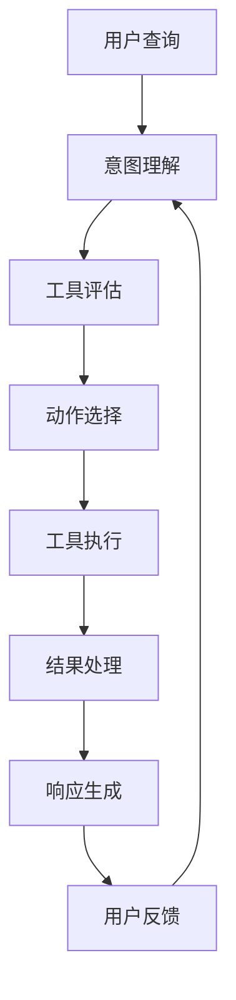

# 2.3.1 工具使用与动作选择

## 概念讲解（文字+图示）

### 智能代理的核心能力演进

在大语言模型（LLM）应用生态中，智能代理（Agent）系统代表了AI应用的最高层次。一个真正的智能代理不仅仅是聊天机器人，而是具备**自主决策能力**、**工具使用能力**和**环境适应能力**的智能体。

#### 代理系统的三层次架构

1. **感知层**：理解用户意图，解析自然语言查询
2. **决策层**：基于可用工具和当前状态选择最优动作
3. **执行层**：调用工具执行动作并处理结果



### 工具使用的本质：扩展LLM能力边界

大型语言模型虽然拥有强大的语言理解和生成能力，但存在固有的局限性：

1. **实时性限制**：训练数据截止日期问题
2. **计算能力限制**：复杂数学计算、逻辑推理
3. **外部系统访问限制**：无法直接操作数据库、API等
4. **确定性操作限制**：需要精确执行特定操作

工具系统正是为了解决这些限制而设计的，它为LLM提供了**能力扩展接口**，让模型能够与外部世界进行交互。

### 动作选择的核心挑战

在复杂问题解决场景中，代理需要面对的核心决策问题：

1. **工具选择问题**：从多个可用工具中选择最合适的工具
2. **参数确定问题**：为选定的工具提供正确的输入参数
3. **执行策略问题**：确定执行顺序和错误处理策略
4. **结果评估问题**：判断工具执行结果是否满足需求

## 核心要点（重点标记）

### 🎯 **关键概念1：工具抽象层**

LangChain通过`@tool`装饰器提供统一的工具抽象，将任意Python函数转换为LLM可理解的工具：

- **自动文档生成**：从函数docstring提取工具描述
- **参数schema推导**：自动生成JSON Schema描述参数
- **错误处理标准化**：统一的异常处理机制
- **类型安全保证**：支持Pydantic模型验证

### 🎯 **关键概念2：工具绑定机制**

在LangChain v1.2.22中，工具绑定到模型的过程完全自动化：

```python
# 模型自动学习工具描述和调用方式
model_with_tools = model.bind_tools(tools)
```

这个过程实现了：
- **工具发现**：模型自动获取可用工具列表
- **格式理解**：学习工具调用的标准格式
- **上下文感知**：根据对话历史优化工具选择

### 🎯 **关键概念3：决策策略类型**

LangChain提供多种预定义的决策策略：

| 策略类型 | 适用场景 | 特点 |
|---------|---------|------|
| **ZERO_SHOT_REACT_DESCRIPTION** | 简单任务 | 零样本学习，基于工具描述决策 |
| **STRUCTURED_CHAT_ZERO_SHOT_REACT_DESCRIPTION** | 复杂对话 | 结构化聊天格式，支持复杂参数 |
| **OPENAI_FUNCTIONS** | OpenAI模型 | 专为OpenAI函数调用优化 |
| **CONVERSATIONAL_REACT_DESCRIPTION** | 多轮对话 | 保持对话历史上下文 |

### 🎯 **关键概念4：错误处理中间件**

LangChain v1.2.22引入`@wrap_tool_call`装饰器实现错误处理中间件：

```python
@wrap_tool_call
def handle_tool_errors(request, handler):
    try:
        return handler(request)
    except Exception as e:
        return ToolMessage(
            content=f"工具错误：请检查输入参数 ({str(e)})",
            tool_call_id=request.tool_call["id"]
        )
```

## 简单示例（代码演示）

### 示例1：基础工具定义与使用

```python
# Python 3.10+
from langchain.tools import tool
from langchain_openai import ChatOpenAI
from langchain.agents import create_agent, AgentType

# 1. 使用@tool装饰器定义工具
@tool
def search_weather(city: str) -> str:
    """查询指定城市的天气信息。
    
    Args:
        city: 城市名称，如"北京"、"上海"
    """
    # 模拟天气API调用
    weather_data = {
        "北京": "晴，25°C，湿度45%，空气质量优",
        "上海": "多云，23°C，湿度60%，空气质量良",
        "广州": "阵雨，28°C，湿度75%，空气质量良"
    }
    return weather_data.get(city, f"未找到{city}的天气信息")

@tool
def calculate_expression(expression: str) -> str:
    """计算数学表达式结果。
    
    Args:
        expression: 数学表达式，如"2 + 3 * 4"
    """
    try:
        # 安全计算（实际应用中应使用更安全的方法）
        result = eval(expression)
        return f"{expression} = {result}"
    except Exception as e:
        return f"计算错误：{e}"

# 2. 创建模型并绑定工具
model = ChatOpenAI(model="gpt-4", temperature=0.2)
tools = [search_weather, calculate_expression]

# 3. 创建代理
agent = create_agent(
    model=model,
    tools=tools,
    agent_type=AgentType.STRUCTURED_CHAT_ZERO_SHOT_REACT_DESCRIPTION,
    verbose=True
)

# 4. 使用代理
response = agent.invoke({
    "input": "北京天气怎么样？另外计算一下(15 + 27) * 3的结果"
})
print(response["output"])
```

### 示例2：工具错误处理与监控

```python
from langchain.agents.middleware import wrap_tool_call
from langchain.messages import ToolMessage

# 工具监控中间件
@wrap_tool_call
def monitor_tool_execution(request, handler):
    """监控工具执行过程"""
    print(f"🔧 执行工具: {request.tool_call['name']}")
    print(f"📊 参数: {request.tool_call['args']}")
    
    try:
        start_time = time.time()
        result = handler(request)
        elapsed = time.time() - start_time
        
        print(f"✅ 工具执行成功，耗时: {elapsed:.2f}秒")
        return result
        
    except Exception as e:
        print(f"❌ 工具执行失败: {e}")
        # 返回有意义的错误信息给模型
        return ToolMessage(
            content=f"工具'{request.tool_call['name']}'执行失败：{str(e)[:100]}",
            tool_call_id=request.tool_call["id"]
        )

# 创建带监控的代理
agent_with_monitor = create_agent(
    model=model,
    tools=tools,
    agent_type=AgentType.STRUCTURED_CHAT_ZERO_SHOT_REACT_DESCRIPTION,
    middleware=[monitor_tool_execution]
)
```

## 进阶应用（可选内容）

### 场景1：动态工具发现与注册系统

在企业级应用中，工具可能动态变化，需要支持运行时注册：

```python
from typing import Dict, List, Optional
from langchain.tools import BaseTool

class DynamicToolRegistry:
    """动态工具注册系统"""
    
    def __init__(self):
        self._tools: Dict[str, BaseTool] = {}
        self._categories: Dict[str, List[str]] = {}
        self._performance_stats: Dict[str, Dict] = {}
    
    def register_tool(self, tool: BaseTool, category: str = "general"):
        """注册新工具"""
        tool_name = tool.name
        
        # 避免重复注册
        if tool_name in self._tools:
            print(f"⚠️ 工具'{tool_name}'已存在，跳过注册")
            return
        
        self._tools[tool_name] = tool
        
        # 分类管理
        if category not in self._categories:
            self._categories[category] = []
        self._categories[category].append(tool_name)
        
        # 初始化性能统计
        self._performance_stats[tool_name] = {
            "calls": 0,
            "success": 0,
            "total_time": 0.0,
            "avg_time": 0.0
        }
        
        print(f"✅ 注册工具: {tool_name} (类别: {category})")
    
    def get_tools_by_query(self, query: str) -> List[BaseTool]:
        """基于查询内容智能选择工具"""
        # 1. 关键词匹配
        relevant_tools = []
        
        for name, tool in self._tools.items():
            # 检查工具描述是否匹配查询
            description = tool.description.lower()
            query_lower = query.lower()
            
            # 简单关键词匹配算法
            score = 0
            if any(keyword in description for keyword in ["天气", "temperature", "weather"]):
                if any(w in query_lower for w in ["天气", "温度", "weather"]):
                    score += 0.8
            
            if any(keyword in description for keyword in ["计算", "calculate", "math"]):
                if any(w in query_lower for w in ["计算", "等于", "calculate"]):
                    score += 0.7
            
            if score > 0.5:
                relevant_tools.append((tool, score))
        
        # 2. 按匹配分数排序
        relevant_tools.sort(key=lambda x: x[1], reverse=True)
        
        # 3. 返回工具对象
        return [tool for tool, score in relevant_tools[:3]]  # 最多返回3个
    
    def create_adaptive_agent(self, model, query: str):
        """创建自适应代理，基于查询动态选择工具"""
        selected_tools = self.get_tools_by_query(query)
        
        if not selected_tools:
            print("⚠️ 未找到相关工具，使用基础模型")
            return model
        
        print(f"🎯 为查询选择工具: {[t.name for t in selected_tools]}")
        
        agent = create_agent(
            model=model,
            tools=selected_tools,
            agent_type=AgentType.STRUCTURED_CHAT_ZERO_SHOT_REACT_DESCRIPTION,
            verbose=True
        )
        
        return agent

# 使用示例
registry = DynamicToolRegistry()
registry.register_tool(search_weather, "information")
registry.register_tool(calculate_expression, "computation")

query = "今天北京天气如何？另外帮我计算一下圆的面积，半径是5"
adaptive_agent = registry.create_adaptive_agent(model, query)
response = adaptive_agent.invoke({"input": query})
```

### 场景2：多工具协同工作流

复杂任务通常需要多个工具协同工作：

```python
from langchain.agents import Tool
from langchain.chains import LLMChain
from langchain.prompts import PromptTemplate

class ToolOrchestrator:
    """工具协调器：管理多工具协同工作"""
    
    def __init__(self, tools: List[Tool]):
        self.tools = {tool.name: tool for tool in tools}
        self.workflow_patterns = self._define_workflow_patterns()
    
    def _define_workflow_patterns(self) -> Dict[str, List[str]]:
        """定义常见工作流模式"""
        return {
            "data_analysis": ["search", "process_data", "analyze"],
            "customer_service": ["search_faq", "check_order", "escalate"],
            "research_assistant": ["search_web", "summarize", "cite_sources"]
        }
    
    def execute_workflow(self, query: str, workflow_type: str = "auto") -> str:
        """执行工作流"""
        # 1. 分析查询，确定工作流类型
        if workflow_type == "auto":
            workflow_type = self._detect_workflow_type(query)
        
        # 2. 获取工作流步骤
        steps = self.workflow_patterns.get(workflow_type, [])
        
        if not steps:
            # 默认顺序执行所有可用工具
            steps = list(self.tools.keys())
        
        # 3. 按步骤执行
        intermediate_results = {}
        current_query = query
        
        for step_name in steps:
            if step_name not in self.tools:
                print(f"⚠️ 跳过不存在的工具: {step_name}")
                continue
            
            tool = self.tools[step_name]
            
            try:
                print(f"🔄 执行步骤: {step_name}")
                result = tool.invoke(current_query)
                intermediate_results[step_name] = result
                
                # 更新查询，用于下一步
                current_query = f"基于上一步结果: {result[:100]}...，继续处理"
                
            except Exception as e:
                print(f"❌ 步骤{step_name}失败: {e}")
                intermediate_results[step_name] = f"执行失败: {e}"
        
        # 4. 合成最终结果
        final_result = self._synthesize_results(intermediate_results, query)
        return final_result
    
    def _detect_workflow_type(self, query: str) -> str:
        """检测工作流类型"""
        query_lower = query.lower()
        
        if any(word in query_lower for word in ["分析", "统计", "report", "analysis"]):
            return "data_analysis"
        elif any(word in query_lower for word in ["客服", "订单", "customer", "service"]):
            return "customer_service"
        elif any(word in query_lower for word in ["研究", "论文", "research", "paper"]):
            return "research_assistant"
        
        return "general"
```

## 常见问题

### ❓ **Q1：工具定义时需要注意什么？**

**A：** 工具定义时应遵循以下原则：
1. **单一职责**：每个工具只完成一个明确的功能
2. **清晰文档**：docstring要详细描述功能和参数
3. **错误处理**：工具内部应有完善的异常处理
4. **类型注解**：使用Python类型注解帮助自动schema生成
5. **性能考虑**：避免长时间运行的工具阻塞代理

### ❓ **Q2：如何处理工具调用失败的情况？**

**A：** LangChain v1.2.22提供多种错误处理策略：
1. **中间件模式**：使用`@wrap_tool_call`装饰器捕获异常
2. **重试机制**：配置自动重试失败的工具调用
3. **备用工具**：为关键工具提供备用实现
4. **优雅降级**：工具失败时提供替代解决方案

### ❓ **Q3：如何优化工具选择性能？**

**A：** 性能优化策略包括：
1. **工具缓存**：缓存常用工具的查询结果
2. **并行执行**：同时尝试多个可能相关的工具
3. **预测预热**：预加载可能需要的工具
4. **优先级队列**：根据历史成功率排序工具

### ❓ **Q4：代理系统如何避免无限循环？**

**A：** 防止无限循环的关键配置：
1. **最大迭代次数**：设置`max_iterations`参数限制循环次数
2. **超时控制**：配置每个工具调用的超时时间
3. **状态监控**：监控代理状态，检测异常模式
4. **熔断机制**：连续失败时暂时禁用问题工具

### ❓ **Q5：如何调试工具调用问题？**

**A：** 调试工具调用的方法：
1. **详细日志**：启用`verbose=True`查看详细执行过程
2. **中间件监控**：添加监控中间件记录工具调用
3. **输入输出检查**：验证工具接收的参数和返回结果
4. **单元测试**：为每个工具编写独立的测试用例

## 本节总结

### 核心收获

1. **工具抽象的价值**：LangChain的`@tool`装饰器将复杂的外部操作抽象为简单的函数调用，极大降低了工具集成的复杂度。

2. **决策策略的多样性**：LangChain提供多种预定义决策策略，适应不同复杂度的应用场景，从简单的零样本学习到复杂的结构化对话。

3. **错误处理的系统性**：通过中间件模式，LangChain实现了系统级的错误处理，让开发者可以专注于业务逻辑而非异常处理。

4. **可扩展的架构设计**：动态工具注册、多工具协同等工作流模式展示了LangChain架构的高度可扩展性。

### 设计哲学体现

本章节内容充分体现了LangChain的核心设计哲学：

- **声明式编程**：通过配置而非代码控制代理行为
- **统一抽象**：所有工具遵循相同的接口规范
- **关注点分离**：工具实现、动作选择、错误处理各自独立
- **渐进式复杂度**：从简单工具定义到复杂工作流编排的平滑过渡

### 实践建议

1. **从简单开始**：先定义1-2个核心工具，验证基础功能
2. **逐步复杂化**：根据需要逐步添加更多工具和复杂逻辑
3. **重视监控**：从一开始就建立完善的监控和日志系统
4. **测试驱动**：为每个工具编写测试，确保可靠性和稳定性

通过本章的学习，您应该能够理解LangChain工具系统的工作原理，掌握工具定义、绑定、选择的基本方法，并能够在实际项目中应用这些知识构建可靠的智能代理系统。

---
**下一节预告**：在2.3.2节中，我们将深入探讨**记忆与上下文管理**，学习如何让代理记住历史对话、管理会话状态，实现真正的智能多轮对话。