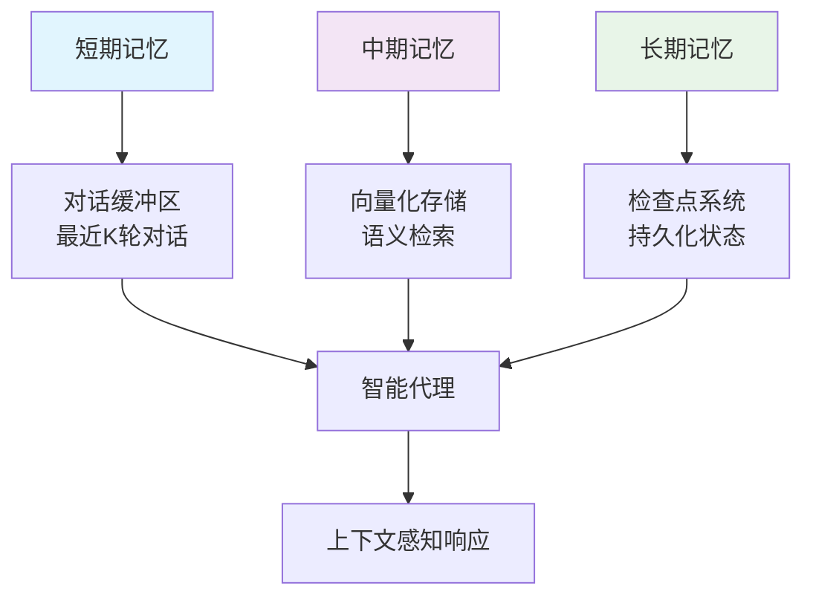

# 2.3.2 记忆与上下文管理

## 概念讲解（文字+图示）

### 智能对话的"记忆"本质

在人工智能对话系统中，**记忆**（Memory）不是简单的数据存储，而是智能代理理解世界、维持身份连续性和实现连贯交互的核心能力。LangChain v1.2.22将记忆系统设计为多层次架构，解决了LLM应用的三大核心挑战：

1. **上下文窗口限制**：所有模型都有固定的token限制
2. **状态连续性需求**：多轮对话需要保持上下文一致
3. **信息检索效率**：快速找到相关历史信息

#### 记忆系统的三层次架构



### 记忆类型的演进：从简单到复杂

1. **对话缓冲区（ConversationBufferMemory）**：最简单的记忆形式，保存完整的对话历史
2. **窗口记忆（ConversationBufferWindowMemory）**：只保留最近K条消息，控制上下文大小
3. **摘要记忆（ConversationSummaryMemory）**：自动生成对话摘要，解决长上下文问题
4. **向量记忆（VectorStoreRetrieverMemory）**：基于语义相似度的智能检索
5. **实体记忆（ConversationEntityMemory）**：跟踪对话中的实体和关系

## 核心要点（重点标记）

### 🎯 **关键概念1：`trim_messages` 智能消息修剪**

LangChain v1.2.22引入`trim_messages`函数，实现智能的上下文窗口管理：

```python
from langchain_core.messages.utils import trim_messages, count_tokens_approximately

# 智能修剪消息，保持上下文窗口
trimmed_messages = trim_messages(
    messages=conversation_history,
    strategy="last",  # 保留最后几条消息
    token_counter=count_tokens_approximately,
    max_tokens=128,   # 最大token限制
    start_on="human", # 从用户消息开始
    end_on=("human", "tool"),  # 在用户或工具消息结束
)
```

### 🎯 **关键概念2：检查点（Checkpointer）系统**

检查点系统实现了对话状态的持久化和管理：

```python
from langgraph.checkpoint.memory import InMemorySaver

# 创建检查点保存器
checkpointer = InMemorySaver()

# 配置对话线程
config = {"configurable": {"thread_id": "user123_session001"}}

# 状态自动保存和恢复
graph = builder.compile(checkpointer=checkpointer)
```

### 🎯 **关键概念3：状态图（StateGraph）中的记忆集成**

LangGraph的`StateGraph`将记忆作为状态的一部分：

```python
from langgraph.graph import StateGraph, START, MessagesState

# 定义消息状态
State = MessagesState  # 内置消息状态类型

# 创建状态图
builder = StateGraph(State)
builder.add_node("process_message", process_function)
```

### 🎯 **关键概念4：`thread_id`隔离的对话状态**

每个对话线程有独立的状态隔离：

```python
# 不同用户的对话状态完全隔离
config_user1 = {"configurable": {"thread_id": "user_001"}}
config_user2 = {"configurable": {"thread_id": "user_002"}}

# 相同的图，不同的状态
response1 = graph.invoke(input_user1, config_user1)
response2 = graph.invoke(input_user2, config_user2)
```

## 简单示例（代码演示）

### 示例1：基础对话缓冲区记忆

```python
# Python 3.10+
from langchain.memory import ConversationBufferMemory
from langchain_openai import ChatOpenAI
from langchain.chains import ConversationChain

# 1. 创建对话缓冲区记忆
memory = ConversationBufferMemory(
    memory_key="chat_history",  # 内存变量名
    return_messages=True,       # 返回消息对象而非字符串
    input_key="input",          # 输入键名
    output_key="output",        # 输出键名
)

# 2. 手动添加对话
memory.chat_memory.add_user_message("你好，我叫张三")
memory.chat_memory.add_ai_message("你好张三！很高兴认识你。")
memory.chat_memory.add_user_message("我喜欢编程和爬山")

# 3. 查看记忆内容
memory_variables = memory.load_memory_variables({})
print("当前对话历史:")
for msg in memory_variables["chat_history"]:
    print(f"{type(msg).__name__}: {msg.content}")

# 4. 创建带记忆的对话链
llm = ChatOpenAI(model="gpt-4", temperature=0.7)
conversation = ConversationChain(
    llm=llm,
    memory=memory,
    verbose=False
)

# 5. 基于记忆继续对话
response = conversation.predict(input="你记得我的爱好吗？")
print(f"\n基于记忆的响应: {response}")
```

### 示例2：智能消息修剪与上下文管理

```python
from langchain_core.messages import HumanMessage, AIMessage
from langchain_core.messages.utils import trim_messages, count_tokens_approximately

# 模拟长对话历史
conversation_history = []
for i in range(10):
    conversation_history.append(HumanMessage(content=f"用户消息{i}: 这是一个测试消息" * 5))
    conversation_history.append(AIMessage(content=f"助手消息{i}: 这是响应" * 5))

print(f"原始消息数量: {len(conversation_history)}")

# 智能修剪消息（基于Context7官方示例）
trimmed = trim_messages(
    messages=conversation_history,
    strategy="last",           # 保留最后几条
    token_counter=count_tokens_approximately,
    max_tokens=200,           # 最大200 tokens
    start_on="human",         # 从用户消息开始
    end_on=("human", "tool"), # 在用户或工具消息结束
    include_system=False      # 不包含系统消息
)

print(f"修剪后消息数量: {len(trimmed)}")

# 估算token使用
original_tokens = count_tokens_approximately(conversation_history)
trimmed_tokens = count_tokens_approximately(trimmed)
print(f"原始token数: ~{original_tokens}, 修剪后: ~{trimmed_tokens}")
```

### 示例3：StateGraph与检查点系统

```python
from langgraph.graph import StateGraph, START, MessagesState
from langgraph.checkpoint.memory import InMemorySaver
from langchain_openai import ChatOpenAI

# 1. 定义消息处理函数
def process_message(state: MessagesState):
    """处理消息并生成响应"""
    from langchain_core.messages import AIMessage
    
    # 获取最后一条用户消息
    last_message = state["messages"][-1]
    
    # 简单响应逻辑（实际应用中应使用LLM）
    response_text = f"收到消息: {last_message.content}"
    
    # 返回新消息
    return {"messages": [AIMessage(content=response_text)]}

# 2. 创建状态图
builder = StateGraph(MessagesState)
builder.add_node("process", process_message)
builder.add_edge(START, "process")

# 3. 编译带检查点的图
checkpointer = InMemorySaver()
graph = builder.compile(checkpointer=checkpointer)

# 4. 模拟多轮对话
print("=== StateGraph记忆系统演示 ===")

config = {"configurable": {"thread_id": "test_session_001"}}

# 第一轮对话
print("\n第一轮对话:")
result1 = graph.invoke(
    {"messages": [{"role": "user", "content": "你好，我叫李四"}]},
    config=config
)
print(f"助手: {result1['messages'][-1].content}")

# 第二轮对话（状态自动保持）
print("\n第二轮对话:")
result2 = graph.invoke(
    {"messages": [{"role": "user", "content": "你还记得我的名字吗？"}]},
    config=config
)
print(f"助手: {result2['messages'][-1].content}")

# 查看状态历史
saved_state = checkpointer.get(config)
print(f"\n检查点保存的状态: {saved_state}")
```

## 进阶应用（可选内容）

### 场景1：多层记忆系统的智能客服

```python
from typing import Dict, List, Any
from datetime import datetime
import hashlib

class IntelligentMemorySystem:
    """智能记忆系统：结合多种记忆策略"""
    
    def __init__(self, user_id: str, session_id: str):
        self.user_id = user_id
        self.session_id = session_id
        self.memory_layers = self._initialize_memory_layers()
        self.conversation_summary = ""
        
    def _initialize_memory_layers(self) -> Dict[str, Any]:
        """初始化记忆层"""
        return {
            "short_term": {
                "type": "buffer",
                "max_messages": 10,
                "messages": []
            },
            "medium_term": {
                "type": "vector",
                "embeddings_cache": {},
                "important_facts": []
            },
            "long_term": {
                "type": "summary",
                "user_profile": {},
                "conversation_themes": []
            }
        }
    
    def add_message(self, role: str, content: str, metadata: Dict = None):
        """添加消息到记忆系统"""
        message = {
            "role": role,
            "content": content,
            "timestamp": datetime.now().isoformat(),
            "metadata": metadata or {}
        }
        
        # 1. 添加到短期记忆
        self.memory_layers["short_term"]["messages"].append(message)
        
        # 维护短期记忆大小
        if len(self.memory_layers["short_term"]["messages"]) > \
           self.memory_layers["short_term"]["max_messages"]:
            self.memory_layers["short_term"]["messages"].pop(0)
        
        # 2. 提取重要信息到中期记忆
        self._extract_important_info(message)
        
        # 3. 定期更新长期记忆摘要
        self._update_conversation_summary()
    
    def _extract_important_info(self, message: Dict):
        """提取重要信息到中期记忆"""
        content = message["content"].lower()
        
        # 提取用户个人信息
        personal_info_keywords = ["我叫", "名字是", "年龄", "住在", "工作是"]
        for keyword in personal_info_keywords:
            if keyword in content:
                self.memory_layers["long_term"]["user_profile"][keyword] = \
                    content[content.find(keyword):content.find(keyword)+50]
        
        # 提取重要事实（简单规则）
        important_indicators = ["重要", "记住", "不要忘记", "关键"]
        if any(indicator in content for indicator in important_indicators):
            self.memory_layers["medium_term"]["important_facts"].append({
                "fact": content,
                "timestamp": message["timestamp"],
                "confidence": 0.8
            })
    
    def _update_conversation_summary(self):
        """更新对话摘要"""
        # 当短期记忆达到一定数量时生成摘要
        if len(self.memory_layers["short_term"]["messages"]) >= 5:
            messages = self.memory_layers["short_term"]["messages"]
            summary = f"对话摘要({len(messages)}条消息): "
            summary += " | ".join([msg["content"][:30] + "..." for msg in messages[-3:]])
            self.conversation_summary = summary
    
    def retrieve_relevant_context(self, query: str, max_items: int = 3) -> List[str]:
        """检索相关上下文"""
        relevant_context = []
        
        # 1. 从短期记忆检索（最近性）
        short_term_msgs = self.memory_layers["short_term"]["messages"]
        for msg in reversed(short_term_msgs[-max_items:]):
            relevant_context.append(f"最近对话: {msg['content'][:50]}...")
        
        # 2. 从中期记忆检索（重要性）
        important_facts = self.memory_layers["medium_term"]["important_facts"]
        for fact in important_facts[-max_items:]:
            relevant_context.append(f"重要信息: {fact['fact'][:50]}...")
        
        # 3. 从长期记忆检索（用户画像）
        user_profile = self.memory_layers["long_term"]["user_profile"]
        if user_profile:
            profile_summary = "用户信息: " + ", ".join(
                f"{k}:{v[:20]}" for k, v in list(user_profile.items())[:2]
            )
            relevant_context.append(profile_summary)
        
        return relevant_context[:max_items]
    
    def get_memory_report(self) -> Dict[str, Any]:
        """获取记忆系统报告"""
        return {
            "user_id": self.user_id,
            "session_id": self.session_id,
            "short_term_count": len(self.memory_layers["short_term"]["messages"]),
            "medium_term_count": len(self.memory_layers["medium_term"]["important_facts"]),
            "long_term_profile_size": len(self.memory_layers["long_term"]["user_profile"]),
            "conversation_summary": self.conversation_summary,
            "memory_health": "良好" if self.conversation_summary else "需要更多对话"
        }

# 测试智能记忆系统
print("=== 智能记忆系统演示 ===")
memory_system = IntelligentMemorySystem("user123", "session001")

# 模拟对话
test_conversation = [
    ("user", "你好，我叫王小明"),
    ("assistant", "你好王小明！很高兴认识你。"),
    ("user", "我是一名软件工程师，住在北京"),
    ("assistant", "软件工程师是个很好的职业！北京是个大城市。"),
    ("user", "请记住：我对花生过敏，这很重要"),
    ("assistant", "好的，我会记住您对花生过敏。"),
    ("user", "我喜欢阅读和旅行"),
    ("assistant", "阅读和旅行都是很好的爱好！"),
]

for role, content in test_conversation:
    memory_system.add_message(role, content)
    
    # 每轮后测试检索
    if role == "user":
        context = memory_system.retrieve_relevant_context(content)
        print(f"\n用户说: {content}")
        print("相关上下文:")
        for ctx in context:
            print(f"  - {ctx}")

# 查看记忆报告
report = memory_system.get_memory_report()
print("\n=== 记忆系统报告 ===")
for key, value in report.items():
    print(f"{key}: {value}")
```

### 场景2：生产环境中的记忆持久化

```python
import json
from pathlib import Path
from typing import Optional

class PersistentMemoryManager:
    """持久化记忆管理器"""
    
    def __init__(self, storage_path: str = "./memory_storage"):
        self.storage_path = Path(storage_path)
        self.storage_path.mkdir(exist_ok=True)
        self.active_sessions = {}
    
    def _get_session_file(self, user_id: str, session_id: str) -> Path:
        """获取会话文件路径"""
        # 使用MD5哈希避免文件名冲突
        session_key = f"{user_id}_{session_id}"
        hash_key = hashlib.md5(session_key.encode()).hexdigest()[:16]
        return self.storage_path / f"memory_{hash_key}.json"
    
    def save_session(self, user_id: str, session_id: str, memory_data: Dict):
        """保存会话记忆"""
        session_file = self._get_session_file(user_id, session_id)
        
        # 准备保存数据
        save_data = {
            "user_id": user_id,
            "session_id": session_id,
            "memory_data": memory_data,
            "last_updated": datetime.now().isoformat(),
            "version": "1.0"
        }
        
        # 保存到文件
        with open(session_file, 'w', encoding='utf-8') as f:
            json.dump(save_data, f, ensure_ascii=False, indent=2)
        
        # 更新活跃会话缓存
        self.active_sessions[f"{user_id}_{session_id}"] = memory_data
        
        print(f"✅ 记忆保存到: {session_file}")
        return True
    
    def load_session(self, user_id: str, session_id: str) -> Optional[Dict]:
        """加载会话记忆"""
        session_key = f"{user_id}_{session_id}"
        
        # 检查缓存
        if session_key in self.active_sessions:
            print(f"从缓存加载会话: {session_key}")
            return self.active_sessions[session_key]
        
        # 从文件加载
        session_file = self._get_session_file(user_id, session_id)
        
        if not session_file.exists():
            print(f"会话文件不存在: {session_file}")
            return None
        
        try:
            with open(session_file, 'r', encoding='utf-8') as f:
                save_data = json.load(f)
            
            memory_data = save_data["memory_data"]
            
            # 更新缓存
            self.active_sessions[session_key] = memory_data
            
            print(f"✅ 从文件加载会话: {session_key}")
            return memory_data
            
        except Exception as e:
            print(f"加载会话失败: {e}")
            return None
    
    def cleanup_old_sessions(self, max_age_days: int = 30):
        """清理旧会话"""
        cutoff_time = datetime.now().timestamp() - (max_age_days * 24 * 3600)
        deleted_count = 0
        
        for session_file in self.storage_path.glob("memory_*.json"):
            try:
                file_mtime = session_file.stat().st_mtime
                if file_mtime < cutoff_time:
                    session_file.unlink()
                    deleted_count += 1
            except Exception as e:
                print(f"删除文件失败 {session_file}: {e}")
        
        print(f"清理完成，删除了 {deleted_count} 个旧会话文件")
    
    def get_session_stats(self) -> Dict[str, Any]:
        """获取会话统计信息"""
        session_files = list(self.storage_path.glob("memory_*.json"))
        
        return {
            "total_sessions": len(session_files),
            "active_in_memory": len(self.active_sessions),
            "storage_path": str(self.storage_path),
            "total_size_mb": sum(f.stat().st_size for f in session_files) / (1024 * 1024)
        }

# 测试持久化记忆管理器
print("=== 持久化记忆管理器演示 ===")
memory_manager = PersistentMemoryManager()

# 创建测试记忆数据
test_memory = {
    "conversation_history": [
        {"role": "user", "content": "你好", "timestamp": "2024-01-01T10:00:00"},
        {"role": "assistant", "content": "你好！", "timestamp": "2024-01-01T10:00:01"},
    ],
    "user_preferences": {
        "language": "zh-CN",
        "tone": "friendly"
    },
    "important_facts": ["用户喜欢咖啡", "用户是晨型人"]
}

# 保存会话
memory_manager.save_session("test_user", "session_001", test_memory)

# 加载会话（模拟重新启动）
print("\n模拟系统重启...")
loaded_memory = memory_manager.load_session("test_user", "session_001")

if loaded_memory:
    print("✅ 记忆恢复成功!")
    print(f"对话历史: {len(loaded_memory['conversation_history'])} 条消息")
    print(f"用户偏好: {loaded_memory['user_preferences']}")
    print(f"重要事实: {loaded_memory['important_facts']}")

# 查看统计信息
stats = memory_manager.get_session_stats()
print("\n=== 记忆管理器统计 ===")
for key, value in stats.items():
    print(f"{key}: {value}")

# 清理旧会话（演示）
memory_manager.cleanup_old_sessions(max_age_days=0)  # 清理所有"旧"文件
```

## 常见问题

### ❓ **Q1：如何选择合适的记忆类型？**

**A：** 根据应用场景选择：

| 场景 | 推荐记忆类型 | 原因 |
|------|------------|------|
| **简单问答** | ConversationBufferMemory | 实现简单，保留完整上下文 |
| **长对话** | ConversationSummaryMemory | 避免token超限，自动摘要 |
| **知识检索** | VectorStoreRetrieverMemory | 基于语义的智能检索 |
| **生产环境** | 检查点系统 + 持久化存储 | 支持重启恢复，多用户隔离 |
| **复杂对话** | 多层记忆系统组合 | 结合短期、中期、长期记忆优势 |

### ❓ **Q2：如何处理token限制问题？**

**A：** LangChain v1.2.22提供多种解决方案：
1. **`trim_messages`函数**：智能修剪消息，保留重要部分
2. **摘要记忆**：定期生成对话摘要，替代完整历史
3. **窗口记忆**：只保留最近K条消息
4. **向量检索**：基于相似度检索相关历史，而非全部历史
5. **分层记忆**：重要信息长期存储，细节短期存储

### ❓ **Q3：多用户场景下如何隔离记忆？**

**A：** 使用`thread_id`机制：
```python
# 每个用户/会话有独立的thread_id
config_user1 = {"configurable": {"thread_id": "user_001_session_001"}}
config_user2 = {"configurable": {"thread_id": "user_002_session_001"}}

# 状态完全隔离
graph.invoke(input1, config_user1)  # 不影响user2的状态
graph.invoke(input2, config_user2)  # 不影响user1的状态
```

### ❓ **Q4：记忆系统如何影响性能？**

**A：** 性能优化策略：
1. **缓存活跃会话**：内存中缓存常用会话，减少磁盘IO
2. **懒加载**：按需加载记忆数据，而非启动时全部加载
3. **异步保存**：非阻塞方式保存记忆状态
4. **定期清理**：清理不再使用的会话数据
5. **压缩存储**：对历史消息进行压缩存储

### ❓ **Q5：如何调试记忆相关问题？**

**A：** 调试建议：
1. **启用详细日志**：记录记忆的保存、加载、检索过程
2. **添加监控指标**：跟踪记忆命中率、检索延迟等
3. **实现记忆可视化**：展示当前记忆状态和内容
4. **单元测试**：为记忆操作编写测试用例
5. **A/B测试**：比较不同记忆策略的效果

## 本节总结

### 核心收获

1. **记忆系统的多层次设计**：LangChain提供了从简单到复杂的完整记忆方案，满足不同场景需求。

2. **智能上下文管理**：通过`trim_messages`等工具，实现了智能的token管理和上下文窗口控制。

3. **生产级持久化**：检查点系统和`thread_id`机制确保了对话状态的可持久化和多用户隔离。

4. **灵活的可扩展性**：记忆组件可像乐高积木一样组合，支持自定义记忆策略。

### 设计哲学体现

本章内容体现了LangChain在记忆系统设计上的核心理念：

- **声明式配置**：通过配置而非代码定义记忆行为
- **可组合架构**：不同记忆类型可以灵活组合
- **生产就绪**：内置持久化、监控、调试支持
- **渐进式复杂度**：从简单缓冲区到复杂向量检索的平滑演进

### 实践建议

1. **从简单开始**：先使用`ConversationBufferMemory`，验证基础功能
2. **渐进式优化**：根据实际需求逐步引入更复杂的记忆策略
3. **重视持久化**：生产环境务必实现记忆的持久化存储
4. **监控和调试**：建立完善的记忆系统监控和调试机制
5. **用户隐私**：敏感信息应加密存储，遵守隐私政策

### 技术展望

随着AI对话系统的发展，记忆管理将面临新挑战和机遇：

1. **个性化记忆**：基于用户画像的个性化记忆策略
2. **跨会话记忆**：用户在不同会话间的记忆共享（需谨慎处理隐私）
3. **主动记忆**：系统主动识别和记忆重要信息
4. **记忆压缩**：更高效的记忆表示和存储方式
5. **联邦学习记忆**：在保护隐私的前提下共享记忆模式

**记住**：好的记忆系统不是要记住所有事情，而是要记住对的事情。通过LangChain的记忆管理系统，开发者可以构建真正理解上下文、保持对话连贯性的智能代理，实现真正意义上的"智能对话"。

通过本节学习，您应该掌握了LangChain记忆系统的基本原理和实践方法，能够根据实际需求选择合适的记忆策略，并构建可靠、高效的记忆管理系统。

---
**下一节预告**：在2.3.3节中，我们将深入探讨**多轮对话与状态保持**，学习如何使用LangGraph的状态图和检查点系统构建复杂的多轮对话工作流。