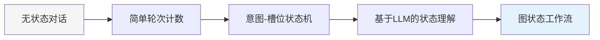

# 2.3.3 多轮对话与状态保持

## 概念讲解（文字+图示）

### 多轮对话的复杂性本质

在真实的人机对话场景中，智能代理面临的不仅仅是单次问答，而是包含**上下文依赖**、**状态转移**、**目标导向**和**历史记忆**的复杂交互过程。LangChain v1.2.22通过`StateGraph`和检查点系统，将多轮对话状态管理抽象为可配置、可持久化、可扩展的工程问题。

#### 多轮对话的核心挑战

1. **状态连续性**：如何保持对话上下文在不同轮次间的一致性
2. **目标追踪**：如何理解和追踪用户的对话目标
3. **中断恢复**：如何处理对话中断后的状态恢复
4. **多任务切换**：如何在多个对话目标间平滑切换
5. **超时管理**：如何管理长时间未响应的对话状态

#### 状态管理的演进：从简单到复杂



### StateGraph：图计算驱动的状态管理

LangGraph的`StateGraph`是多轮对话状态管理的核心抽象，它将对话状态建模为**有向图**，其中：
- **节点**：状态处理函数
- **边**：状态转移路径
- **条件边**：基于条件的动态路由

## 核心要点（重点标记）

### 🎯 **关键概念1：`MessagesState`类型化状态**

LangChain v1.2.22使用类型化的状态定义，确保状态结构的安全性和一致性：

```python
from typing import TypedDict, Annotated
from langgraph.graph import MessagesState
import operator

# MessagesState预定义类型
class ConversationState(TypedDict):
    """对话状态类型定义"""
    messages: Annotated[list, operator.add]  # 消息列表（自动累积）
    user_id: str                             # 用户ID
    session_id: str                          # 会话ID
    dialog_stage: str                        # 对话阶段
    collected_data: dict                     # 收集的数据
```

### 🎯 **关键概念2：检查点（Checkpointer）持久化**

检查点系统实现了对话状态的自动保存和恢复：

```python
from langgraph.checkpoint.memory import InMemorySaver

# 内存检查点（适合开发）
checkpointer = InMemorySaver()

# 配置对话线程
config = {"configurable": {"thread_id": "user123_session001"}}

# 状态自动保存
graph = builder.compile(checkpointer=checkpointer)
```

### 🎯 **关键概念3：条件边（Conditional Edges）与动态路由**

状态图支持基于条件的动态路由决策：

```python
from langgraph.graph import StateGraph, END

def route_by_intent(state: ConversationState) -> str:
    """根据意图路由到不同处理节点"""
    intent = state.get("collected_data", {}).get("intent", "unknown")
    
    if intent == "order_food":
        return "handle_order"
    elif intent == "query_info":
        return "handle_query"
    else:
        return "fallback"

# 添加条件边
workflow.add_conditional_edges(
    "identify_intent",
    route_by_intent,
    {
        "handle_order": "handle_order",
        "handle_query": "handle_query",
        "fallback": "fallback"
    }
)
```

### 🎯 **关键概念4：`thread_id`会话隔离**

每个对话会话有完全独立的状态隔离：

```python
# 不同用户的对话状态完全隔离
config_user1 = {"configurable": {"thread_id": "user_001_session_001"}}
config_user2 = {"configurable": {"thread_id": "user_002_session_001"}}

# 相同的状态图，不同的状态存储
response1 = graph.invoke(input1, config_user1)  # 不影响user2
response2 = graph.invoke(input2, config_user2)  # 不影响user1
```

## 简单示例（代码演示）

### 示例1：基础状态图与多轮对话

```python
# Python 3.10+
from langgraph.graph import StateGraph, START, END
from langgraph.checkpoint.memory import InMemorySaver
from typing import TypedDict, Annotated
import operator

# 1. 定义对话状态类型
class DialogState(TypedDict):
    """对话状态"""
    messages: Annotated[list, operator.add]  # 消息列表
    current_step: str                        # 当前步骤
    user_info: dict                          # 用户信息
    collected_data: dict                     # 收集的数据

# 2. 定义状态处理节点
def greet_user(state: DialogState) -> DialogState:
    """问候用户节点"""
    print("步骤: 问候用户")
    
    state["messages"].append({
        "role": "assistant",
        "content": "你好！我是智能助手。请问您怎么称呼？"
    })
    state["current_step"] = "collecting_name"
    return state

def collect_user_name(state: DialogState) -> DialogState:
    """收集用户姓名节点"""
    print("步骤: 收集用户姓名")
    
    # 从最后一条用户消息中提取姓名
    if state["messages"]:
        last_msg = state["messages"][-1]
        if last_msg["role"] == "user":
            content = last_msg["content"]
            if "我叫" in content or "名字是" in content:
                import re
                match = re.search(r'(?:我叫|名字是)\s*(\w+)', content)
                if match:
                    state["user_info"]["name"] = match.group(1)
    
    # 如果还未收集到姓名，继续询问
    if "name" not in state["user_info"]:
        state["messages"].append({
            "role": "assistant",
            "content": "请问您怎么称呼？"
        })
        return state  # 保持当前步骤
    
    # 姓名已收集，进入下一步
    state["messages"].append({
        "role": "assistant",
        "content": f"很高兴认识您，{state['user_info']['name']}！"
    })
    state["current_step"] = "identifying_intent"
    return state

def identify_intent(state: DialogState) -> DialogState:
    """识别用户意图节点"""
    print("步骤: 识别意图")
    
    if not state["messages"]:
        return state
    
    last_msg = state["messages"][-1]
    if last_msg["role"] == "user":
        content = last_msg["content"].lower()
        
        # 简单意图识别
        if any(word in content for word in ["订餐", "点餐", "外卖"]):
            state["collected_data"]["intent"] = "order_food"
            state["current_step"] = "ordering_food"
        elif any(word in content for word in ["查询", "查看", "搜索"]):
            state["collected_data"]["intent"] = "query_info"
            state["current_step"] = "querying_info"
        else:
            state["collected_data"]["intent"] = "general_chat"
            state["current_step"] = "general_response"
    
    return state

# 3. 创建状态图
workflow = StateGraph(DialogState)

# 添加节点
workflow.add_node("greet", greet_user)
workflow.add_node("collect_name", collect_user_name)
workflow.add_node("identify_intent", identify_intent)

# 设置边
workflow.set_entry_point("greet")
workflow.add_edge("greet", "collect_name")
workflow.add_edge("collect_name", "identify_intent")
workflow.add_edge("identify_intent", END)

# 4. 编译带检查点的图
checkpointer = InMemorySaver()
app = workflow.compile(checkpointer=checkpointer)

# 5. 模拟多轮对话
print("=== 基础状态图多轮对话演示 ===")

config = {"configurable": {"thread_id": "test_session_001"}}

# 初始状态
initial_state: DialogState = {
    "messages": [],
    "current_step": "initial",
    "user_info": {},
    "collected_data": {}
}

# 第一轮：用户问候
user_input1 = [{"role": "user", "content": "你好"}]
state1 = app.invoke({**initial_state, "messages": user_input1}, config=config)
print(f"助手: {state1['messages'][-1]['content']}")
print(f"当前步骤: {state1['current_step']}")

# 第二轮：用户提供姓名
user_input2 = [{"role": "user", "content": "我叫张三"}]
state2 = app.invoke({"messages": user_input2}, config=config)
print(f"\n助手: {state2['messages'][-1]['content']}")
print(f"当前步骤: {state2['current_step']}")
print(f"用户信息: {state2['user_info']}")
```

### 示例2：条件路由与动态工作流

```python
from langgraph.graph import StateGraph, START, END
from typing import Literal

# 定义更复杂的状态
class AdvancedDialogState(TypedDict):
    messages: Annotated[list, operator.add]
    dialog_stage: str
    slots: dict
    confirmed: bool

# 定义处理节点
def process_order(state: AdvancedDialogState) -> AdvancedDialogState:
    """处理订单节点"""
    state["dialog_stage"] = "processing_order"
    state["messages"].append({
        "role": "assistant",
        "content": f"正在处理订单: {state['slots'].get('item', '未知商品')}"
    })
    return state

def process_query(state: AdvancedDialogState) -> AdvancedDialogState:
    """处理查询节点"""
    state["dialog_stage"] = "processing_query"
    state["messages"].append({
        "role": "assistant",
        "content": f"正在查询: {state['slots'].get('query', '未知查询')}"
    })
    return state

def get_confirmation(state: AdvancedDialogState) -> AdvancedDialogState:
    """获取确认节点"""
    state["dialog_stage"] = "awaiting_confirmation"
    state["messages"].append({
        "role": "assistant",
        "content": "请确认是否继续？(是/否)"
    })
    return state

# 路由函数
def route_by_stage(state: AdvancedDialogState) -> Literal["process_order", "process_query", "get_confirmation", END]:
    """根据对话阶段路由"""
    if state["dialog_stage"] == "order_received":
        return "process_order"
    elif state["dialog_stage"] == "query_received":
        return "process_query"
    elif state["dialog_stage"] == "needs_confirmation":
        return "get_confirmation"
    elif state["confirmed"] or state["dialog_stage"] == "completed":
        return END
    else:
        return "get_confirmation"

# 创建状态图
advanced_workflow = StateGraph(AdvancedDialogState)

# 添加节点
advanced_workflow.add_node("process_order", process_order)
advanced_workflow.add_node("process_query", process_query)
advanced_workflow.add_node("get_confirmation", get_confirmation)

# 设置条件边
advanced_workflow.add_conditional_edges(
    START,
    route_by_stage,
    {
        "process_order": "process_order",
        "process_query": "process_query",
        "get_confirmation": "get_confirmation",
        END: END
    }
)

advanced_workflow.add_edge("process_order", "get_confirmation")
advanced_workflow.add_edge("process_query", "get_confirmation")
advanced_workflow.add_conditional_edges(
    "get_confirmation",
    lambda s: END if s.get("confirmed") else "get_confirmation",
    {END: END}
)

# 编译图
advanced_app = advanced_workflow.compile()

# 测试动态路由
print("\n=== 条件路由动态工作流演示 ===")

test_cases = [
    {"dialog_stage": "order_received", "slots": {"item": "披萨"}, "confirmed": False},
    {"dialog_stage": "query_received", "slots": {"query": "天气"}, "confirmed": True},
]

for i, test_state in enumerate(test_cases, 1):
    print(f"\n测试用例 {i}:")
    print(f"初始状态: {test_state}")
    
    result = advanced_app.invoke({
        "messages": [],
        **test_state
    })
    
    print(f"最终状态: {result['dialog_stage']}")
    print(f"最后消息: {result['messages'][-1]['content'] if result['messages'] else '无消息'}")
```

### 示例3：检查点系统与状态恢复

```python
from datetime import datetime

# 模拟长时间运行的对话服务
class DialogService:
    """对话服务：演示检查点系统"""
    
    def __init__(self):
        self.checkpointer = InMemorySaver()
        self.app = self._create_dialog_app()
    
    def _create_dialog_app(self):
        """创建对话应用"""
        workflow = StateGraph(DialogState)
        
        # 简单对话节点
        def respond(state: DialogState) -> DialogState:
            last_msg = state["messages"][-1] if state["messages"] else None
            
            if last_msg and last_msg["role"] == "user":
                response = f"收到: {last_msg['content']} (时间: {datetime.now().strftime('%H:%M:%S')})"
                state["messages"].append({"role": "assistant", "content": response})
                state["current_step"] = "responded"
            
            return state
        
        workflow.add_node("respond", respond)
        workflow.set_entry_point("respond")
        workflow.add_edge("respond", END)
        
        return workflow.compile(checkpointer=self.checkpointer)
    
    def process_message(self, user_id: str, session_id: str, message: str) -> str:
        """处理用户消息"""
        config = {"configurable": {"thread_id": f"{user_id}_{session_id}"}}
        
        # 构建输入
        input_state = {
            "messages": [{"role": "user", "content": message}],
            "current_step": "processing",
            "user_info": {},
            "collected_data": {}
        }
        
        try:
            # 执行对话
            result = self.app.invoke(input_state, config=config)
            
            # 获取助手的最新响应
            if result["messages"]:
                last_msg = result["messages"][-1]
                if last_msg["role"] == "assistant":
                    return last_msg["content"]
            
            return "处理完成"
            
        except Exception as e:
            return f"处理失败: {e}"
    
    def get_session_state(self, user_id: str, session_id: str) -> dict:
        """获取会话状态"""
        config = {"configurable": {"thread_id": f"{user_id}_{session_id}"}}
        state = self.checkpointer.get(config)
        return state if state else {"status": "无状态"}

# 测试检查点系统
print("\n=== 检查点系统与状态恢复演示 ===")
service = DialogService()

# 模拟用户对话
user_id = "user123"
session_id = "chat001"

print("第一轮对话:")
response1 = service.process_message(user_id, session_id, "你好")
print(f"用户: 你好")
print(f"助手: {response1}")

print("\n查看当前状态:")
state1 = service.get_session_state(user_id, session_id)
print(f"状态: {state1}")

print("\n第二轮对话 (模拟一段时间后):")
response2 = service.process_message(user_id, session_id, "现在几点了？")
print(f"用户: 现在几点了？")
print(f"助手: {response2}")

print("\n模拟系统重启...")
print("重新创建服务（检查点系统保证状态恢复）")
new_service = DialogService()

print("\n第三轮对话 (从检查点恢复):")
response3 = new_service.process_message(user_id, session_id, "继续我们的对话")
print(f"用户: 继续我们的对话")
print(f"助手: {response3}")

print("\n最终状态:")
final_state = new_service.get_session_state(user_id, session_id)
print(f"状态: {final_state}")
```

## 进阶应用（可选内容）

### 场景1：生产级多轮对话系统

```python
from typing import Dict, List, Optional, Any
from enum import Enum
import json
from pathlib import Path

class DialogStage(Enum):
    """对话阶段枚举"""
    INITIAL = "initial"
    GREETING = "greeting"
    COLLECTING_INFO = "collecting_info"
    PROCESSING = "processing"
    CONFIRMATION = "confirmation"
    COMPLETED = "completed"
    ERROR = "error"

class ProductionDialogManager:
    """生产级多轮对话管理器"""
    
    def __init__(self, storage_path: str = "./dialog_states"):
        self.storage_path = Path(storage_path)
        self.storage_path.mkdir(exist_ok=True)
        self.workflow = self._create_production_workflow()
        
    def _create_production_workflow(self):
        """创建生产级工作流"""
        from langgraph.graph import StateGraph, START, END
        
        workflow = StateGraph(DialogState)
        
        # 定义生产级节点
        def validate_session(state: DialogState) -> DialogState:
            """验证会话节点"""
            if not state.get("user_info", {}).get("user_id"):
                state["current_step"] = "error"
                state["messages"].append({
                    "role": "assistant",
                    "content": "会话验证失败"
                })
            return state
        
        def analyze_intent(state: DialogState) -> DialogState:
            """分析意图节点（使用LLM）"""
            from langchain_openai import ChatOpenAI
            
            llm = ChatOpenAI(model="gpt-4-mini", temperature=0.1)
            
            if state["messages"]:
                last_msg = state["messages"][-1]
                if last_msg["role"] == "user":
                    # 使用LLM分析意图
                    prompt = f"""分析用户消息的意图：
                    
                    用户消息: {last_msg['content']}
                    
                    可能的意图：
                    - order: 订购商品或服务
                    - query: 查询信息
                    - complaint: 投诉
                    - feedback: 反馈
                    - other: 其他
                    
                    返回JSON格式: {{"intent": "意图名称", "confidence": 0.95}}
                    """
                    
                    try:
                        response = llm.invoke(prompt)
                        import json
                        intent_data = json.loads(response.content)
                        state["collected_data"]["intent"] = intent_data
                    except:
                        state["collected_data"]["intent"] = {"intent": "unknown", "confidence": 0}
            
            return state
        
        def handle_complex_branching(state: DialogState) -> DialogState:
            """复杂分支处理节点"""
            intent = state["collected_data"].get("intent", {})
            intent_type = intent.get("intent", "unknown")
            
            if intent_type == "order":
                state["current_step"] = "order_processing"
                state["messages"].append({
                    "role": "assistant",
                    "content": "开始处理订单流程..."
                })
            elif intent_type == "query":
                state["current_step"] = "query_processing"
                state["messages"].append({
                    "role": "assistant",
                    "content": "开始查询流程..."
                })
            else:
                state["current_step"] = "general_response"
                state["messages"].append({
                    "role": "assistant",
                    "content": "我可以帮助您处理订单或查询信息，请告诉我您的需求。"
                })
            
            return state
        
        # 添加节点
        workflow.add_node("validate", validate_session)
        workflow.add_node("analyze", analyze_intent)
        workflow.add_node("branch", handle_complex_branching)
        
        # 设置边
        workflow.set_entry_point("validate")
        workflow.add_edge("validate", "analyze")
        workflow.add_edge("analyze", "branch")
        workflow.add_edge("branch", END)
        
        return workflow.compile()
    
    def process_dialog(self, user_id: str, session_id: str, message: str) -> Dict[str, Any]:
        """处理对话框"""
        # 加载或初始化状态
        state_file = self.storage_path / f"{user_id}_{session_id}.json"
        
        if state_file.exists():
            with open(state_file, 'r', encoding='utf-8') as f:
                current_state = json.load(f)
        else:
            current_state = {
                "messages": [],
                "current_step": "initial",
                "user_info": {"user_id": user_id, "session_id": session_id},
                "collected_data": {}
            }
        
        # 添加用户消息
        current_state["messages"].append({
            "role": "user",
            "content": message,
            "timestamp": datetime.now().isoformat()
        })
        
        try:
            # 执行工作流
            result = self.workflow.invoke(current_state)
            
            # 保存状态
            with open(state_file, 'w', encoding='utf-8') as f:
                json.dump(result, f, ensure_ascii=False, indent=2)
            
            # 准备响应
            response = {
                "success": True,
                "response": result["messages"][-1]["content"] if result["messages"] else "",
                "current_step": result["current_step"],
                "next_action": self._suggest_next_action(result)
            }
            
            return response
            
        except Exception as e:
            # 错误处理
            error_state = {
                **current_state,
                "current_step": "error",
                "error": str(e)
            }
            
            with open(state_file, 'w', encoding='utf-8') as f:
                json.dump(error_state, f, ensure_ascii=False, indent=2)
            
            return {
                "success": False,
                "error": str(e),
                "suggestion": "请重新开始对话"
            }
    
    def _suggest_next_action(self, state: Dict[str, Any]) -> str:
        """建议下一步操作"""
        step = state.get("current_step", "")
        
        suggestions = {
            "order_processing": "请提供商品名称和数量",
            "query_processing": "请详细说明查询内容",
            "general_response": "请告诉我您的具体需求",
            "error": "抱歉，请重新说明您的问题"
        }
        
        return suggestions.get(step, "请继续对话")

# 测试生产级系统
print("=== 生产级多轮对话系统演示 ===")
manager = ProductionDialogManager()

test_dialog = [
    "你好",
    "我想订购一些商品",
    "笔记本电脑",
    "2台"
]

for i, message in enumerate(test_dialog, 1):
    print(f"\n第{i}轮:")
    print(f"用户: {message}")
    
    result = manager.process_dialog("corp_user", "order_session", message)
    
    if result["success"]:
        print(f"助手: {result['response']}")
        print(f"当前步骤: {result['current_step']}")
        print(f"建议下一步: {result['next_action']}")
    else:
        print(f"错误: {result['error']}")
```

### 场景2：多模态对话状态管理

```python
from typing import Union
from pydantic import BaseModel
import base64

class MultimodalState(BaseModel):
    """多模态对话状态"""
    text_messages: List[Dict[str, Any]] = []
    image_data: Optional[Dict[str, Any]] = None
    audio_data: Optional[Dict[str, Any]] = None
    current_modality: str = "text"  # text, image, audio, mixed
    processing_stage: str = "initial"

class MultimodalDialogEngine:
    """多模态对话引擎"""
    
    def __init__(self):
        self.state_storage: Dict[str, MultimodalState] = {}
    
    def process_input(self, session_id: str, input_data: Union[str, Dict]) -> Dict[str, Any]:
        """处理多模态输入"""
        # 获取或创建状态
        if session_id not in self.state_storage:
            self.state_storage[session_id] = MultimodalState()
        
        state = self.state_storage[session_id]
        
        # 处理不同类型的输入
        if isinstance(input_data, str):
            # 文本输入
            state.text_messages.append({
                "role": "user",
                "content": input_data,
                "type": "text",
                "timestamp": datetime.now().isoformat()
            })
            state.current_modality = "text"
            
        elif isinstance(input_data, dict) and "image" in input_data:
            # 图像输入
            state.image_data = {
                "data": input_data["image"],
                "description": input_data.get("description", ""),
                "timestamp": datetime.now().isoformat()
            }
            state.current_modality = "image"
            state.text_messages.append({
                "role": "user",
                "content": f"上传了图片: {input_data.get('description', '未描述')}",
                "type": "image_metadata",
                "timestamp": datetime.now().isoformat()
            })
        
        # 基于状态的响应生成
        response = self._generate_response(state)
        
        # 更新状态
        state.text_messages.append({
            "role": "assistant",
            "content": response["text"],
            "type": "response",
            "timestamp": datetime.now().isoformat()
        })
        
        if response.get("next_action"):
            state.processing_stage = response["next_action"]
        
        return response
    
    def _generate_response(self, state: MultimodalState) -> Dict[str, Any]:
        """生成响应（简化版）"""
        if state.current_modality == "text" and state.text_messages:
            last_msg = state.text_messages[-1]
            if last_msg["role"] == "user":
                content = last_msg["content"]
                
                if "图片" in content or "照片" in content:
                    return {
                        "text": "请上传图片，我会帮您分析。",
                        "next_action": "awaiting_image",
                        "modality": "mixed"
                    }
                elif state.image_data:
                    return {
                        "text": f"基于您之前上传的图片({state.image_data['description']})和当前文本，我正在综合分析。",
                        "next_action": "processing_multimodal",
                        "modality": "mixed"
                    }
                else:
                    return {
                        "text": f"收到您的消息: {content}",
                        "next_action": "processing_text",
                        "modality": "text"
                    }
        
        elif state.current_modality == "image":
            return {
                "text": f"收到图片: {state.image_data['description']}。请描述您想对这张图片做什么？",
                "next_action": "awaiting_text_for_image",
                "modality": "mixed"
            }
        
        return {
            "text": "请提供文本或图片输入。",
            "next_action": "awaiting_input",
            "modality": "text"
        }

# 测试多模态对话
print("\n=== 多模态对话状态管理演示 ===")
engine = MultimodalDialogEngine()
session = "multimodal_test_001"

# 文本输入
print("1. 文本输入:")
response1 = engine.process_input(session, "你好，我想分析一张图片")
print(f"用户: 你好，我想分析一张图片")
print(f"助手: {response1['text']}")
print(f"下一动作: {response1['next_action']}")

# 模拟图片输入
print("\n2. 图片输入:")
response2 = engine.process_input(session, {
    "image": "base64_encoded_image_data",
    "description": "一张风景照片"
})
print(f"用户: 上传了风景照片")
print(f"助手: {response2['text']}")
print(f"当前模态: {response2['modality']}")

# 后续文本输入
print("\n3. 后续文本输入:")
response3 = engine.process_input(session, "请描述这张照片的内容")
print(f"用户: 请描述这张照片的内容")
print(f"助手: {response3['text']}")
print(f"处理阶段: {response3['next_action']}")
```

## 常见问题

### ❓ **Q1：StateGraph与传统状态机有何不同？**

**A：** 主要区别：

| 特性 | 传统状态机 | LangGraph StateGraph |
|------|-----------|---------------------|
| **状态表示** | 枚举或字符串 | 类型化的状态字典 |
| **转移逻辑** | 硬编码的条件语句 | 可配置的条件边函数 |
| **并发支持** | 有限 | 原生支持并行节点执行 |
| **持久化** | 需要自定义实现 | 内置检查点系统 |
| **可视化** | 需要外部工具 | 自动生成工作流图 |
| **组合性** | 困难 | 支持子图嵌套和组合 |

### ❓ **Q2：如何处理对话中断和恢复？**

**A：** 推荐策略：

1. **检查点自动保存**：每次状态变更后自动保存
2. **超时检测**：监控对话闲置时间
3. **优雅恢复**：恢复时显示上下文摘要
4. **用户确认**：恢复后询问用户是否继续
5. **状态压缩**：长期闲置时压缩保存状态

### ❓ **Q3：多用户并发场景下的性能考虑？**

**A：** 性能优化建议：

1. **分布式检查点**：使用Redis或PostgreSQL替代内存检查点
2. **状态分区**：按用户ID或会话ID分区存储
3. **懒加载**：按需加载状态，而非全部加载
4. **缓存策略**：热会话保持在内存中
5. **状态清理**：定期清理过期会话

### ❓ **Q4：如何调试复杂的状态图？**

**A：** 调试工具和技巧：

1. **状态追踪**：使用`langchain_core.tracers`记录状态变更
2. **可视化工具**：生成状态图的可视化表示
3. **断点调试**：在节点函数中添加调试输出
4. **状态快照**：定期保存状态快照用于回放
5. **单元测试**：为每个状态转移路径编写测试

### ❓ **Q5：如何设计可扩展的状态图？**

**A：** 可扩展性设计原则：

1. **模块化节点**：每个节点功能单一，职责明确
2. **松耦合**：节点间通过状态字典通信，而非直接依赖
3. **可配置路由**：使用配置驱动而非硬编码的条件
4. **插件架构**：支持动态添加和移除节点
5. **版本兼容**：状态结构向后兼容，支持平滑升级

## 本节总结

### 核心收获

1. **图计算范式**：StateGraph将多轮对话建模为有向图，提供了强大的状态管理能力。

2. **声明式状态定义**：通过类型化的状态字典，确保了状态结构的安全性和一致性。

3. **自动持久化**：检查点系统实现了状态的无缝保存和恢复，支持生产级可靠性。

4. **动态路由**：条件边支持基于业务逻辑的智能路由决策。

### 设计哲学体现

LangChain在多轮对话状态管理上体现了以下设计哲学：

- **配置优于代码**：通过配置定义状态转移，而非硬编码逻辑
- **组合优于继承**：通过节点组合构建复杂工作流
- **显式优于隐式**：状态变更和转移都是显式声明的
- **可观测性**：内置的追踪和监控支持

### 实践建议

1. **从简单开始**：先构建基本的状态图，验证核心流程
2. **渐进式复杂化**：逐步添加条件路由、并行处理等高级特性
3. **重视测试**：为状态转移路径编写全面的测试用例
4. **监控生产**：在生产环境监控状态图执行性能和错误率
5. **文档驱动**：维护状态图的文档和可视化表示

### 技术展望

随着对话系统的发展，状态管理将面临新挑战：

1. **分布式状态**：跨多个服务实例的状态同步
2. **联邦学习状态**：在保护隐私的前提下共享状态模式
3. **自适应状态**：基于用户行为动态调整状态转移
4. **跨模态状态**：统一管理文本、语音、图像等多模态状态
5. **量子启发状态**：基于量子计算的状态管理新范式

**记住**：好的状态管理系统不是要管理所有状态，而是要管理重要的状态。通过LangChain的状态图系统，开发者可以构建真正理解上下文、保持对话连贯性的智能代理，实现自然、流畅的多轮对话体验。

通过本节学习，您应该掌握了使用StateGraph和检查点系统构建多轮对话应用的核心技能，能够设计、实现和调试复杂的对话状态管理工作流。

---
**章节总结**：在2.3节"代理思维与智能决策"中，我们系统学习了：
1. **2.3.1 工具使用与动作选择**：智能代理如何选择和调用工具
2. **2.3.2 记忆与上下文管理**：如何保持对话历史和理解上下文
3. **2.3.3 多轮对话与状态保持**：如何管理复杂的对话状态和工作流

这三部分共同构成了LangChain智能代理系统的完整能力栈，帮助开发者构建真正智能、连贯、可靠的对话应用。