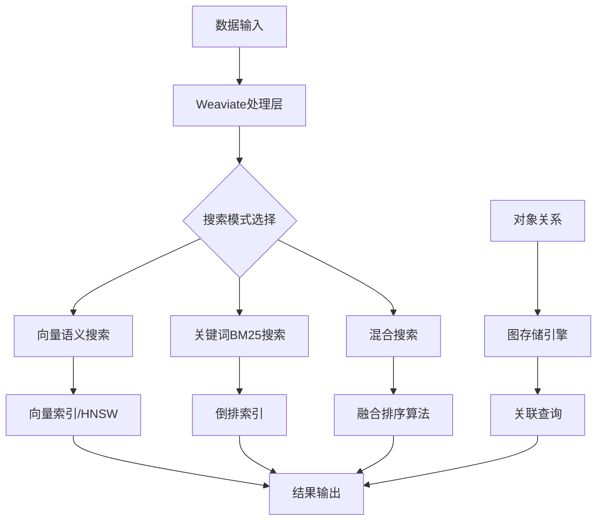

# 5.3.3 Weaviate：图向量混合存储

## 概念讲解（文字+图示）

Weaviate是一款开源的**向量数据库**，其核心创新在于将**图数据库**的灵活性与**向量搜索**的高效性完美结合，形成独特的"图向量混合存储"架构。不同于传统向量数据库只关注向量相似度，Weaviate能够同时维护对象之间的关系（图结构）和语义相似度（向量空间），实现了真正意义上的多维数据建模。

### 核心架构设计
Weaviate采用模块化架构，核心组件包括：

1. **向量存储引擎**：基于HNSW算法实现高效的近似最近邻搜索
2. **图存储引擎**：维护对象之间的关联关系，支持属性过滤和关联查询
3. **混合索引器**：同时支持BM25关键词搜索和向量语义搜索
4. **模块系统**：可插拔的向量化器、重排序器和生成器模块



### 图向量混合优势
传统向量数据库将每个文档视为孤立点，而Weaviate通过图结构维护文档间的语义关系：
- **上下文感知**：理解文档间的引用关系、层级结构
- **多跳查询**：支持"朋友的朋友"式的多级关联检索
- **属性过滤**：在向量搜索基础上添加复杂的属性约束
- **动态路由**：根据查询类型自动选择最优搜索策略

## 核心要点（重点标记）

**💡 Weaviate的核心价值主张：**

1. **🔄 图向量混合存储**
   - 同时维护向量相似度和对象关联关系
   - 支持复杂业务场景下的多维检索需求
   - 实现真正意义上的上下文感知搜索

2. **🔌 高度模块化架构**
   - 向量化器模块：支持OpenAI、Cohere、HuggingFace等多种模型
   - 重排序器模块：可集成Cohere、Cross-Encoder等重排序服务
   - 生成器模块：内置RAG能力，支持OpenAI、Anthropic等模型

3. **⚡ 生产级特性**
   - 支持多租户隔离
   - 自动备份与恢复
   - 水平扩展能力
   - 企业级安全控制

4. **🌐 云原生设计**
   - 支持Kubernetes原生部署
   - 提供Weaviate Cloud托管服务
   - 完整的监控和日志集成

## 简单示例（代码演示）

### 环境准备与安装
```bash
# 安装LangChain Weaviate集成包
pip install langchain-weaviate weaviate-client>=4.0.0

# 启动本地Weaviate实例（使用Docker）
docker run -d \
  -p 8080:8080 \
  -p 50051:50051 \
  --name weaviate \
  semitechnologies/weaviate:latest
```

### 基础使用示例
```python
from langchain_weaviate import WeaviateVectorStore
from langchain_openai import OpenAIEmbeddings
import weaviate

# 1. 创建Weaviate客户端
client = weaviate.Client(
    url="http://localhost:8080",
    additional_headers={
        "X-OpenAI-Api-Key": "your-openai-api-key"
    }
)

# 2. 初始化嵌入模型
embeddings = OpenAIEmbeddings(
    model="text-embedding-3-small",
    openai_api_key="your-openai-api-key"
)

# 3. 创建向量存储
vector_store = WeaviateVectorStore(
    client=client,
    index_name="DocumentIndex",
    text_key="content",
    embedding=embeddings
)

# 4. 添加文档
documents = [
    "LangChain是一个用于构建AI应用的开源框架",
    "Weaviate是一款支持图向量混合存储的向量数据库",
    "向量搜索在大语言模型中用于实现RAG检索增强生成"
]

vector_store.add_texts(
    texts=documents,
    metadatas=[
        {"source": "doc1", "category": "framework"},
        {"source": "doc2", "category": "database"}, 
        {"source": "doc3", "category": "technique"}
    ]
)

# 5. 执行混合搜索
from langchain_weaviate import WeaviateHybridSearchRetriever

retriever = WeaviateHybridSearchRetriever(
    client=client,
    index_name="DocumentIndex",
    text_key="content",
    alpha=0.5,  # 混合权重：0=纯关键词, 1=纯向量, 0.5=均衡混合
    k=10  # 返回结果数量
)

# 执行混合搜索
results = retriever.invoke("LangChain和向量数据库如何结合使用？")
for result in results:
    print(f"内容: {result.page_content[:100]}...")
    print(f"元数据: {result.metadata}")
    print("-" * 50)
```

### 图关联查询示例
```python
# 创建具有关联关系的对象
import json

# 定义数据模式
schema = {
    "classes": [
        {
            "class": "Author",
            "properties": [
                {"name": "name", "dataType": ["text"]},
                {"name": "writesArticles", "dataType": ["Article"]}
            ]
        },
        {
            "class": "Article",
            "properties": [
                {"name": "title", "dataType": ["text"]},
                {"name": "content", "dataType": ["text"]},
                {"name": "writtenBy", "dataType": ["Author"]}
            ]
        }
    ]
}

# 应用模式
client.schema.create(schema)

# 创建关联数据
author_id = client.data_object.create(
    data_object={"name": "张明"},
    class_name="Author"
)

article_id = client.data_object.create(
    data_object={
        "title": "LangChain高级应用指南",
        "content": "本文深入探讨LangChain在复杂业务场景中的应用..."
    },
    class_name="Article"
)

# 建立关联关系
client.data_object.reference.add(
    from_uuid=article_id,
    from_class_name="Article",
    from_property_name="writtenBy",
    to_uuid=author_id,
    to_class_name="Author"
)

# 查询关联数据
query = """
{
  Get {
    Article(
      nearText: {
        concepts: ["LangChain高级应用"]
      }
    ) {
      title
      content
      writtenBy {
        ... on Author {
          name
        }
      }
    }
  }
}
"""

result = client.query.raw(query)
print(json.dumps(result, indent=2, ensure_ascii=False))
```

## 进阶应用（可选内容）

### 企业级部署架构
```python
# 生产环境配置示例
from weaviate import Client
from weaviate.auth import AuthApiKey
import os

# 配置云托管Weaviate集群
client = Client(
    url="https://your-cluster.weaviate.network",
    auth_client_secret=AuthApiKey(api_key=os.getenv("WEAVIATE_API_KEY")),
    additional_headers={
        "X-OpenAI-Api-Key": os.getenv("OPENAI_API_KEY"),
        "X-Cohere-Api-Key": os.getenv("COHERE_API_KEY")
    },
    timeout_config=(10, 60)  # 连接超时10秒，读取超时60秒
)

# 配置多模块管道
vector_store = WeaviateVectorStore(
    client=client,
    index_name="EnterpriseDocs",
    text_key="content",
    embedding=embeddings,
    # 启用多阶段处理管道
    additional_config={
        "vectorizer": "text2vec-openai",
        "moduleConfig": {
            "text2vec-openai": {
                "model": "text-embedding-3-large",
                "dimensions": 3072
            },
            "reranker-cohere": {
                "model": "rerank-english-v2.0"
            },
            "generative-openai": {
                "model": "gpt-4-turbo-preview"
            }
        }
    }
)
```

### 性能优化策略
```python
# 1. 批量导入优化
from langchain.text_splitter import RecursiveCharacterTextSplitter
from tqdm import tqdm

def batch_import_documents(documents, batch_size=100):
    """批量导入文档，优化性能"""
    text_splitter = RecursiveCharacterTextSplitter(
        chunk_size=1000,
        chunk_overlap=200
    )
    
    chunks = text_splitter.split_documents(documents)
    
    for i in tqdm(range(0, len(chunks), batch_size)):
        batch = chunks[i:i+batch_size]
        texts = [chunk.page_content for chunk in batch]
        metadatas = [chunk.metadata for chunk in batch]
        
        vector_store.add_texts(
            texts=texts,
            metadatas=metadatas,
            # 启用动态批处理
            batch_config={
                "batch_size": batch_size,
                "dynamic": True
            }
        )

# 2. 缓存策略
from langchain.cache import WeaviateCache

# 启用向量缓存
cache = WeaviateCache(
    client=client,
    index_name="QueryCache",
    ttl=3600  # 缓存1小时
)

# 3. 索引优化
def optimize_index_settings():
    """优化索引配置"""
    index_config = {
        "vectorIndexConfig": {
            "efConstruction": 128,  # 构建时参数
            "maxConnections": 32,   # HNSW最大连接数
            "ef": 64,               # 查询时参数
            "dynamicEfMin": 50,     # 动态EF最小值
            "dynamicEfMax": 500,    # 动态EF最大值
            "dynamicEfFactor": 8    # 动态EF因子
        },
        "invertedIndexConfig": {
            "cleanupIntervalSeconds": 300,
            "bm25": {
                "k1": 1.2,
                "b": 0.75
            }
        }
    }
    
    client.schema.update_config(
        class_name="DocumentIndex",
        config=index_config
    )
```

### 监控与告警
```python
import prometheus_client
from weaviate.monitoring import PrometheusMetrics

# 配置监控
metrics = PrometheusMetrics()

# 自定义业务指标
queries_counter = prometheus_client.Counter(
    'weaviate_queries_total',
    'Total number of queries',
    ['index_name', 'query_type']
)

latency_histogram = prometheus_client.Histogram(
    'weaviate_query_latency_seconds',
    'Query latency in seconds',
    ['index_name', 'query_type'],
    buckets=[0.1, 0.5, 1.0, 2.0, 5.0]
)

def track_query_performance(index_name, query_type, duration):
    """记录查询性能指标"""
    queries_counter.labels(index_name, query_type).inc()
    latency_histogram.labels(index_name, query_type).observe(duration)
```

## 常见问题

### Q1: Weaviate与其他向量数据库的主要区别是什么？
**A:** Weaviate的核心差异化在于"图向量混合"架构。传统向量数据库如Pinecone、Chroma主要关注纯向量搜索，而Weaviate：
1. **支持对象关系建模**：可以定义对象间的关联，支持复杂查询
2. **原生混合搜索**：内置BM25+向量融合算法，无需外部重排序
3. **模块化扩展**：可插拔的向量化器、重排序器、生成器
4. **多租户支持**：企业级的多租户隔离和管理功能

### Q2: Weaviate适合哪些业务场景？
**A:** Weaviate特别适合以下场景：
- **知识图谱+RAG**：需要维护实体关系的智能问答系统
- **电商搜索**：需要结合属性过滤、语义搜索、关联推荐的复杂搜索
- **内容推荐**：基于用户行为图的内容个性化推荐
- **企业搜索**：需要多维度筛选和关联查询的企业文档检索
- **研究分析**：需要探索性数据分析和模式发现的科研场景

### Q3: Weaviate的性能表现如何？
**A:** Weaviate在性能方面具有以下特点：
1. **搜索性能**：单节点QPS可达1000+，p99延迟<100ms
2. **扩展性**：支持水平扩展，可线性提升吞吐量
3. **内存效率**：采用内存映射文件，支持超过内存大小的数据集
4. **并发能力**：支持高并发查询，内置连接池管理

### Q4: Weaviate的部署复杂度如何？
**A:** 部署选择丰富：
1. **云托管**：Weaviate Cloud提供全托管服务，最快5分钟上线
2. **自托管**：Docker单行命令即可启动开发环境
3. **Kubernetes**：提供Helm Chart和Operator，适合生产部署
4. **混合部署**：支持跨云、跨区域的多集群部署

### Q5: LangChain集成需要注意什么？
**A:** LangChain集成关键点：
1. **版本兼容**：确保`langchain-weaviate`与`weaviate-client`版本匹配
2. **认证配置**：正确配置API密钥和认证头
3. **错误处理**：实现重试机制和降级策略
4. **监控集成**：配置性能监控和健康检查

## 本节总结

Weaviate作为**图向量混合存储**的代表，在向量数据库领域开辟了新的技术范式。它不仅仅是一个向量搜索引擎，更是一个完整的**语义数据平台**，将向量搜索、图关联、混合检索等能力深度融合。

### 技术选型建议
**选择Weaviate当：**
- 业务需要维护复杂的对象关系
- 搜索需求结合了属性过滤、语义匹配、关联查询
- 需要内置RAG能力，减少系统复杂度
- 企业级的多租户和安全控制是刚需

**考虑其他方案当：**
- 只需要简单的向量相似度搜索
- 对部署复杂度极其敏感，追求极简方案
- 预算有限，且不需要图关联功能

### 发展趋势
随着大模型应用的深入，Weaviate的图向量混合架构展现出独特优势：
1. **上下文增强**：通过图结构维护对话上下文，提升多轮对话质量
2. **动态知识**：支持实时更新和关联推理，适应动态变化的知识库
3. **多模态扩展**：正在扩展图像、音频等多模态向量支持
4. **边缘计算**：推出轻量级版本，支持边缘设备部署

### 最佳实践提示
1. **从小规模开始**：先从一个业务场景试点，验证技术可行性
2. **设计合理模式**：精心设计数据模式，平衡灵活性和性能
3. **监控先行**：部署初期就建立完整的监控体系
4. **团队培训**：确保团队理解图向量混合的概念和最佳实践
5. **持续优化**：定期分析查询模式，优化索引和缓存策略

Weaviate代表了向量数据库发展的一个重要方向——从单纯的相似度匹配走向智能的语义理解与关联推理。对于需要构建复杂AI应用的企业来说，Weaviate提供了从数据存储到智能检索的一站式解决方案。