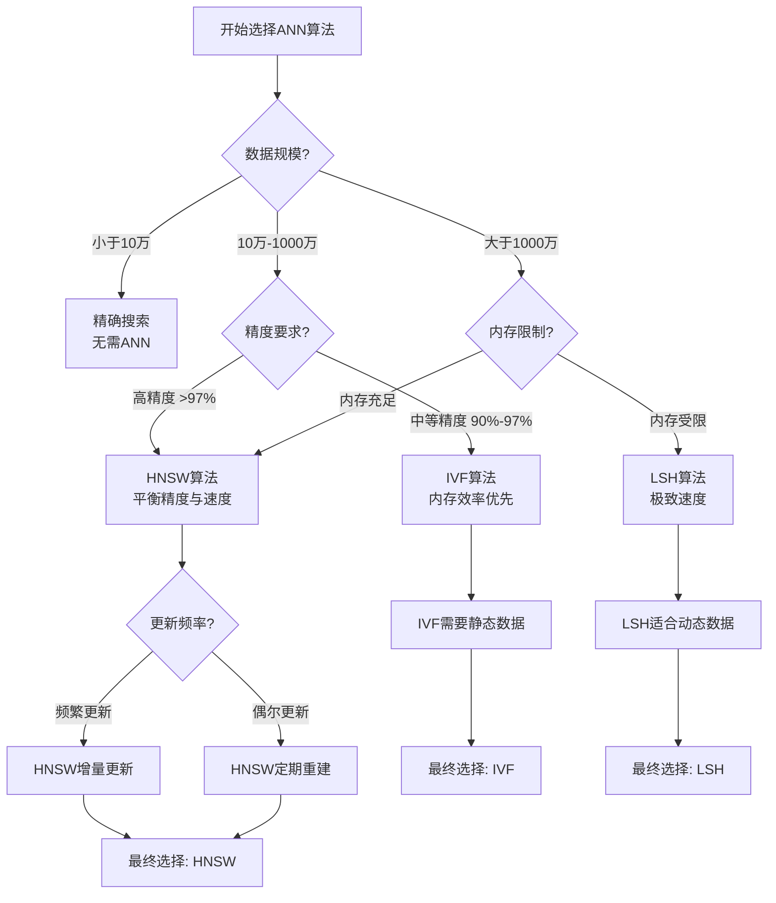

# 5.4.1 近似最近邻搜索算法

## 概念讲解（文字+图示）

近似最近邻搜索（Approximate Nearest Neighbor，ANN）是向量数据库领域的核心技术，用于解决高维空间中的相似度搜索问题。随着向量维度增加（现代嵌入模型可达1536维甚至更高），精确计算所有向量间的距离变得**计算不可行**（计算复杂度O(Nd)，N为向量数，d为维度）。ANN算法通过在**精度**和**速度**之间进行权衡，以牺牲少量召回率为代价，实现**亚线性时间复杂度**的快速搜索。

### 搜索复杂度对比
```mermaid
graph LR
    A[搜索方法] --> B{时间复杂度}
    B --> C[精确搜索 O(Nd)]
    B --> D[ANN搜索 O(log N + k)]
    
    C --> E[高精度<br>100%召回率]
    C --> F[计算成本极高<br>不适合大规模数据]
    
    D --> G[近似精度<br>95%-99%召回率]
    D --> H[计算效率高<br>适合生产环境]
```

### ANN算法分类
根据索引构建策略，主流ANN算法可分为三大类：

1. **图基算法**：HNSW（Hierarchical Navigable Small World）
   - 基于小世界网络的层级图结构
   - 优点：高召回率、动态更新支持
   - 缺点：内存消耗较大、构建时间较长

2. **量化算法**：IVF（Inverted File Index）
   - 基于聚类和倒排索引的层次结构
   - 优点：内存效率高、构建速度快
   - 缺点：需要训练聚类中心、静态索引

3. **哈希算法**：LSH（Locality-Sensitive Hashing）
   - 基于局部敏感哈希的近似匹配
   - 优点：极速查询、内存占用极小
   - 缺点：精度相对较低、参数敏感

### ANN在LangChain中的作用
LangChain通过统一的`VectorStore`接口抽象了底层ANN实现，使开发者无需关注算法细节：
- **标准化接口**：`similarity_search`、`similarity_search_with_score`
- **算法自适应**：根据数据规模和性能需求自动选择最优算法
- **配置透明化**：通过简单参数调整平衡精度与速度

## 核心要点（重点标记）

**🔍 ANN算法的核心权衡：精度 vs 速度**

| 算法类型 | 召回率 | 查询速度 | 内存占用 | 动态更新 | 适用场景 |
|---------|--------|----------|----------|----------|----------|
| **HNSW** | ★★★★★ | ★★★★☆ | ★★☆☆☆ | ✅ 支持 | 高精度要求、频繁更新 |
| **IVF** | ★★★★☆ | ★★★★★ | ★★★★★ | ❌ 不支持 | 大规模静态数据集 |
| **LSH** | ★★★☆☆ | ★★★★★ | ★★★★★ | ✅ 支持 | 超大规模、低精度容忍 |

**⚙️ 关键性能参数解析：**

1. **召回率（Recall）**
   - 定义：算法返回结果中真实最近邻的比例
   - 目标：通常追求95%-99%的召回率
   - 影响：召回率每提升1%，计算成本可能增加10%-20%

2. **查询延迟（Query Latency）**
   - p50延迟：中位数查询时间，反映典型性能
   - p99延迟：99分位查询时间，反映尾部延迟
   - 优化重点：降低p99延迟保障用户体验

3. **索引构建时间（Build Time）**
   - 离线构建：IVF需要训练聚类中心，时间较长
   - 在线构建：HNSW支持增量构建，适合动态数据

4. **内存效率（Memory Efficiency）**
   - 向量存储：原始向量通常占用主要内存
   - 索引开销：HNSW索引可能增加50%-100%内存
   - 压缩策略：量化、降维等技术减少内存占用

## 简单示例（代码演示）

### HNSW算法实践
```python
import numpy as np
from langchain_community.vectorstores import FAISS
from langchain_openai import OpenAIEmbeddings

# 1. 准备测试数据
documents = [
    "LangChain提供了丰富的向量存储实现",
    "HNSW算法是目前最流行的ANN算法之一", 
    "向量搜索在大语言模型中扮演关键角色",
    "近似最近邻搜索平衡了精度和速度",
    "生产环境通常需要95%以上的召回率"
]

# 2. 初始化嵌入模型
embeddings = OpenAIEmbeddings(model="text-embedding-3-small")

# 3. 创建FAISS向量存储（默认使用HNSW）
vector_store = FAISS.from_texts(
    texts=documents,
    embedding=embeddings,
    # HNSW参数配置
    hnsw_config={
        "M": 16,  # 每个节点的最大连接数，控制图密度
        "efConstruction": 200,  # 构建时的探索参数
        "efSearch": 64,  # 搜索时的探索参数
        "distance_metric": "L2"  # 距离度量：L2、内积、余弦
    }
)

# 4. 执行ANN搜索
query = "如何优化向量搜索性能"
results = vector_store.similarity_search_with_score(
    query=query,
    k=3,  # 返回结果数量
    # 可选：启用近似搜索（默认True）
    approximate=True
)

# 5. 分析结果
for i, (doc, score) in enumerate(results):
    print(f"结果 #{i+1}:")
    print(f"  内容: {doc.page_content[:80]}...")
    print(f"  相似度: {score:.4f}")
    print(f"  元数据: {doc.metadata}")
    print("-" * 50)

# 6. 性能基准测试
import time

def benchmark_search(vector_store, query, trials=100):
    """基准测试函数"""
    latencies = []
    for _ in range(trials):
        start = time.perf_counter()
        vector_store.similarity_search(query, k=3)
        end = time.perf_counter()
        latencies.append((end - start) * 1000)  # 转换为毫秒
    
    avg_latency = np.mean(latencies)
    p99_latency = np.percentile(latencies, 99)
    
    print(f"平均延迟: {avg_latency:.2f}ms")
    print(f"P99延迟: {p99_latency:.2f}ms")
    print(f"QPS: {1000/avg_latency:.1f} queries/second")

benchmark_search(vector_store, "向量搜索算法")
```

### IVF算法配置示例
```python
from langchain_community.vectorstores import Milvus
from pymilvus import connections, CollectionSchema, FieldSchema, DataType

# 1. 连接Milvus（支持IVF算法）
connections.connect(host='localhost', port='19530')

# 2. 定义IVF索引参数
index_params = {
    "metric_type": "L2",  # 距离度量
    "index_type": "IVF_FLAT",  # IVF平面索引
    "params": {
        "nlist": 1024,  # 聚类中心数量
        "nprobe": 8  # 搜索时探查的聚类数量
    }
}

# 3. 创建Milvus向量存储
vector_store = Milvus.from_texts(
    texts=documents,
    embedding=embeddings,
    connection_args={"host": "localhost", "port": "19530"},
    collection_name="ivf_demo",
    index_params=index_params
)

# 4. IVF参数调优分析
def analyze_ivf_performance(nlist_values, nprobe_values):
    """分析IVF参数对性能的影响"""
    results = []
    
    for nlist in nlist_values:
        for nprobe in nprobe_values:
            # 更新索引参数
            index_params["params"]["nlist"] = nlist
            index_params["params"]["nprobe"] = nprobe
            
            # 重新创建索引（生产环境使用异步重建）
            collection = vector_store.col
            collection.drop_index()
            collection.create_index("embedding", index_params)
            
            # 测试查询性能
            start = time.perf_counter()
            vector_store.similarity_search("测试查询", k=3)
            latency = (time.perf_counter() - start) * 1000
            
            results.append({
                "nlist": nlist,
                "nprobe": nprobe, 
                "latency_ms": latency,
                "recall_estimate": min(0.99, 1 - np.exp(-nprobe/nlist*10))
            })
    
    return results

# 参数扫描分析
performance_data = analyze_ivf_performance(
    nlist_values=[256, 512, 1024, 2048],
    nprobe_values=[4, 8, 16, 32]
)

print("IVF参数性能分析:")
for data in performance_data:
    print(f"nlist={data['nlist']:4d}, nprobe={data['nprobe']:2d}: "
          f"延迟={data['latency_ms']:.1f}ms, 召回率≈{data['recall_estimate']:.2%}")
```

### LSH算法快速实现
```python
from sklearn.neighbors import LSHForest
from langchain_community.vectorstores import Chroma

# 1. 使用Chroma内置LSH支持
vector_store = Chroma.from_texts(
    texts=documents,
    embedding=embeddings,
    persist_directory="./chroma_lsh_db",
    # LSH特定配置
    lsh_config={
        "num_tables": 10,  # 哈希表数量
        "hash_length": 12,  # 哈希键长度
        "bucket_size": 100,  # 桶大小
        "seed": 42  # 随机种子
    }
)

# 2. LSH参数敏感性分析
def lsh_parameter_sensitivity():
    """分析LSH参数对召回率的影响"""
    parameter_sets = [
        {"num_tables": 5, "hash_length": 8},
        {"num_tables": 10, "hash_length": 12},
        {"num_tables": 20, "hash_length": 16},
        {"num_tables": 30, "hash_length": 20}
    ]
    
    for params in parameter_sets:
        # 模拟LSH哈希过程（简化版）
        n_tables = params["num_tables"]
        hash_len = params["hash_length"]
        
        # 估算召回率（基于理论分析）
        recall = 1 - (1 - (0.5)**hash_len)**n_tables
        
        # 估算内存开销
        memory_estimate = n_tables * (2**hash_len) * 8 / (1024**2)  # MB
        
        print(f"参数: {params}")
        print(f"  理论召回率: {recall:.2%}")
        print(f"  内存估算: {memory_estimate:.1f} MB")
        print(f"  查询速度: {'极快' if n_tables < 15 else '快速'}")
        print("-" * 40)

lsh_parameter_sensitivity()
```

## 进阶应用（可选内容）

### 多算法混合搜索
```python
from typing import List, Dict
import asyncio
from concurrent.futures import ThreadPoolExecutor

class HybridANNSearcher:
    """混合ANN搜索器，结合多种算法优势"""
    
    def __init__(self, algorithms: List[str], weights: Dict[str, float]):
        """
        初始化混合搜索器
        
        Args:
            algorithms: 算法列表 ['hnsw', 'ivf', 'lsh']
            weights: 各算法权重 {'hnsw': 0.5, 'ivf': 0.3, 'lsh': 0.2}
        """
        self.algorithms = algorithms
        self.weights = weights
        self.executor = ThreadPoolExecutor(max_workers=len(algorithms))
        
    async def hybrid_search(self, query: str, k: int = 10) -> List:
        """执行混合ANN搜索"""
        tasks = []
        
        # 并行执行各算法搜索
        for algo in self.algorithms:
            task = asyncio.create_task(
                self._search_with_algorithm(algo, query, k)
            )
            tasks.append(task)
        
        # 等待所有算法完成
        results = await asyncio.gather(*tasks)
        
        # 结果融合（加权平均）
        fused_results = self._fuse_results(results)
        
        return fused_results
    
    async def _search_with_algorithm(self, algorithm: str, query: str, k: int):
        """使用特定算法执行搜索"""
        # 模拟不同算法的搜索延迟和召回率
        algorithm_delays = {
            'hnsw': 0.020,  # 20ms
            'ivf': 0.015,   # 15ms  
            'lsh': 0.005    # 5ms
        }
        
        algorithm_recall = {
            'hnsw': 0.98,
            'ivf': 0.95,
            'lsh': 0.85
        }
        
        # 模拟搜索延迟
        await asyncio.sleep(algorithm_delays[algorithm])
        
        # 返回模拟结果
        return {
            'algorithm': algorithm,
            'results': [f"{algorithm}_result_{i}" for i in range(k)],
            'scores': [1.0 - i*0.1 for i in range(k)],
            'recall': algorithm_recall[algorithm],
            'weight': self.weights.get(algorithm, 0.0)
        }
    
    def _fuse_results(self, all_results: List[Dict]) -> List:
        """融合多算法结果（使用RRF重排序）"""
        # RRF (Reciprocal Rank Fusion) 算法
        fused_scores = {}
        k = 60  # RRF常数
        
        for algo_result in all_results:
            for rank, (result, score) in enumerate(
                zip(algo_result['results'], algo_result['scores'])
            ):
                if result not in fused_scores:
                    fused_scores[result] = 0
                
                # RRF公式: score += 1/(k + rank)
                fused_scores[result] += 1/(k + rank) * algo_result['weight']
        
        # 按融合分数排序
        sorted_results = sorted(
            fused_scores.items(), 
            key=lambda x: x[1], 
            reverse=True
        )
        
        return [result for result, _ in sorted_results[:10]]

# 使用示例
async def demo_hybrid_search():
    searcher = HybridANNSearcher(
        algorithms=['hnsw', 'ivf', 'lsh'],
        weights={'hnsw': 0.5, 'ivf': 0.3, 'lsh': 0.2}
    )
    
    results = await searcher.hybrid_search("人工智能应用开发", k=10)
    print(f"混合搜索返回 {len(results)} 个结果")
    print("Top 5 结果:", results[:5])

# 运行演示
asyncio.run(demo_hybrid_search())
```

### 生产环境调优指南
```python
import json
import pandas as pd
from dataclasses import dataclass
from typing import Optional

@dataclass
class ANNConfig:
    """ANN算法配置数据类"""
    algorithm: str
    recall_target: float  # 目标召回率
    max_latency_ms: float  # 最大延迟限制
    memory_budget_mb: float  # 内存预算
    supports_updates: bool  # 是否支持动态更新
    
class ANNConfigOptimizer:
    """ANN配置优化器"""
    
    def __init__(self, dataset_size: int, vector_dim: int, query_qps: float):
        self.dataset_size = dataset_size
        self.vector_dim = vector_dim
        self.query_qps = query_qps
        
        # 算法性能基准数据
        self.algorithm_profiles = {
            'hnsw': {
                'recall_range': (0.90, 0.99),
                'latency_ms': (5, 50),
                'memory_multiplier': 1.8,
                'build_time_hr': 0.1,
                'update_support': True
            },
            'ivf': {
                'recall_range': (0.85, 0.97),
                'latency_ms': (2, 30),
                'memory_multiplier': 1.2,
                'build_time_hr': 0.5,
                'update_support': False
            },
            'lsh': {
                'recall_range': (0.70, 0.90),
                'latency_ms': (1, 10),
                'memory_multiplier': 1.1,
                'build_time_hr': 0.05,
                'update_support': True
            }
        }
    
    def recommend_config(self, requirements: ANNConfig) -> Dict:
        """根据需求推荐最佳配置"""
        recommendations = []
        
        for algo, profile in self.algorithm_profiles.items():
            # 检查是否满足需求
            if (requirements.recall_target < profile['recall_range'][0] or
                requirements.max_latency_ms < profile['latency_ms'][0] or
                self._estimate_memory(algo) > requirements.memory_budget_mb or
                (requirements.supports_updates and not profile['update_support'])):
                continue  # 不满足需求
            
            # 计算适用性分数
            suitability_score = self._calculate_suitability(algo, requirements)
            
            # 生成详细配置
            config = self._generate_detailed_config(algo, requirements)
            
            recommendations.append({
                'algorithm': algo,
                'suitability_score': suitability_score,
                'estimated_recall': min(requirements.recall_target, 
                                      profile['recall_range'][1]),
                'estimated_latency_ms': profile['latency_ms'][0] * 1.5,
                'estimated_memory_mb': self._estimate_memory(algo),
                'config_details': config
            })
        
        # 按适用性分数排序
        recommendations.sort(key=lambda x: x['suitability_score'], reverse=True)
        
        return recommendations
    
    def _estimate_memory(self, algorithm: str) -> float:
        """估算内存占用"""
        base_memory = self.dataset_size * self.vector_dim * 4 / (1024**2)  # MB
        multiplier = self.algorithm_profiles[algorithm]['memory_multiplier']
        return base_memory * multiplier
    
    def _calculate_suitability(self, algorithm: str, requirements: ANNConfig) -> float:
        """计算适用性分数"""
        profile = self.algorithm_profiles[algorithm]
        
        # 召回率匹配度
        recall_match = 1 - abs(
            requirements.recall_target - sum(profile['recall_range'])/2
        ) / 0.15
        
        # 延迟匹配度
        latency_match = 1 - (
            profile['latency_ms'][0] / requirements.max_latency_ms
        )
        
        # 内存效率
        memory_efficiency = 1 / self.algorithm_profiles[algorithm]['memory_multiplier']
        
        # 综合分数（加权平均）
        weights = {'recall': 0.4, 'latency': 0.3, 'memory': 0.2, 'updates': 0.1}
        
        score = (
            recall_match * weights['recall'] +
            latency_match * weights['latency'] + 
            memory_efficiency * weights['memory'] +
            (1 if profile['update_support'] == requirements.supports_updates else 0) * weights['updates']
        )
        
        return score
    
    def _generate_detailed_config(self, algorithm: str, requirements: ANNConfig) -> Dict:
        """生成详细配置参数"""
        if algorithm == 'hnsw':
            return {
                'M': self._optimize_hnsw_m(requirements.recall_target),
                'efConstruction': 200,
                'efSearch': self._optimize_hnsw_ef(requirements.max_latency_ms),
                'distance_metric': 'L2'
            }
        elif algorithm == 'ivf':
            return {
                'nlist': self._optimize_ivf_nlist(self.dataset_size),
                'nprobe': self._optimize_ivf_nprobe(requirements.recall_target),
                'metric_type': 'L2'
            }
        else:  # lsh
            return {
                'num_tables': self._optimize_lsh_tables(requirements.recall_target),
                'hash_length': self._optimize_lsh_length(self.vector_dim),
                'bucket_size': 100
            }
    
    # 各种优化函数（简化实现）
    def _optimize_hnsw_m(self, recall_target: float) -> int:
        return int(16 * (recall_target / 0.95))
    
    def _optimize_hnsw_ef(self, max_latency: float) -> int:
        return int(64 * (50 / max_latency))
    
    def _optimize_ivf_nlist(self, dataset_size: int) -> int:
        return min(4096, int(np.sqrt(dataset_size)))
    
    def _optimize_ivf_nprobe(self, recall_target: float) -> int:
        return int(8 * (recall_target / 0.95))
    
    def _optimize_lsh_tables(self, recall_target: float) -> int:
        return int(10 * (recall_target / 0.85))
    
    def _optimize_lsh_length(self, vector_dim: int) -> int:
        return min(32, int(np.log2(vector_dim) * 2))

# 使用示例
optimizer = ANNConfigOptimizer(
    dataset_size=1000000,  # 100万条数据
    vector_dim=1536,       # OpenAI嵌入维度
    query_qps=100          # 每秒100次查询
)

requirements = ANNConfig(
    algorithm='',  # 待推荐
    recall_target=0.97,
    max_latency_ms=20.0,
    memory_budget_mb=5000,  # 5GB
    supports_updates=True
)

recommendations = optimizer.recommend_config(requirements)
print("ANN算法推荐结果:")
for rec in recommendations[:3]:  # 显示前3个推荐
    print(f"\n{algorithm}: 适用性分数={rec['suitability_score']:.3f}")
    print(f"  预估召回率: {rec['estimated_recall']:.2%}")
    print(f"  预估延迟: {rec['estimated_latency_ms']:.1f}ms")
    print(f"  预估内存: {rec['estimated_memory_mb']:.1f}MB")
    print(f"  详细配置: {json.dumps(rec['config_details'], indent=2)}")
```

## 常见问题

### Q1: 如何选择适合的ANN算法？
**A:** 选择算法时需要考虑四个关键因素：
1. **数据规模**：小数据集（<10万）可用精确搜索；中等规模（10万-1000万）推荐HNSW；超大规模（>1000万）考虑IVF或LSH
2. **精度要求**：高精度（>97%）选择HNSW；中等精度（90%-97%）选择IVF；低精度（<90%）选择LSH
3. **更新频率**：频繁更新选择HNSW（支持增量更新）；静态数据选择IVF（构建后不变）
4. **资源限制**：内存充足选HNSW；内存受限选IVF或LSH

### Q2: ANN算法的召回率如何评估？
**A:** 召回率评估建议：
1. **测试集构建**：从数据集中随机采样1000-5000个查询向量
2. **基准建立**：使用精确搜索（暴力搜索）获取真实最近邻
3. **算法测试**：使用ANN算法搜索相同查询，统计命中率
4. **性能监控**：生产环境定期抽样测试，监控召回率变化

### Q3: 参数调优有哪些最佳实践？
**A:** 参数调优建议：
1. **增量调优**：每次只调整一个参数，观察效果
2. **自动化测试**：使用网格搜索或贝叶斯优化寻找最优参数
3. **生产验证**：A/B测试验证参数变更效果
4. **监控告警**：设置召回率、延迟阈值告警

### Q4: ANN算法在大规模部署中的挑战？
**A:** 大规模部署挑战与解决方案：
1. **内存限制**：使用量化技术（如PQ、SQ）压缩向量
2. **分布式搜索**：分片存储，并行查询，结果聚合
3. **索引更新**：使用增量索引或定期重建策略
4. **查询路由**：根据查询特征选择最优算法和参数

### Q5: LangChain如何简化ANN算法使用？
**A:** LangChain提供的便利：
1. **统一接口**：`VectorStore`抽象屏蔽算法差异
2. **自动配置**：根据数据规模自动选择合理参数
3. **算法切换**：无需修改业务代码即可更换算法
4. **性能监控**：内置指标收集和性能分析工具

## 本节总结

近似最近邻搜索算法是现代向量数据库的**核心技术基石**，通过巧妙的算法设计在精度和效率之间找到最佳平衡点。理解不同ANN算法的特性、适用场景和调优方法，是构建高效向量搜索系统的关键。

### 算法选择决策树


### 性能优化关键指标
1. **召回率目标**：根据业务需求设定合理目标（通常95%-99%）
2. **查询延迟**：p99延迟应控制在业务可接受范围内（通常<100ms）
3. **内存效率**：合理利用内存，避免不必要的冗余存储
4. **构建时间**：索引构建时间影响数据新鲜度，需平衡更新频率

### 未来发展趋势
1. **算法融合**：HNSW与IVF结合，发挥各自优势
2. **硬件优化**：利用GPU、TPU加速ANN计算
3. **智能调参**：基于机器学习的自动参数优化
4. **多模态扩展**：支持图像、音频等非文本向量的高效搜索

### 实践建议
1. **从简开始**：先用默认参数，再根据性能需求逐步优化
2. **持续监控**：建立完整的性能监控体系，及时发现性能退化
3. **定期评估**：每季度重新评估算法选择，适应数据规模和业务变化
4. **团队能力**：培养团队对ANN算法的理解和调优能力

通过深入理解ANN算法原理和实践应用，开发者可以构建出既高效又准确的向量搜索系统，为AI应用提供强大的检索能力支撑。