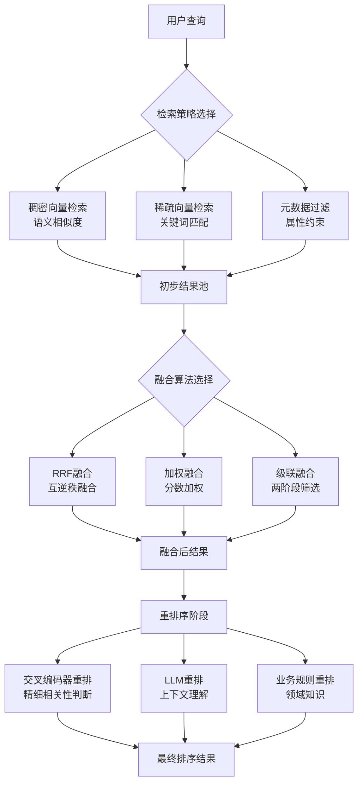

# 5.4.2 混合检索与重排序

## 概念讲解（文字+图示）

混合检索与重排序是现代信息检索系统的**核心优化技术**，通过结合多种检索方法的优势，显著提升搜索结果的**相关性**和**多样性**。在向量搜索场景中，单纯的向量相似度搜索虽然能捕捉语义相似性，但容易忽略**关键词匹配**、**新鲜度**、**权威性**等传统IR指标。混合检索技术将**稠密向量检索**（Dense Retrieval）与**稀疏向量检索**（Sparse Retrieval）相结合，而重排序则对初步检索结果进行精细化排序优化。

### 混合检索架构


### 技术演进路径
1. **第一代：纯关键词搜索**（BM25）
   - 基于词频统计的经典算法
   - 优点：计算高效、结果可解释
   - 缺点：语义鸿沟、同义词问题

2. **第二代：纯向量搜索**（Embedding + ANN）
   - 基于深度学习嵌入的语义搜索
   - 优点：语义理解能力强
   - 缺点：忽略精确匹配、计算成本高

3. **第三代：混合搜索**（Hybrid Search）
   - 结合关键词和语义搜索优势
   - 平衡召回率和精确率
   - 支持多维度相关性评估

4. **第四代：智能重排序**（Reranking）
   - 基于交叉编码器的精细化排序
   - 上下文感知的相关性判断
   - 个性化与业务规则集成

## 核心要点（重点标记）

**🎯 混合检索的核心价值：**

1. **📈 提升召回率**
   - 向量搜索召回语义相关但关键词不匹配的内容
   - 关键词搜索召回精确匹配但语义不相关的内容
   - 两者结合实现更全面的文档覆盖

2. **⚖️ 平衡相关性维度**
   - 语义相关性：向量相似度（0.0-1.0）
   - 词汇相关性：BM25分数（0.0-∞）
   - 时间相关性：新鲜度权重（0.0-1.0）
   - 权威性：来源权重（0.0-1.0）

3. **🔧 灵活的可配置性**
   - 动态调整向量/关键词权重
   - 支持查询时参数调整
   - 自适应不同查询类型

**🎯 重排序的核心优势：**

1. **🔍 精细化相关性判断**
   - 交叉编码器：query-doc对联合编码
   - 对比学习：学习细微相关性差异
   - 上下文理解：考虑完整文档上下文

2. **🎨 个性化排序能力**
   - 用户历史行为建模
   - 领域知识注入
   - 业务规则优先级

3. **⚡ 计算效率优化**
   - 只在Top-K候选集上重排
   - 支持批处理并行计算
   - 缓存机制减少重复计算

## 简单示例（代码演示）

### 基础混合检索实现
```python
from langchain.retrievers import ContextualCompressionRetriever
from langchain.retrievers.document_compressors import FlashrankRerank
from langchain_community.vectorstores import FAISS
from langchain_openai import OpenAIEmbeddings
from langchain.retrievers import BM25Retriever
from langchain.retrievers import EnsembleRetriever
from langchain_core.documents import Document

# 1. 准备测试数据
documents = [
    Document(page_content="LangChain框架提供了丰富的工具链"),
    Document(page_content="混合检索结合了关键词和语义搜索的优势"),
    Document(page_content="重排序技术可以显著提升搜索结果质量"),
    Document(page_content="BM25算法是经典的关键词匹配算法"),
    Document(page_content="向量嵌入能够捕捉文本的语义信息")
]

# 2. 初始化向量检索器
embeddings = OpenAIEmbeddings(model="text-embedding-3-small")
vector_store = FAISS.from_documents(documents, embeddings)
vector_retriever = vector_store.as_retriever(search_kwargs={"k": 10})

# 3. 初始化BM25检索器
bm25_retriever = BM25Retriever.from_documents(documents)
bm25_retriever.k = 10

# 4. 创建混合检索器（Ensemble）
ensemble_retriever = EnsembleRetriever(
    retrievers=[vector_retriever, bm25_retriever],
    weights=[0.5, 0.5],  # 各检索器权重
    search_type="similarity",  # 或 "mmr" 最大边际相关性
    c=0.7  # MMR多样性参数
)

# 5. 执行混合检索
query = "如何提升搜索质量"
results = ensemble_retriever.invoke(query)

print("混合检索结果:")
for i, doc in enumerate(results):
    print(f"{i+1}. {doc.page_content[:80]}...")
    print(f"   来源: {'向量' if i % 2 == 0 else 'BM25'}")
    print("-" * 50)

# 6. RRF（互逆秩融合）示例
def reciprocal_rank_fusion(vector_results, bm25_results, k=60):
    """RRF融合算法实现"""
    fused_scores = {}
    
    # 处理向量搜索结果
    for rank, doc in enumerate(vector_results):
        doc_id = id(doc)  # 实际使用文档唯一标识
        if doc_id not in fused_scores:
            fused_scores[doc_id] = 0
        fused_scores[doc_id] += 1 / (k + rank + 1)
    
    # 处理BM25搜索结果
    for rank, doc in enumerate(bm25_results):
        doc_id = id(doc)
        if doc_id not in fused_scores:
            fused_scores[doc_id] = 0
        fused_scores[oc_id] += 1 / (k + rank + 1)
    
    # 按融合分数排序
    sorted_docs = sorted(
        fused_scores.items(),
        key=lambda x: x[1],
        reverse=True
    )
    
    # 返回排序后的文档（简化版）
    return [doc for doc_id, score in sorted_docs[:10]]

# 获取各检索器结果
vector_results = vector_retriever.invoke(query)
bm25_results = bm25_retriever.invoke(query)

# 应用RRF融合
fused_results = reciprocal_rank_fusion(vector_results, bm25_results)
print(f"\nRRF融合后结果数: {len(fused_results)}")
```

### 重排序实践
```python
from langchain.retrievers.document_compressors import CrossEncoderReranker
from sentence_transformers import CrossEncoder
import numpy as np

# 1. 初始化交叉编码器
cross_encoder_model = CrossEncoder('cross-encoder/ms-marco-MiniLM-L-6-v2')

# 2. 创建重排序器
reranker = CrossEncoderReranker(
    model=cross_encoder_model,
    top_n=5,  # 重排序的文档数量
    device='cpu'  # 或 'cuda' 如果有GPU
)

# 3. 创建压缩检索器（重排序）
compression_retriever = ContextualCompressionRetriever(
    base_compressor=reranker,
    base_retriever=ensemble_retriever
)

# 4. 执行带重排序的检索
reranked_results = compression_retriever.invoke(query)

print("\n重排序后结果:")
for i, doc in enumerate(reranked_results):
    # 交叉编码器会添加相关性分数到metadata
    relevance_score = doc.metadata.get('relevance_score', 0)
    print(f"{i+1}. 分数: {relevance_score:.4f}")
    print(f"   内容: {doc.page_content[:80]}...")
    print("-" * 50)

# 5. 自定义重排序函数
def custom_reranking_function(query: str, documents: list, **kwargs):
    """自定义重排序逻辑"""
    reranked_docs = []
    
    for doc in documents:
        # 计算综合分数（示例逻辑）
        content = doc.page_content
        
        # 1. 向量相似度（如果存在）
        vector_score = doc.metadata.get('vector_score', 0)
        
        # 2. BM25分数（如果存在）
        bm25_score = doc.metadata.get('bm25_score', 0)
        
        # 3. 新鲜度分数
        freshness = doc.metadata.get('freshness', 1.0)
        
        # 4. 权威性分数
        authority = doc.metadata.get('authority', 1.0)
        
        # 5. 业务规则分数
        business_rules = kwargs.get('business_rules', {})
        rule_score = 1.0
        for rule, weight in business_rules.items():
            if rule in content.lower():
                rule_score *= weight
        
        # 计算综合分数
        combined_score = (
            vector_score * 0.4 +
            bm25_score * 0.3 +
            freshness * 0.1 +
            authority * 0.1 +
            rule_score * 0.1
        )
        
        # 更新文档分数
        doc.metadata['combined_score'] = combined_score
        reranked_docs.append((combined_score, doc))
    
    # 按综合分数排序
    reranked_docs.sort(key=lambda x: x[0], reverse=True)
    
    return [doc for _, doc in reranked_docs]

# 应用自定义重排序
custom_reranked = custom_reranking_function(
    query,
    results,
    business_rules={'langchain': 1.2, '搜索': 1.1}
)

print(f"\n自定义重排序结果数: {len(custom_reranked)}")
```

### 生产级混合检索系统
```python
from typing import List, Dict, Any
import asyncio
from dataclasses import dataclass
from enum import Enum
import time

class SearchType(Enum):
    VECTOR = "vector"
    KEYWORD = "keyword"
    HYBRID = "hybrid"
    HYBRID_RERANK = "hybrid_rerank"

@dataclass
class SearchConfig:
    """搜索配置参数"""
    search_type: SearchType
    vector_weight: float = 0.5
    keyword_weight: float = 0.5
    rerank_top_k: int = 50
    fusion_method: str = "rrf"  # rrf, weighted, cascade
    alpha: float = 0.5  # 混合搜索权重参数

class ProductionHybridSearcher:
    """生产级混合检索器"""
    
    def __init__(self, config: SearchConfig):
        self.config = config
        self._initialize_components()
        
    def _initialize_components(self):
        """初始化各个组件"""
        # 向量检索器
        self.vector_retriever = self._create_vector_retriever()
        
        # 关键词检索器
        self.keyword_retriever = self._create_keyword_retriever()
        
        # 重排序器（按需加载）
        self.reranker = None
        if self.config.search_type == SearchType.HYBRID_RERANK:
            self.reranker = self._create_reranker()
    
    async def search(self, query: str, **kwargs) -> List[Dict[str, Any]]:
        """执行搜索"""
        start_time = time.perf_counter()
        
        # 根据搜索类型选择策略
        if self.config.search_type == SearchType.VECTOR:
            results = await self._vector_search(query, **kwargs)
        elif self.config.search_type == SearchType.KEYWORD:
            results = await self._keyword_search(query, **kwargs)
        elif self.config.search_type == SearchType.HYBRID:
            results = await self._hybrid_search(query, **kwargs)
        else:  # HYBRID_RERANK
            results = await self._hybrid_rerank_search(query, **kwargs)
        
        # 计算延迟
        latency_ms = (time.perf_counter() - start_time) * 1000
        
        # 添加搜索元数据
        for result in results:
            result['search_metadata'] = {
                'search_type': self.config.search_type.value,
                'latency_ms': latency_ms,
                'config': self.config.__dict__
            }
        
        return results
    
    async def _vector_search(self, query: str, **kwargs) -> List[Dict]:
        """纯向量搜索"""
        # 异步执行向量搜索
        vector_results = await asyncio.to_thread(
            self.vector_retriever.invoke,
            query,
            **kwargs
        )
        
        return self._format_results(vector_results, 'vector')
    
    async def _keyword_search(self, query: str, **kwargs) -> List[Dict]:
        """纯关键词搜索"""
        keyword_results = await asyncio.to_thread(
            self.keyword_retriever.invoke,
            query,
            **kwargs
        )
        
        return self._format_results(keyword_results, 'keyword')
    
    async def _hybrid_search(self, query: str, **kwargs) -> List[Dict]:
        """混合搜索"""
        # 并行执行向量和关键词搜索
        vector_task = asyncio.create_task(self._vector_search(query, **kwargs))
        keyword_task = asyncio.create_task(self._keyword_search(query, **kwargs))
        
        vector_results, keyword_results = await asyncio.gather(
            vector_task, keyword_task
        )
        
        # 结果融合
        if self.config.fusion_method == 'rrf':
            fused_results = self._rrf_fusion(vector_results, keyword_results)
        else:  # weighted fusion
            fused_results = self._weighted_fusion(vector_results, keyword_results)
        
        return fused_results
    
    async def _hybrid_rerank_search(self, query: str, **kwargs) -> List[Dict]:
        """混合搜索+重排序"""
        # 先执行混合搜索获取候选集
        candidate_results = await self._hybrid_search(query, **kwargs)
        
        # 限制重排序的文档数量
        candidates = candidate_results[:self.config.rerank_top_k]
        
        # 执行重排序
        reranked_results = await asyncio.to_thread(
            self._apply_reranking,
            query,
            candidates
        )
        
        return reranked_results
    
    def _rrf_fusion(self, vec_results: List, kw_results: List, k: int = 60) -> List:
        """RRF融合算法"""
        fused_scores = {}
        
        # 向量结果融合
        for rank, result in enumerate(vec_results):
            doc_id = result['id']
            fused_scores[doc_id] = fused_scores.get(doc_id, 0) + 1/(k + rank + 1)
        
        # 关键词结果融合
        for rank, result in enumerate(kw_results):
            doc_id = result['id']
            fused_scores[doc_id] = fused_scores.get(doc_id, 0) + 1/(k + rank + 1)
        
        # 收集所有文档
        all_docs = {doc['id']: doc for doc in vec_results + kw_results}
        
        # 按融合分数排序
        sorted_docs = sorted(
            fused_scores.items(),
            key=lambda x: x[1],
            reverse=True
        )
        
        # 构建最终结果
        final_results = []
        for doc_id, score in sorted_docs:
            doc = all_docs[doc_id].copy()
            doc['fusion_score'] = score
            final_results.append(doc)
        
        return final_results
    
    def _weighted_fusion(self, vec_results: List, kw_results: List) -> List:
        """加权融合算法"""
        # 归一化分数
        vec_scores = [r.get('score', 0) for r in vec_results]
        kw_scores = [r.get('score', 0) for r in kw_results]
        
        if vec_scores:
            vec_max = max(vec_scores)
            vec_min = min(vec_scores)
            if vec_max > vec_min:
                vec_scores = [(s - vec_min)/(vec_max - vec_min) for s in vec_scores]
        
        if kw_scores:
            kw_max = max(kw_scores)
            kw_min = min(kw_scores)
            if kw_max > kw_min:
                kw_scores = [(s - kw_min)/(kw_max - kw_min) for s in kw_scores]
        
        # 收集所有文档
        all_docs = {}
        for i, doc in enumerate(vec_results):
            doc_id = doc['id']
            all_docs[doc_id] = {
                'doc': doc,
                'vector_score': vec_scores[i] if vec_scores else 0
            }
        
        for i, doc in enumerate(kw_results):
            doc_id = doc['id']
            if doc_id in all_docs:
                all_docs[doc_id]['keyword_score'] = kw_scores[i] if kw_scores else 0
            else:
                all_docs[doc_id] = {
                    'doc': doc,
                    'keyword_score': kw_scores[i] if kw_scores else 0,
                    'vector_score': 0
                }
        
        # 计算加权分数
        weighted_results = []
        for doc_id, scores in all_docs.items():
            doc = scores['doc'].copy()
            weighted_score = (
                scores.get('vector_score', 0) * self.config.vector_weight +
                scores.get('keyword_score', 0) * self.config.keyword_weight
            )
            doc['weighted_score'] = weighted_score
            weighted_results.append((weighted_score, doc))
        
        # 按加权分数排序
        weighted_results.sort(key=lambda x: x[0], reverse=True)
        
        return [doc for _, doc in weighted_results]
    
    def _apply_reranking(self, query: str, candidates: List[Dict]) -> List[Dict]:
        """应用重排序"""
        if not self.reranker:
            return candidates
        
        # 提取文档内容
        doc_contents = [doc['content'] for doc in candidates]
        
        # 准备query-doc对
        pairs = [(query, content) for content in doc_contents]
        
        # 使用交叉编码器计算相关性分数
        similarity_scores = self.reranker.predict(pairs)
        
        # 更新文档分数
        reranked_docs = []
        for score, doc in zip(similarity_scores, candidates):
            updated_doc = doc.copy()
            updated_doc['rerank_score'] = float(score)
            reranked_docs.append((score, updated_doc))
        
        # 按重排序分数排序
        reranked_docs.sort(key=lambda x: x[0], reverse=True)
        
        return [doc for _, doc in reranked_docs]
    
    def _format_results(self, documents: List, source: str) -> List[Dict]:
        """格式化结果"""
        formatted = []
        for i, doc in enumerate(documents):
            formatted.append({
                'id': f"{source}_{i}",
                'content': doc.page_content,
                'metadata': doc.metadata,
                'source': source,
                'rank': i,
                'score': 1.0 - (i * 0.1)  # 简化分数
            })
        return formatted
    
    # 组件创建方法（简化实现）
    def _create_vector_retriever(self):
        """创建向量检索器"""
        # 实际实现需要具体的向量存储
        from langchain_community.retrievers import FAISSRetriever
        return FAISSRetriever()  # 简化
    
    def _create_keyword_retriever(self):
        """创建关键词检索器"""
        from langchain_community.retrievers import BM25Retriever
        return BM25Retriever()  # 简化
    
    def _create_reranker(self):
        """创建重排序器"""
        from sentence_transformers import CrossEncoder
        return CrossEncoder('cross-encoder/ms-marco-MiniLM-L-6-v2')

# 使用示例
async def demo_production_search():
    # 配置搜索参数
    config = SearchConfig(
        search_type=SearchType.HYBRID_RERANK,
        vector_weight=0.6,
        keyword_weight=0.4,
        rerank_top_k=20,
        fusion_method='rrf',
        alpha=0.7
    )
    
    # 创建检索器
    searcher = ProductionHybridSearcher(config)
    
    # 执行搜索
    results = await searcher.search(
        "LangChain混合搜索最佳实践",
        k=10,
        filter={"category": "tutorial"}
    )
    
    print(f"搜索完成，返回 {len(results)} 个结果")
    print(f"搜索类型: {config.search_type.value}")
    print(f"搜索延迟: {results[0]['search_metadata']['latency_ms']:.2f}ms")
    
    # 显示前3个结果
    for i, result in enumerate(results[:3]):
        print(f"\n结果 #{i+1}:")
        print(f"  内容: {result['content'][:100]}...")
        print(f"  来源: {result['source']}")
        print(f"  分数: {result.get('rerank_score', result.get('weighted_score', 'N/A'))}")

# 运行演示
asyncio.run(demo_production_search())
```

## 进阶应用（可选内容）

### 智能权重调整系统
```python
import pandas as pd
from sklearn.ensemble import RandomForestRegressor
from typing import Dict, List
import numpy as np

class AdaptiveWeightOptimizer:
    """自适应权重优化器"""
    
    def __init__(self):
        self.model = RandomForestRegressor(n_estimators=100, random_state=42)
        self.feature_columns = [
            'query_length',
            'query_entropy',
            'avg_doc_length',
            'vocab_overlap',
            'time_of_day',
            'day_of_week',
            'user_history_clicks',
            'user_history_dwell_time'
        ]
        self.is_trained = False
    
    def extract_features(self, query: str, context: Dict) -> np.ndarray:
        """提取查询特征"""
        features = []
        
        # 1. 查询特征
        features.append(len(query))  # 查询长度
        features.append(self._calculate_entropy(query))  # 查询熵
        
        # 2. 文档特征（从context获取）
        avg_doc_len = context.get('avg_document_length', 100)
        features.append(avg_doc_len)
        
        vocab_overlap = context.get('vocabulary_overlap', 0.5)
        features.append(vocab_overlap)
        
        # 3. 时间特征
        import datetime
        now = datetime.datetime.now()
        features.append(now.hour / 24.0)  # 时间归一化
        features.append(now.weekday() / 7.0)  # 星期归一化
        
        # 4. 用户特征
        user_clicks = context.get('user_clicks_last_week', 10)
        features.append(min(user_clicks / 100.0, 1.0))
        
        dwell_time = context.get('avg_dwell_time', 30)
        features.append(min(dwell_time / 300.0, 1.0))
        
        return np.array(features).reshape(1, -1)
    
    def predict_optimal_weights(self, query: str, context: Dict) -> Dict[str, float]:
        """预测最优权重"""
        if not self.is_trained:
            # 返回默认权重
            return {'vector_weight': 0.5, 'keyword_weight': 0.5}
        
        # 提取特征
        features = self.extract_features(query, context)
        
        # 预测权重
        weights = self.model.predict(features)[0]
        
        # 确保权重合理
        vector_weight = max(0.1, min(0.9, weights[0]))
        keyword_weight = 1.0 - vector_weight
        
        return {
            'vector_weight': vector_weight,
            'keyword_weight': keyword_weight,
            'fusion_method': 'weighted' if abs(vector_weight - 0.5) > 0.3 else 'rrf'
        }
    
    def train(self, training_data: List[Dict]):
        """训练权重预测模型"""
        X = []
        y_vector = []
        y_keyword = []
        
        for sample in training_data:
            # 提取特征
            features = self.extract_features(
                sample['query'],
                sample['context']
            ).flatten()
            X.append(features)
            
            # 最优权重（从人工标注或A/B测试获得）
            y_vector.append(sample['optimal_vector_weight'])
            y_keyword.append(sample['optimal_keyword_weight'])
        
        X = np.array(X)
        y = np.column_stack([y_vector, y_keyword])
        
        # 训练模型
        self.model.fit(X, y)
        self.is_trained = True
        
        # 评估模型
        train_score = self.model.score(X, y)
        print(f"模型训练完成，R²分数: {train_score:.4f}")
    
    def _calculate_entropy(self, text: str) -> float:
        """计算文本熵"""
        from collections import Counter
        import math
        
        if not text:
            return 0.0
        
        char_counts = Counter(text)
        total_chars = len(text)
        
        entropy = 0.0
        for count in char_counts.values():
            probability = count / total_chars
            entropy -= probability * math.log2(probability)
        
        return entropy

# 训练数据示例
training_samples = [
    {
        'query': '人工智能机器学习区别',
        'context': {
            'avg_document_length': 150,
            'vocabulary_overlap': 0.8,
            'user_clicks_last_week': 15,
            'avg_dwell_time': 45
        },
        'optimal_vector_weight': 0.7,  # 语义查询更适合向量搜索
        'optimal_keyword_weight': 0.3
    },
    {
        'query': 'Python安装教程3.10',
        'context': {
            'avg_document_length': 200,
            'vocabulary_overlap': 0.6,
            'user_clicks_last_week': 8,
            'avg_dwell_time': 120
        },
        'optimal_vector_weight': 0.3,  # 精确查询更适合关键词搜索
        'optimal_keyword_weight': 0.7
    }
]

# 创建并训练优化器
optimizer = AdaptiveWeightOptimizer()
optimizer.train(training_samples)

# 预测新查询的权重
test_query = "深度学习神经网络原理"
test_context = {
    'avg_document_length': 180,
    'vocabulary_overlap': 0.7,
    'user_clicks_last_week': 12,
    'avg_dwell_time': 60
}

optimal_weights = optimizer.predict_optimal_weights(test_query, test_context)
print(f"查询: {test_query}")
print(f"推荐权重: 向量={optimal_weights['vector_weight']:.2f}, "
      f"关键词={optimal_weights['keyword_weight']:.2f}")
print(f"融合方法: {optimal_weights['fusion_method']}")
```

### A/B测试与效果评估
```python
from abc import ABC, abstractmethod
from typing import List, Tuple
import hashlib
import json

class SearchVariant(ABC):
    """搜索变体基类"""
    
    def __init__(self, name: str):
        self.name = name
    
    @abstractmethod
    def search(self, query: str, **kwargs) -> List[Dict]:
        """执行搜索"""
        pass
    
    def get_metrics(self) -> Dict:
        """获取性能指标"""
        return {
            'name': self.name,
            'qps': self._calculate_qps(),
            'p99_latency': self._get_p99_latency(),
            'recall@10': self._calculate_recall(10),
            'precision@5': self._calculate_precision(5)
        }

class ABTestManager:
    """A/B测试管理器"""
    
    def __init__(self, variants: List[SearchVariant], traffic_split: Dict[str, float]):
        """
        初始化A/B测试
        
        Args:
            variants: 搜索变体列表
            traffic_split: 流量分配 {'variant_a': 0.5, 'variant_b': 0.5}
        """
        self.variants = {v.name: v for v in variants}
        self.traffic_split = traffic_split
        self.experiment_data = []
        
        # 验证流量分配
        total_split = sum(traffic_split.values())
        if abs(total_split - 1.0) > 0.001:
            raise ValueError(f"流量分配总和必须为1.0，当前为{total_split}")
    
    def assign_variant(self, user_id: str) -> str:
        """分配用户到变体（一致性哈希）"""
        # 使用一致性哈希确保相同用户始终分配到相同变体
        hash_value = int(hashlib.md5(user_id.encode()).hexdigest(), 16)
        hash_normalized = hash_value / (2**128)  # 归一化到[0,1)
        
        cumulative_prob = 0.0
        for variant_name, probability in self.traffic_split.items():
            cumulative_prob += probability
            if hash_normalized < cumulative_prob:
                return variant_name
        
        # 默认返回第一个变体
        return list(self.traffic_split.keys())[0]
    
    def search_with_abtest(self, user_id: str, query: str, **kwargs) -> Tuple[List[Dict], str]:
        """执行A/B测试搜索"""
        # 分配变体
        variant_name = self.assign_variant(user_id)
        variant = self.variants[variant_name]
        
        # 执行搜索
        start_time = time.perf_counter()
        results = variant.search(query, **kwargs)
        latency_ms = (time.perf_counter() - start_time) * 1000
        
        # 记录实验数据
        experiment_record = {
            'timestamp': time.time(),
            'user_id': user_id,
            'variant': variant_name,
            'query': query,
            'result_count': len(results),
            'latency_ms': latency_ms,
            'user_feedback': None  # 后续通过其他方式收集
        }
        self.experiment_data.append(experiment_record)
        
        # 添加变体信息到结果
        for result in results:
            result['ab_test_variant'] = variant_name
        
        return results, variant_name
    
    def analyze_results(self) -> Dict:
        """分析A/B测试结果"""
        if not self.experiment_data:
            return {'status': 'no_data'}
        
        # 转换为DataFrame便于分析
        df = pd.DataFrame(self.experiment_data)
        
        analysis_results = {}
        
        for variant_name in self.variants.keys():
            variant_data = df[df['variant'] == variant_name]
            
            if len(variant_data) == 0:
                continue
            
            # 计算关键指标
            analysis_results[variant_name] = {
                'sample_size': len(variant_data),
                'avg_latency_ms': variant_data['latency_ms'].mean(),
                'p95_latency_ms': variant_data['latency_ms'].quantile(0.95),
                'p99_latency_ms': variant_data['latency_ms'].quantile(0.99),
                'avg_results_per_query': variant_data['result_count'].mean(),
                'query_diversity': self._calculate_query_diversity(variant_data)
            }
        
        # 计算统计显著性
        if len(analysis_results) >= 2:
            variant_names = list(analysis_results.keys())
            baseline = variant_names[0]
            
            for variant in variant_names[1:]:
                # 简化版显著性检验（实际应用需更严谨）
                baseline_latency = analysis_results[baseline]['avg_latency_ms']
                variant_latency = analysis_results[variant]['avg_latency_ms']
                
                improvement = (baseline_latency - variant_latency) / baseline_latency * 100
                analysis_results[variant]['latency_improvement_pct'] = improvement
        
        return analysis_results
    
    def _calculate_query_diversity(self, variant_data: pd.DataFrame) -> float:
        """计算查询多样性"""
        unique_queries = variant_data['query'].nunique()
        total_queries = len(variant_data)
        
        if total_queries == 0:
            return 0.0
        
        return unique_queries / total_queries
    
    def export_data(self, filepath: str):
        """导出实验数据"""
        with open(filepath, 'w', encoding='utf-8') as f:
            json.dump(self.experiment_data, f, ensure_ascii=False, indent=2)
        
        print(f"实验数据已导出到: {filepath}")

# 定义搜索变体
class VectorOnlyVariant(SearchVariant):
    def __init__(self):
        super().__init__('vector_only')
    
    def search(self, query: str, **kwargs) -> List[Dict]:
        # 简化实现
        return [{'content': f'向量结果 {i}', 'score': 1.0 - i*0.1} 
                for i in range(5)]

class HybridVariant(SearchVariant):
    def __init__(self):
        super().__init__('hybrid')
    
    def search(self, query: str, **kwargs) -> List[Dict]:
        # 简化实现
        return [{'content': f'混合结果 {i}', 'score': 1.0 - i*0.08} 
                for i in range(7)]

# 创建A/B测试
ab_manager = ABTestManager(
    variants=[VectorOnlyVariant(), HybridVariant()],
    traffic_split={'vector_only': 0.5, 'hybrid': 0.5}
)

# 模拟用户搜索
users = ['user_001', 'user_002', 'user_003', 'user_004']
queries = ['机器学习', '深度学习', '人工智能', '神经网络']

for user in users:
    for query in queries:
        results, variant = ab_manager.search_with_abtest(user, query)
        print(f"用户 {user} 查询 '{query}' -> 变体 {variant}, 结果数: {len(results)}")

# 分析结果
analysis = ab_manager.analyze_results()
print("\nA/B测试分析结果:")
for variant, metrics in analysis.items():
    print(f"\n变体: {variant}")
    for metric, value in metrics.items():
        print(f"  {metric}: {value}")

# 导出数据
ab_manager.export_data('./ab_test_results.json')
```

## 常见问题

### Q1: 混合检索相比纯向量搜索有哪些优势？
**A:** 混合检索的主要优势：
1. **召回率提升**：结合关键词精确匹配和语义模糊匹配
2. **结果多样性**：避免单一算法偏向性
3. **鲁棒性增强**：对OOV（未登录词）问题更稳健
4. **可解释性**：关键词匹配结果更容易理解
5. **成本效益**：可在保持性能的同时减少向量计算量

### Q2: 如何选择合适的融合算法？
**A:** 融合算法选择建议：
1. **RRF（互逆秩融合）**：适合需要简单高效融合的场景，不依赖分数归一化
2. **加权融合**：适合能获得可靠分数且需要精细控制权重的场景
3. **级联融合**：适合资源受限，需要逐步过滤的场景
4. **学习型融合**：适合有充足标注数据，追求最优性能的场景

### Q3: 重排序的计算开销如何管理？
**A:** 重排序开销管理策略：
1. **候选集剪枝**：只在Top-K（如50-100）结果上重排
2. **异步处理**：先返回初步结果，后台异步重排更新
3. **缓存机制**：缓存常见query-doc对的重排结果
4. **模型蒸馏**：使用轻量级学生模型近似重排
5. **硬件加速**：利用GPU/TPU进行批处理加速

### Q4: 如何评估混合检索系统的效果？
**A:** 评估指标体系：
1. **离线指标**：Recall@K、MAP、NDCG、MRR
2. **在线指标**：CTR（点击率）、CVR（转化率）、停留时间
3. **业务指标**：用户满意度、任务完成率、搜索频次
4. **系统指标**：QPS、延迟、资源消耗
5. **A/B测试**：直接对比不同策略的业务效果

### Q5: LangChain对混合检索提供了哪些支持？
**A:** LangChain的混合检索支持：
1. **预置检索器**：`EnsembleRetriever`、`ContextualCompressionRetriever`
2. **融合算法**：内置RRF和加权融合支持
3. **重排序器**：`CrossEncoderReranker`、`FlashrankRerank`等
4. **评估工具**：检索效果评估和对比工具
5. **扩展接口**：方便集成自定义融合和重排序逻辑

## 本节总结

混合检索与重排序技术代表了现代搜索系统的**智能化演进方向**，通过巧妙结合不同检索方法的优势，实现了"1+1>2"的效果提升。从简单的权重调整到复杂的自适应融合，从规则重排序到深度学习重排，这一领域不断涌现出创新方法。

### 技术选型指南
**初级方案**（快速上线）：
- 使用`EnsembleRetriever` + RRF融合
- 固定权重（向量:关键词 = 0.6:0.4）
- 无需重排序，依靠融合算法优化

**中级方案**（性能优化）：
- 实现自适应权重调整
- 添加交叉编码器重排序
- 建立基础A/B测试框架

**高级方案**（极致优化）：
- 深度学习融合模型
- 个性化重排序（用户画像+上下文）
- 全链路优化与自动调参

### 实施路线图
1. **第一阶段**：实现基础混合检索，验证效果提升
2. **第二阶段**：添加重排序模块，优化Top结果质量
3. **第三阶段**：建立自适应机制，实现智能权重调整
4. **第四阶段**：构建完整评估体系，持续迭代优化
5. **第五阶段**：探索个性化搜索，实现千人千面

### 未来发展趋势
1. **多模态混合**：结合文本、图像、视频等多模态检索
2. **交互式检索**：支持多轮对话和查询改写
3. **生成式检索**：直接生成答案而非返回文档
4. **联邦学习**：在保护隐私的前提下优化检索模型
5. **边缘计算**：在终端设备上实现轻量级混合检索

### 成功关键因素
1. **数据质量**：高质量的训练和评估数据是基础
2. **快速迭代**：建立快速的实验和评估闭环
3. **用户反馈**：重视用户显式和隐式反馈
4. **团队协作**：算法、工程、产品紧密合作
5. **技术前瞻**：关注学术界和工业界最新进展

混合检索与重排序不仅是技术优化，更是对**搜索本质**的深入思考——如何更好地理解用户意图，如何更准确地匹配相关知识，如何更智能地呈现结果。掌握这些技术，意味着掌握了构建下一代智能搜索系统的核心能力。