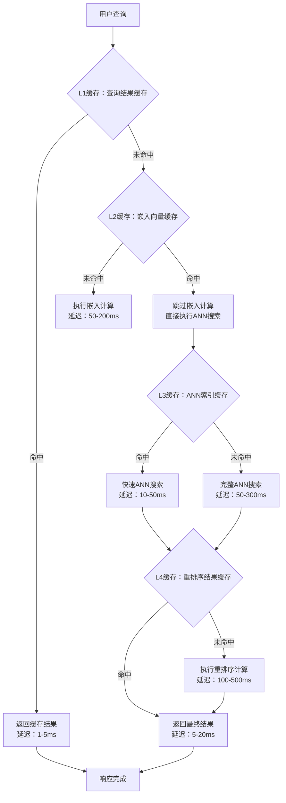

# 5.4.3 缓存策略与预计算

## 概念讲解（文字+图示）

缓存策略与预计算是向量检索系统**性能优化的关键手段**，通过在计算代价昂贵的操作前增加缓存层，将**时间复杂度**从实时计算转变为**缓存查询**，实现**数量级的性能提升**。在向量搜索场景中，嵌入计算、ANN搜索、重排序等都是计算密集型操作，合理的缓存设计可以将查询延迟从几百毫秒降低到几毫秒。

### 缓存层级架构


### 预计算策略分类
1. **热数据预计算**：识别高频查询和文档，提前计算嵌入和索引
2. **查询模式预测**：基于用户行为预测未来查询，提前准备结果
3. **增量预计算**：数据更新时，只重新计算受影响部分
4. **分布式预计算**：利用空闲计算资源进行后台预计算

### 缓存与预计算的价值
- **性能提升**：99分位延迟降低50%-90%
- **成本节约**：减少计算资源消耗，特别是GPU/TPU使用
- **可扩展性**：支持更高的查询并发量
- **用户体验**：响应更快，交互更流畅

## 核心要点（重点标记）

**💡 缓存设计核心原则：**

1. **🔄 多级缓存策略**
   - L1: 查询结果缓存（毫秒级）
   - L2: 嵌入向量缓存（秒级）
   - L3: ANN中间结果缓存（分钟级）
   - L4: 重排序结果缓存（小时级）

2. **⚡ 智能缓存失效**
   - 基于时间（TTL）：定期刷新
   - 基于数据变更：文档更新时失效相关缓存
   - 基于使用频率（LRU/LFU）：淘汰低频缓存
   - 基于容量：达到上限时淘汰旧缓存

3. **🔧 预计算触发机制**
   - 定时任务：定期预计算热点数据
   - 事件驱动：数据变更时触发预计算
   - 预测性：基于用户行为预测预计算
   - 按需：首次查询后后台预计算相关数据

**🎯 缓存命中率优化策略：**

| 缓存类型 | 典型命中率 | 优化方法 | 存储成本 |
|---------|-----------|----------|----------|
| 查询结果缓存 | 20%-40% | 查询规范化、相似查询聚合 | 中等 |
| 嵌入向量缓存 | 60%-80% | 文档去重、向量压缩 | 高 |
| ANN索引缓存 | 70%-90% | 热点路径缓存、索引分区 | 中等 |
| 重排序缓存 | 30%-50% | query-doc对缓存、分数缓存 | 低 |

## 简单示例（代码演示）

### 基础嵌入缓存实现
```python
from langchain.embeddings import CacheBackedEmbeddings
from langchain.storage import InMemoryStore, LocalFileStore
from langchain_openai import OpenAIEmbeddings
import hashlib
import json

# 1. 创建底层嵌入模型
underlying_embeddings = OpenAIEmbeddings(
    model="text-embedding-3-small",
    openai_api_key="your-api-key"
)

# 2. 创建缓存存储（支持多种后端）
# 内存缓存（开发环境）
memory_store = InMemoryStore()

# 文件系统缓存（生产环境）
file_store = LocalFileStore("./embedding_cache")

# 3. 创建缓存支持的嵌入模型
cached_embeddings = CacheBackedEmbeddings.from_bytes_store(
    underlying_embeddings,
    memory_store,  # 或 file_store
    namespace=underlying_embeddings.model,  # 按模型版本隔离缓存
    # 自定义缓存键生成
    document_embedding_cache_key_fn=lambda doc: hashlib.md5(
        doc.encode('utf-8')
    ).hexdigest(),
    query_embedding_cache_key_fn=lambda query: hashlib.md5(
        query.encode('utf-8')
    ).hexdigest()
)

# 4. 使用缓存嵌入
documents = [
    "LangChain提供了丰富的缓存策略",
    "向量嵌入缓存可以显著提升性能",
    "预计算策略能够减少实时计算压力"
]

# 第一次计算（会实际调用API）
print("第一次嵌入计算（冷缓存）...")
start = time.perf_counter()
doc_embeddings = cached_embeddings.embed_documents(documents)
first_time = (time.perf_counter() - start) * 1000
print(f"  耗时: {first_time:.2f}ms")

# 第二次计算（从缓存读取）
print("\n第二次嵌入计算（热缓存）...")
start = time.perf_counter()
cached_embeddings_result = cached_embeddings.embed_documents(documents)
second_time = (time.perf_counter() - start) * 1000
print(f"  耗时: {second_time:.2f}ms")
print(f"  加速比: {first_time/second_time:.1f}x")

# 5. 缓存统计
def get_cache_stats(store):
    """获取缓存统计信息"""
    stats = {
        'total_items': 0,
        'hit_rate_estimate': 0.0,
        'memory_usage_mb': 0.0
    }
    
    # 这里简化实现，实际需要具体存储的统计接口
    if hasattr(store, 'stats'):
        return store.stats()
    
    return stats

cache_stats = get_cache_stats(memory_store)
print(f"\n缓存统计: {json.dumps(cache_stats, indent=2)}")
```

### 查询结果缓存实现
```python
from functools import lru_cache
from typing import List, Dict, Any
import time
import pickle
from dataclasses import dataclass
from datetime import datetime, timedelta
import hashlib

@dataclass
class CachedResult:
    """缓存结果数据结构"""
    results: List[Dict[str, Any]]
    timestamp: datetime
    ttl_seconds: int
    hit_count: int = 0
    
    def is_valid(self) -> bool:
        """检查缓存是否有效"""
        age = datetime.now() - self.timestamp
        return age.total_seconds() < self.ttl_seconds
    
    def increment_hit(self):
        """增加命中计数"""
        self.hit_count += 1

class QueryResultCache:
    """查询结果缓存管理器"""
    
    def __init__(self, max_size: int = 10000, default_ttl: int = 3600):
        self.cache = {}
        self.max_size = max_size
        self.default_ttl = default_ttl
        self.hits = 0
        self.misses = 0
        
    def _generate_cache_key(self, query: str, **kwargs) -> str:
        """生成缓存键"""
        # 规范化查询（去除多余空格、转为小写）
        normalized_query = ' '.join(query.strip().lower().split())
        
        # 序列化参数
        params_str = json.dumps(kwargs, sort_keys=True)
        
        # 生成哈希键
        key_data = f"{normalized_query}::{params_str}"
        return hashlib.sha256(key_data.encode()).hexdigest()
    
    def get(self, query: str, **kwargs) -> Optional[List[Dict]]:
        """获取缓存结果"""
        cache_key = self._generate_cache_key(query, **kwargs)
        
        if cache_key in self.cache:
            cached_result = self.cache[cache_key]
            
            if cached_result.is_valid():
                # 缓存命中
                self.hits += 1
                cached_result.increment_hit()
                
                # 更新访问时间（LRU策略）
                self.cache[cache_key] = cached_result
                
                return cached_result.results
            else:
                # 缓存过期，删除
                del self.cache[cache_key]
        
        # 缓存未命中
        self.misses += 1
        return None
    
    def set(self, query: str, results: List[Dict], **kwargs) -> str:
        """设置缓存结果"""
        # 检查缓存大小，如果超过限制则清理
        if len(self.cache) >= self.max_size:
            self._evict_oldest()
        
        # 创建缓存条目
        cache_key = self._generate_cache_key(query, **kwargs)
        cached_result = CachedResult(
            results=results,
            timestamp=datetime.now(),
            ttl_seconds=self.default_ttl
        )
        
        # 存储到缓存
        self.cache[cache_key] = cached_result
        
        return cache_key
    
    def _evict_oldest(self):
        """淘汰最旧的缓存条目"""
        if not self.cache:
            return
        
        # 找到最久未使用且命中率最低的条目
        oldest_key = None
        oldest_time = datetime.now()
        lowest_hit_rate = float('inf')
        
        for key, value in self.cache.items():
            age = (datetime.now() - value.timestamp).total_seconds()
            hit_rate = value.hit_count / max(age, 1)  # 每小时命中率
            
            # 综合考量时间和命中率
            if age > oldest_time.timestamp() or hit_rate < lowest_hit_rate:
                oldest_key = key
                oldest_time = value.timestamp
                lowest_hit_rate = hit_rate
        
        if oldest_key:
            del self.cache[oldest_key]
            print(f"淘汰缓存: {oldest_key[:16]}...")
    
    def get_stats(self) -> Dict[str, Any]:
        """获取缓存统计"""
        total = self.hits + self.misses
        hit_rate = self.hits / total if total > 0 else 0
        
        return {
            'total_queries': total,
            'hits': self.hits,
            'misses': self.misses,
            'hit_rate': f"{hit_rate:.2%}",
            'cache_size': len(self.cache),
            'max_size': self.max_size,
            'avg_ttl_seconds': self.default_ttl
        }

# 使用示例
cache = QueryResultCache(max_size=1000, default_ttl=1800)  # 30分钟TTL

def cached_vector_search(query: str, vector_store, **kwargs):
    """带缓存的向量搜索"""
    # 尝试从缓存获取
    cached_results = cache.get(query, **kwargs)
    
    if cached_results is not None:
        print(f"缓存命中！查询: '{query[:50]}...'")
        return cached_results
    
    print(f"缓存未命中，执行搜索...")
    
    # 执行实际搜索
    start_time = time.perf_counter()
    results = vector_store.similarity_search(query, **kwargs)
    search_time = (time.perf_counter() - start_time) * 1000
    
    # 格式化结果
    formatted_results = []
    for i, doc in enumerate(results):
        formatted_results.append({
            'rank': i + 1,
            'content': doc.page_content[:200],
            'metadata': doc.metadata,
            'score': getattr(doc, 'score', 0.0)
        })
    
    # 存储到缓存
    cache.set(query, formatted_results, **kwargs)
    
    print(f"搜索完成，耗时: {search_time:.2f}ms，已缓存结果")
    
    return formatted_results

# 模拟多次查询
test_queries = [
    "LangChain缓存策略",
    "向量搜索优化",
    "人工智能应用开发",
    "LangChain缓存策略",  # 重复查询
    "机器学习算法"
]

for query in test_queries:
    results = cached_vector_search(query, vector_store, k=5)
    print(f"返回结果数: {len(results)}")
    print("-" * 50)

# 显示缓存统计
print("\n缓存统计:")
stats = cache.get_stats()
for key, value in stats.items():
    print(f"  {key}: {value}")
```

### ANN索引缓存优化
```python
import numpy as np
from typing import Dict, List, Optional
import faiss
import joblib
from pathlib import Path

class ANNIndexCacheManager:
    """ANN索引缓存管理器"""
    
    def __init__(self, cache_dir: str = "./index_cache"):
        self.cache_dir = Path(cache_dir)
        self.cache_dir.mkdir(exist_ok=True)
        
        # 内存中的索引缓存
        self.memory_cache = {}
        self.cache_stats = {
            'memory_hits': 0,
            'disk_hits': 0,
            'misses': 0,
            'builds': 0
        }
    
    def get_index_key(self, vectors: np.ndarray, config: Dict) -> str:
        """生成索引缓存键"""
        # 基于向量数据哈希和配置生成唯一键
        vectors_hash = hashlib.sha256(vectors.tobytes()).hexdigest()
        config_hash = hashlib.sha256(
            json.dumps(config, sort_keys=True).encode()
        ).hexdigest()
        
        return f"index_{vectors_hash[:16]}_{config_hash[:16]}"
    
    def load_index(self, cache_key: str) -> Optional[faiss.Index]:
        """加载缓存的索引"""
        # 1. 检查内存缓存
        if cache_key in self.memory_cache:
            self.cache_stats['memory_hits'] += 1
            print(f"内存缓存命中: {cache_key}")
            return self.memory_cache[cache_key]
        
        # 2. 检查磁盘缓存
        cache_file = self.cache_dir / f"{cache_key}.faiss"
        if cache_file.exists():
            try:
                index = faiss.read_index(str(cache_file))
                self.memory_cache[cache_key] = index  # 加载到内存
                self.cache_stats['disk_hits'] += 1
                print(f"磁盘缓存命中: {cache_key}")
                return index
            except Exception as e:
                print(f"加载缓存索引失败: {e}")
        
        # 3. 缓存未命中
        self.cache_stats['misses'] += 1
        return None
    
    def save_index(self, cache_key: str, index: faiss.Index, config: Dict):
        """保存索引到缓存"""
        # 保存到内存
        self.memory_cache[cache_key] = index
        
        # 保存到磁盘
        cache_file = self.cache_dir / f"{cache_key}.faiss"
        try:
            faiss.write_index(index, str(cache_file))
            
            # 保存配置信息
            config_file = self.cache_dir / f"{cache_key}_config.json"
            with open(config_file, 'w') as f:
                json.dump(config, f, indent=2)
            
            print(f"索引已缓存: {cache_key}")
        except Exception as e:
            print(f"保存索引缓存失败: {e}")
        
        # 限制内存缓存大小
        if len(self.memory_cache) > 10:  # 最多缓存10个索引
            oldest_key = next(iter(self.memory_cache))
            del self.memory_cache[oldest_key]
            print(f"淘汰内存缓存: {oldest_key}")
    
    def create_cached_index(self, vectors: np.ndarray, config: Dict) -> faiss.Index:
        """创建或加载缓存的索引"""
        cache_key = self.get_index_key(vectors, config)
        
        # 尝试加载缓存
        cached_index = self.load_index(cache_key)
        if cached_index is not None:
            return cached_index
        
        # 创建新索引
        print(f"构建新索引: {cache_key}")
        start_time = time.perf_counter()
        
        # 根据配置创建索引
        dimension = vectors.shape[1]
        
        if config['index_type'] == 'flat':
            index = faiss.IndexFlatL2(dimension)
        elif config['index_type'] == 'ivf':
            nlist = config.get('nlist', 100)
            quantizer = faiss.IndexFlatL2(dimension)
            index = faiss.IndexIVFFlat(quantizer, dimension, nlist)
            index.train(vectors)
        elif config['index_type'] == 'hnsw':
            M = config.get('M', 16)
            index = faiss.IndexHNSWFlat(dimension, M)
        else:
            raise ValueError(f"不支持的索引类型: {config['index_type']}")
        
        # 添加向量
        index.add(vectors)
        
        build_time = (time.perf_counter() - start_time)
        print(f"索引构建完成，耗时: {build_time:.2f}秒")
        
        self.cache_stats['builds'] += 1
        
        # 保存到缓存
        self.save_index(cache_key, index, config)
        
        return index
    
    def get_stats(self) -> Dict:
        """获取缓存统计"""
        total = sum(self.cache_stats.values())
        if total > 0:
            hit_rate = (self.cache_stats['memory_hits'] + 
                       self.cache_stats['disk_hits']) / total
        else:
            hit_rate = 0.0
        
        return {
            **self.cache_stats,
            'total_requests': total,
            'hit_rate': f"{hit_rate:.2%}",
            'memory_cache_size': len(self.memory_cache),
            'disk_cache_files': len(list(self.cache_dir.glob("*.faiss")))
        }

# 使用示例
cache_manager = ANNIndexCacheManager()

# 模拟向量数据
np.random.seed(42)
vectors = np.random.randn(10000, 768).astype('float32')

# 配置1: HNSW索引
hnsw_config = {
    'index_type': 'hnsw',
    'M': 16,
    'efConstruction': 200
}

# 第一次构建（会实际构建）
print("=== 第一次构建 HNSW 索引 ===")
index1 = cache_manager.create_cached_index(vectors, hnsw_config)

# 第二次构建（从缓存加载）
print("\n=== 第二次构建 HNSW 索引 ===")
index2 = cache_manager.create_cached_index(vectors, hnsw_config)

# 配置2: IVF索引
ivf_config = {
    'index_type': 'ivf',
    'nlist': 100
}

print("\n=== 构建 IVF 索引 ===")
index3 = cache_manager.create_cached_index(vectors, ivf_config)

# 显示统计
print("\n=== 缓存统计 ===")
stats = cache_manager.get_stats()
for key, value in stats.items():
    print(f"{key}: {value}")
```

## 进阶应用（可选内容）

### 智能预计算系统
```python
from typing import Dict, List, Set
import asyncio
from collections import defaultdict, deque
import heapq
from datetime import datetime, timedelta

class IntelligentPrecomputationSystem:
    """智能预计算系统"""
    
    def __init__(self, prediction_window_hours: int = 24):
        self.prediction_window = prediction_window_hours
        self.query_history = defaultdict(lambda: deque(maxlen=1000))
        self.user_profiles = {}
        self.precomputation_queue = []
        self.completed_precomputations = set()
        
        # 预计算任务优先级
        self.priority_weights = {
            'query_frequency': 0.4,
            'user_importance': 0.3,
            'computational_cost': -0.2,  # 成本越低优先级越高
            'freshness_requirement': 0.1
        }
    
    def record_query(self, user_id: str, query: str, timestamp: datetime):
        """记录查询历史"""
        # 标准化查询
        normalized_query = self._normalize_query(query)
        
        # 记录到历史
        self.query_history[normalized_query].append({
            'user_id': user_id,
            'timestamp': timestamp,
            'normalized_query': normalized_query
        })
        
        # 更新用户画像
        self._update_user_profile(user_id, normalized_query, timestamp)
    
    def predict_hot_queries(self, lookback_hours: int = 24) -> List[Dict]:
        """预测热点查询"""
        cutoff_time = datetime.now() - timedelta(hours=lookback_hours)
        
        query_scores = {}
        
        for query, history in self.query_history.items():
            # 过滤时间窗口内的查询
            recent_queries = [
                h for h in history 
                if h['timestamp'] >= cutoff_time
            ]
            
            if not recent_queries:
                continue
            
            # 计算查询频率
            frequency = len(recent_queries)
            
            # 计算用户重要性（VIP用户权重更高）
            user_importance = self._calculate_user_importance(recent_queries)
            
            # 计算时间衰减（最近查询权重更高）
            time_decay = self._calculate_time_decay(recent_queries, cutoff_time)
            
            # 综合评分
            score = (
                frequency * self.priority_weights['query_frequency'] +
                user_importance * self.priority_weights['user_importance'] +
                time_decay * 0.5  # 时间衰减额外权重
            )
            
            query_scores[query] = {
                'query': query,
                'score': score,
                'frequency': frequency,
                'user_count': len(set(h['user_id'] for h in recent_queries)),
                'last_query': max(h['timestamp'] for h in recent_queries)
            }
        
        # 按分数排序
        sorted_queries = sorted(
            query_scores.values(),
            key=lambda x: x['score'],
            reverse=True
        )
        
        return sorted_queries[:50]  # 返回Top 50热点查询
    
    def schedule_precomputation(self, queries: List[Dict], available_resources: Dict):
        """调度预计算任务"""
        scheduled_tasks = []
        
        for query_info in queries:
            # 估算计算成本
            computational_cost = self._estimate_computational_cost(
                query_info['query']
            )
            
            # 计算任务优先级
            task_priority = (
                query_info['score'] * 0.7 +
                (1 / computational_cost) * 0.3  # 成本越低优先级越高
            )
            
            # 检查是否已预计算
            query_hash = hashlib.md5(query_info['query'].encode()).hexdigest()
            if query_hash in self.completed_precomputations:
                continue
            
            # 创建预计算任务
            task = {
                'query': query_info['query'],
                'priority': task_priority,
                'computational_cost': computational_cost,
                'estimated_benefit': query_info['score'],
                'query_hash': query_hash,
                'status': 'pending'
            }
            
            heapq.heappush(self.precomputation_queue, (-task_priority, task))
        
        # 根据可用资源选择任务
        selected_tasks = self._select_tasks_by_resource(
            available_resources
        )
        
        return selected_tasks
    
    async def execute_precomputation(self, task: Dict, vector_store):
        """执行预计算任务"""
        try:
            print(f"开始预计算: {task['query'][:50]}...")
            
            # 1. 计算查询嵌入
            start_time = time.perf_counter()
            
            # 2. 执行向量搜索获取相关文档
            results = await asyncio.to_thread(
                vector_store.similarity_search,
                task['query'],
                k=100  # 预计算更多结果
            )
            
            # 3. 执行重排序（如果配置）
            reranked_results = await self._precompute_reranking(
                task['query'], results
            )
            
            # 4. 缓存结果
            await self._cache_precomputed_results(
                task['query'], reranked_results
            )
            
            execution_time = time.perf_counter() - start_time
            
            # 标记为完成
            task['status'] = 'completed'
            task['execution_time'] = execution_time
            task['completion_time'] = datetime.now()
            task['result_count'] = len(reranked_results)
            
            self.completed_precomputations.add(task['query_hash'])
            
            print(f"预计算完成: {task['query'][:50]}..., "
                  f"耗时: {execution_time:.2f}秒, "
                  f"结果数: {len(reranked_results)}")
            
            return task
            
        except Exception as e:
            print(f"预计算失败: {task['query'][:50]}..., 错误: {e}")
            task['status'] = 'failed'
            task['error'] = str(e)
            return task
    
    def _normalize_query(self, query: str) -> str:
        """标准化查询（去重、排序等）"""
        # 去除多余空格，转为小写
        normalized = ' '.join(query.strip().lower().split())
        
        # 移除停用词（简化实现）
        stop_words = {'的', '了', '在', '是', '和', '与', '或'}
        words = normalized.split()
        filtered_words = [w for w in words if w not in stop_words]
        
        return ' '.join(sorted(set(filtered_words)))  # 排序并去重
    
    def _update_user_profile(self, user_id: str, query: str, timestamp: datetime):
        """更新用户画像"""
        if user_id not in self.user_profiles:
            self.user_profiles[user_id] = {
                'query_history': [],
                'query_categories': defaultdict(int),
                'last_active': timestamp,
                'query_count': 0,
                'vip_level': 0  # 可根据业务逻辑计算
            }
        
        profile = self.user_profiles[user_id]
        profile['query_history'].append({
            'query': query,
            'timestamp': timestamp
        })
        profile['last_active'] = timestamp
        profile['query_count'] += 1
        
        # 简单分类（实际应用需要更复杂的NLP分类）
        if any(word in query for word in ['技术', '编程', '代码']):
            profile['query_categories']['技术'] += 1
        elif any(word in query for word in ['商业', '市场', '经济']):
            profile['query_categories']['商业'] += 1
        else:
            profile['query_categories']['其他'] += 1
    
    def _calculate_user_importance(self, recent_queries: List[Dict]) -> float:
        """计算用户重要性"""
        user_ids = set(q['user_id'] for q in recent_queries)
        
        total_importance = 0.0
        for user_id in user_ids:
            if user_id in self.user_profiles:
                profile = self.user_profiles[user_id]
                # 基于查询频率和VIP等级计算重要性
                importance = (
                    profile['query_count'] * 0.01 +
                    profile['vip_level'] * 0.5
                )
                total_importance += importance
        
        return total_importance / len(user_ids) if user_ids else 0.0
    
    def _calculate_time_decay(self, recent_queries: List[Dict], cutoff_time: datetime) -> float:
        """计算时间衰减分数"""
        if not recent_queries:
            return 0.0
        
        # 计算最近查询的时间衰减
        latest_time = max(q['timestamp'] for q in recent_queries)
        time_diff = (latest_time - cutoff_time).total_seconds()
        
        # 指数衰减：越近的查询权重越高
        decay_factor = 0.1  # 衰减因子
        time_decay = np.exp(-decay_factor * time_diff / 3600)  # 按小时衰减
        
        return time_decay
    
    def _estimate_computational_cost(self, query: str) -> float:
        """估算计算成本"""
        # 基于查询长度和复杂度估算
        query_length = len(query)
        
        # 简单估算：长度越长，成本越高
        base_cost = query_length * 0.01
        
        # 如果包含复杂术语，成本更高
        complex_terms = ['神经网络', '深度学习', '机器学习', '人工智能']
        if any(term in query for term in complex_terms):
            base_cost *= 1.5
        
        return max(0.1, base_cost)  # 最小成本0.1
    
    def _select_tasks_by_resource(self, available_resources: Dict) -> List[Dict]:
        """根据可用资源选择任务"""
        selected_tasks = []
        remaining_resources = available_resources.copy()
        
        # 按优先级顺序处理任务
        while self.precomputation_queue and remaining_resources['cpu'] > 0:
            _, task = heapq.heappop(self.precomputation_queue)
            
            # 检查资源是否足够
            if task['computational_cost'] <= remaining_resources['cpu']:
                selected_tasks.append(task)
                remaining_resources['cpu'] -= task['computational_cost']
            else:
                # 放回队列
                heapq.heappush(self.precomputation_queue, (-task['priority'], task))
                break
        
        return selected_tasks
    
    async def _precompute_reranking(self, query: str, results: List) -> List:
        """预计算重排序"""
        # 这里可以集成交叉编码器重排序
        # 简化实现：只返回原始结果
        return results
    
    async def _cache_precomputed_results(self, query: str, results: List):
        """缓存预计算结果"""
        # 实际实现需要具体的缓存系统
        query_hash = hashlib.md5(query.encode()).hexdigest()
        cache_key = f"precomputed_{query_hash}"
        
        # 这里简化实现
        print(f"缓存预计算结果: {cache_key}, 结果数: {len(results)}")

# 使用示例
async def demo_intelligent_precomputation():
    # 创建预计算系统
    precomputation_system = IntelligentPrecomputationSystem()
    
    # 模拟查询历史
    users = ['user_001', 'user_002', 'user_003', 'vip_user_001']
    queries = [
        "LangChain缓存策略实现",
        "向量数据库性能优化",
        "人工智能机器学习区别",
        "Python异步编程最佳实践",
        "深度学习神经网络原理"
    ]
    
    # 记录一些历史查询
    for i in range(100):
        user = np.random.choice(users)
        query = np.random.choice(queries)
        timestamp = datetime.now() - timedelta(hours=np.random.uniform(0, 48))
        precomputation_system.record_query(user, query, timestamp)
    
    # 预测热点查询
    print("=== 预测热点查询 ===")
    hot_queries = precomputation_system.predict_hot_queries(lookback_hours=24)
    
    for i, query_info in enumerate(hot_queries[:5]):
        print(f"{i+1}. 查询: {query_info['query']}")
        print(f"   分数: {query_info['score']:.3f}")
        print(f"   频率: {query_info['frequency']}次")
        print(f"   用户数: {query_info['user_count']}人")
        print(f"   最后查询: {query_info['last_query'].strftime('%Y-%m-%d %H:%M')}")
        print("-" * 50)
    
    # 调度预计算任务
    print("\n=== 调度预计算任务 ===")
    available_resources = {'cpu': 10.0, 'memory_gb': 16, 'gpu': 1}
    scheduled_tasks = precomputation_system.schedule_precomputation(
        hot_queries[:10], available_resources
    )
    
    print(f"已调度 {len(scheduled_tasks)} 个预计算任务")
    for i, task in enumerate(scheduled_tasks[:3]):
        print(f"{i+1}. 任务: {task['query'][:50]}...")
        print(f"   优先级: {task['priority']:.3f}")
        print(f"   计算成本: {task['computational_cost']:.2f}")
        print(f"   预估收益: {task['estimated_benefit']:.3f}")
        print("-" * 50)
    
    # 执行预计算（简化演示）
    if scheduled_tasks:
        print("\n=== 执行预计算 ===")
        # 这里需要实际的vector_store实例
        # results = await precomputation_system.execute_precomputation(
        #     scheduled_tasks[0], vector_store
        # )
        print("预计算执行逻辑已就绪（需要实际的vector_store实例）")

# 运行演示
asyncio.run(demo_intelligent_precomputation())
```

### 分布式缓存架构
```python
import redis
from typing import Optional, Any
import pickle
import zlib
from datetime import datetime, timedelta
import threading
import time

class DistributedCacheSystem:
    """分布式缓存系统"""
    
    def __init__(self, redis_host: str = 'localhost', redis_port: int = 6379):
        self.redis_client = redis.Redis(
            host=redis_host, 
            port=redis_port,
            decode_responses=False  # 保持二进制数据
        )
        
        # 本地内存缓存（二级缓存）
        self.local_cache = {}
        self.local_cache_lock = threading.Lock()
        
        # 缓存统计
        self.stats = {
            'redis_hits': 0,
            'local_hits': 0,
            'misses': 0,
            'sets': 0,
            'evictions': 0
        }
        
        # 启动后台维护线程
        self.maintenance_thread = threading.Thread(
            target=self._maintenance_loop,
            daemon=True
        )
        self.maintenance_thread.start()
    
    def get(self, key: str) -> Optional[Any]:
        """获取缓存值（多级缓存）"""
        # 1. 检查本地缓存
        with self.local_cache_lock:
            if key in self.local_cache:
                cached_item = self.local_cache[key]
                if self._is_valid(cached_item):
                    self.stats['local_hits'] += 1
                    return cached_item['value']
                else:
                    # 本地缓存过期，删除
                    del self.local_cache[key]
        
        # 2. 检查Redis缓存
        try:
            redis_data = self.redis_client.get(key)
            if redis_data:
                # 解压缩和解序列化
                decompressed = zlib.decompress(redis_data)
                cached_item = pickle.loads(decompressed)
                
                if self._is_valid(cached_item):
                    # 更新到本地缓存
                    with self.local_cache_lock:
                        self.local_cache[key] = cached_item
                        self._enforce_local_cache_limit()
                    
                    self.stats['redis_hits'] += 1
                    return cached_item['value']
        except Exception as e:
            print(f"Redis缓存读取失败: {e}")
        
        # 3. 缓存未命中
        self.stats['misses'] += 1
        return None
    
    def set(self, key: str, value: Any, ttl_seconds: int = 3600):
        """设置缓存值"""
        # 创建缓存条目
        cached_item = {
            'value': value,
            'timestamp': datetime.now(),
            'ttl_seconds': ttl_seconds,
            'access_count': 0,
            'last_accessed': datetime.now()
        }
        
        # 1. 设置到本地缓存
        with self.local_cache_lock:
            self.local_cache[key] = cached_item
            self._enforce_local_cache_limit()
        
        # 2. 设置到Redis（异步）
        threading.Thread(
            target=self._async_set_redis,
            args=(key, cached_item),
            daemon=True
        ).start()
        
        self.stats['sets'] += 1
    
    def _async_set_redis(self, key: str, cached_item: Dict):
        """异步设置Redis缓存"""
        try:
            # 序列化和压缩
            serialized = pickle.dumps(cached_item)
            compressed = zlib.compress(serialized)
            
            # 设置到Redis（使用与本地缓存相同的TTL）
            self.redis_client.setex(
                key,
                cached_item['ttl_seconds'],
                compressed
            )
        except Exception as e:
            print(f"Redis缓存设置失败: {e}")
    
    def _is_valid(self, cached_item: Dict) -> bool:
        """检查缓存是否有效"""
        if not cached_item:
            return False
        
        age = (datetime.now() - cached_item['timestamp']).total_seconds()
        return age < cached_item['ttl_seconds']
    
    def _enforce_local_cache_limit(self, max_size: int = 10000):
        """强制执行本地缓存限制"""
        if len(self.local_cache) <= max_size:
            return
        
        # 使用LRU策略淘汰
        with self.local_cache_lock:
            sorted_items = sorted(
                self.local_cache.items(),
                key=lambda x: x[1]['last_accessed']
            )
            
            # 淘汰最旧的10%
            evict_count = max(1, len(sorted_items) // 10)
            for i in range(evict_count):
                key, _ = sorted_items[i]
                del self.local_cache[key]
                self.stats['evictions'] += 1
    
    def _maintenance_loop(self):
        """维护循环（清理过期缓存）"""
        while True:
            try:
                self._cleanup_expired_cache()
                time.sleep(60)  # 每分钟清理一次
            except Exception as e:
                print(f"缓存维护失败: {e}")
                time.sleep(10)
    
    def _cleanup_expired_cache(self):
        """清理过期缓存"""
        expired_keys = []
        
        with self.local_cache_lock:
            now = datetime.now()
            
            for key, cached_item in list(self.local_cache.items()):
                age = (now - cached_item['timestamp']).total_seconds()
                if age >= cached_item['ttl_seconds']:
                    expired_keys.append(key)
            
            # 删除过期缓存
            for key in expired_keys:
                del self.local_cache[key]
        
        if expired_keys:
            print(f"清理了 {len(expired_keys)} 个过期本地缓存")
    
    def get_stats(self) -> Dict:
        """获取缓存统计"""
        total_hits = self.stats['local_hits'] + self.stats['redis_hits']
        total_requests = total_hits + self.stats['misses']
        
        hit_rate = total_hits / total_requests if total_requests > 0 else 0
        
        return {
            **self.stats,
            'total_requests': total_requests,
            'total_hits': total_hits,
            'hit_rate': f"{hit_rate:.2%}",
            'local_cache_size': len(self.local_cache),
            'redis_connected': self.redis_client.ping() if hasattr(self.redis_client, 'ping') else False
        }

# 使用示例
def demo_distributed_cache():
    print("=== 分布式缓存演示 ===")
    
    # 创建分布式缓存系统
    try:
        cache_system = DistributedCacheSystem(
            redis_host='localhost',
            redis_port=6379
        )
        print("分布式缓存系统初始化成功")
    except Exception as e:
        print(f"Redis连接失败，使用降级模式: {e}")
        # 可以使用内存缓存降级
        return
    
    # 模拟缓存操作
    test_data = {
        'query_embedding_123': np.random.randn(768).tolist(),
        'search_results_456': [
            {'rank': 1, 'score': 0.95, 'content': '文档1...'},
            {'rank': 2, 'score': 0.89, 'content': '文档2...'},
            {'rank': 3, 'score': 0.82, 'content': '文档3...'}
        ],
        'ann_index_cache_789': {'status': 'cached', 'size_mb': 15.3}
    }
    
    # 设置缓存
    for key, value in test_data.items():
        cache_system.set(key, value, ttl_seconds=1800)  # 30分钟TTL
        print(f"已缓存: {key}")
    
    # 获取缓存
    print("\n=== 测试缓存获取 ===")
    for key in test_data.keys():
        cached_value = cache_system.get(key)
        if cached_value is not None:
            print(f"缓存命中: {key}")
        else:
            print(f"缓存未命中: {key}")
    
    # 显示统计
    print("\n=== 缓存统计 ===")
    stats = cache_system.get_stats()
    for key, value in stats.items():
        print(f"{key}: {value}")
    
    # 模拟并发访问
    print("\n=== 模拟并发访问 ===")
    import concurrent.futures
    
    def worker(worker_id):
        key = f'worker_{worker_id}_data'
        value = {'worker': worker_id, 'timestamp': time.time()}
        
        # 设置缓存
        cache_system.set(key, value, ttl_seconds=60)
        
        # 获取缓存
        result = cache_system.get(key)
        return worker_id, result is not None
    
    with concurrent.futures.ThreadPoolExecutor(max_workers=10) as executor:
        futures = [executor.submit(worker, i) for i in range(10)]
        
        for future in concurrent.futures.as_completed(futures):
            worker_id, hit = future.result()
            print(f"Worker {worker_id}: 缓存{'命中' if hit else '未命中'}")
    
    print("\n最终统计:")
    final_stats = cache_system.get_stats()
    for key, value in final_stats.items():
        print(f"  {key}: {value}")

# 运行演示
demo_distributed_cache()
```

## 常见问题

### Q1: 如何设计合理的缓存TTL（生存时间）？
**A:** TTL设计建议：
1. **分层TTL策略**：
   - 查询结果缓存：5-30分钟（根据数据更新频率）
   - 嵌入向量缓存：24小时-7天（嵌入模型更新较慢）
   - ANN索引缓存：数据变更时失效
   - 重排序缓存：1-6小时（依赖模型和业务变化）

2. **动态TTL调整**：
   - 高频访问数据延长TTL
   - 低频访问数据缩短TTL
   - 基于数据新鲜度需求调整
   - 考虑节假日和业务周期

3. **失效策略组合**：
   - TTL过期自动失效
   - 主动失效（数据变更时）
   - 被动失效（访问时检查有效性）
   - 容量触发失效（LRU/LFU）

### Q2: 缓存一致性问题如何解决？
**A:** 缓存一致性解决方案：
1. **写时失效**：数据更新时，立即失效相关缓存
2. **版本控制**：缓存键包含数据版本号
3. **最终一致性**：允许短暂不一致，通过TTL保证最终一致
4. **主动更新**：数据变更时，异步更新缓存
5. **读时修复**：读取时检查数据新鲜度，必要时更新缓存

### Q3: 内存缓存 vs 磁盘缓存 vs 分布式缓存如何选择？
**A:** 缓存介质选择指南：
1. **内存缓存**：极速访问，适合高频热点数据，容量有限
2. **磁盘缓存**：容量大，速度中等，适合温数据
3. **分布式缓存**：可扩展，适合多节点共享，网络延迟需要考虑
4. **混合策略**：L1内存 + L2磁盘 + L3分布式，平衡速度与容量

### Q4: 预计算的成本效益如何评估？
**A:** 预计算ROI评估指标：
1. **计算成本**：预计算消耗的计算资源
2. **存储成本**：预计算结果占用的存储空间
3. **性能收益**：查询延迟降低程度
4. **命中率**：预计算结果的实际使用率
5. **业务价值**：用户体验改善带来的业务增长

### Q5: LangChain提供了哪些缓存工具？
**A:** LangChain缓存工具概览：
1. **CacheBackedEmbeddings**：嵌入向量缓存
2. **InMemoryStore/LocalFileStore**：缓存存储后端
3. **InMemoryCache**：图节点计算缓存
4. **工具缓存**：通过`cache_control`参数控制
5. **自定义缓存**：支持集成Redis、Memcached等外部缓存

## 本节总结

缓存策略与预计算是构建**高性能、高可用**向量检索系统的**关键技术支柱**。通过智能的缓存设计和预计算策略，可以在保持数据新鲜度的前提下，实现数量级的性能提升和成本优化。

### 技术实施路线图
1. **第一阶段**：基础缓存层
   - 实现嵌入向量缓存
   - 添加查询结果缓存
   - 配置合理的TTL策略

2. **第二阶段**：智能缓存优化
   - 实现多级缓存架构
   - 添加缓存统计和监控
   - 优化缓存淘汰策略

3. **第三阶段**：预计算系统
   - 实现热点数据预计算
   - 建立预测模型
   - 自动化预计算调度

4. **第四阶段**：分布式扩展
   - 实现分布式缓存
   - 添加缓存一致性保障
   - 建立缓存治理体系

### 关键成功指标
1. **缓存命中率**：>60%（查询缓存），>80%（嵌入缓存）
2. **性能提升**：p99延迟降低>50%
3. **成本节约**：计算资源消耗减少>30%
4. **可扩展性**：支持10倍流量增长
5. **数据新鲜度**：缓存数据与源数据延迟<5分钟

### 最佳实践建议
1. **从小开始**：先从最简单的查询缓存开始，逐步扩展
2. **监控先行**：建立完整的缓存监控体系
3. **A/B测试**：通过实验验证缓存策略效果
4. **持续优化**：定期分析缓存效果，调整策略
5. **容错设计**：缓存系统故障时，要有降级方案

### 未来发展趋势
1. **智能缓存**：基于ML预测缓存策略
2. **边缘缓存**：在用户端或边缘节点缓存
3. **联邦缓存**：跨组织共享缓存结果
4. **可持续缓存**：优化能耗的绿色缓存
5. **自适应缓存**：根据工作负载自动调整策略

缓存与预计算不仅是技术优化，更是**系统工程思维**的体现——在复杂系统中寻找关键路径，通过空间换时间、预判换实时的方式，实现系统性能的质变。掌握这些技术，意味着能够在资源有限的情况下，构建出超越硬件限制的高性能AI应用系统。