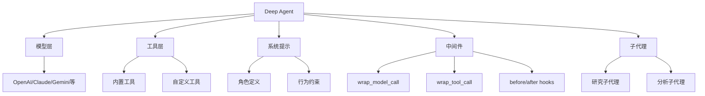

# 10.1 Deep Agent核心架构

## 概念讲解

### 什么是Deep Agents？

**Deep Agents**是LangChain提供的"电池内置"（batteries-included）深度代理框架，专为构建生产级AI应用而设计。它在基础Agent之上增加了以下核心能力：

1. **智能上下文管理**：自动处理长对话的上下文窗口
2. **子代理系统**：动态创建和协调子代理完成复杂任务
3. **中间件支持**：通过中间件扩展代理行为
4. **内置工具集成**：与搜索、文件系统等功能深度集成



### 与传统Agent的核心区别

| 特性 | 基础Agent | Deep Agent |
|------|-----------|------------|
| 上下文管理 | 手动处理 | 自动压缩和管理 |
| 子代理 | 需要自行实现 | 内置支持 |
| 中间件 | 有限 | 完整的中间件系统 |
| 配置复杂度 | 需要多步骤配置 | 一行创建 |
| 文件系统 | 无 | 虚拟文件系统 |

## 核心要点

### create_deep_agent函数签名

```python
create_deep_agent(
    name: str | None = None,           # 代理名称
    model: str | BaseChatModel,        # 模型（字符串或实例）
    tools: Sequence[BaseTool | Callable] | None = None,  # 工具列表
    *,
    system_prompt: str | SystemMessage | None = None,    # 系统提示
    middleware: Sequence[AgentMiddleware] | None = None,  # 中间件
    subagents: list | None = None      # 子代理配置
) -> CompiledStateGraph
```

### 模型配置方式

Deep Agent支持两种模型配置方式：

**方式一：字符串简写**（推荐）

```python
from deepagents import create_deep_agent

# 格式: "provider:model_name"
agent = create_deep_agent(
    model="anthropic:claude-sonnet-4-6",
    system_prompt="你是一个助手"
)
```

常用模型前缀：
- `anthropic:` - Claude系列
- `openai:` - GPT系列
- `google_genai:` - Gemini系列
- `openrouter:` - 通过OpenRouter访问
- `fireworks:` - 通过Fireworks访问
- `ollama:` - 本地模型

**方式二：模型实例**

```python
from langchain_anthropic import ChatAnthropic
from deepagents import create_deep_agent

model = ChatAnthropic(
    model="claude-sonnet-4-6",
    temperature=0
)

agent = create_deep_agent(
    model=model,
    system_prompt="你是一个助手"
)
```

## 简单示例

### 最小化Deep Agent

```python
from deepagents import create_deep_agent
from deepagents.tools import internet_search

# 最简创建 - 只需模型和工具
agent = create_deep_agent(
    model="anthropic:claude-sonnet-4-6",
    tools=[internet_search],
    system_prompt="你是一个研究助手"
)

# 执行任务
result = agent.invoke({
    "messages": [{"role": "user", "content": "帮我搜索LangChain最新进展"}]
})
```

### 自定义工具 + Deep Agent

```python
from deepagents import create_deep_agent
from langchain.tools import tool
from typing import Literal

@tool
def search(query: str, max_results: int = 5):
    """执行网络搜索"""
    # 这里可以集成任何搜索API
    return [{"title": "结果1", "content": "内容..."}]

agent = create_deep_agent(
    tools=[search],
    system_prompt="你是一个信息检索专家"
)
```

## 进阶应用

### 子代理配置

Deep Agent支持定义子代理，实现任务分解和并行处理：

```python
from deepagents import create_deep_agent

# 定义研究子代理
research_subagent = {
    "name": "research-agent",
    "description": "负责信息搜索和研究",
    "systemPrompt": "你是一个研究助手，负责收集和分析信息",
    "tools": [internet_search],
}

# 创建主代理，包含子代理
agent = create_deep_agent(
    model="anthropic:claude-sonnet-4-6",
    tools=[internet_search],
    system_prompt="你是一个研究协调员，可以委派任务给研究子代理",
    subagents=[research_subagent]
)
```

## 常见问题

### Q: create_deep_agent和create_agent有什么区别？

**A:** `create_deep_agent`在`create_agent`基础上增加了：
- 深度上下文管理
- 子代理支持
- 更完整的中间件系统
- 虚拟文件系统集成

### Q: 如何选择模型提供商？

**A:** 根据需求选择：
- **复杂推理**：Claude Sonnet系列
- **快速响应**：GPT-4o/GPT-5
- **成本敏感**：Gemini Flash
- **数据隐私**：本地Ollama模型

## 本节总结

Deep Agent是LangChain提供的生产级代理框架，通过`create_deep_agent`函数简化了代理创建流程。它支持字符串简写模型配置、中间件扩展、子代理协调等企业级功能。

核心要点：
- 使用`create_deep_agent`一行创建完整代理
- 模型配置支持字符串简写（`provider:model`格式）
- 通过中间件扩展代理行为
- 支持子代理实现任务分解