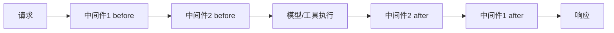

# 10.2 中间件与状态管理

## 概念讲解

### 什么是中间件？

中间件是Deep Agent架构中的横切关注点实现机制，允许你在不修改核心逻辑的情况下扩展代理行为。中间件可以在模型调用前后、工具调用前后插入自定义逻辑。



### AgentMiddleware核心钩子

`AgentMiddleware`提供了多个可扩展的钩子：

| 钩子方法 | 作用 | 执行时机 |
|----------|------|----------|
| `before_model` | 模型调用前处理 | 每次模型调用前 |
| `after_model` | 模型调用后处理 | 每次模型调用后 |
| `before_tool` | 工具调用前处理 | 每个工具调用前 |
| `after_tool` | 工具调用后处理 | 每个工具调用后 |
| `wrap_model_call` | 包装模型调用 | 替代默认模型调用 |
| `wrap_tool_call` | 包装工具调用 | 替代默认工具调用 |

## 核心要点

### 自定义中间件

通过继承`AgentMiddleware`创建自定义中间件：

```python
from langchain.agents.middleware import AgentMiddleware
from typing import Any

class CallCounterMiddleware(AgentMiddleware):
    """调用次数计数器中间件"""
    
    def before_model(self, state, runtime):
        count = state.get("model_call_count", 0)
        if count > 10:
            # 超过10次调用，结束执行
            return {"jump_to": "end"}
        return None
    
    def after_model(self, state, runtime):
        # 增加调用计数
        return {"model_call_count": state.get("model_call_count", 0) + 1}

agent = create_deep_agent(
    model="claude-sonnet-4-6",
    tools=[...],
    middleware=[CallCounterMiddleware()]
)
```

### 状态管理规范

**重要**：中间件中应通过更新图状态来管理状态，而不是修改类属性：

```python
# ✅ 正确：更新图状态
class CorrectMiddleware(AgentMiddleware):
    def __init__(self):
        pass  # 不在类中存储可变状态
    
    def before_agent(self, state, runtime):
        return {"counter": state.get("counter", 0) + 1}

# ❌ 错误：修改类属性会导致并发问题
class WrongMiddleware(AgentMiddleware):
    def __init__(self):
        self.counter = 0  # 并发时会出错
    
    def before_agent(self, state, runtime):
        self.counter += 1  # 不安全
```

## 简单示例

### 工具调用日志中间件

```python
from langchain.agents.middleware import wrap_tool_call
from langchain.tools import tool
from deepagents import create_deep_agent

@tool
def get_weather(city: str) -> str:
    """获取城市天气"""
    return f"{city}天气晴朗"

# 使用@wrap_tool_call装饰器创建中间件
@wrap_tool_call
def log_tool_calls(request, handler):
    tool_name = request.name if hasattr(request, 'name') else str(request)
    print(f"[工具调用] {tool_name}")
    result = handler(request)
    return result

agent = create_deep_agent(
    tools=[get_weather],
    middleware=[log_tool_calls],
)
```

### 基于用户经验的动态模型选择

```python
from dataclasses import dataclass
from typing import Callable
from langchain_openai import ChatOpenAI
from langchain.agents.middleware import AgentMiddleware, ModelRequest
from langchain.agents.middleware.types import ModelResponse

@dataclass
class Context:
    user_expertise: str = "beginner"

class ExpertiseBasedModelMiddleware(AgentMiddleware):
    def wrap_model_call(
        self,
        request: ModelRequest,
        handler: Callable[[ModelRequest], ModelResponse]
    ) -> ModelResponse:
        user_level = request.runtime.context.user_expertise
        
        if user_level == "expert":
            # 专家用户：使用更强模型
            model = ChatOpenAI(model="gpt-5")
            tools = [advanced_search, data_analysis]
        else:
            # 普通用户：使用简单模型
            model = ChatOpenAI(model="gpt-5-nano")
            tools = [simple_search, basic_calculator]
        
        return handler(request.override(model=model, tools=tools))

agent = create_deep_agent(
    model="claude-sonnet-4-6",
    tools=[simple_search, advanced_search, basic_calculator, data_analysis],
    middleware=[ExpertiseBasedModelMiddleware()],
    context_schema=Context
)
```

## 进阶应用

### 中间件执行顺序

多个中间件的执行遵循责任链模式：

```python
agent = create_deep_agent(
    model="gpt-4.1",
    middleware=[middleware1, middleware2, middleware3],
    tools=[...],
)
```

执行顺序：
1. `before`钩子：middleware1 → middleware2 → middleware3
2. 核心执行：模型/工具调用
3. `after`钩子：middleware3 → middleware2 → middleware1（反向）

### 多层中间件组合

```python
from langchain.agents.middleware import AgentMiddleware

class SecurityMiddleware(AgentMiddleware):
    """安全中间件：检查敏感内容"""
    def before_model(self, state, runtime):
        # 安全检查逻辑
        return None  # 返回None表示继续

class RateLimitMiddleware(AgentMiddleware):
    """限流中间件：控制调用频率"""
    def before_model(self, state, runtime):
        # 限流逻辑
        return None

class LoggingMiddleware(AgentMiddleware):
    """日志中间件：记录调用信息"""
    def after_model(self, state, runtime):
        # 日志记录逻辑
        return None

# 组合使用
agent = create_deep_agent(
    model="claude-sonnet-4-6",
    middleware=[
        SecurityMiddleware(),
        RateLimitMiddleware(),
        LoggingMiddleware()
    ],
    tools=[...]
)
```

## 常见问题

### Q: 中间件如何访问用户自定义状态？

**A:** 使用`context_schema`定义上下文结构，通过`request.runtime.context`访问：

```python
@dataclass
class MyContext:
    user_id: str
    preferences: dict

agent = create_deep_agent(
    model="gpt-4",
    context_schema=MyContext,
    middleware=[CustomMiddleware()]
)
```

### Q: 中间件执行出错时如何处理？

**A:** 中间件可以返回`{"jump_to": "end"}`跳过后续执行，或返回`None`继续执行。

## 本节总结

中间件是Deep Agent扩展能力的核心机制：
- 继承`AgentMiddleware`并实现钩子方法
- 使用`@wrap_tool_call`装饰器拦截工具调用
- 使用`@wrap_model_call`拦截模型调用
- 通过图状态管理而非类属性确保并发安全
- 多个中间件按注册顺序执行，`after`钩子反向执行