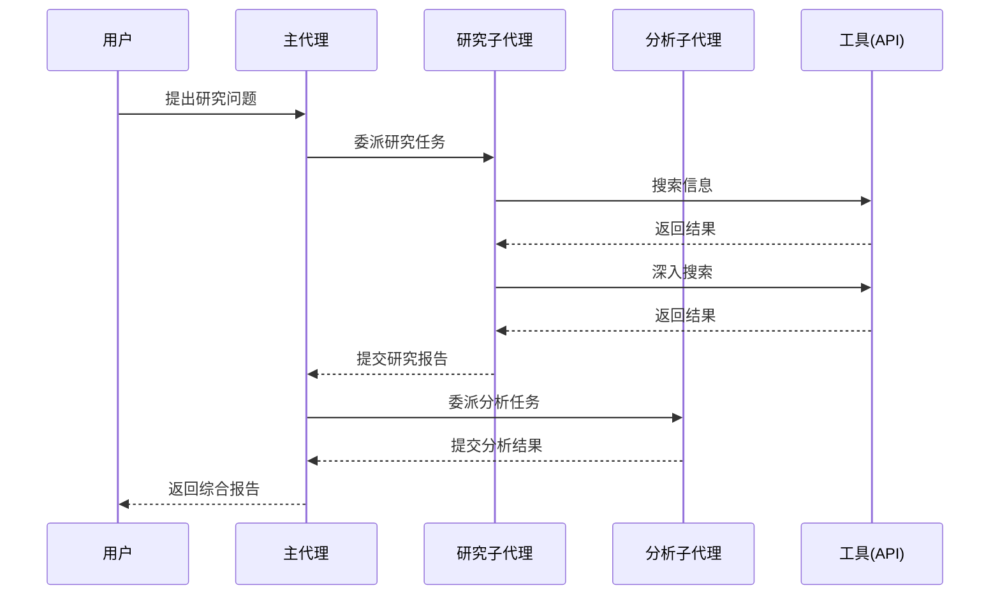

# 10.3 Deep Agent实战模式

## 概念讲解

### Deep Agent的典型应用场景

Deep Agent特别适合需要深度推理、多步骤执行和任务分解的复杂场景：

1. **深度研究**：自动搜索、分析和总结信息
2. **代码生成**：理解需求、编写代码、测试和调试
3. **数据分析**：数据探索、分析、可视化和报告
4. **文档处理**：读取、分析和生成文档

### 深度研究工作流



## 核心要点

### 深度研究Agent配置

```python
from deepagents import create_deep_agent
from deepagents.tools import internet_search
from langchain.tools import tool

@tool
def write_file(path: str, content: str) -> str:
    """写入文件"""
    with open(path, "w") as f:
        f.write(content)
    return f"文件已写入 {path}"

@tool
def read_file(path: str) -> str:
    """读取文件"""
    with open(path, "r") as f:
        return f.read()

# 研究子代理
research_subagent = {
    "name": "researcher",
    "description": "执行网络搜索收集信息",
    "systemPrompt": "你是一个研究助手，使用搜索工具收集最新信息",
    "tools": [internet_search],
}

# 主代理
research_agent = create_deep_agent(
    model="anthropic:claude-sonnet-4-6",
    tools=[internet_search, write_file, read_file],
    system_prompt="""你是一个深度研究助手，可以：
1. 使用搜索工具收集信息
2. 分析和整合搜索结果
3. 将研究结果保存到文件
4. 生成结构化的研究报告
""",
    subagents=[research_subagent]
)
```

### 代码开发Agent

```python
from deepagents import create_deep_agent
from langchain.tools import tool

@tool
def run_code(code: str) -> str:
    """执行Python代码"""
    import io
    import sys
    old_stdout = sys.stdout
    sys.stdout = io.StringIO()
    try:
        exec(code)
        output = sys.stdout.getvalue()
    except Exception as e:
        output = f"错误: {str(e)}"
    finally:
        sys.stdout = old_stdout
    return output

@tool
def save_code(filename: str, code: str) -> str:
    """保存代码到文件"""
    with open(filename, "w") as f:
        f.write(code)
    return f"代码已保存到 {filename}"

dev_agent = create_deep_agent(
    model="anthropic:claude-sonnet-4-6",
    tools=[run_code, save_code],
    system_prompt="""你是一个编程助手，可以：
1. 编写和测试Python代码
2. 执行代码并查看结果
3. 保存代码到文件
4. 调试和修复代码问题
"""
)
```

## 简单示例

### 研究助手完整示例

```python
from deepagents import create_deep_agent
from deepagents.tools import internet_search

# 创建研究助手
researcher = create_deep_agent(
    model="anthropic:claude-sonnet-4-6",
    tools=[internet_search],
    system_prompt="""你是一个研究助手。

工作流程：
1. 理解用户的研究问题
2. 使用搜索工具收集信息
3. 分析和整合信息
4. 生成结构化的回答

要求：
- 确保信息的准确性和时效性
- 提供引用来源
- 客观中立地呈现信息
"""
)

# 执行研究任务
result = researcher.invoke({
    "messages": [{
        "role": "user",
        "content": "请研究2024年大语言模型的最新发展趋势"
    }]
})
```

## 进阶应用

### 多代理协作模式

```python
from deepagents import create_deep_agent

# 定义多个子代理
subagents = [
    {
        "name": "researcher",
        "description": "负责信息搜索",
        "systemPrompt": "你负责收集信息",
        "tools": [internet_search],
    },
    {
        "name": "writer",
        "description": "负责文档撰写",
        "systemPrompt": "你负责撰写和编辑文档",
        "tools": [write_file],
    },
    {
        "name": "reviewer",
        "description": "负责内容审核",
        "systemPrompt": "你负责审核内容的质量和准确性",
        "tools": [],
    }
]

# 创建协调主代理
coordinator = create_deep_agent(
    model="anthropic:claude-sonnet-4-6",
    tools=[internet_search],
    system_prompt="""你是一个项目协调员，负责任务分配和质量控制。

你的职责：
1. 将复杂任务分解并委派给子代理
2. 协调各子代理的工作
3. 整合最终结果
4. 确保输出质量

可用子代理：
- researcher: 信息收集
- writer: 文档撰写
- reviewer: 内容审核
"""
)
```

### 流式输出

```python
from deepagents import create_deep_agent

agent = create_deep_agent(
    model="anthropic:claude-sonnet-4-6",
    tools=[internet_search],
    system_prompt="你是一个研究助手"
)

# 流式获取响应
for chunk in agent.stream({
    "messages": [{"role": "user", "content": "搜索最新AI技术"}]
}):
    if "agent" in chunk:
        print(chunk["agent"]["content"], end="", flush=True)
```

## 常见问题

### Q: 如何控制Agent的执行步骤？

**A:** 可以通过系统提示和中间件控制：
- 在系统提示中设置最大迭代次数
- 使用中间件检查调用次数并适时终止

### Q: 子代理之间如何共享信息？

**A:** 子代理通过主代理共享的图状态进行通信。主代理负责：
- 将子代理的结果整合到状态中
- 将需要的信息传递给下一个子代理

## 本节总结

Deep Agent实战模式：
- 通过子代理实现任务分解和专业化处理
- 使用中间件控制和监控执行流程
- 支持流式输出提升用户体验
- 多代理协作适合复杂研究和分析任务

关键原则：
- 子代理应职责明确、单一
- 主代理负责协调和整合
- 通过系统提示定义清晰的工作流程
- 利用中间件实现横切关注点