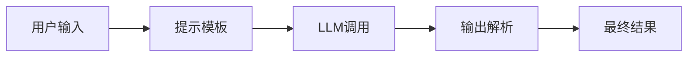

# 8.1 链式执行引擎基础

## 概念讲解（文字+图示）

链式执行引擎是LangChain的**核心运行机制**。它将多个独立组件串联起来，让数据按照预定顺序自动流转处理。

### 什么是链式执行

想象一个工厂流水线：
```
原材料 → 清洗 → 组装 → 检测 → 包装 → 成品
```

链式执行引擎就是这个流水线系统。每个环节只需关注自己的任务，无需关心数据从何而来、去向何处。

### LCEL：声明式链式语言

LangChain使用**LCEL**（LangChain Expression Language）定义执行链。核心思想：**一切皆Runnable，用管道符`|`连接**。



### 框架屏蔽的复杂性

1. **同步/异步统一**：同一套代码，同步异步都支持
2. **流式输出**：`.stream()`自动处理流式响应
3. **批量处理**：`.batch()`自动并行
4. **错误传播**：链中任一环节失败，自动向上传播
5. **类型推导**：自动推断输入输出类型

## 核心要点

**🔑 LCEL核心组件：**

| 组件 | 语法 | 用途 |
|------|------|------|
| RunnableSequence | `a | b` | 顺序执行 |
| RunnableParallel | `{"key": runnable}` | 并行执行 |
| RunnableLambda | `RunnableLambda(func)` | 自定义逻辑 |

**🔑 管道符`|`的魔力：**

```python
# 两个Runnable用|连接 → 自动创建RunnableSequence
chain = prompt | model | parser

# 字典字面量 → 自动创建RunnableParallel
parallel = {"a": chain1, "b": chain2}
```

## 简单示例

### 顺序执行：基础链

```python
from langchain_core.prompts import ChatPromptTemplate
from langchain_core.output_parsers import StrOutputParser

# 定义链：提示词 → 模型 → 解析器
chain = (
    ChatPromptTemplate.from_template("解释{topic}")
    | model  # 假设已初始化
    | StrOutputParser()
)

# 执行
result = chain.invoke({"topic": "光合作用"})
```

### 并行执行：分支处理

```python
# 并行执行多个任务
parallel_chain = {
    "translation": translation_chain,
    "summary": summary_chain,
    "analysis": analysis_chain,
}

# 同一输入，同时执行
results = parallel_chain.invoke("输入文本")
# {"translation": "...", "summary": "...", "analysis": "..."}
```

### RunnableLambda：自定义逻辑

```python
from langchain_core.runnables import RunnableLambda

# 将普通函数包装为Runnable
def clean_text(text: str) -> str:
    return text.strip().lower()

clean_chain = RunnableLambda(clean_text)
```

### 完整工作流：组合使用

```python
chain = (
    # 1. 输入处理
    RunnableLambda(lambda x: {"text": x["input"].strip()})
    |
    # 2. 并行分支
    {
        "original": RunnableLambda(lambda x: x["text"]),
        "summary": summary_chain,
        "translation": translation_chain,
    }
    |
    # 3. 结果合并
    RunnableLambda(
        lambda x: f"原文: {x['original']}\n摘要: {x['summary']}\n翻译: {x['translation']}"
    )
)
```

## 常见问题

### Q: `|`和`>>`有什么区别？
A: 功能相同，`>>`是旧语法，推荐使用`|`。

### Q: 如何在链中间修改数据？
A: 使用`RunnableLambda`包装数据转换函数。

### Q: 链执行失败怎么办？
A: 使用try/except包裹`.invoke()`，或在链中加入错误处理逻辑。

## 本节总结

- LCEL通过`|`操作符定义执行链
- `RunnableSequence`顺序执行，`RunnableParallel`并行执行
- `RunnableLambda`注入自定义逻辑
- 统一支持同步、异步、流式、批量调用