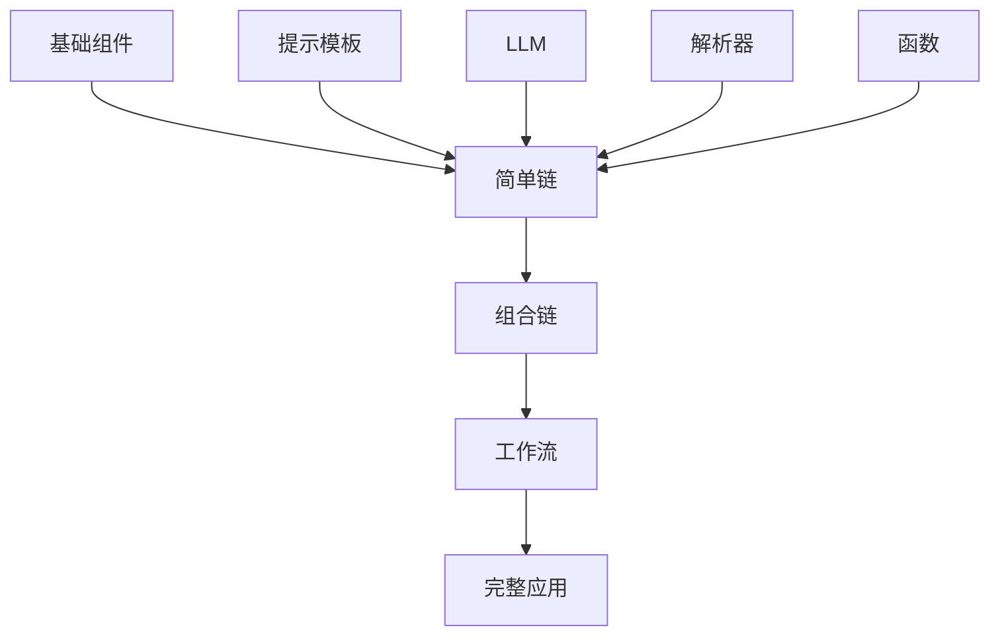

# 8.3 链的组合与扩展

## 概念讲解（文字+图示）

链的真正威力在于**组合**。通过灵活的组合方式，简单组件可以构建出复杂的业务逻辑。

### 组合的层次结构



### 三种组合方式

1. **串联**：一个接一个执行（`|`操作符）
2. **并联**：同一输入，多路输出（字典字面量）
3. **嵌套**：链中包含链，形成层级结构

### 框架屏蔽的复杂性

1. **调用链传递**：输入自动在链中传递
2. **类型检查**：运行前验证类型兼容性
3. **性能优化**：自动批处理和缓存
4. **错误恢复**：结构化异常传播

## 核心要点

**🔑 链组合的关键技术：**

- `RunnablePassthrough`：透传输入，用于数据累积
- `RunnablePassthrough.assign()`：在原有数据上添加新字段
- `RunnableParallel`：并行执行多路分支
- 嵌套链：链可作为另一个链的组件

## 简单示例

### 链的嵌套与复用

```python
from langchain_core.runnables import RunnablePassthrough

# 定义可复用的子链
summary_chain = prompt_summary | model | StrOutputParser()
translation_chain = prompt_translation | model | StrOutputParser()

# 组合成完整链
full_chain = (
    {"text": RunnablePassthrough()}  # 保留原始输入
    | {
        "original": RunnablePassthrough(),
        "summary": summary_chain,
        "translation": translation_chain,
    }
    | RunnableLambda(
        lambda x: {
            "result": f"摘要: {x['summary']}\n翻译: {x['translation']}",
            "original": x["original"],
        }
    )
)
```

### 自定义链开发

```python
from langchain_core.runnables import RunnableSerializable
from typing import Any

class CustomChain(RunnableSerializable[dict, dict]):
    """自定义链：添加业务逻辑"""
    
    def invoke(self, input: dict, config: Any = None) -> dict:
        # 1. 前置处理
        processed_input = self.preprocess(input)
        # 2. 调用内部链
        result = self.internal_chain.invoke(processed_input)
        # 3. 后置处理
        return self.postprocess(result)
    
    def preprocess(self, input: dict) -> dict:
        return {"cleaned": input["text"].strip()}
    
    def postprocess(self, result: dict) -> dict:
        return {"final": result, "status": "success"}
```

## 进阶应用

### 带重试机制的链

```python
from tenacity import retry, stop_after_attempt, wait_exponential

@retry(stop=stop_after_attempt(3), wait=wait_exponential(multiplier=1, min=2, max=10))
def call_with_retry(text: str) -> str:
    """带重试的LLM调用"""
    return model.invoke(text).content

retry_chain = RunnableLambda(call_with_retry)
```

### 条件执行链

```python
def conditional_chain(input_data: dict):
    """根据输入类型选择不同处理链"""
    if input_data.get("type") == "question":
        return qa_chain.invoke(input_data)
    elif input_data.get("type") == "summary":
        return summary_chain.invoke(input_data)
    else:
        return default_chain.invoke(input_data)
```

## 常见问题

### Q: 如何调试链执行？
A: 使用`.invoke()`逐步测试每个环节，或加入日志。

### Q: 链太长会影响性能吗？
A: 每增加一步都有开销，建议保持链简洁。

### Q: 如何实现链的动态路由？
A: 推荐使用LangGraph的条件边（见第11章）。

## 本节总结

- 通过`|`串联、字典并联、嵌套实现链组合
- `RunnablePassthrough`保留和扩展输入数据
- 可继承`RunnableSerializable`开发自定义链
- 复杂路由和条件逻辑推荐用LangGraph