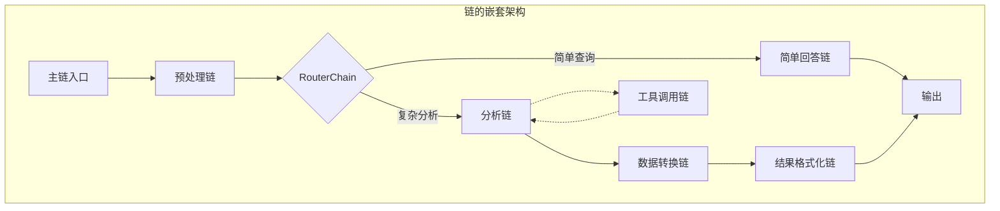

# 8.3.1 链的嵌套与复用

## 概念讲解

链的嵌套与复用是LangChain框架中的核心设计模式，它代表了从单一功能链到复杂工作流系统的演进。在传统软件开发中，我们通过函数组合和模块化来实现代码复用；而在大语言模型应用开发中，链的嵌套与复用提供了类似的抽象能力，但针对的是基于AI的工作流程。

### 设计哲学演进

链的嵌套设计遵循着"分而治之"的软件工程原则：
1. **单一职责原则**：每个链专注于完成特定功能
2. **开闭原则**：链可以通过组合扩展，无需修改原有实现
3. **依赖倒置原则**：高层模块不依赖低层模块，而是通过抽象接口交互

### 架构设计模式

LangChain v1.2.22提供了多种链嵌套与复用的设计模式：

1. **组合模式**：通过`|`操作符将多个Runnable组合成新链
2. **装饰器模式**：使用`@chain`装饰器封装复杂逻辑
3. **工厂模式**：通过配置动态创建和组合链
4. **策略模式**：根据上下文选择不同的链实现



## 核心要点

### 1. 链嵌套的四种基本形式

| 嵌套类型 | 适用场景 | 实现方式 | 特点 |
|---------|---------|---------|------|
| **顺序嵌套** | 线性工作流程 | `chain1 | chain2 | chain3` | 数据流单向传递 |
| **条件嵌套** | 动态路由决策 | `RunnableBranch` | 基于输入选择分支 |
| **并行嵌套** | 并发处理 | `RunnableParallel` | 同时执行多个链 |
| **递归嵌套** | 自引用处理 | `@chain`装饰器 | 链调用自身或循环 |

### 2. 链复用的关键技术

- **参数化链**：通过闭包或工厂函数创建可配置链
- **链注册表**：全局链管理，支持按名称检索
- **链组合器**：将原子链组合成复合链
- **链适配器**：接口转换，使不兼容链能够协同工作

### 3. 模块化设计原则

1. **高内聚**：每个链内部逻辑紧密相关
2. **低耦合**：链间依赖通过标准接口
3. **可测试**：每个链可以独立测试
4. **可替换**：相同接口的链可以互相替换
5. **可配置**：通过参数调整链的行为

### 4. 性能与维护性平衡

- **深度 vs 广度**：过深的嵌套影响调试，过宽的平行增加复杂度
- **复用度 vs 定制性**：高度复用的链可能失去针对性
- **抽象层 vs 性能**：每增加一层抽象都带来额外开销

## 简单示例

### 示例1：基础链嵌套（顺序组合）

```python
from langchain_core.prompts import ChatPromptTemplate
from langchain_core.output_parsers import StrOutputParser
from langchain_openai import ChatOpenAI

# 创建三个基础链
def create_chain1():
    prompt1 = ChatPromptTemplate.from_template("请分析以下文本的情感倾向: {text}")
    llm = ChatOpenAI(model="gpt-4")
    return prompt1 | llm | StrOutputParser()

def create_chain2():
    prompt2 = ChatPromptTemplate.from_template("根据情感分析结果生成回应: {sentiment}")
    llm = ChatOpenAI(model="gpt-4")
    return prompt2 | llm | StrOutputParser()

def create_chain3():
    prompt3 = ChatPromptTemplate.from_template("优化回应文本: {response}")
    llm = ChatOpenAI(model="gpt-4")
    return prompt3 | llm | StrOutputParser()

# 嵌套组合三个链
nested_chain = (
    {"text": lambda x: x}
    | {"sentiment": create_chain1()}
    | {"response": lambda x: f"情感分析结果: {x}"}
    | create_chain2()
    | {"response": lambda x: x}
    | create_chain3()
)

# 使用嵌套链
result = nested_chain.invoke("这个产品非常好用，我非常满意！")
print(f"优化后的回应: {result}")
```

### 示例2：复用已有链（工厂模式）

```python
from langchain.chains import LLMChain
from langchain_core.prompts import PromptTemplate
from langchain_openai import ChatOpenAI

class ChainFactory:
    """链工厂，支持链的创建和复用"""
    
    def __init__(self):
        self._chains = {}
    
    def get_translation_chain(self, source_lang, target_lang):
        """获取或创建翻译链"""
        key = f"translate_{source_lang}_to_{target_lang}"
        if key not in self._chains:
            prompt = PromptTemplate(
                input_variables=["text"],
                template=f"将以下{source_lang}文本翻译成{target_lang}: {{text}}"
            )
            llm = ChatOpenAI(model="gpt-4", temperature=0.1)
            self._chains[key] = LLMChain(llm=llm, prompt=prompt)
        return self._chains[key]
    
    def get_summary_chain(self, style="concise"):
        """获取或创建摘要链"""
        key = f"summary_{style}"
        if key not in self._chains:
            templates = {
                "concise": "用一句话总结以下文本: {text}",
                "detailed": "详细总结以下文本的要点: {text}",
                "bullet": "用要点形式总结以下文本: {text}"
            }
            prompt = PromptTemplate(
                input_variables=["text"],
                template=templates[style]
            )
            llm = ChatOpenAI(model="gpt-4", temperature=0.2)
            self._chains[key] = LLMChain(llm=llm, prompt=prompt)
        return self._chains[key]

# 使用链工厂
factory = ChainFactory()

# 复用翻译链
en_to_zh = factory.get_translation_chain("英语", "中文")
zh_to_en = factory.get_translation_chain("中文", "英语")

# 创建复杂工作流：翻译 -> 摘要 -> 再翻译
text = "LangChain is a framework for developing applications powered by language models."

# 方法1：显式调用
translated = en_to_zh.run(text=text)
summary = factory.get_summary_chain("concise").run(text=translated)
final = zh_to_en.run(text=summary)

print(f"原始文本: {text}")
print(f"翻译结果: {translated}")
print(f"摘要: {summary}")
print(f"回译结果: {final}")

# 方法2：链式组合
from langchain.chains import SimpleSequentialChain
workflow = SimpleSequentialChain(
    chains=[en_to_zh, factory.get_summary_chain("detailed"), zh_to_en],
    verbose=True
)
result = workflow.run(text)
```

### 示例3：使用@chain装饰器创建可复用链

```python
from langchain_core.runnables import chain
from langchain_core.prompts import ChatPromptTemplate
from langchain_openai import ChatOpenAI

@chain
def text_analysis_chain(text: str) -> dict:
    """文本分析链：多个分析步骤的组合"""
    llm = ChatOpenAI(model="gpt-4")
    
    # 步骤1：情感分析
    sentiment_prompt = ChatPromptTemplate.from_template(
        "分析以下文本的情感倾向（积极/消极/中性）并给出置信度: {text}"
    )
    sentiment_chain = sentiment_prompt | llm | StrOutputParser()
    sentiment = sentiment_chain.invoke({"text": text})
    
    # 步骤2：主题提取
    topic_prompt = ChatPromptTemplate.from_template(
        "提取以下文本的主要主题（最多3个）: {text}"
    )
    topic_chain = topic_prompt | llm | StrOutputParser()
    topics = topic_chain.invoke({"text": text})
    
    # 步骤3：关键信息提取
    keyinfo_prompt = ChatPromptTemplate.from_template(
        "提取以下文本的关键信息: {text}"
    )
    keyinfo_chain = keyinfo_prompt | llm | StrOutputParser()
    keyinfo = keyinfo_chain.invoke({"text": text})
    
    return {
        "original_text": text,
        "sentiment": sentiment,
        "topics": topics,
        "key_information": keyinfo
    }

# 复用分析链
analysis_result = text_analysis_chain.invoke(
    "人工智能正在改变我们的工作和生活方式，带来了效率和便利，但也带来了新的挑战。"
)
print(f"分析结果: {analysis_result}")

# 嵌套使用：分析链的结果作为另一个链的输入
@chain
def report_generation_chain(analysis: dict) -> str:
    """报告生成链：基于分析结果生成报告"""
    llm = ChatOpenAI(model="gpt-4")
    
    prompt = ChatPromptTemplate.from_template("""
基于以下分析结果生成一份结构化报告：
文本: {text}
情感分析: {sentiment}
主题: {topics}
关键信息: {keyinfo}

请生成包含以下章节的报告：
1. 执行摘要
2. 详细分析
3. 建议与行动计划
    """)
    
    report_chain = prompt | llm | StrOutputParser()
    return report_chain.invoke({
        "text": analysis["original_text"],
        "sentiment": analysis["sentiment"],
        "topics": analysis["topics"],
        "keyinfo": analysis["key_information"]
    })

# 链的嵌套：分析链 -> 报告链
nested_workflow = text_analysis_chain | report_generation_chain
final_report = nested_workflow.invoke(
    "人工智能正在改变我们的工作和生活方式，带来了效率和便利，但也带来了新的挑战。"
)
print(f"\n生成的报告:\n{final_report}")
```

## 进阶应用

### 应用1：企业级内容审核流水线

企业级内容审核系统需要多层嵌套的链来处理复杂的审核逻辑：

```python
from langchain_core.runnables import RunnableBranch, RunnableParallel
from typing import Dict, Any

class ContentModerationPipeline:
    """内容审核流水线：多级嵌套链"""
    
    def __init__(self):
        self.llm = ChatOpenAI(model="gpt-4")
        
    def build_pipeline(self):
        """构建多级审核流水线"""
        
        # 第一级：敏感词检测
        sensitive_words_chain = self._create_sensitive_detection_chain()
        
        # 第二级：情感倾向分析
        sentiment_analysis_chain = self._create_sentiment_analysis_chain()
        
        # 第三级：合规性检查
        compliance_chain = self._create_compliance_check_chain()
        
        # 第四级：上下文理解
        context_chain = self._create_context_understanding_chain()
        
        # 构建并行处理链
        parallel_analysis = RunnableParallel({
            "sensitive": sensitive_words_chain,
            "sentiment": sentiment_analysis_chain,
            "compliance": compliance_chain,
            "context": context_chain
        })
        
        # 决策链：基于多维度分析结果做最终决策
        decision_chain = self._create_decision_chain()
        
        # 完整流水线：并行分析 -> 决策
        return parallel_analysis | decision_chain
    
    def _create_sensitive_detection_chain(self):
        """创建敏感词检测链"""
        prompt = ChatPromptTemplate.from_template("""
        检测以下文本是否包含敏感词汇（暴力、色情、政治敏感等）：
        文本: {text}
        
        请按以下格式返回：
        检测结果: [是/否]
        敏感词汇: [列表或"无"]
        风险等级: [高/中/低]
        """)
        return prompt | self.llm | StrOutputParser()
    
    def _create_decision_chain(self):
        """创建决策链：基于多维度分析做最终决定"""
        @chain
        def decision_logic(inputs: Dict[str, Any]) -> Dict[str, Any]:
            # 模拟决策逻辑
            if "高风险" in inputs.get("sensitive", ""):
                return {"decision": "拒绝", "reason": "包含高风险敏感词汇"}
            elif "负面" in inputs.get("sentiment", "") and "违规" in inputs.get("compliance", ""):
                return {"decision": "人工审核", "reason": "负面情绪且合规性存疑"}
            else:
                return {"decision": "通过", "reason": "符合所有审核标准"}
        return decision_logic

# 使用企业级审核流水线
pipeline = ContentModerationPipeline()
moderation_chain = pipeline.build_pipeline()

content = "这个产品的价格太高了，简直是抢钱！"
result = moderation_chain.invoke({"text": content})
print(f"审核结果: {result}")
```

### 应用2：动态工作流编排器

在某些场景下，工作流需要根据实时情况动态调整链的组成：

```python
from langchain_core.runnables import RunnableConfig
from langchain_core.runnables import RunnableLambda

class DynamicWorkflowOrchestrator:
    """动态工作流编排器：运行时决定链的组合"""
    
    def __init__(self):
        self.chain_registry = {}
        self.register_default_chains()
    
    def register_chain(self, name: str, chain_func):
        """注册链到注册表"""
        self.chain_registry[name] = chain_func
    
    def register_default_chains(self):
        """注册默认链"""
        # 预处理链
        self.register_chain("preprocess", self._create_preprocess_chain())
        # 分类链
        self.register_chain("classify", self._create_classification_chain())
        # 处理链1
        self.register_chain("process_simple", self._create_simple_processing_chain())
        # 处理链2
        self.register_chain("process_complex", self._create_complex_processing_chain())
        # 后处理链
        self.register_chain("postprocess", self._create_postprocess_chain())
    
    def orchestrate(self, input_text: str, context: Dict = None) -> str:
        """动态编排工作流"""
        # 步骤1：预处理
        preprocessed = self.chain_registry["preprocess"].invoke({"text": input_text})
        
        # 步骤2：分类，决定后续处理路径
        classification = self.chain_registry["classify"].invoke({"text": preprocessed})
        
        # 步骤3：根据分类结果选择处理链
        if "简单" in classification:
            processor = self.chain_registry["process_simple"]
        else:
            processor = self.chain_registry["process_complex"]
        
        processed = processor.invoke({"text": preprocessed})
        
        # 步骤4：后处理
        final_result = self.chain_registry["postprocess"].invoke({"text": processed})
        
        return final_result
    
    def _create_preprocess_chain(self):
        """创建预处理链"""
        llm = ChatOpenAI(model="gpt-4")
        prompt = ChatPromptTemplate.from_template("清洗和标准化文本: {text}")
        return prompt | llm | StrOutputParser()
    
    def _create_classification_chain(self):
        """创建分类链"""
        llm = ChatOpenAI(model="gpt-4")
        prompt = ChatPromptTemplate.from_template("""
        分析以下文本的复杂度：
        文本: {text}
        
        返回：
        复杂度: [简单/复杂]
        原因: [简要说明]
        """)
        return prompt | llm | StrOutputParser()

# 使用动态编排器
orchestrator = DynamicWorkflowOrchestrator()
result = orchestrator.orchestrate(
    "我需要一份关于人工智能伦理的详细报告，包括技术挑战和社会影响。"
)
print(f"动态编排结果: {result}")
```

## 常见问题

### Q1：链嵌套太深会影响性能吗？

**A：** 是的，链嵌套深度会影响性能，主要体现在：
1. **序列化开销**：每层链都需要输入/输出序列化
2. **网络延迟**：如果链涉及外部API调用，多层嵌套会累积延迟
3. **内存占用**：中间结果会保存在内存中

**优化建议**：
- 深度不超过3-4层
- 使用`RunnableParallel`并行处理独立任务
- 缓存中间结果
- 考虑使用LangGraph处理复杂工作流

### Q2：如何调试嵌套的链？

**A：** LangChain v1.2.22提供了多种调试工具：

```python
# 方法1：使用verbose模式
chain = SimpleSequentialChain(chains=[chain1, chain2, chain3], verbose=True)

# 方法2：添加日志装饰器
from langchain_core.runnables import RunnableLambda

def add_logging(chain):
    @chain
    def logged_chain(inputs):
        print(f"输入: {inputs}")
        result = chain.invoke(inputs)
        print(f"输出: {result}")
        return result
    return logged_chain

# 方法3：使用LangSmith进行链路追踪
import os
os.environ["LANGCHAIN_TRACING_V2"] = "true"
os.environ["LANGCHAIN_API_KEY"] = "your-api-key"
```

### Q3：如何复用第三方或自定义链？

**A：** 有几种复用策略：

1. **适配器模式**：创建适配器使不兼容接口匹配
```python
class ChainAdapter:
    def __init__(self, chain, input_key="text", output_key="result"):
        self.chain = chain
        self.input_key = input_key
        self.output_key = output_key
    
    def invoke(self, inputs):
        # 转换输入格式
        adapted_input = {self.input_key: inputs.get("text", "")}
        result = self.chain.invoke(adapted_input)
        # 转换输出格式
        return {self.output_key: result}
```

2. **工厂模式**：统一创建接口
3. **注册表模式**：全局管理链实例

### Q4：链的嵌套与微服务架构有何异同？

**A：** 相似之处：
- 都遵循单一职责原则
- 都支持组件复用
- 都可以独立开发、测试、部署

不同之处：
- **通信方式**：链嵌套是进程内调用，微服务是网络调用
- **部署粒度**：链嵌套是代码级组合，微服务是进程级组合
- **性能特性**：链嵌套延迟低，微服务扩展性好
- **故障隔离**：微服务有更好的故障隔离

### Q5：如何管理链的版本和依赖？

**A：** 推荐的做法：
1. **语义化版本**：为链定义版本号（如`TextAnalyzerChain-v1.2.0`）
2. **依赖声明**：在链的文档中声明依赖的其他链
3. **契约测试**：确保链的输入输出格式稳定
4. **向后兼容**：新版本链应兼容旧版本的输入格式

## 本节总结

链的嵌套与复用是LangChain高级应用开发的核心技能，它体现了现代软件工程的模块化设计思想在AI工作流中的具体应用。

### 关键要点回顾

1. **设计模式优先**：优先使用组合模式、装饰器模式等经典设计模式
2. **适度抽象**：避免过度设计，根据实际需求确定抽象层级
3. **性能意识**：链嵌套深度直接影响性能，需要平衡功能与效率
4. **可维护性**：良好的命名、文档和测试是链复用的基础

### 实践建议

1. **从简单开始**：先实现功能，再逐步重构为可复用组件
2. **契约驱动**：明确定义每个链的输入输出契约
3. **测试策略**：为每个原子链编写单元测试，为组合链编写集成测试
4. **监控与调试**：使用LangSmith等工具监控链的执行情况

### 进阶方向

1. **链的市场化**：将常用链打包为可共享的Python包
2. **可视化编排**：开发基于Web的链编排界面
3. **智能组合**：使用AI自动推荐链的组合方式
4. **性能优化**：实现链的懒加载、缓存和预编译

链的嵌套与复用不仅是技术实现，更是一种工程思维。掌握这一技能，你将能够构建出既灵活又可靠的复杂AI应用系统，真正发挥LangChain在大语言模型应用开发中的威力。