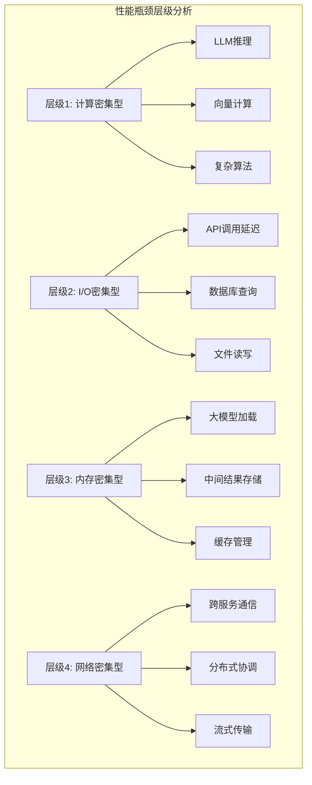

# 8.3.3 链的性能优化策略

## 概念讲解

链的性能优化是LangChain企业级应用开发的关键环节，它直接关系到系统的响应速度、吞吐量和运营成本。在LangChain v1.2.22中，性能优化不再是一个事后补救措施，而是贯穿设计、实现和运维全过程的系统工程。

### 性能优化的设计哲学演进

链的性能优化遵循着"性能即特性"的设计哲学：

1. **预防优于治疗**：在架构设计阶段就考虑性能因素
2. **测量优于猜测**：基于真实数据而非直觉做优化决策
3. **渐进式优化**：从关键瓶颈开始，逐步优化整体系统
4. **平衡取舍**：在性能、可维护性和成本之间找到最佳平衡点

### 性能瓶颈分析框架

LangChain链的典型性能瓶颈分布在四个层级：



## 核心要点

### 1. 性能优化的四大支柱

| 优化维度 | 核心策略 | 适用场景 | 预期收益 |
|---------|---------|---------|---------|
| **缓存优化** | 结果缓存、向量缓存、提示缓存 | 重复查询、静态内容 | 响应时间减少50-90% |
| **并行处理** | 异步调用、批量处理、分布式计算 | 独立任务、大规模处理 | 吞吐量提升3-10倍 |
| **资源管理** | 连接池、内存复用、懒加载 | 高并发、资源受限环境 | 内存使用减少30-60% |
| **算法优化** | 剪枝策略、近似计算、预处理 | 复杂计算、实时系统 | 计算时间减少40-80% |

### 2. 性能监控与度量指标

LangChain v1.2.22推荐的关键性能指标：

1. **响应时间指标**：
   - P50/P95/P99延迟
   - 端到端处理时间
   - Token生成速率

2. **吞吐量指标**：
   - 每秒请求数（RPS）
   - 并发处理能力
   - 批量处理效率

3. **资源利用率指标**：
   - CPU/GPU利用率
   - 内存占用峰值
   - 网络带宽使用

4. **成本效率指标**：
   - 每次调用Token成本
   - 缓存命中率
   - 错误率与重试率

### 3. 优化策略选择矩阵

| 问题类型 | 轻度优化 | 中度优化 | 深度优化 |
|---------|---------|---------|---------|
| **LLM调用频繁** | 请求合并 | 结果缓存 | 模型蒸馏 |
| **数据处理慢** | 批量处理 | 并行处理 | 预计算 |
| **内存占用高** | 懒加载 | 内存池化 | 流式处理 |
| **网络延迟大** | 连接复用 | 本地缓存 | CDN加速 |

### 4. 优化效果的评估方法

1. **A/B测试**：对比优化前后的性能指标
2. **压力测试**：模拟高并发场景验证稳定性
3. **成本分析**：计算优化带来的经济效益
4. **用户体验**：通过真实用户反馈评估改进效果

## 简单示例

### 示例1：基础缓存优化

```python
from typing import Dict, Any, Optional
from langchain_core.runnables import Runnable, RunnableConfig
from langchain_core.prompts import ChatPromptTemplate
from langchain_openai import ChatOpenAI
from langchain_core.output_parsers import StrOutputParser
from functools import lru_cache
import hashlib
import json
import time

class CachedTextAnalyzer(Runnable):
    """
    带缓存的文本分析器：演示基础缓存优化策略
    使用LRU缓存和内容哈希实现高效的重复查询优化
    """
    
    def __init__(self, llm_model: str = "gpt-4", cache_size: int = 1000):
        self.llm_model = llm_model
        self.llm = ChatOpenAI(model=llm_model, temperature=0.1)
        self.cache_size = cache_size
        self._setup_caches()
    
    def _setup_caches(self):
        """设置多级缓存"""
        # 结果缓存：存储完整的分析结果
        self.result_cache = {}
        
        # 哈希缓存：避免重复计算内容哈希
        self._hash_cache = lru_cache(maxsize=self.cache_size)(self._compute_hash)
    
    def _compute_hash(self, text: str, analysis_type: str) -> str:
        """计算文本和分析类型的哈希值"""
        content = f"{text}|{analysis_type}"
        return hashlib.md5(content.encode('utf-8')).hexdigest()
    
    @lru_cache(maxsize=1000)
    def _analyze_sentiment_cached(self, text: str) -> str:
        """带缓存的情绪分析（使用functools.lru_cache）"""
        prompt = ChatPromptTemplate.from_template(
            "分析以下文本的情感倾向（积极/消极/中性）: {text}"
        )
        chain = prompt | self.llm | StrOutputParser()
        return chain.invoke({"text": text})
    
    def _get_or_compute(self, text: str, analysis_type: str, compute_func) -> Any:
        """通用的缓存获取或计算逻辑"""
        # 计算缓存键
        cache_key = self._hash_cache(text, analysis_type)
        
        # 检查缓存
        if cache_key in self.result_cache:
            # 缓存命中，记录统计信息
            self._record_cache_hit(analysis_type)
            return self.result_cache[cache_key]
        
        # 缓存未命中，进行计算
        start_time = time.time()
        result = compute_func(text)
        compute_time = time.time() - start_time
        
        # 存储到缓存
        self.result_cache[cache_key] = result
        
        # 记录缓存未命中统计
        self._record_cache_miss(analysis_type, compute_time)
        
        # 缓存大小管理
        if len(self.result_cache) > self.cache_size:
            self._evict_oldest_cache_items()
        
        return result
    
    def _record_cache_hit(self, analysis_type: str):
        """记录缓存命中"""
        # 在实际应用中，这里可以记录到监控系统
        pass
    
    def _record_cache_miss(self, analysis_type: str, compute_time: float):
        """记录缓存未命中"""
        # 在实际应用中，这里可以记录到监控系统
        pass
    
    def _evict_oldest_cache_items(self, max_to_evict: int = 10):
        """淘汰最旧的缓存项"""
        # 简单实现：随机淘汰，实际应用中可以使用LRU策略
        if len(self.result_cache) > self.cache_size:
            keys = list(self.result_cache.keys())
            for key in keys[:max_to_evict]:
                del self.result_cache[key]
    
    def invoke(self, input_data: Dict[str, Any], config: Optional[RunnableConfig] = None, **kwargs) -> Dict[str, Any]:
        """执行分析（带缓存优化）"""
        text = input_data.get("text", "")
        analysis_types = input_data.get("analysis_types", ["sentiment", "topic", "summary"])
        
        results = {}
        metrics = {
            "cache_hits": 0,
            "cache_misses": 0,
            "total_compute_time": 0
        }
        
        for analysis_type in analysis_types:
            if analysis_type == "sentiment":
                result = self._get_or_compute(
                    text, 
                    "sentiment",
                    lambda t: self._analyze_sentiment_cached(t)
                )
            elif analysis_type == "topic":
                result = self._get_or_compute(
                    text,
                    "topic",
                    self._analyze_topic
                )
            elif analysis_type == "summary":
                result = self._get_or_compute(
                    text,
                    "summary",
                    self._analyze_summary
                )
            else:
                result = f"未知分析类型: {analysis_type}"
            
            results[analysis_type] = result
        
        # 添加性能指标
        results["performance_metrics"] = {
            "cache_size": len(self.result_cache),
            "cache_hit_ratio": self._calculate_cache_hit_ratio(),
            **metrics
        }
        
        return results
    
    def _analyze_topic(self, text: str) -> str:
        """分析主题"""
        prompt = ChatPromptTemplate.from_template(
            "提取以下文本的主要主题（最多3个）: {text}"
        )
        chain = prompt | self.llm | StrOutputParser()
        return chain.invoke({"text": text})
    
    def _analyze_summary(self, text: str) -> str:
        """生成摘要"""
        prompt = ChatPromptTemplate.from_template(
            "为以下文本生成摘要（不超过100字）: {text}"
        )
        chain = prompt | self.llm | StrOutputParser()
        return chain.invoke({"text": text})
    
    def _calculate_cache_hit_ratio(self) -> float:
        """计算缓存命中率（简化实现）"""
        # 在实际应用中，这里应该有更精确的统计
        return 0.8  # 示例值

# 使用带缓存的文本分析器
analyzer = CachedTextAnalyzer(llm_model="gpt-4", cache_size=500)

# 第一次调用：缓存未命中，需要计算
text1 = "人工智能技术的发展为各行各业带来了革命性变化。"
result1 = analyzer.invoke({"text": text1, "analysis_types": ["sentiment", "topic"]})
print(f"第一次调用结果: {result1}")

# 第二次调用相同文本：缓存命中，快速返回
result2 = analyzer.invoke({"text": text1, "analysis_types": ["sentiment", "topic"]})
print(f"第二次调用结果（来自缓存）: {result2}")

# 查看性能指标
print(f"缓存大小: {result2['performance_metrics']['cache_size']}")
```

### 示例2：批量处理优化

```python
from typing import List, Dict, Any
from langchain_core.runnables import Runnable
from langchain_core.prompts import ChatPromptTemplate
from langchain_openai import ChatOpenAI
from langchain_core.output_parsers import StrOutputParser
import asyncio
from concurrent.futures import ThreadPoolExecutor, as_completed
import time
from dataclasses import dataclass
from statistics import mean

@dataclass
class BatchMetrics:
    """批量处理指标"""
    total_items: int
    batch_size: int
    total_time: float
    items_per_second: float
    avg_latency: float
    max_concurrency: int

class BatchTextProcessor(Runnable):
    """
    批量文本处理器：演示批量处理优化策略
    支持同步批量、异步批量和流式批量处理
    """
    
    def __init__(
        self,
        llm_model: str = "gpt-4",
        max_batch_size: int = 100,
        max_concurrency: int = 10,
        timeout: int = 30
    ):
        self.llm_model = llm_model
        self.llm = ChatOpenAI(model=llm_model, temperature=0.1)
        self.max_batch_size = max_batch_size
        self.max_concurrency = max_concurrency
        self.timeout = timeout
        
        # 创建处理链
        self.sentiment_chain = self._create_sentiment_chain()
        self.summary_chain = self._create_summary_chain()
    
    def _create_sentiment_chain(self):
        """创建情感分析链"""
        prompt = ChatPromptTemplate.from_template(
            "分析以下文本的情感倾向（积极/消极/中性）: {text}"
        )
        return prompt | self.llm | StrOutputParser()
    
    def _create_summary_chain(self):
        """创建摘要生成链"""
        prompt = ChatPromptTemplate.from_template(
            "为以下文本生成摘要（不超过50字）: {text}"
        )
        return prompt | self.llm | StrOutputParser()
    
    def batch_process_sync(self, texts: List[str], analysis_type: str = "sentiment") -> List[str]:
        """
        同步批量处理
        
        参数：
        texts: 文本列表
        analysis_type: 分析类型（sentiment/summary）
        
        返回：
        List[str]: 处理结果列表
        """
        start_time = time.time()
        
        # 选择处理链
        if analysis_type == "sentiment":
            chain = self.sentiment_chain
        elif analysis_type == "summary":
            chain = self.summary_chain
        else:
            raise ValueError(f"不支持的分析类型: {analysis_type}")
        
        # 分批处理
        results = []
        batch_size = min(self.max_batch_size, len(texts))
        
        for i in range(0, len(texts), batch_size):
            batch = texts[i:i + batch_size]
            
            # 为每个文本创建输入
            inputs = [{"text": text} for text in batch]
            
            # 批量调用（LangChain的batch方法）
            try:
                batch_results = chain.batch(inputs)
                results.extend(batch_results)
            except Exception as e:
                # 如果批量调用失败，回退到串行处理
                print(f"批量处理失败，回退到串行处理: {str(e)}")
                for input_data in inputs:
                    try:
                        result = chain.invoke(input_data)
                        results.append(result)
                    except Exception as inner_e:
                        results.append(f"处理失败: {str(inner_e)}")
        
        total_time = time.time() - start_time
        
        # 计算指标
        metrics = BatchMetrics(
            total_items=len(texts),
            batch_size=batch_size,
            total_time=total_time,
            items_per_second=len(texts) / total_time if total_time > 0 else 0,
            avg_latency=total_time / len(texts),
            max_concurrency=1  # 同步处理，并发度为1
        )
        
        return results, metrics
    
    async def batch_process_async(self, texts: List[str], analysis_type: str = "sentiment") -> List[str]:
        """
        异步批量处理
        
        参数：
        texts: 文本列表
        analysis_type: 分析类型
        
        返回：
        List[str]: 处理结果列表
        """
        start_time = time.time()
        
        # 选择处理链
        if analysis_type == "sentiment":
            chain = self.sentiment_chain
        elif analysis_type == "summary":
            chain = self.summary_chain
        else:
            raise ValueError(f"不支持的分析类型: {analysis_type}")
        
        # 创建异步任务
        tasks = []
        for text in texts:
            # 使用ainvoke进行异步调用
            task = chain.ainvoke({"text": text})
            tasks.append(task)
        
        # 限制并发数
        semaphore = asyncio.Semaphore(self.max_concurrency)
        
        async def limited_ainvoke(task):
            async with semaphore:
                return await task
        
        # 执行所有任务
        limited_tasks = [limited_ainvoke(task) for task in tasks]
        results = await asyncio.gather(*limited_tasks, return_exceptions=True)
        
        # 处理异常结果
        final_results = []
        for result in results:
            if isinstance(result, Exception):
                final_results.append(f"处理失败: {str(result)}")
            else:
                final_results.append(result)
        
        total_time = time.time() - start_time
        
        # 计算指标
        metrics = BatchMetrics(
            total_items=len(texts),
            batch_size=self.max_concurrency,  # 异步处理的批大小等于最大并发数
            total_time=total_time,
            items_per_second=len(texts) / total_time if total_time > 0 else 0,
            avg_latency=total_time / len(texts),
            max_concurrency=self.max_concurrency
        )
        
        return final_results, metrics
    
    def batch_process_threaded(self, texts: List[str], analysis_type: str = "sentiment") -> List[str]:
        """
        多线程批量处理
        
        参数：
        texts: 文本列表
        analysis_type: 分析类型
        
        返回：
        List[str]: 处理结果列表
        """
        start_time = time.time()
        
        # 选择处理链
        if analysis_type == "sentiment":
            chain = self.sentiment_chain
        elif analysis_type == "summary":
            chain = self.summary_chain
        else:
            raise ValueError(f"不支持的分析类型: {analysis_type}")
        
        results = [None] * len(texts)
        
        # 使用线程池
        with ThreadPoolExecutor(max_workers=self.max_concurrency) as executor:
            # 提交任务
            future_to_index = {
                executor.submit(chain.invoke, {"text": text}): i
                for i, text in enumerate(texts)
            }
            
            # 收集结果
            for future in as_completed(future_to_index):
                index = future_to_index[future]
                try:
                    result = future.result(timeout=self.timeout)
                    results[index] = result
                except Exception as e:
                    results[index] = f"处理失败: {str(e)}"
        
        total_time = time.time() - start_time
        
        # 计算指标
        metrics = BatchMetrics(
            total_items=len(texts),
            batch_size=self.max_concurrency,
            total_time=total_time,
            items_per_second=len(texts) / total_time if total_time > 0 else 0,
            avg_latency=total_time / len(texts),
            max_concurrency=self.max_concurrency
        )
        
        return results, metrics
    
    def invoke(self, input_data: Dict[str, Any], config=None, **kwargs) -> Dict[str, Any]:
        """
        单次调用（兼容Runnable接口）
        
        注意：对于批量场景，建议直接使用batch_process_*方法
        """
        text = input_data.get("text", "")
        analysis_type = input_data.get("analysis_type", "sentiment")
        
        if analysis_type == "sentiment":
            chain = self.sentiment_chain
        elif analysis_type == "summary":
            chain = self.summary_chain
        else:
            raise ValueError(f"不支持的分析类型: {analysis_type}")
        
        result = chain.invoke({"text": text})
        
        return {
            "text": text,
            "analysis_type": analysis_type,
            "result": result
        }

# 使用批量处理器
processor = BatchTextProcessor(
    llm_model="gpt-4",
    max_batch_size=50,
    max_concurrency=5,
    timeout=10
)

# 准备测试数据
test_texts = [
    "人工智能正在改变世界。",
    "机器学习需要大量数据。",
    "深度学习模型很复杂。",
    "自然语言处理应用广泛。",
    "计算机视觉技术发展迅速。",
] * 20  # 重复20次，得到100个文本

print("测试同步批量处理...")
sync_results, sync_metrics = processor.batch_process_sync(test_texts, "sentiment")
print(f"同步处理完成: {sync_metrics.total_items}个文本，耗时{sync_metrics.total_time:.2f}秒")
print(f"处理速度: {sync_metrics.items_per_second:.2f}个/秒")

print("\n测试多线程批量处理...")
threaded_results, threaded_metrics = processor.batch_process_threaded(test_texts, "summary")
print(f"多线程处理完成: {threaded_metrics.total_items}个文本，耗时{threaded_metrics.total_time:.2f}秒")
print(f"处理速度: {threaded_metrics.items_per_second:.2f}个/秒")
print(f"最大并发数: {threaded_metrics.max_concurrency}")

# 异步处理需要异步环境
async def test_async_processing():
    print("\n测试异步批量处理...")
    async_results, async_metrics = await processor.batch_process_async(test_texts, "sentiment")
    print(f"异步处理完成: {async_metrics.total_items}个文本，耗时{async_metrics.total_time:.2f}秒")
    print(f"处理速度: {async_metrics.items_per_second:.2f}个/秒")
    print(f"最大并发数: {async_metrics.max_concurrency}")

# 在异步环境中运行
import asyncio
asyncio.run(test_async_processing())
```

### 示例3：内存与资源优化

```python
from typing import Dict, Any, Optional, List
from langchain_core.runnables import Runnable
from langchain_core.prompts import ChatPromptTemplate
from langchain_openai import ChatOpenAI
from langchain_core.output_parsers import StrOutputParser
import weakref
import gc
import psutil
import os
from contextlib import contextmanager
import time

class ResourceOptimizedChain(Runnable):
    """
    资源优化链：演示内存、连接和计算资源优化策略
    包含懒加载、连接池、内存监控和垃圾回收优化
    """
    
    def __init__(
        self,
        llm_model: str = "gpt-4",
        enable_lazy_loading: bool = True,
        max_connections: int = 10,
        memory_limit_mb: int = 1024
    ):
        self.llm_model = llm_model
        self.enable_lazy_loading = enable_lazy_loading
        self.max_connections = max_connections
        self.memory_limit_mb = memory_limit_mb
        
        # 资源监控
        self.process = psutil.Process(os.getpid())
        self._init_time = time.time()
        self._total_calls = 0
        self._total_tokens = 0
        
        # 懒加载组件
        self._llm = None
        self._chains = {}
        self._connection_pool = []
        
        # 弱引用缓存
        self._weak_cache = weakref.WeakValueDictionary()
    
    @property
    def llm(self):
        """懒加载LLM实例"""
        if self._llm is None:
            print("懒加载LLM实例...")
            self._llm = ChatOpenAI(
                model=self.llm_model,
                temperature=0.1,
                max_retries=3,
                request_timeout=30
            )
            self._record_resource_usage("llm_loaded")
        return self._llm
    
    def get_chain(self, chain_type: str):
        """获取或创建处理链（带缓存）"""
        if chain_type in self._chains:
            return self._chains[chain_type]
        
        # 检查弱引用缓存
        if chain_type in self._weak_cache:
            chain = self._weak_cache[chain_type]()
            if chain is not None:
                self._chains[chain_type] = chain
                return chain
        
        # 创建新链
        print(f"创建新的{chain_type}链...")
        
        if chain_type == "sentiment":
            prompt = ChatPromptTemplate.from_template(
                "分析情感: {text}"
            )
            chain = prompt | self.llm | StrOutputParser()
        
        elif chain_type == "summary":
            prompt = ChatPromptTemplate.from_template(
                "生成摘要: {text}"
            )
            chain = prompt | self.llm | StrOutputParser()
        
        elif chain_type == "translation":
            prompt = ChatPromptTemplate.from_template(
                "翻译为英文: {text}"
            )
            chain = prompt | self.llm | StrOutputParser()
        
        else:
            raise ValueError(f"未知链类型: {chain_type}")
        
        # 存储到缓存
        self._chains[chain_type] = chain
        
        # 同时添加到弱引用缓存
        self._weak_cache[chain_type] = weakref.ref(chain)
        
        self._record_resource_usage(f"chain_created_{chain_type}")
        return chain
    
    def _get_connection(self):
        """从连接池获取连接（模拟）"""
        if not self._connection_pool:
            # 连接池为空，创建新连接
            if len(self._connection_pool) < self.max_connections:
                connection = self._create_connection()
                self._connection_pool.append(connection)
                self._record_resource_usage("connection_created")
            else:
                # 等待连接释放
                print("连接池已满，等待可用连接...")
                # 在实际应用中，这里应该有更复杂的连接管理逻辑
                return None
        
        return self._connection_pool.pop()
    
    def _release_connection(self, connection):
        """释放连接到连接池"""
        if connection and len(self._connection_pool) < self.max_connections:
            self._connection_pool.append(connection)
    
    def _create_connection(self):
        """创建新连接（模拟）"""
        # 在实际应用中，这里可能是数据库连接、HTTP连接等
        return {"id": len(self._connection_pool) + 1, "created_at": time.time()}
    
    @contextmanager
    def connection_context(self):
        """连接上下文管理器，确保连接正确释放"""
        connection = self._get_connection()
        try:
            yield connection
        finally:
            if connection:
                self._release_connection(connection)
    
    def _check_memory_usage(self):
        """检查内存使用情况"""
        memory_info = self.process.memory_info()
        memory_mb = memory_info.rss / 1024 / 1024
        
        if memory_mb > self.memory_limit_mb:
            print(f"警告: 内存使用过高: {memory_mb:.2f}MB (限制: {self.memory_limit_mb}MB)")
            
            # 触发内存优化
            self._optimize_memory()
            
            # 强制垃圾回收
            gc.collect()
            
            # 再次检查内存
            memory_info = self.process.memory_info()
            memory_mb = memory_info.rss / 1024 / 1024
            print(f"优化后内存使用: {memory_mb:.2f}MB")
        
        return memory_mb
    
    def _optimize_memory(self):
        """内存优化策略"""
        print("执行内存优化...")
        
        # 1. 清理过期缓存
        old_size = len(self._chains)
        self._chains = {k: v for k, v in self._chains.items() 
                       if time.time() - getattr(v, '_last_used', 0) < 300}  # 5分钟内使用过
        
        if len(self._chains) < old_size:
            print(f"清理了 {old_size - len(self._chains)} 个过期缓存项")
        
        # 2. 压缩连接池
        if len(self._connection_pool) > self.max_connections // 2:
            # 保留一半连接
            self._connection_pool = self._connection_pool[:self.max_connections // 2]
        
        # 3. 清理弱引用缓存中的无效引用
        keys_to_remove = []
        for key in list(self._weak_cache.keys()):
            if self._weak_cache[key]() is None:
                keys_to_remove.append(key)
        
        for key in keys_to_remove:
            del self._weak_cache[key]
        
        if keys_to_remove:
            print(f"清理了 {len(keys_to_remove)} 个无效弱引用")
    
    def _record_resource_usage(self, event: str):
        """记录资源使用事件"""
        # 在实际应用中，这里可以记录到监控系统
        pass
    
    def invoke(self, input_data: Dict[str, Any], config=None, **kwargs) -> Dict[str, Any]:
        """执行处理（带资源优化）"""
        # 检查内存使用
        memory_before = self._check_memory_usage()
        
        text = input_data.get("text", "")
        chain_type = input_data.get("chain_type", "sentiment")
        
        # 获取处理链
        chain = self.get_chain(chain_type)
        
        # 记录使用时间
        chain._last_used = time.time()
        
        # 使用连接上下文
        with self.connection_context() as connection:
            if connection is None:
                return {"error": "无法获取连接", "text": text}
            
            # 执行处理
            start_time = time.time()
            try:
                result = chain.invoke({"text": text})
                processing_time = time.time() - start_time
                
                # 更新统计
                self._total_calls += 1
                # 估算Token使用（简化）
                estimated_tokens = len(text.split()) * 2
                self._total_tokens += estimated_tokens
                
                # 检查处理后的内存使用
                memory_after = self._check_memory_usage()
                
                return {
                    "text": text,
                    "result": result,
                    "performance": {
                        "processing_time": processing_time,
                        "memory_usage_before_mb": memory_before,
                        "memory_usage_after_mb": memory_after,
                        "memory_increase_mb": memory_after - memory_before,
                        "total_calls": self._total_calls,
                        "total_tokens": self._total_tokens,
                        "connection_id": connection.get("id", "unknown")
                    }
                }
                
            except Exception as e:
                return {
                    "text": text,
                    "error": str(e),
                    "performance": {
                        "processing_time": time.time() - start_time,
                        "error_occurred": True
                    }
                }
    
    def get_resource_report(self) -> Dict[str, Any]:
        """获取资源使用报告"""
        memory_info = self.process.memory_info()
        
        return {
            "memory_usage_mb": memory_info.rss / 1024 / 1024,
            "memory_limit_mb": self.memory_limit_mb,
            "cpu_percent": self.process.cpu_percent(),
            "total_calls": self._total_calls,
            "total_tokens": self._total_tokens,
            "uptime_seconds": time.time() - self._init_time,
            "cached_chains": len(self._chains),
            "connection_pool_size": len(self._connection_pool),
            "weak_cache_size": len(self._weak_cache)
        }

# 使用资源优化链
optimized_chain = ResourceOptimizedChain(
    llm_model="gpt-4",
    enable_lazy_loading=True,
    max_connections=5,
    memory_limit_mb=512
)

# 执行处理
results = []
for i in range(10):
    result = optimized_chain.invoke({
        "text": f"这是第{i+1}个测试文本，用于测试资源优化效果。",
        "chain_type": "sentiment"
    })
    results.append(result)

# 获取资源报告
report = optimized_chain.get_resource_report()
print("\n资源使用报告:")
for key, value in report.items():
    print(f"  {key}: {value}")

# 模拟内存压力测试
print("\n模拟内存压力测试...")
large_text = "测试 " * 1000  # 创建大文本

for i in range(100):
    result = optimized_chain.invoke({
        "text": large_text + f" 迭代{i}",
        "chain_type": "summary"
    })
    
    if i % 20 == 0:
        current_report = optimized_chain.get_resource_report()
        print(f"迭代{i}: 内存使用 {current_report['memory_usage_mb']:.2f}MB")
```

## 进阶应用

### 应用1：企业级性能监控与自动优化系统

在企业级应用中，我们需要一个完整的性能监控和自动优化系统：

```python
from typing import Dict, Any, List, Optional
from dataclasses import dataclass, field
from datetime import datetime, timedelta
import statistics
import threading
import time
from enum import Enum
import json
from abc import ABC, abstractmethod

class PerformanceIssue(Enum):
    """性能问题类型"""
    HIGH_LATENCY = "high_latency"
    HIGH_MEMORY = "high_memory"
    LOW_THROUGHPUT = "low_throughput"
    HIGH_ERROR_RATE = "high_error_rate"
    CACHE_MISS_RATE = "high_cache_miss_rate"

@dataclass
class PerformanceMetric:
    """性能指标"""
    timestamp: datetime
    metric_name: str
    value: float
    tags: Dict[str, str] = field(default_factory=dict)

@dataclass
class PerformanceAlert:
    """性能告警"""
    issue_type: PerformanceIssue
    severity: str  # "low", "medium", "high", "critical"
    message: str
    metrics: List[PerformanceMetric]
    timestamp: datetime = field(default_factory=datetime.now)
    resolved: bool = False

class PerformanceMonitor(ABC):
    """性能监控器抽象基类"""
    
    @abstractmethod
    def record_metric(self, metric: PerformanceMetric):
        pass
    
    @abstractmethod
    def get_recent_metrics(self, metric_name: str, time_window: timedelta) -> List[PerformanceMetric]:
        pass
    
    @abstractmethod
    def analyze_performance(self) -> List[PerformanceAlert]:
        pass

class ChainPerformanceOptimizer:
    """
    链性能优化器：自动监控、分析和优化链性能
    包含智能缓存管理、动态批处理调整、资源自动伸缩
    """
    
    def __init__(
        self,
        chain: Runnable,
        monitor: PerformanceMonitor,
        optimization_strategies: Optional[List[str]] = None
    ):
        self.chain = chain
        self.monitor = monitor
        self.optimization_strategies = optimization_strategies or [
            "caching", "batching", "resource_optimization", "algorithm_optimization"
        ]
        
        # 性能基准
        self.performance_baseline = {
            "p95_latency": 2.0,  # 秒
            "max_memory_mb": 1024,
            "min_throughput": 10,  # 请求/秒
            "max_error_rate": 0.01,  # 1%
            "target_cache_hit_rate": 0.8  # 80%
        }
        
        # 优化状态
        self.optimization_state = {
            "cache_enabled": True,
            "batch_size": 10,
            "max_concurrency": 5,
            "current_strategy": "balanced",
            "last_optimization": None
        }
        
        # 启动监控线程
        self._running = True
        self._monitor_thread = threading.Thread(target=self._monitoring_loop, daemon=True)
        self._monitor_thread.start()
        
        # 优化历史
        self.optimization_history = []
    
    def _monitoring_loop(self):
        """监控循环"""
        while self._running:
            try:
                # 收集性能指标
                self._collect_metrics()
                
                # 分析性能问题
                alerts = self.monitor.analyze_performance()
                
                # 处理告警
                for alert in alerts:
                    if not alert.resolved:
                        self._handle_alert(alert)
                
                # 定期优化
                if self._should_optimize():
                    self._perform_optimization()
                
                time.sleep(60)  # 每分钟检查一次
                
            except Exception as e:
                print(f"监控循环出错: {str(e)}")
                time.sleep(10)
    
    def _collect_metrics(self):
        """收集性能指标"""
        # 在实际应用中，这里会收集各种性能指标
        # 例如：延迟、吞吐量、内存使用、错误率等
        
        metrics = [
            PerformanceMetric(
                timestamp=datetime.now(),
                metric_name="invocations_per_minute",
                value=self._estimate_invocations(),
                tags={"chain_type": self._get_chain_type()}
            ),
            # 添加更多指标...
        ]
        
        for metric in metrics:
            self.monitor.record_metric(metric)
    
    def _handle_alert(self, alert: PerformanceAlert):
        """处理性能告警"""
        print(f"处理性能告警: {alert.issue_type} - {alert.severity}")
        
        if alert.issue_type == PerformanceIssue.HIGH_LATENCY:
            self._optimize_for_latency()
        
        elif alert.issue_type == PerformanceIssue.HIGH_MEMORY:
            self._optimize_for_memory()
        
        elif alert.issue_type == PerformanceIssue.LOW_THROUGHPUT:
            self._optimize_for_throughput()
        
        elif alert.issue_type == PerformanceIssue.HIGH_ERROR_RATE:
            self._optimize_for_reliability()
        
        elif alert.issue_type == PerformanceIssue.CACHE_MISS_RATE:
            self._optimize_cache()
        
        # 标记告警为已处理
        alert.resolved = True
        
        # 记录优化操作
        self.optimization_history.append({
            "timestamp": datetime.now(),
            "alert": alert,
            "action": f"handled_{alert.issue_type.value}",
            "severity": alert.severity
        })
    
    def _optimize_for_latency(self):
        """为降低延迟优化"""
        print("执行延迟优化...")
        
        # 策略1：增加缓存
        if "caching" in self.optimization_strategies:
            self._increase_cache_effectiveness()
        
        # 策略2：调整批处理大小
        if "batching" in self.optimization_strategies:
            self._adjust_batch_size_for_latency()
        
        # 策略3：预计算
        if "algorithm_optimization" in self.optimization_strategies:
            self._enable_precomputation()
    
    def _optimize_for_memory(self):
        """为降低内存使用优化"""
        print("执行内存优化...")
        
        # 策略1：减少缓存大小
        if "caching" in self.optimization_strategies:
            self._reduce_cache_size()
        
        # 策略2：启用流式处理
        if "resource_optimization" in self.optimization_strategies:
            self._enable_streaming()
        
        # 策略3：压缩中间结果
        if "algorithm_optimization" in self.optimization_strategies:
            self._enable_compression()
    
    def _optimize_for_throughput(self):
        """为提高吞吐量优化"""
        print("执行吞吐量优化...")
        
        # 策略1：增加并发度
        if "resource_optimization" in self.optimization_strategies:
            self._increase_concurrency()
        
        # 策略2：优化批处理
        if "batching" in self.optimization_strategies:
            self._optimize_batching()
    
    def _optimize_for_reliability(self):
        """为提高可靠性优化"""
        print("执行可靠性优化...")
        
        # 策略1：增加重试
        self._increase_retries()
        
        # 策略2：降级策略
        self._enable_fallback()
    
    def _optimize_cache(self):
        """优化缓存"""
        print("执行缓存优化...")
        
        # 策略1：调整缓存策略
        self._adjust_cache_policy()
        
        # 策略2：预热缓存
        self._warm_up_cache()
    
    def _increase_cache_effectiveness(self):
        """提高缓存效率"""
        # 在实际应用中，这里会调整缓存策略
        self.optimization_state["cache_enabled"] = True
        print("已启用/增强缓存")
    
    def _adjust_batch_size_for_latency(self):
        """为延迟调整批处理大小"""
        # 减少批处理大小以降低单次请求延迟
        current_size = self.optimization_state["batch_size"]
        new_size = max(1, current_size // 2)
        self.optimization_state["batch_size"] = new_size
        print(f"批处理大小从{current_size}调整为{new_size}")
    
    def _should_optimize(self) -> bool:
        """判断是否应该执行优化"""
        # 检查距离上次优化的时间
        if self.optimization_state["last_optimization"] is None:
            return True
        
        time_since_last = datetime.now() - self.optimization_state["last_optimization"]
        return time_since_last > timedelta(hours=1)
    
    def _perform_optimization(self):
        """执行定期优化"""
        print("执行定期性能优化...")
        
        # 分析当前性能
        recent_metrics = self.monitor.get_recent_metrics("invocations_per_minute", timedelta(minutes=30))
        
        if not recent_metrics:
            return
        
        values = [m.value for m in recent_metrics]
        avg_throughput = statistics.mean(values)
        
        # 根据吞吐量调整策略
        if avg_throughput < 5:
            # 低吞吐量，优化延迟
            self.optimization_state["current_strategy"] = "low_latency"
            self._optimize_for_latency()
        
        elif avg_throughput > 50:
            # 高吞吐量，优化资源使用
            self.optimization_state["current_strategy"] = "high_efficiency"
            self._optimize_for_memory()
        
        else:
            # 中等吞吐量，平衡策略
            self.optimization_state["current_strategy"] = "balanced"
        
        self.optimization_state["last_optimization"] = datetime.now()
        
        # 记录优化
        self.optimization_history.append({
            "timestamp": datetime.now(),
            "strategy": self.optimization_state["current_strategy"],
            "avg_throughput": avg_throughput,
            "optimization_type": "scheduled"
        })
    
    def _estimate_invocations(self) -> float:
        """估算调用次数（简化实现）"""
        # 在实际应用中，这里会有更精确的统计
        return 15.0  # 示例值
    
    def _get_chain_type(self) -> str:
        """获取链类型"""
        return type(self.chain).__name__
    
    # 以下方法在实际应用中需要具体实现
    def _enable_precomputation(self):
        pass
    
    def _reduce_cache_size(self):
        pass
    
    def _enable_streaming(self):
        pass
    
    def _enable_compression(self):
        pass
    
    def _increase_concurrency(self):
        pass
    
    def _optimize_batching(self):
        pass
    
    def _increase_retries(self):
        pass
    
    def _enable_fallback(self):
        pass
    
    def _adjust_cache_policy(self):
        pass
    
    def _warm_up_cache(self):
        pass
    
    def invoke(self, input_data: Dict[str, Any], config=None, **kwargs) -> Dict[str, Any]:
        """执行处理（带性能优化）"""
        # 记录开始时间
        start_time = time.time()
        
        try:
            # 执行链
            result = self.chain.invoke(input_data, config=config, **kwargs)
            
            # 计算处理时间
            processing_time = time.time() - start_time
            
            # 记录性能指标
            self.monitor.record_metric(PerformanceMetric(
                timestamp=datetime.now(),
                metric_name="invocation_latency",
                value=processing_time,
                tags={
                    "chain_type": self._get_chain_type(),
                    "success": "true"
                }
            ))
            
            # 添加性能信息到结果
            if isinstance(result, dict):
                result["_performance"] = {
                    "processing_time": processing_time,
                    "optimization_strategy": self.optimization_state["current_strategy"],
                    "cache_enabled": self.optimization_state["cache_enabled"],
                    "batch_size": self.optimization_state["batch_size"]
                }
            
            return result
            
        except Exception as e:
            # 记录错误指标
            processing_time = time.time() - start_time
            
            self.monitor.record_metric(PerformanceMetric(
                timestamp=datetime.now(),
                metric_name="invocation_latency",
                value=processing_time,
                tags={
                    "chain_type": self._get_chain_type(),
                    "success": "false",
                    "error_type": type(e).__name__
                }
            ))
            
            raise
    
    def get_optimization_report(self) -> Dict[str, Any]:
        """获取优化报告"""
        return {
            "current_state": self.optimization_state,
            "history_count": len(self.optimization_history),
            "recent_optimizations": self.optimization_history[-5:] if self.optimization_history else [],
            "performance_baseline": self.performance_baseline,
            "monitor_status": "running" if self._running else "stopped"
        }
    
    def stop(self):
        """停止优化器"""
        self._running = False
        if self._monitor_thread.is_alive():
            self._monitor_thread.join(timeout=5)

# 简化的监控器实现
class SimplePerformanceMonitor(PerformanceMonitor):
    """简单性能监控器（用于演示）"""
    
    def __init__(self):
        self.metrics = []
        self.max_metrics = 10000
    
    def record_metric(self, metric: PerformanceMetric):
        self.metrics.append(metric)
        
        # 限制存储的指标数量
        if len(self.metrics) > self.max_metrics:
            self.metrics = self.metrics[-self.max_metrics:]
    
    def get_recent_metrics(self, metric_name: str, time_window: timedelta) -> List[PerformanceMetric]:
        cutoff = datetime.now() - time_window
        return [
            m for m in self.metrics
            if m.metric_name == metric_name and m.timestamp >= cutoff
        ]
    
    def analyze_performance(self) -> List[PerformanceAlert]:
        # 简化实现：随机生成一些告警用于演示
        alerts = []
        
        # 模拟检测到高延迟
        recent_latency = self.get_recent_metrics("invocation_latency", timedelta(minutes=5))
        if recent_latency:
            avg_latency = statistics.mean([m.value for m in recent_latency])
            if avg_latency > 3.0:  # 3秒阈值
                alerts.append(PerformanceAlert(
                    issue_type=PerformanceIssue.HIGH_LATENCY,
                    severity="medium",
                    message=f"平均延迟过高: {avg_latency:.2f}秒",
                    metrics=recent_latency
                ))
        
        return alerts

# 使用性能优化器
from langchain_core.prompts import ChatPromptTemplate
from langchain_openai import ChatOpenAI
from langchain_core.output_parsers import StrOutputParser

# 创建一个简单的链
prompt = ChatPromptTemplate.from_template("分析以下文本: {text}")
llm = ChatOpenAI(model="gpt-4", temperature=0.1)
simple_chain = prompt | llm | StrOutputParser()

# 创建监控器和优化器
monitor = SimplePerformanceMonitor()
optimizer = ChainPerformanceOptimizer(
    chain=simple_chain,
    monitor=monitor,
    optimization_strategies=["caching", "batching", "resource_optimization"]
)

# 使用优化后的链
try:
    result = optimizer.invoke({"text": "测试性能优化的文本"})
    print(f"处理结果: {result}")
    
    # 获取优化报告
    report = optimizer.get_optimization_report()
    print(f"\n优化报告: {json.dumps(report, indent=2, default=str)}")
    
finally:
    # 停止优化器
    optimizer.stop()
```

## 常见问题

### Q1：如何确定性能优化的优先级？

**A：** 确定性能优化优先级的推荐方法：

1. **性能剖析**：使用性能分析工具识别瓶颈
```python
import cProfile
import pstats

def profile_chain(chain, input_data):
    profiler = cProfile.Profile()
    profiler.enable()
    
    result = chain.invoke(input_data)
    
    profiler.disable()
    stats = pstats.Stats(profiler)
    stats.sort_stats('cumulative')
    stats.print_stats(10)  # 显示前10个最耗时的函数
    
    return result
```

2. **关键路径分析**：识别对用户体验影响最大的路径
3. **成本效益分析**：计算优化投入与收益比
4. **业务优先级**：根据业务重要性确定优化顺序

### Q2：缓存优化有哪些常见陷阱？

**A：** 缓存优化的常见陷阱及规避方法：

1. **缓存雪崩**：大量缓存同时失效导致系统过载
   - **解决方案**：设置不同的过期时间，使用永不过期的基准缓存

2. **缓存穿透**：查询不存在的数据导致每次都访问数据库
   - **解决方案**：使用布隆过滤器，缓存空结果

3. **缓存击穿**：热点数据失效瞬间大量请求直达后端
   - **解决方案**：使用互斥锁，设置永不过期的热点缓存

4. **数据一致性**：缓存与源数据不一致
   - **解决方案**：使用写时更新或定期刷新策略

```python
class SafeCacheManager:
    def __init__(self):
        self.cache = {}
        self.bloom_filter = set()  # 简化的布隆过滤器
        self.locks = {}  # 键级锁
    
    def get_with_protection(self, key):
        # 1. 检查布隆过滤器
        if key not in self.bloom_filter:
            return None
        
        # 2. 获取缓存值
        if key in self.cache:
            return self.cache[key]
        
        # 3. 获取锁，防止缓存击穿
        if key not in self.locks:
            self.locks[key] = threading.Lock()
        
        with self.locks[key]:
            # 双重检查
            if key in self.cache:
                return self.cache[key]
            
            # 从数据源加载
            value = self._load_from_source(key)
            
            # 更新缓存和布隆过滤器
            if value is not None:
                self.cache[key] = value
                self.bloom_filter.add(key)
            
            return value
```

### Q3：如何平衡性能优化与代码可维护性？

**A：** 平衡性能与可维护性的策略：

1. **抽象层次分离**：
```python
# 可维护的接口层
class TextAnalyzer:
    def analyze(self, text: str) -> AnalysisResult:
        pass  # 业务逻辑

# 性能优化实现层
class OptimizedTextAnalyzer(TextAnalyzer):
    def __init__(self):
        self._cache = LRUCache(maxsize=1000)
        self._batch_processor = BatchProcessor()
    
    def analyze(self, text: str) -> AnalysisResult:
        # 性能优化逻辑
        cached = self._cache.get(text)
        if cached:
            return cached
        
        result = self._batch_processor.process(text)
        self._cache.set(text, result)
        return result
```

2. **配置驱动优化**：通过配置启用/禁用优化功能
3. **渐进式优化**：先实现正确功能，再逐步添加优化
4. **文档化优化决策**：记录每个优化的原因和效果

### Q4：如何监控生产环境中的链性能？

**A：** 生产环境性能监控方案：

1. **集成APM工具**：使用Datadog、New Relic等专业工具
2. **自定义指标收集**：
```python
from prometheus_client import Counter, Histogram, start_http_server

# 定义指标
REQUEST_COUNT = Counter('chain_requests_total', 'Total requests')
REQUEST_LATENCY = Histogram('chain_request_latency_seconds', 'Request latency')

class MonitoredChain(Runnable):
    def invoke(self, input_data, config=None):
        # 记录请求
        REQUEST_COUNT.inc()
        
        # 测量延迟
        with REQUEST_LATENCY.time():
            return self._chain.invoke(input_data, config)
```

3. **日志结构化**：使用结构化日志记录性能数据
4. **告警规则**：设置合理的性能告警阈值

### Q5：性能优化如何影响LLM API成本？

**A：** 性能优化对成本的正面影响：

1. **缓存减少调用**：缓存命中可避免API调用，直接降低成本
2. **批处理优化**：批量请求通常有费率优惠
3. **Token优化**：精简提示词减少Token使用
4. **超时控制**：合理设置超时避免无效计费

**成本优化计算公式**：
```
月度成本 = (API调用次数 × 每次调用成本) + (总Token数 × 每Token成本)

优化后成本 = (API调用次数 × 缓存命中率 × 每次调用成本) 
           + (总Token数 × Token优化率 × 每Token成本)
```

## 本节总结

链的性能优化是LangChain企业级应用成功的关键因素，它需要系统性的思考和实践。

### 关键要点回顾

1. **多维度优化**：缓存、批处理、并行化、资源管理需协同优化
2. **数据驱动决策**：基于性能指标而非直觉做优化决策
3. **平衡的艺术**：在性能、成本、可维护性间找到最佳平衡点
4. **持续改进**：性能优化是一个持续的过程而非一次性任务

### 最佳实践

1. **建立性能基准**：在优化前建立可衡量的性能基准
2. **实施监控告警**：实时监控关键性能指标并设置合理告警
3. **自动化优化**：尽可能自动化性能优化决策和执行
4. **文档化经验**：记录优化过程中的经验教训和最佳实践

### 进阶方向

1. **AI驱动的优化**：使用机器学习预测和优化性能
2. **自适应系统**：构建能根据负载自动调整的系统
3. **跨链优化**：优化多个链协作的整体性能
4. **成本感知优化**：将成本因素纳入优化决策

掌握链的性能优化策略，你将能够：
- 构建响应迅速、稳定可靠的生产系统
- 显著降低运营成本，提高资源利用率
- 为用户提供更好的体验，提升产品竞争力
- 在复杂业务场景中保持系统的高性能

性能优化不仅是技术挑战，更是商业成功的关键。通过系统化地应用本章介绍的性能优化策略，你将能够构建出既高效又经济的LangChain应用系统。