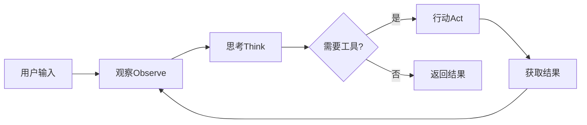

# 9.1 代理架构设计原理

## 概念讲解（文字+图示）

Agent（代理）是LangChain中实现**智能决策**的核心组件。与传统链不同，Agent能够根据输入**自主决定**执行路径，而非按固定流程执行。

### 什么是Agent

想象两种工作方式：

```
传统链：老板说一步，员工做一步（固定流程）
Agent：老板说目标，员工自己想办法（智能决策）
```

### Agent架构：观察-思考-行动循环



这个循环被称为**ReAct循环**（Reasoning + Acting），是Agent智能决策的基础。

### 框架屏蔽的复杂性

1. **消息历史管理**：自动记录和传递对话历史
2. **工具调用协议**：统一工具接口，模型自动选择
3. **循环控制**：自动判断何时停止，避免无限循环
4. **错误恢复**：工具失败时自动重试或调整策略

## 核心要点

**🔑 Agent核心组成：**

- **LLM**：大脑，负责推理和决策
- **工具列表**：手脚，定义Agent能做什么
- **系统提示**：行为准则，约束Agent行为

**🔑 创建Agent的关键参数：**

| 参数 | 用途 | 是否必需 |
|------|------|----------|
| model | LLM模型 | 是 |
| tools | 工具列表 | 否 |
| system_prompt | 系统提示 | 否 |
| middleware | 中间件（高级） | 否 |

## 简单示例

### 最简Agent

```python
from langchain.agents import create_agent
from langchain_openai import ChatOpenAI
from langchain_core.tools import tool

# 定义工具
@tool
def get_weather(city: str) -> str:
    """获取指定城市的天气信息"""
    return f"{city}今天晴天，25°C"

@tool
def calculator(expr: str) -> str:
    """执行数学计算"""
    return str(eval(expr))

# 创建Agent
model = ChatOpenAI(model="gpt-4o-mini")
agent = create_agent(
    model=model,
    tools=[get_weather, calculator],
    system_prompt="你是一个有用的助手。",
)

# 调用Agent
result = agent.invoke({
    "messages": [{"role": "user", "content": "北京今天天气如何？"}]
})
```

### Agent自动循环执行

```python
# Agent会自动完成以下流程：
# 1. 理解用户请求
# 2. 决定调用get_weather工具
# 3. 获取天气结果
# 4. 判断是否需要进一步操作
# 5. 返回最终结果

result = agent.invoke({
    "messages": [{
        "role": "user",
        "content": "北京今天天气？如果是华氏度帮我转成摄氏度。"
    }]
})
# Agent可能：先查天气 → 发现是华氏度 → 调用计算器转换 → 返回结果
```

## 进阶应用

### 带检查点的Agent（可中断恢复）

```python
from langgraph.checkpoint.memory import MemorySaver

# 添加检查点支持
checkpointer = MemorySaver()

agent = create_agent(
    model=model,
    tools=[get_weather, calculator],
    checkpointer=checkpointer,
    system_prompt="你是助手。",
)

# 使用配置调用（支持中断恢复）
config = {"configurable": {"thread_id": "session-1"}}
result = agent.invoke(
    {"messages": [{"role": "user", "content": "帮我查询天气"}]},
    config=config,
)
```

### 约束Agent行为

```python
# 通过工具定义和提示词约束Agent
agent = create_agent(
    model=model,
    tools=[get_weather],  # 只给天气工具
    system_prompt="""你是天气助手。
只使用get_weather工具回答天气问题。
对于非天气问题，礼貌拒绝。""",
)
```

## 常见问题

### Q: Agent和Chain有什么区别？
A: Chain执行流程固定，Agent动态决定执行路径。Agent更灵活但更复杂。

### Q: Agent一定会调用工具吗？
A: 不一定。如果模型判断直接回答即可，可能不调用工具。

### Q: 如何防止Agent滥用工具？
A: 通过工具定义（最小权限）和系统提示（明确规则）来约束。

## 本节总结

- Agent通过LLM推理自主决定执行路径
- 核心循环：观察→思考→行动（ReAct循环）
- `create_agent`是推荐的Agent创建方式
- 通过工具和提示词约束Agent行为
- 检查点支持中断和恢复