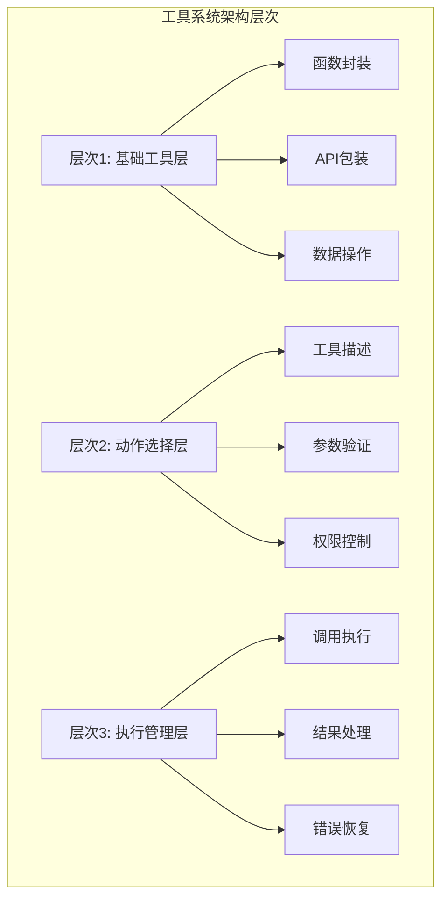

# 9.1.2 工具使用与动作空间

## 概念讲解

工具使用与动作空间是代理系统的核心能力，它定义了代理如何与现实世界交互并执行具体操作。在LangChain v1.2.22中，工具系统已经从简单的函数调用演进为复杂的动作选择框架。

### 设计哲学演进

工具系统的设计遵循着"能力扩展"和"安全约束"的双重哲学：

1. **能力扩展**：通过工具扩展LLM的能力边界，使其能够执行编程任务
2. **安全约束**：通过动作空间限制代理的操作范围，确保可控性
3. **语义对齐**：工具接口设计与自然语言语义保持一致，降低学习成本
4. **组合灵活**：支持工具的自由组合，实现复杂功能

### 架构设计层次

LangChain v1.2.22的工具系统包含三个层次的设计：



## 核心要点

### 1. 工具类型体系

| 工具类型 | 核心功能 | 适用场景 | 示例 |
|---------|---------|---------|------|
| **查询工具** | 信息检索与查询 | 数据查找、状态检查 | 搜索引擎、数据库查询 |
| **计算工具** | 数值计算与处理 | 统计分析、逻辑计算 | 计算器、数学函数库 |
| **转换工具** | 数据格式转换 | 数据预处理、格式标准化 | JSON解析器、编码转换 |
| **操作工具** | 系统状态改变 | 文件操作、配置修改 | 文件读写、API调用 |
| **组合工具** | 多工具协同 | 复杂工作流 | 工作流引擎、任务编排 |

### 2. 动作空间设计原则

- **最小权限**：每个工具只拥有完成其功能所需的最小权限
- **边界明确**：明确定义每个工具的输入输出边界
- **失败安全**：工具执行失败时应保持系统状态一致性
- **可观测性**：工具执行过程和结果应可监控和调试

### 3. 工具注册与发现机制

LangChain v1.2.22提供了多种工具注册方式：

1. **静态注册**：在代理初始化时显式注册工具列表
2. **动态注册**：运行时根据上下文动态添加工具
3. **按需加载**：延迟加载工具以减少资源占用
4. **权限过滤**：根据用户权限动态过滤可用工具

### 4. 参数验证与错误处理

- **强类型验证**：使用Pydantic模型验证工具参数
- **输入清理**：自动清理和标准化输入数据
- **错误分类**：区分可恢复错误和不可恢复错误
- **重试策略**：为临时性错误提供自动重试机制

## 简单示例

### 示例1：基础工具定义与使用

```python
from typing import Dict, Any, Optional, List
from langchain.tools import tool, Tool
from langchain_core.tools import BaseTool
from langchain_core.callbacks import CallbackManagerForToolRun
from pydantic import BaseModel, Field
import json
import datetime
import requests

# 方法1：使用@tool装饰器创建工具
@tool
def search_products(query: str) -> str:
    """
    搜索产品信息
    
    参数：
    query: 搜索查询词
    
    返回：
    str: 产品信息JSON字符串
    """
    # 模拟产品搜索
    products = [
        {"id": "WH-1000XM5", "name": "Sony WH-1000XM5", "price": 299.99, "stock": 10},
        {"id": "QC45", "name": "Bose QuietComfort 45", "price": 329.99, "stock": 5},
        {"id": "PXC550", "name": "Sennheiser PXC 550-II", "price": 349.99, "stock": 8}
    ]
    
    # 简单过滤
    filtered = [p for p in products if query.lower() in p["name"].lower()]
    return json.dumps(filtered, indent=2)

# 方法2：继承BaseTool创建复杂工具
class CheckInventoryTool(BaseTool):
    """检查库存工具"""
    
    name: str = "check_inventory"
    description: str = "检查产品库存数量"
    
    class InputSchema(BaseModel):
        """输入模式定义"""
        product_id: str = Field(..., description="产品ID")
        warehouse: Optional[str] = Field("default", description="仓库名称")
    
    args_schema: type[BaseModel] = InputSchema
    
    def _run(
        self,
        product_id: str,
        warehouse: str = "default",
        run_manager: Optional[CallbackManagerForToolRun] = None
    ) -> str:
        """执行工具逻辑"""
        # 模拟库存检查
        inventory_data = {
            "WH-1000XM5": {"default": 10, "warehouse_west": 5},
            "QC45": {"default": 5, "warehouse_east": 3},
            "PXC550": {"default": 8, "warehouse_central": 4}
        }
        
        try:
            stock = inventory_data.get(product_id, {}).get(warehouse, 0)
            return json.dumps({
                "product_id": product_id,
                "warehouse": warehouse,
                "stock": stock,
                "checked_at": datetime.datetime.now().isoformat(),
                "status": "in_stock" if stock > 0 else "out_of_stock"
            })
        except Exception as e:
            return json.dumps({
                "error": str(e),
                "product_id": product_id,
                "status": "error"
            })
    
    async def _arun(
        self,
        product_id: str,
        warehouse: str = "default",
        run_manager: Optional[CallbackManagerForToolRun] = None
    ) -> str:
        """异步执行"""
        # 简单实现：调用同步方法
        return self._run(product_id, warehouse, run_manager)

# 方法3：使用Tool.from_function创建工具
def calculate_shipping_cost(
    product_id: str,
    destination: str,
    expedited: bool = False
) -> str:
    """
    计算运费
    
    参数：
    product_id: 产品ID
    destination: 目的地
    expedited: 是否加急
    
    返回：
    str: 运费信息
    """
    # 模拟运费计算
    base_costs = {
        "US": {"standard": 5.99, "expedited": 12.99},
        "EU": {"standard": 8.99, "expedited": 18.99},
        "ASIA": {"standard": 10.99, "expedited": 22.99}
    }
    
    region = destination.upper() if destination.upper() in base_costs else "US"
    service = "expedited" if expedited else "standard"
    cost = base_costs[region][service]
    
    return json.dumps({
        "product_id": product_id,
        "destination": destination,
        "service": service,
        "cost": cost,
        "currency": "USD",
        "estimated_days": 3 if expedited else 7
    })

shipping_tool = Tool.from_function(
    func=calculate_shipping_cost,
    name="calculate_shipping",
    description="计算产品运费",
    args_schema=None  # 可选：可以提供Pydantic模型
)

# 创建工具集
tools = [
    search_products,
    CheckInventoryTool(),
    shipping_tool
]

# 使用工具
print("=== 测试工具 ===")

# 测试搜索工具
search_result = search_products.invoke({"query": "Sony"})
print(f"搜索结果: {search_result[:100]}...")

# 测试库存工具
inventory_tool = CheckInventoryTool()
inventory_result = inventory_tool.invoke({"product_id": "WH-1000XM5", "warehouse": "default"})
print(f"库存检查: {inventory_result}")

# 测试运费工具
shipping_result = shipping_tool.invoke({
    "product_id": "WH-1000XM5",
    "destination": "US",
    "expedited": True
})
print(f"运费计算: {shipping_result}")
```

### 示例2：工具组合与动作空间管理

```python
from typing import Dict, Any, List, Optional
from enum import Enum
from langchain.tools import StructuredTool
from langchain_core.tools import BaseTool
from pydantic import BaseModel, Field, validator
import asyncio

class ToolCategory(Enum):
    """工具分类"""
    INFORMATION = "information"
    CALCULATION = "calculation"
    OPERATION = "operation"
    VALIDATION = "validation"

class ActionPermission(Enum):
    """动作权限级别"""
    PUBLIC = "public"
    USER = "user"
    ADMIN = "admin"
    SYSTEM = "system"

class ToolRegistry:
    """工具注册表：管理工具的动作空间"""
    
    def __init__(self):
        self._tools: Dict[str, BaseTool] = {}
        self._tool_categories: Dict[str, ToolCategory] = {}
        self._tool_permissions: Dict[str, ActionPermission] = {}
        self._tool_dependencies: Dict[str, List[str]] = {}
    
    def register_tool(
        self,
        tool: BaseTool,
        category: ToolCategory = ToolCategory.INFORMATION,
        permission: ActionPermission = ActionPermission.PUBLIC,
        dependencies: Optional[List[str]] = None
    ):
        """注册工具"""
        tool_name = tool.name
        
        if tool_name in self._tools:
            raise ValueError(f"工具 {tool_name} 已注册")
        
        self._tools[tool_name] = tool
        self._tool_categories[tool_name] = category
        self._tool_permissions[tool_name] = permission
        self._tool_dependencies[tool_name] = dependencies or []
        
        print(f"注册工具: {tool_name} ({category.value}, {permission.value})")
    
    def get_tools_for_user(
        self,
        user_permission: ActionPermission,
        required_categories: Optional[List[ToolCategory]] = None
    ) -> List[BaseTool]:
        """获取用户可用的工具"""
        available_tools = []
        
        for tool_name, tool in self._tools.items():
            # 检查权限
            tool_perm = self._tool_permissions[tool_name]
            if not self._check_permission(user_permission, tool_perm):
                continue
            
            # 检查分类
            if required_categories:
                tool_category = self._tool_categories[tool_name]
                if tool_category not in required_categories:
                    continue
            
            # 检查依赖
            dependencies = self._tool_dependencies[tool_name]
            if dependencies:
                # 确保所有依赖工具都可用
                if all(dep in self._tools for dep in dependencies):
                    available_tools.append(tool)
            else:
                available_tools.append(tool)
        
        return available_tools
    
    def _check_permission(
        self,
        user_permission: ActionPermission,
        tool_permission: ActionPermission
    ) -> bool:
        """检查权限"""
        # 权限级别顺序：SYSTEM > ADMIN > USER > PUBLIC
        permission_order = {
            ActionPermission.SYSTEM: 4,
            ActionPermission.ADMIN: 3,
            ActionPermission.USER: 2,
            ActionPermission.PUBLIC: 1
        }
        
        return permission_order[user_permission] >= permission_order[tool_permission]
    
    def execute_tool_chain(
        self,
        tool_chain: List[Dict[str, Any]],
        user_permission: ActionPermission
    ) -> List[Dict[str, Any]]:
        """执行工具链"""
        results = []
        
        for step in tool_chain:
            tool_name = step.get("tool")
            args = step.get("args", {})
            
            if tool_name not in self._tools:
                results.append({
                    "step": tool_name,
                    "success": False,
                    "error": f"工具不存在: {tool_name}"
                })
                continue
            
            # 检查权限
            tool = self._tools[tool_name]
            tool_perm = self._tool_permissions[tool_name]
            
            if not self._check_permission(user_permission, tool_perm):
                results.append({
                    "step": tool_name,
                    "success": False,
                    "error": f"权限不足: {tool_name} 需要 {tool_perm.value} 权限"
                })
                continue
            
            try:
                # 执行工具
                result = tool.invoke(args)
                results.append({
                    "step": tool_name,
                    "success": True,
                    "result": result,
                    "args": args
                })
            except Exception as e:
                results.append({
                    "step": tool_name,
                    "success": False,
                    "error": str(e),
                    "args": args
                })
        
        return results

# 创建各种工具
class ProductSearchInput(BaseModel):
    """产品搜索输入"""
    query: str = Field(..., description="搜索查询词")
    limit: int = Field(10, description="结果数量限制")

def search_products_tool(query: str, limit: int = 10) -> str:
    """产品搜索工具"""
    # 模拟实现
    return f"搜索 '{query}' 找到 {limit} 个结果"

search_tool = StructuredTool.from_function(
    func=search_products_tool,
    name="product_search",
    description="搜索产品信息",
    args_schema=ProductSearchInput
)

class PriceCalculationInput(BaseModel):
    """价格计算输入"""
    product_id: str = Field(..., description="产品ID")
    quantity: int = Field(1, ge=1, description="数量")
    discount_code: Optional[str] = Field(None, description="折扣码")
    
    @validator('quantity')
    def validate_quantity(cls, v):
        if v > 100:
            raise ValueError('数量不能超过100')
        return v

def calculate_price_tool(
    product_id: str,
    quantity: int = 1,
    discount_code: Optional[str] = None
) -> str:
    """价格计算工具"""
    # 模拟价格计算
    base_price = 299.99
    discount = 0.1 if discount_code == "SAVE10" else 0.0
    total = base_price * quantity * (1 - discount)
    
    return json.dumps({
        "product_id": product_id,
        "quantity": quantity,
        "unit_price": base_price,
        "discount": discount * 100,
        "total": total,
        "currency": "USD"
    })

price_tool = StructuredTool.from_function(
    func=calculate_price_tool,
    name="calculate_price",
    description="计算产品价格",
    args_schema=PriceCalculationInput
)

class OrderCreationInput(BaseModel):
    """订单创建输入"""
    product_id: str = Field(..., description="产品ID")
    quantity: int = Field(1, description="数量")
    shipping_address: str = Field(..., description="收货地址")
    customer_email: str = Field(..., description="客户邮箱")

def create_order_tool(
    product_id: str,
    quantity: int,
    shipping_address: str,
    customer_email: str
) -> str:
    """订单创建工具（需要管理员权限）"""
    # 模拟订单创建
    order_id = f"ORD-{datetime.datetime.now().strftime('%Y%m%d-%H%M%S')}"
    
    return json.dumps({
        "order_id": order_id,
        "product_id": product_id,
        "quantity": quantity,
        "shipping_address": shipping_address,
        "customer_email": customer_email,
        "status": "created",
        "created_at": datetime.datetime.now().isoformat()
    })

order_tool = StructuredTool.from_function(
    func=create_order_tool,
    name="create_order",
    description="创建新订单",
    args_schema=OrderCreationInput
)

# 创建工具注册表
registry = ToolRegistry()

# 注册工具（不同权限级别）
registry.register_tool(
    search_tool,
    category=ToolCategory.INFORMATION,
    permission=ActionPermission.PUBLIC
)

registry.register_tool(
    price_tool,
    category=ToolCategory.CALCULATION,
    permission=ActionPermission.USER
)

registry.register_tool(
    order_tool,
    category=ToolCategory.OPERATION,
    permission=ActionPermission.ADMIN,
    dependencies=["product_search", "calculate_price"]  # 创建订单需要先搜索和计算价格
)

# 测试不同用户的工具可用性
print("\n=== 不同用户的工具可用性 ===")

# 公共用户
public_tools = registry.get_tools_for_user(ActionPermission.PUBLIC)
print(f"公共用户可用工具: {[t.name for t in public_tools]}")

# 普通用户
user_tools = registry.get_tools_for_user(ActionPermission.USER)
print(f"普通用户可用工具: {[t.name for t in user_tools]}")

# 管理员用户
admin_tools = registry.get_tools_for_user(ActionPermission.ADMIN)
print(f"管理员可用工具: {[t.name for t in admin_tools]}")

# 测试工具链执行
print("\n=== 测试工具链执行 ===")

# 定义工具链（用户购物流程）
tool_chain = [
    {
        "tool": "product_search",
        "args": {"query": "wireless headphones", "limit": 3}
    },
    {
        "tool": "calculate_price",
        "args": {"product_id": "WH-1000XM5", "quantity": 2, "discount_code": "SAVE10"}
    },
    # 只有管理员可以执行这个步骤
    # {
    #     "tool": "create_order",
    #     "args": {
    #         "product_id": "WH-1000XM5",
    #         "quantity": 2,
    #         "shipping_address": "123 Main St",
    #         "customer_email": "customer@example.com"
    #     }
    # }
]

# 普通用户执行工具链（只能执行前两步）
user_results = registry.execute_tool_chain(
    tool_chain[:2],  # 只执行前两步
    ActionPermission.USER
)

print("普通用户执行结果:")
for result in user_results:
    print(f"  {result['step']}: {result['success']}")

# 管理员执行完整工具链
admin_results = registry.execute_tool_chain(
    tool_chain,
    ActionPermission.ADMIN
)

print("\n管理员执行结果:")
for result in admin_results:
    print(f"  {result['step']}: {result['success']}")
```

### 示例3：动态动作空间与上下文感知工具

```python
from typing import Dict, Any, List, Optional, Callable
from contextlib import contextmanager
from dataclasses import dataclass, field
from datetime import datetime, timedelta
import hashlib
import json

@dataclass
class ToolContext:
    """工具执行上下文"""
    user_id: str
    session_id: str
    request_id: str
    timestamp: datetime = field(default_factory=datetime.now)
    metadata: Dict[str, Any] = field(default_factory=dict)

@dataclass
class ToolExecutionResult:
    """工具执行结果"""
    success: bool
    output: Any
    execution_time: float
    tool_name: str
    context: ToolContext
    error: Optional[str] = None
    warnings: List[str] = field(default_factory=list)

class DynamicActionSpace:
    """
    动态动作空间：根据上下文动态调整可用工具
    支持工具缓存、限流、上下文感知等功能
    """
    
    def __init__(self):
        self._tools: Dict[str, BaseTool] = {}
        self._tool_configs: Dict[str, Dict[str, Any]] = {}
        self._execution_history: List[ToolExecutionResult] = []
        self._rate_limits: Dict[str, Dict[str, Any]] = {}
        
        # 上下文缓存
        self._context_cache: Dict[str, Any] = {}
        self._cache_ttl = timedelta(minutes=5)
    
    def register_tool(
        self,
        tool: BaseTool,
        rate_limit: Optional[Dict[str, Any]] = None,
        cache_enabled: bool = True,
        context_aware: bool = False
    ):
        """注册工具并配置行为"""
        tool_name = tool.name
        
        self._tools[tool_name] = tool
        self._tool_configs[tool_name] = {
            "cache_enabled": cache_enabled,
            "context_aware": context_aware,
            "rate_limit": rate_limit or {}
        }
        
        if rate_limit:
            self._rate_limits[tool_name] = {
                "limit": rate_limit.get("limit", 100),
                "window": rate_limit.get("window", 60),  # 秒
                "count": 0,
                "window_start": datetime.now()
            }
    
    def _check_rate_limit(self, tool_name: str, context: ToolContext) -> bool:
        """检查速率限制"""
        if tool_name not in self._rate_limits:
            return True
        
        limit_info = self._rate_limits[tool_name]
        now = datetime.now()
        
        # 检查时间窗口
        window_start = limit_info["window_start"]
        window_seconds = limit_info["window"]
        
        if (now - window_start).total_seconds() > window_seconds:
            # 重置窗口
            limit_info["count"] = 0
            limit_info["window_start"] = now
        
        # 检查计数
        if limit_info["count"] >= limit_info["limit"]:
            return False
        
        limit_info["count"] += 1
        return True
    
    def _get_cache_key(self, tool_name: str, args: Dict[str, Any], context: ToolContext) -> str:
        """生成缓存键"""
        # 组合工具名、参数和上下文
        cache_data = {
            "tool": tool_name,
            "args": args,
            "context": {
                "user_id": context.user_id,
                "session_id": context.session_id,
                "request_id": context.request_id
            }
        }
        
        cache_json = json.dumps(cache_data, sort_keys=True)
        return hashlib.md5(cache_json.encode()).hexdigest()
    
    def _check_cache(
        self,
        tool_name: str,
        args: Dict[str, Any],
        context: ToolContext
    ) -> Optional[Any]:
        """检查缓存"""
        config = self._tool_configs.get(tool_name, {})
        if not config.get("cache_enabled", True):
            return None
        
        cache_key = self._get_cache_key(tool_name, args, context)
        
        if cache_key in self._context_cache:
            cache_entry = self._context_cache[cache_key]
            cache_time = cache_entry.get("timestamp")
            
            # 检查TTL
            if datetime.now() - cache_time < self._cache_ttl:
                return cache_entry["result"]
        
        return None
    
    def _update_cache(
        self,
        tool_name: str,
        args: Dict[str, Any],
        context: ToolContext,
        result: Any
    ):
        """更新缓存"""
        config = self._tool_configs.get(tool_name, {})
        if not config.get("cache_enabled", True):
            return
        
        cache_key = self._get_cache_key(tool_name, args, context)
        self._context_cache[cache_key] = {
            "result": result,
            "timestamp": datetime.now(),
            "tool": tool_name,
            "context": context
        }
        
        # 简单的缓存清理（限制大小）
        max_cache_size = 1000
        if len(self._context_cache) > max_cache_size:
            # 移除最早的缓存项
            oldest_key = min(self._context_cache.keys(), 
                           key=lambda k: self._context_cache[k]["timestamp"])
            del self._context_cache[oldest_key]
    
    def execute_tool(
        self,
        tool_name: str,
        args: Dict[str, Any],
        context: ToolContext
    ) -> ToolExecutionResult:
        """执行工具（带动态动作空间管理）"""
        import time
        
        start_time = time.time()
        
        # 检查工具是否存在
        if tool_name not in self._tools:
            return ToolExecutionResult(
                success=False,
                output=None,
                execution_time=time.time() - start_time,
                tool_name=tool_name,
                context=context,
                error=f"工具不存在: {tool_name}"
            )
        
        # 检查速率限制
        if not self._check_rate_limit(tool_name, context):
            return ToolExecutionResult(
                success=False,
                output=None,
                execution_time=time.time() - start_time,
                tool_name=tool_name,
                context=context,
                error=f"速率限制: {tool_name} 超出限制"
            )
        
        # 检查缓存
        cached_result = self._check_cache(tool_name, args, context)
        if cached_result is not None:
            return ToolExecutionResult(
                success=True,
                output=cached_result,
                execution_time=time.time() - start_time,
                tool_name=tool_name,
                context=context,
                warnings=["结果来自缓存"]
            )
        
        # 获取工具
        tool = self._tools[tool_name]
        config = self._tool_configs[tool_name]
        
        try:
            # 根据配置调整行为
            if config.get("context_aware", False):
                # 上下文感知的工具可能需要调整参数
                args = self._adapt_args_for_context(args, context)
            
            # 执行工具
            result = tool.invoke(args)
            execution_time = time.time() - start_time
            
            # 更新缓存
            self._update_cache(tool_name, args, context, result)
            
            # 记录执行历史
            exec_result = ToolExecutionResult(
                success=True,
                output=result,
                execution_time=execution_time,
                tool_name=tool_name,
                context=context
            )
            self._execution_history.append(exec_result)
            
            return exec_result
            
        except Exception as e:
            execution_time = time.time() - start_time
            return ToolExecutionResult(
                success=False,
                output=None,
                execution_time=execution_time,
                tool_name=tool_name,
                context=context,
                error=str(e)
            )
    
    def _adapt_args_for_context(
        self,
        args: Dict[str, Any],
        context: ToolContext
    ) -> Dict[str, Any]:
        """根据上下文调整参数"""
        # 在实际应用中，这里可以根据用户上下文调整工具参数
        adapted_args = args.copy()
        
        # 示例：根据用户ID添加个性化参数
        if context.user_id:
            adapted_args["user_context"] = {
                "user_id": context.user_id,
                "timestamp": context.timestamp.isoformat()
            }
        
        # 示例：根据会话ID添加跟踪信息
        if context.session_id:
            adapted_args["tracking"] = {
                "session_id": context.session_id,
                "request_id": context.request_id
            }
        
        return adapted_args
    
    def get_available_tools(
        self,
        context: ToolContext,
        filter_criteria: Optional[Dict[str, Any]] = None
    ) -> List[Dict[str, Any]]:
        """获取当前上下文可用的工具"""
        available_tools = []
        
        for tool_name, tool in self._tools.items():
            config = self._tool_configs[tool_name]
            
            # 检查速率限制（是否可用）
            if not self._check_rate_limit(tool_name, context):
                continue
            
            # 应用过滤条件
            if filter_criteria:
                # 在实际应用中，这里可以根据工具属性进行过滤
                pass
            
            tool_info = {
                "name": tool_name,
                "description": tool.description,
                "config": config,
                "rate_limit_status": self._rate_limits.get(tool_name, {})
            }
            available_tools.append(tool_info)
        
        return available_tools
    
    def get_execution_stats(self) -> Dict[str, Any]:
        """获取执行统计"""
        if not self._execution_history:
            return {"total_executions": 0}
        
        successful = sum(1 for r in self._execution_history if r.success)
        failed = len(self._execution_history) - successful
        
        avg_time = sum(r.execution_time for r in self._execution_history) / len(self._execution_history)
        
        return {
            "total_executions": len(self._execution_history),
            "successful": successful,
            "failed": failed,
            "success_rate": successful / len(self._execution_history) if self._execution_history else 0,
            "avg_execution_time": avg_time,
            "cache_size": len(self._context_cache)
        }

# 创建动态动作空间
action_space = DynamicActionSpace()

# 注册工具（带不同配置）
# 工具1：频繁使用的搜索工具（带缓存和速率限制）
action_space.register_tool(
    search_tool,
    rate_limit={"limit": 10, "window": 60},  # 每分钟10次
    cache_enabled=True,
    context_aware=False
)

# 工具2：计算工具（带上下文感知）
action_space.register_tool(
    price_tool,
    rate_limit={"limit": 50, "window": 60},  # 每分钟50次
    cache_enabled=True,
    context_aware=True
)

# 工具3：管理工具（严格限制）
action_space.register_tool(
    order_tool,
    rate_limit={"limit": 5, "window": 300},  # 每5分钟5次
    cache_enabled=False,  # 订单创建不缓存
    context_aware=True
)

# 测试动态动作空间
print("=== 测试动态动作空间 ===")

# 创建上下文
context1 = ToolContext(
    user_id="user123",
    session_id="session456",
    request_id="req789"
)

# 获取可用工具
available_tools = action_space.get_available_tools(context1)
print(f"可用工具数量: {len(available_tools)}")
for tool_info in available_tools:
    print(f"  - {tool_info['name']}: {tool_info['description'][:50]}...")

# 执行工具
print("\n=== 执行工具测试 ===")

# 执行搜索工具
result1 = action_space.execute_tool(
    "product_search",
    {"query": "headphones", "limit": 5},
    context1
)
print(f"搜索执行: {result1.success}, 时间: {result1.execution_time:.3f}s")

# 再次执行相同搜索（应该命中缓存）
result2 = action_space.execute_tool(
    "product_search",
    {"query": "headphones", "limit": 5},
    context1
)
print(f"缓存搜索: {result2.success}, 时间: {result2.execution_time:.3f}s, 警告: {result2.warnings}")

# 测试速率限制
print("\n=== 测试速率限制 ===")
for i in range(15):  # 尝试执行15次，但限制是每分钟10次
    result = action_space.execute_tool(
        "product_search",
        {"query": f"test{i}", "limit": 1},
        context1
    )
    if not result.success and "速率限制" in result.error:
        print(f"第{i+1}次执行被限制: {result.error}")
        break

# 获取统计信息
stats = action_space.get_execution_stats()
print(f"\n执行统计: {stats}")

# 测试不同用户的上下文
print("\n=== 测试不同用户上下文 ===")
context2 = ToolContext(
    user_id="admin001",
    session_id="admin_session",
    request_id="admin_req"
)

# 管理员执行管理工具
admin_result = action_space.execute_tool(
    "create_order",
    {
        "product_id": "WH-1000XM5",
        "quantity": 1,
        "shipping_address": "Admin Address",
        "customer_email": "admin@example.com"
    },
    context2
)
print(f"管理员订单创建: {admin_result.success}")
```

## 进阶应用

### 应用1：企业级工具编排系统

在企业级应用中，工具使用需要更复杂的编排和管理：

```python
from typing import Dict, Any, List, Optional, Set
from abc import ABC, abstractmethod
from datetime import datetime
import networkx as nx
from collections import defaultdict

class ToolOrchestrator(ABC):
    """工具编排器抽象基类"""
    
    @abstractmethod
    def plan_execution(self, goal: str, context: Dict[str, Any]) -> List[Dict[str, Any]]:
        """规划工具执行序列"""
        pass
    
    @abstractmethod
    def execute_plan(self, plan: List[Dict[str, Any]]) -> List[Dict[str, Any]]:
        """执行规划"""
        pass

class GraphBasedToolOrchestrator(ToolOrchestrator):
    """
    基于图的工具编排器
    使用图论算法优化工具执行顺序
    """
    
    def __init__(self, tool_registry: ToolRegistry):
        self.tool_registry = tool_registry
        self.dependency_graph = nx.DiGraph()
        self._build_dependency_graph()
    
    def _build_dependency_graph(self):
        """构建工具依赖图"""
        # 添加节点（工具）
        for tool_name in self.tool_registry._tools:
            self.dependency_graph.add_node(tool_name)
        
        # 添加边（依赖关系）
        for tool_name, deps in self.tool_registry._tool_dependencies.items():
            for dep in deps:
                if dep in self.tool_registry._tools:
                    self.dependency_graph.add_edge(dep, tool_name)
    
    def plan_execution(self, goal: str, context: Dict[str, Any]) -> List[Dict[str, Any]]:
        """基于目标规划工具执行序列"""
        # 1. 分析目标，确定需要的工具
        required_tools = self._analyze_goal(goal)
        
        # 2. 检查依赖关系，确定执行顺序
        execution_order = self._determine_execution_order(required_tools)
        
        # 3. 为每个工具生成参数
        tool_plan = []
        for tool_name in execution_order:
            tool_params = self._generate_tool_parameters(tool_name, goal, context)
            tool_plan.append({
                "tool": tool_name,
                "params": tool_params,
                "depends_on": list(self.dependency_graph.predecessors(tool_name))
            })
        
        return tool_plan
    
    def _analyze_goal(self, goal: str) -> Set[str]:
        """分析目标，确定需要的工具"""
        # 在实际应用中，这里可以使用LLM分析目标
        # 简化实现：基于关键词匹配
        
        goal_lower = goal.lower()
        required_tools = set()
        
        # 简单的关键词匹配
        if "search" in goal_lower or "find" in goal_lower:
            required_tools.add("product_search")
        
        if "price" in goal_lower or "cost" in goal_lower:
            required_tools.add("calculate_price")
        
        if "order" in goal_lower or "buy" in goal_lower:
            required_tools.add("create_order")
            required_tools.add("product_search")  # 订单需要先搜索
            required_tools.add("calculate_price")  # 订单需要计算价格
        
        return required_tools
    
    def _determine_execution_order(self, required_tools: Set[str]) -> List[str]:
        """根据依赖关系确定执行顺序"""
        if not required_tools:
            return []
        
        # 创建子图
        subgraph_nodes = set(required_tools)
        
        # 添加所有依赖节点
        for tool in list(required_tools):
            ancestors = nx.ancestors(self.dependency_graph, tool)
            subgraph_nodes.update(ancestors)
        
        # 创建子图并获取拓扑排序
        subgraph = self.dependency_graph.subgraph(subgraph_nodes)
        
        try:
            # 获取拓扑排序（依赖顺序）
            execution_order = list(nx.topological_sort(subgraph))
            
            # 只保留需要的工具
            execution_order = [t for t in execution_order if t in required_tools]
            
            return execution_order
            
        except nx.NetworkXUnfeasible:
            # 存在循环依赖
            print("警告：检测到循环依赖")
            return list(required_tools)
    
    def _generate_tool_parameters(
        self,
        tool_name: str,
        goal: str,
        context: Dict[str, Any]
    ) -> Dict[str, Any]:
        """为工具生成参数"""
        # 在实际应用中，这里可以使用LLM根据目标和上下文生成参数
        # 简化实现：返回默认参数
        
        default_params = {
            "product_search": {
                "query": goal.split()[0] if goal.split() else "product",
                "limit": 5
            },
            "calculate_price": {
                "product_id": "WH-1000XM5",
                "quantity": 1
            },
            "create_order": {
                "product_id": "WH-1000XM5",
                "quantity": 1,
                "shipping_address": context.get("shipping_address", "默认地址"),
                "customer_email": context.get("customer_email", "user@example.com")
            }
        }
        
        return default_params.get(tool_name, {})
    
    def execute_plan(
        self,
        plan: List[Dict[str, Any]],
        user_permission: ActionPermission = ActionPermission.USER
    ) -> List[Dict[str, Any]]:
        """执行规划"""
        results = []
        intermediate_results = {}
        
        for step in plan:
            tool_name = step["tool"]
            params = step["params"]
            
            # 检查依赖是否满足
            dependencies = step.get("depends_on", [])
            missing_deps = [d for d in dependencies if d not in intermediate_results]
            
            if missing_deps:
                results.append({
                    "step": tool_name,
                    "success": False,
                    "error": f"依赖未满足: {missing_deps}",
                    "skipped": True
                })
                continue
            
            # 执行工具
            tool = self.tool_registry._tools.get(tool_name)
            if not tool:
                results.append({
                    "step": tool_name,
                    "success": False,
                    "error": f"工具不存在: {tool_name}"
                })
                continue
            
            try:
                # 实际应用中，这里应该使用action_space执行工具
                result = tool.invoke(params)
                intermediate_results[tool_name] = result
                
                results.append({
                    "step": tool_name,
                    "success": True,
                    "result": result,
                    "params": params
                })
                
            except Exception as e:
                results.append({
                    "step": tool_name,
                    "success": False,
                    "error": str(e),
                    "params": params
                })
        
        return results

# 使用工具编排器
print("=== 企业级工具编排系统 ===")

# 创建编排器
orchestrator = GraphBasedToolOrchestrator(registry)

# 规划工具执行
goal = "搜索无线耳机并创建订单"
context = {
    "shipping_address": "北京市朝阳区",
    "customer_email": "customer@example.com"
}

plan = orchestrator.plan_execution(goal, context)
print(f"目标: {goal}")
print(f"执行计划: {[step['tool'] for step in plan]}")

# 执行计划（管理员权限）
results = orchestrator.execute_plan(plan, ActionPermission.ADMIN)

print("\n执行结果:")
for result in results:
    status = "成功" if result["success"] else f"失败: {result.get('error', '未知错误')}"
    print(f"  {result['step']}: {status}")
```

## 常见问题

### Q1：如何设计工具的参数验证机制？

**A：** 参数验证的推荐设计：

1. **使用Pydantic模型**：
```python
from pydantic import BaseModel, Field, validator
from typing import Optional

class SearchParameters(BaseModel):
    query: str = Field(..., min_length=1, max_length=100)
    limit: int = Field(10, ge=1, le=100)
    filters: Optional[Dict[str, Any]] = Field(None)
    
    @validator('query')
    def validate_query(cls, v):
        # 自定义验证逻辑
        if any(char in v for char in ['<', '>', 'script']):
            raise ValueError('查询包含非法字符')
        return v.strip()
```

2. **多层验证策略**：
```python
class ValidatedTool:
    def invoke(self, input_data: Dict[str, Any]) -> Any:
        # 第一层：模式验证
        validated = self.input_schema.parse_obj(input_data)
        
        # 第二层：业务逻辑验证
        self._validate_business_rules(validated)
        
        # 第三层：上下文验证
        self._validate_context(validated)
        
        return self._execute(validated)
```

### Q2：如何处理工具之间的依赖关系？

**A：** 依赖管理的策略：

1. **显式依赖声明**：
```python
class ToolWithDependencies(BaseTool):
    dependencies: List[str] = ["search_tool", "validate_tool"]
    
    def _run(self, input_data, run_manager=None):
        # 确保依赖工具已执行
        for dep in self.dependencies:
            if not self._check_dependency_executed(dep):
                raise DependencyError(f"依赖工具 {dep} 未执行")
```

2. **依赖图拓扑排序**：
```python
def execute_tool_chain(tools: List[BaseTool]) -> List[Any]:
    # 构建依赖图
    graph = build_dependency_graph(tools)
    
    # 拓扑排序
    execution_order = topological_sort(graph)
    
    results = {}
    for tool_name in execution_order:
        # 收集依赖结果
        dep_results = {dep: results[dep] for dep in get_dependencies(tool_name)}
        results[tool_name] = execute_tool(tool_name, dep_results)
    
    return results
```

### Q3：如何实现工具的动态加载和热更新？

**A：** 动态加载的实现方法：

1. **插件式架构**：
```python
class ToolPluginManager:
    def __init__(self, plugin_dir: str):
        self.plugin_dir = plugin_dir
        self._plugins = {}
    
    def load_plugin(self, plugin_name: str):
        # 动态导入模块
        module = importlib.import_module(f"plugins.{plugin_name}")
        
        # 实例化工具
        tool_class = getattr(module, 'ToolClass')
        tool_instance = tool_class()
        
        # 注册工具
        self._plugins[plugin_name] = tool_instance
    
    def hot_update(self, plugin_name: str):
        # 重新加载模块
        importlib.reload(sys.modules[f"plugins.{plugin_name}"])
        
        # 更新工具实例
        self.load_plugin(plugin_name)
```

### Q4：如何监控和优化工具性能？

**A：** 性能监控方案：

1. **指标收集**：
```python
from prometheus_client import Counter, Histogram, start_http_server

TOOL_CALLS = Counter('tool_calls_total', 'Total tool calls', ['tool_name'])
TOOL_DURATION = Histogram('tool_duration_seconds', 'Tool execution duration', ['tool_name'])

class MonitoredTool(BaseTool):
    def _run(self, *args, **kwargs):
        # 记录调用
        TOOL_CALLS.labels(self.name).inc()
        
        # 测量执行时间
        with TOOL_DURATION.labels(self.name).time():
            return self._execute(*args, **kwargs)
```

2. **性能分析**：
```python
import cProfile
import pstats
from io import StringIO

def profile_tool(tool, input_data):
    profiler = cProfile.Profile()
    profiler.enable()
    
    result = tool.invoke(input_data)
    
    profiler.disable()
    
    # 分析结果
    stream = StringIO()
    stats = pstats.Stats(profiler, stream=stream)
    stats.sort_stats('cumulative')
    stats.print_stats(20)
    
    return result, stream.getvalue()
```

### Q5：如何设计安全的工具权限系统？

**A：** 权限系统设计：

1. **基于角色的访问控制**：
```python
from enum import Enum
from typing import Set

class Role(Enum):
    GUEST = "guest"
    USER = "user"
    ADMIN = "admin"
    SUPER_ADMIN = "super_admin"

class ToolPermissionManager:
    def __init__(self):
        self._role_permissions = {
            Role.GUEST: {"search", "view"},
            Role.USER: {"search", "view", "calculate", "save"},
            Role.ADMIN: {"search", "view", "calculate", "save", "modify", "delete"},
            Role.SUPER_ADMIN: {"*"}  # 所有权限
        }
    
    def can_execute(self, tool_name: str, user_role: Role) -> bool:
        tool_permissions = self._get_tool_permissions(tool_name)
        user_permissions = self._role_permissions[user_role]
        
        if "*" in user_permissions:
            return True
        
        return any(perm in user_permissions for perm in tool_permissions)
```

## 本节总结

工具使用与动作空间是代理系统的核心能力，它决定了代理能够完成的任务范围和执行效率。

### 关键要点回顾

1. **工具类型多样化**：根据功能需求设计不同类型的工具
2. **权限控制精细化**：基于角色和上下文动态控制工具访问
3. **依赖管理智能化**：使用图论算法优化工具执行顺序
4. **性能监控全面化**：从多个维度监控和优化工具性能

### 最佳实践

1. **设计清晰的工具接口**：保持工具API的简洁性和一致性
2. **实现多层验证机制**：确保工具输入的安全性和有效性
3. **建立完善的权限体系**：基于最小权限原则设计访问控制
4. **提供丰富的监控指标**：便于性能分析和问题排查

### 进阶方向

1. **工具自动化生成**：基于API文档自动生成工具代码
2. **智能工具推荐**：根据用户意图自动推荐合适的工具
3. **工具组合优化**：使用机器学习优化工具执行顺序
4. **跨平台工具适配**：支持多种平台和环境的工具适配

掌握工具使用与动作空间的设计，你将能够：
- 构建功能丰富且安全的代理系统
- 实现复杂的业务流程自动化
- 提供灵活可扩展的工具生态
- 确保系统的高性能和可靠性

工具系统不仅是技术实现，更是业务能力的体现。通过精心设计工具使用与动作空间，你的代理系统将能够胜任各种复杂的现实世界任务。