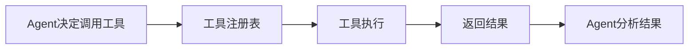

# 9.3 工具系统设计

## 概念讲解（文字+图示）

工具（Tool）是Agent与外部世界的**桥梁**。通过工具，Agent能够执行搜索、计算、API调用等操作。

### 什么是工具

工具的本质是**函数包装**：
```
普通函数 → 添加描述和类型信息 → 工具
```

模型通过阅读工具描述，理解何时调用、如何传参。

### 工具的工作机制



### 框架屏蔽的复杂性

1. **参数验证**：自动检查参数类型和必填项
2. **错误处理**：工具异常时统一格式化错误信息
3. **描述提取**：从docstring自动生成工具描述
4. **异步支持**：同步工具自动包装为异步调用

## 核心要点

**🔑 工具定义要素：**

- **函数签名**：参数类型和默认值
- **Docstring**：工具描述（模型依靠此理解用途）
- **返回类型**：必须是字符串（或可转为字符串）

**🔑 工具装饰器：**

| 方式 | 语法 | 适用场景 |
|------|------|----------|
| @tool装饰器 | `@tool def func():` | 最常用 |
| StructuredTool | `StructuredTool.from_function()` | 需要更多控制 |
| 直接函数 | `def func():` | 最简方式（自动包装） |

## 简单示例

### 最简工具定义

```python
from langchain_core.tools import tool

@tool
def add(a: int, b: int) -> int:
    """计算两个整数的和"""
    return a + b

# 工具属性
print(add.name)        # "add"
print(add.description) # "计算两个整数的和"
```

### 带复杂参数的工具

```python
@tool
def search_database(
    query: str,
    limit: int = 10,
    sort_by: str = "relevance"
) -> str:
    """搜索数据库并返回结果。
    
    Args:
        query: 搜索关键词
        limit: 返回结果数量限制，默认10
        sort_by: 排序方式，可选"relevance"或"date"
    """
    # 模拟搜索
    return f"找到与'{query}'相关的{limit}条结果"
```

### StructuredTool：更多控制

```python
from langchain_core.tools import StructuredTool
from pydantic import BaseModel, Field

class SearchInput(BaseModel):
    """搜索输入参数"""
    query: str = Field(description="搜索关键词")
    source: str = Field(description="搜索来源", default="web")

def search_impl(query: str, source: str) -> str:
    return f"在{source}中搜索'{query}'"

# 使用StructuredTool
search_tool = StructuredTool.from_function(
    func=search_impl,
    name="search",
    description="执行搜索操作",
    args_schema=SearchInput,
)
```

## 进阶应用

### 带状态的工具

```python
class DatabaseTool:
    """有状态的工具：维护数据库连接"""
    
    def __init__(self, connection_string: str):
        self.connection = connection_string
        self.connected = False
    
    def connect(self) -> str:
        """连接到数据库"""
        self.connected = True
        return f"已连接到 {self.connection}"
    
    def query(self, sql: str) -> str:
        """执行SQL查询"""
        if not self.connected:
            return "错误：未连接数据库"
        return f"执行SQL: {sql}"
    
    def close(self) -> str:
        """关闭数据库连接"""
        self.connected = False
        return "数据库连接已关闭"
    
    def as_tools(self):
        """将方法暴露为工具列表"""
        return [
            tool(self.connect),
            tool(self.query),
            tool(self.close),
        ]

# 创建并注册工具
db = DatabaseTool("postgresql://localhost/mydb")
tools = db.as_tools()
```

### 工具组合与编排

```python
@tool
def get_stock_price(symbol: str) -> str:
    """获取股票当前价格"""
    return "150.00"  # 模拟数据

@tool
def calculate_returns(investment: float, price: float) -> str:
    """计算投资回报率"""
    shares = investment / price
    return f"可购买 {shares:.2f} 股"

# 组合使用工具的分析Agent
finance_agent = create_agent(
    model=model,
    tools=[get_stock_price, calculate_returns],
    system_prompt="""你是金融助手。
1. 先查询股票价格
2. 根据用户预算计算可购买股数
3. 给出投资建议""",
)

result = finance_agent.invoke({
    "messages": [{"role": "user", "content": "我有5000元，想买AAPL股票，能买多少？"}]
})
```

### 工具错误处理

```python
@tool
def safe_api_call(url: str) -> str:
    """安全地调用外部API"""
    import requests
    try:
        response = requests.get(url, timeout=10)
        response.raise_for_status()
        return response.text[:500]  # 截取前500字符
    except requests.Timeout:
        return "错误：API调用超时"
    except requests.HTTPError as e:
        return f"错误：HTTP错误 {e.response.status_code}"
    except Exception as e:
        return f"错误：{str(e)}"
```

## 常见问题

### Q: 工具返回值必须是字符串吗？
A: 推荐返回字符串，Agent会将结果转为文本处理。

### Q: 如何给Agent提供大量工具？
A: 建议按场景分组，避免给Agent过多无关工具影响性能。

### Q: 工具描述很重要吗？
A: 非常重要！模型完全依赖描述理解工具用途，描述越清晰，调用越准确。

## 本节总结

- 工具是Agent与外部世界的桥梁
- 使用`@tool`装饰器最简便
- Docstring决定模型对工具的理解
- StructuredTool提供更多控制选项
- 好的工具描述 = 好的工具调用效果