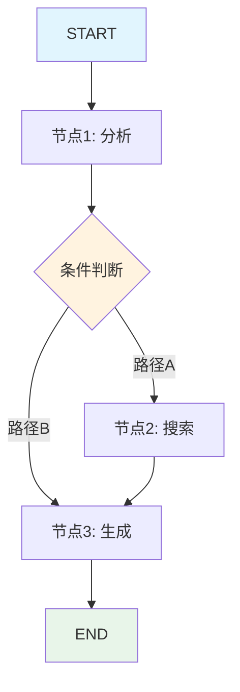

# 11.1 StateGraph核心概念

## 概念讲解

### 什么是StateGraph？

**StateGraph**是LangGraph的核心抽象，它用图结构来定义工作流。图中的节点（Node）代表处理步骤，边（Edge）代表步骤之间的流转关系，状态（State）是在整个图中传递的数据。



### 为什么需要StateGraph？

相比传统的链式执行，StateGraph提供了三个关键能力：

| 能力 | Chain | StateGraph |
|------|-------|------------|
| 条件分支 | 有限 | 完整支持 |
| 循环 | 不支持 | 原生支持 |
| 状态管理 | 需手动处理 | 自动维护 |

### 状态（State）的本质

在LangGraph中，状态是一个**不可变的、类型化的数据结构**，它包含工作流执行过程中的所有数据。关键特性：

1. **不可变性**：状态在节点间传递时不会被直接修改，每个节点返回的是状态更新
2. **类型安全**：使用Python的类型提示定义状态结构
3. **可序列化**：支持检查点、持久化和跨进程传递

## 核心要点

### 四步构建StateGraph

1. **State**：定义在图中传递的数据结构
2. **Node**：处理逻辑的函数
3. **Edge**：定义节点之间的流转
4. **compile**：将图编译为可执行的Runnable

### 状态定义：Annotated与Reducer

```python
from typing_extensions import Annotated, TypedDict
from typing import operator
from langchain_core.messages import AnyMessage

class ChatState(TypedDict):
    messages: Annotated[list[AnyMessage], operator.add]  # 追加模式
    current_step: str                                    # 覆盖模式
```

`Annotated`配合reducer定义状态字段的合并策略：
- `operator.add`：新值追加到旧值（适合消息列表）
- 默认：新值覆盖旧值

## 简单示例

### 最小StateGraph

```python
from typing import TypedDict
from langgraph.graph import StateGraph, START, END

# 1. 定义状态
class State(TypedDict):
    count: int

# 2. 创建图
graph = StateGraph(State)

# 3. 添加节点
def increment(state: State) -> State:
    return {"count": state["count"] + 1}

graph.add_node("add_one", increment)

# 4. 添加边
graph.add_edge(START, "add_one")
graph.add_edge("add_one", END)

# 5. 编译
app = graph.compile()

# 6. 执行
result = app.invoke({"count": 0})
# result = {"count": 1}
```

### 多节点线性流程

```python
class ChatState(TypedDict):
    messages: Annotated[list, operator.add]

graph = StateGraph(ChatState)

# 添加多个节点
graph.add_node("analyze", analyze_query)
graph.add_node("search", search_docs)
graph.add_node("generate", generate_response)

# 定义流转
graph.add_edge(START, "analyze")
graph.add_edge("analyze", "search")
graph.add_edge("search", "generate")
graph.add_edge("generate", END)

app = graph.compile()
```

## 进阶应用

### 可视化图结构

```python
# 生成图的可视化
app.get_graph().draw_mermaid()
# 输出Mermaid格式的图，可渲染为流程图
```

### 检查点：状态持久化

```python
from langgraph.checkpoint.memory import MemorySaver

checkpointer = MemorySaver()
app = graph.compile(checkpointer=checkpointer)

# 使用thread_id追踪会话
config = {"configurable": {"thread_id": "user-123"}}
result = app.invoke({"messages": ["hello"]}, config)

# 后续可以中断和恢复
```

## 常见问题

### Q: StateGraph和普通的函数调用有什么区别？

**A:** StateGraph提供了状态管理、循环、条件分支等图计算能力，适合复杂工作流。简单线性流程用函数即可。

### Q: 状态字段如何更新？

**A:** 节点函数返回一个字典，只包含需要更新的字段。使用`operator.add`的字段会追加，其他字段会覆盖。

## 本节总结

StateGraph是LangGraph的核心抽象，通过定义状态、节点和边来构建工作流。它支持条件分支、循环和状态持久化，是构建复杂AI应用的基础。

核心要点：
- 使用`TypedDict`定义状态结构
- `Annotated`配合reducer控制字段合并策略
- 四步流程：定义状态 → 添加节点 → 添加边 → 编译
- 检查点支持状态持久化和恢复