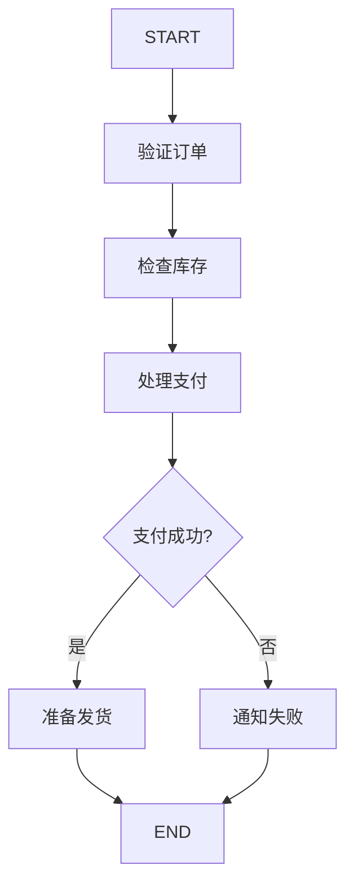

# 12.1 多步骤工作流设计

## 概念讲解

### 什么是多步骤工作流？

多步骤工作流是指将复杂业务过程拆分为多个有序执行的节点，每个节点完成一个原子任务。LangGraph通过图计算引擎提供了强大的工作流编排能力。



### 工作流核心要素

1. **任务节点**：独立的业务处理单元
2. **依赖关系**：节点之间的执行顺序
3. **状态传递**：节点间的数据共享
4. **错误处理**：异常情况的处理策略

## 核心要点

### 重试策略（RetryPolicy）

LangGraph内置了重试策略，可为节点配置自动重试：

```python
from langgraph.types import RetryPolicy
import sqlite3

# 为节点配置重试策略
builder.add_node(
    "query_database",
    query_database,
    retry_policy=RetryPolicy(
        retry_on=sqlite3.OperationalError,  # 特定错误类型
        max_attempts=3,                      # 最大重试次数
        initial_interval=1.0                 # 初始间隔（秒）
    )
)
```

常用重试场景：
- 数据库连接错误
- 网络请求失败
- API速率限制

### 并行执行

当多个节点没有依赖关系时，可以并行执行提升效率：

```python
# 从同一节点并行分支
builder.add_edge("start_node", "parallel_a")
builder.add_edge("start_node", "parallel_b")
builder.add_edge("start_node", "parallel_c")
# 所有并行节点完成后汇聚
builder.add_edge("parallel_a", "merge_node")
builder.add_edge("parallel_b", "merge_node")
builder.add_edge("parallel_c", "merge_node")
```

## 简单示例

### 订单处理工作流

```python
from typing import Literal, Annotated
from typing_extensions import TypedDict
import operator
from langgraph.graph import StateGraph, START, END
from langgraph.checkpoint.memory import MemorySaver

# 定义状态
class OrderState(TypedDict):
    order_id: str
    payment_status: Literal["pending", "paid", "failed"]
    processing_steps: Annotated[list, operator.add]
    errors: Annotated[list, operator.add]

# 节点函数
def validate_order(state: OrderState) -> dict:
    return {
        "processing_steps": ["订单验证"],
        "errors": [] if state.get("order_id") else ["订单ID为空"]
    }

def check_inventory(state: OrderState) -> dict:
    return {"processing_steps": ["库存检查"]}

def process_payment(state: OrderState) -> dict:
    # 模拟支付处理
    return {
        "processing_steps": ["支付处理"],
        "payment_status": "paid"
    }

def prepare_shipping(state: OrderState) -> dict:
    return {"processing_steps": ["发货准备"]}

# 路由函数
def route_after_payment(state: OrderState) -> Literal["shipping", "end"]:
    if state.get("payment_status") == "paid":
        return "shipping"
    return "end"

# 构建工作流
builder = StateGraph(OrderState)
builder.add_node("validate", validate_order)
builder.add_node("inventory", check_inventory)
builder.add_node("payment", process_payment)
builder.add_node("shipping", prepare_shipping)

builder.add_edge(START, "validate")
builder.add_edge("validate", "inventory")
builder.add_edge("inventory", "payment")
builder.add_conditional_edges("payment", route_after_payment, {
    "shipping": "shipping",
    "end": END
})
builder.add_edge("shipping", END)

# 编译
graph = builder.compile(checkpointer=MemorySaver())

# 执行
config = {"configurable": {"thread_id": "order-001"}}
result = graph.invoke({
    "order_id": "ORD123",
    "payment_status": "pending",
    "processing_steps": [],
    "errors": []
}, config)
```

## 进阶应用

### 带重试和错误处理的工作流

```python
from langgraph.types import RetryPolicy

# 为外部API调用节点配置重试
builder.add_node(
    "call_payment_api",
    call_payment_api,
    retry_policy=RetryPolicy(
        max_attempts=3,
        initial_interval=1.0
    )
)

# 错误处理节点
def handle_error(state: OrderState) -> dict:
    error_count = len(state.get("errors", []))
    if error_count > 0:
        return {"processing_steps": [f"错误处理: 共{error_count}个错误"]}
    return {}
```

### 动态分支工作流

```python
def dynamic_router(state: OrderState) -> Literal["express", "standard", "economy"]:
    """根据订单金额动态选择物流方式"""
    amount = state.get("amount", 0)
    if amount > 1000:
        return "express"      # 大额订单：快递
    elif amount > 100:
        return "standard"     # 中等订单：标准
    else:
        return "economy"      # 小额订单：经济
```

## 常见问题

### Q: 如何调试复杂工作流？

**A:** 使用以下方式：
1. `graph.get_graph().draw_mermaid()` 生成可视化图
2. `stream_mode="values"` 查看每个节点执行后的完整状态
3. `stream_mode="updates"` 查看每个节点的具体更新

### Q: 如何处理节点超时？

**A:** 在重试策略中配置超时参数，或在节点函数内部实现超时逻辑。

## 本节总结

多步骤工作流设计：
- 使用`add_node`和`add_edge`定义基本流程
- 使用`add_conditional_edges`实现条件分支
- 使用`RetryPolicy`为节点配置自动重试
- 通过并行节点提升执行效率