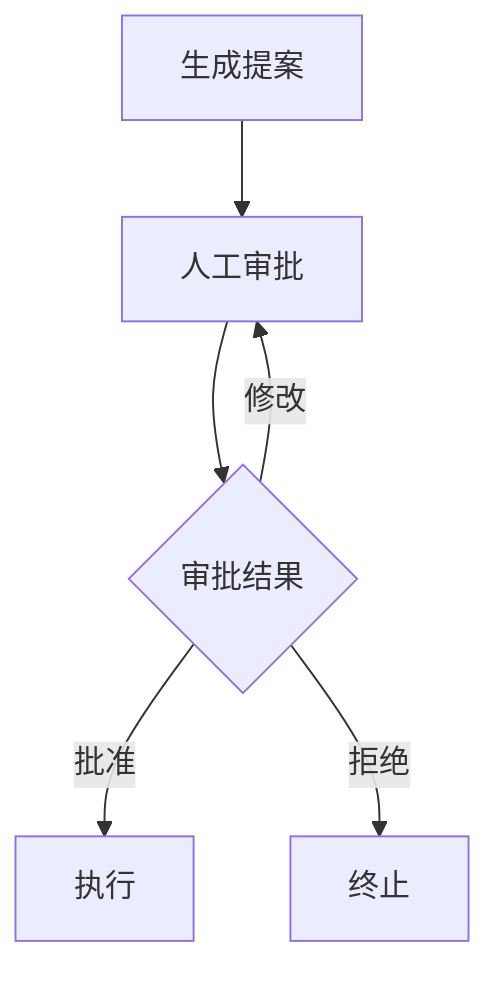

# 12.2 人工介入与审批流程

## 概念讲解

### 什么是人工介入（Human-in-the-Loop）？

人工介入是指在工作流的关键节点暂停自动执行，等待人类审批者做出决策后再继续。这在企业级应用中非常常见。



### 适用场景

| 场景 | 说明 |
|------|------|
| 高风险决策 | 涉及资金、法律等重大影响 |
| 合规要求 | 法规要求必须有人工审核 |
| 质量控制 | 确保输出质量符合标准 |
| 模糊边界 | AI无法明确判断的情况 |

## 核心要点

### interrupt()函数

`interrupt()`是LangGraph实现人工介入的核心API：

```python
from langgraph.types import interrupt

def human_approval(state: dict) -> dict:
    decision = interrupt({
        "title": "审批标题",
        "content": state["proposal_content"],
        "options": ["approve", "reject"]
    })
    return {"approval_status": decision}
```

### Command对象恢复

使用`Command(resume=...)`从暂停点恢复：

```python
from langgraph.types import Command

# 恢复工作流，携带人工决策
graph.stream(Command(resume="approve"), config)
```

## 简单示例

### 基础审批流程

```python
from typing_extensions import TypedDict
from langgraph.graph import StateGraph, START, END
from langgraph.checkpoint.memory import MemorySaver
from langgraph.types import interrupt, Command

# 定义审批状态
class ApprovalState(TypedDict):
    proposal_content: str
    approval_status: str
    approval_history: list

# 生成提案
def generate_proposal(state: ApprovalState) -> dict:
    return {
        "proposal_content": "增加营销预算20%用于Q3推广",
        "approval_history": ["提案已生成"]
    }

# 人工审批
def human_approval(state: ApprovalState) -> dict:
    decision = interrupt({
        "title": "营销预算审批",
        "proposal": state["proposal_content"],
        "options": ["approve", "reject", "modify"]
    })
    return {
        "approval_status": decision,
        "approval_history": [f"审批完成: {decision}"]
    }

# 执行结果
def execute_proposal(state: ApprovalState) -> dict:
    action = "执行预算增加" if state["approval_status"] == "approve" else "维持原预算"
    return {"approval_history": [f"执行: {action}"]}

# 构建工作流
builder = StateGraph(ApprovalState)
builder.add_node("generate", generate_proposal)
builder.add_node("approval", human_approval)
builder.add_node("execute", execute_proposal)

builder.add_edge(START, "generate")
builder.add_edge("generate", "approval")
builder.add_edge("approval", "execute")
builder.add_edge("execute", END)

graph = builder.compile(checkpointer=MemorySaver())

# 执行到审批节点
config = {"configurable": {"thread_id": "approval-001"}}
for event in graph.stream({
    "proposal_content": "",
    "approval_status": "pending",
    "approval_history": []
}, config):
    print(event)
    if "__interrupt__" in event:
        print("等待人工审批...")

# 模拟人工审批后恢复
human_decision = "approve"
for event in graph.stream(Command(resume=human_decision), config):
    print(event)
```

## 进阶应用

### 多级审批流程

```python
from typing import Literal

class MultiLevelState(TypedDict):
    proposal: str
    dept_approval: Literal["pending", "approved", "rejected"]
    finance_approval: Literal["pending", "approved", "rejected"]

def dept_approval(state: MultiLevelState) -> dict:
    decision = interrupt({"level": "部门经理", "proposal": state["proposal"]})
    return {"dept_approval": decision}

def finance_approval(state: MultiLevelState) -> dict:
    if state["dept_approval"] != "approved":
        return {"finance_approval": "rejected"}
    decision = interrupt({"level": "财务总监", "proposal": state["proposal"]})
    return {"finance_approval": decision}

def route_after_dept(state: MultiLevelState) -> Literal["finance", "end"]:
    return "finance" if state["dept_approval"] == "approved" else "end"

builder = StateGraph(MultiLevelState)
builder.add_node("dept", dept_approval)
builder.add_node("finance", finance_approval)

builder.add_edge(START, "dept")
builder.add_conditional_edges("dept", route_after_dept)
builder.add_edge("finance", END)
```

### 审批验证循环

```python
def validated_approval(state: ApprovalState) -> dict:
    """带验证的审批循环"""
    prompt = "请审批提案"
    
    while True:
        decision = interrupt({
            "prompt": prompt,
            "options": ["approve", "reject", "modify"]
        })
        
        if decision in ["approve", "reject"]:
            break
        else:
            prompt = "请重新审批（修改后再次审批）"
    
    return {"approval_status": decision}
```

## 常见问题

### Q: 审批超时如何处理？

**A:** 可以在外部系统中实现超时逻辑，例如使用定时任务检查中断状态并发送提醒，或通过`Command`自动恢复。

### Q: 如何确保审批安全？

**A:** 
1. 身份验证：确保审批者身份有效
2. 权限控制：基于角色的权限管理
3. 操作审计：完整记录审批日志

## 本节总结

人工介入与审批流程：
- `interrupt()`暂停工作流等待人工输入
- `Command(resume=...)`恢复执行并携带决策结果
- 支持单级、多级、条件审批等多种模式
- 结合检查点实现状态持久化和恢复