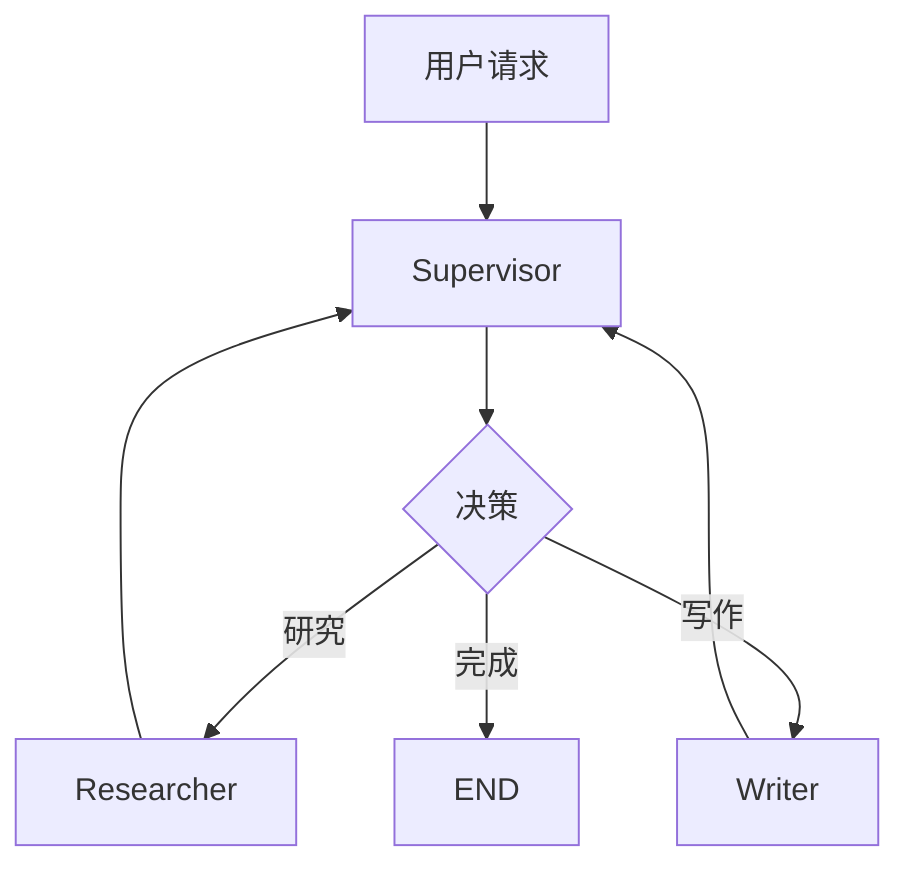

# 13.1 Supervisor多代理架构

## 概念讲解

### 什么是Supervisor模式？

Supervisor（监督者）模式是多代理协作中最常用的架构。一个专门的Supervisor Agent负责协调和分配任务给多个Worker Agents，最后汇总结果。



### 三种多代理架构对比

| 架构 | 特点 | 适用场景 |
|------|------|----------|
| Supervisor | 集中式控制，决策清晰 | 需要智能路由的任务 |
| 对等架构 | 分布式，灵活度高 | 任务间依赖复杂的场景 |
| 编排器-工作者 | 先规划再执行 | 可并行的大任务 |

## 核心要点

### LangGraph的Supervisor实现

LangGraph提供了两种方式实现Supervisor模式：
1. **基于条件边**：使用LLM决策路由到不同Worker
2. **基于handoffs**：使用`create_agent`的handoffs机制实现代理间交接

### handoffs机制

```python
from langgraph.prebuilt import create_agent

# 创建Worker代理
researcher = create_agent(
    model=model,
    tools=[search_tool],
    handoffs=["writer"],  # 可以转交给writer
    prompt="你是研究员..."
)

writer = create_agent(
    model=model,
    tools=[],
    prompt="你是写手..."
)
```

## 简单示例

### 基于条件边的Supervisor

```python
from typing import Literal
from typing_extensions import TypedDict
from langgraph.graph import StateGraph, START, END
from langgraph.prebuilt import create_agent
from langchain.chat_models import init_chat_model

class TeamState(TypedDict):
    messages: Annotated[list, operator.add]

model = init_chat_model("gpt-4o-mini")

# 创建Worker
researcher = create_agent(
    model=model,
    tools=[search_tool],
    system_prompt="你是研究员，负责搜索和分析信息。"
)

writer = create_agent(
    model=model,
    system_prompt="你是写手，负责根据信息撰写内容。"
)

# Supervisor决策
def supervisor_route(state: TeamState) -> Literal["researcher", "writer", END]:
    messages = state["messages"]
    # 使用LLM判断下一步
    response = supervisor_llm.invoke([
        SystemMessage(content="根据对话历史，下一步应该做什么？返回: researcher, writer, 或 FINISH"),
        *messages
    ])
    content = response.content.lower()
    if "researcher" in content:
        return "researcher"
    elif "writer" in content:
        return "writer"
    return END

# 构建图
graph = StateGraph(TeamState)
graph.add_node("researcher", researcher)
graph.add_node("writer", writer)
graph.add_node("supervisor", lambda s: {})  # 决策节点

graph.add_edge(START, "supervisor")
graph.add_conditional_edges("supervisor", supervisor_route)
graph.add_edge("researcher", "supervisor")
graph.add_edge("writer", "supervisor")

app = graph.compile()
```

## 进阶应用

### 使用Send API实现并行Worker调用

```python
from langgraph.types import Send

def supervisor_send(state: TeamState):
    """Supervisor同时派遣多个Worker并行执行"""
    sends = []
    for worker_name in ["researcher", "analyst", "writer"]:
        sends.append(Send(worker_name, {"messages": state["messages"]}))
    return sends

graph.add_conditional_edges("supervisor", supervisor_send, 
    ["researcher", "analyst", "writer"])
```

## 常见问题

### Q: Supervisor模式和Router有什么区别？

**A:** Router是简单的条件判断，Supervisor使用LLM进行更智能的决策，可以理解复杂上下文。

### Q: Worker之间能直接通信吗？

**A:** 推荐通过Supervisor中转，保持架构清晰。直接通信会增加复杂度。

## 本节总结

Supervisor模式通过一个决策者协调多个Worker Agent，实现了类似团队分工的协作模式。它是最直观、最容易理解的多代理架构。