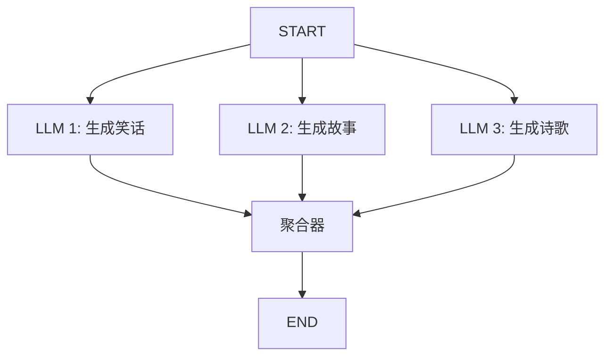

# 13.2 并行执行与任务分配

## 概念讲解

### 为什么需要并行执行？

在多代理系统中，许多任务是独立的，可以并行执行以提升效率。LangGraph通过`Send` API和Functional API的`@task`装饰器支持并行执行。



## 核心要点

### 两种并行方式

| 方式 | API | 特点 |
|------|-----|------|
| Send API | 条件边返回Send列表 | 适用于StateGraph |
| @task装饰器 | Functional API | 适用于函数式编程 |

### Send API并行

当条件边函数返回多个`Send`对象时，LangGraph会并行执行这些节点：

```python
from langgraph.types import Send

def send_to_workers(state: State):
    return [
        Send("worker_a", {"task": "a"}),
        Send("worker_b", {"task": "b"}),
        Send("worker_c", {"task": "c"})
    ]
```

## 简单示例

### 并行LLM调用（StateGraph）

```python
from typing import Annotated
import operator
from typing_extensions import TypedDict
from langgraph.graph import StateGraph, START, END
from langchain.chat_models import init_chat_model

class State(TypedDict):
    topic: str
    joke: str
    story: str
    poem: str
    combined_output: str

llm = init_chat_model("gpt-4o-mini")

def generate_joke(state: State):
    msg = llm.invoke(f"Write a joke about {state['topic']}")
    return {"joke": msg.content}

def generate_story(state: State):
    msg = llm.invoke(f"Write a story about {state['topic']}")
    return {"story": msg.content}

def generate_poem(state: State):
    msg = llm.invoke(f"Write a poem about {state['topic']}")
    return {"poem": msg.content}

def aggregate(state: State):
    combined = f"关于{state['topic']}的创作:\n"
    combined += f"故事:\n{state['story']}\n\n"
    combined += f"笑话:\n{state['joke']}\n\n"
    combined += f"诗歌:\n{state['poem']}"
    return {"combined_output": combined}

# 构建并行工作流
builder = StateGraph(State)
builder.add_node("joke", generate_joke)
builder.add_node("story", generate_story)
builder.add_node("poem", generate_poem)
builder.add_node("aggregate", aggregate)

# 并行边：三个节点同时执行
builder.add_edge(START, "joke")
builder.add_edge(START, "story")
builder.add_edge(START, "poem")
builder.add_edge("joke", "aggregate")
builder.add_edge("story", "aggregate")
builder.add_edge("poem", "aggregate")
builder.add_edge("aggregate", END)

app = builder.compile()
result = app.invoke({"topic": "编程"})
```

### 编排器-工作者模式

```python
from langgraph.types import Send

class ReportState(TypedDict):
    topic: str
    sections: list  # 规划出的章节
    completed_sections: Annotated[list, operator.add]
    final_report: str

def orchestrator(state: ReportState) -> dict:
    """规划阶段：将主题分解为章节"""
    plan = llm.invoke(f"为'{state['topic']}'生成报告章节列表")
    return {"sections": plan.sections}

def section_writer(state: ReportState) -> dict:
    """章节写作：只写入当前章节"""
    section = state.get("_current_section")
    content = llm.invoke(f"编写章节: {section}")
    return {"completed_sections": [content]}

def assign_sections(state: ReportState):
    """分配章节：并行发送给所有章节worker"""
    return [Send("section_writer", {"_current_section": s}) 
            for s in state["sections"]]

def synthesizer(state: ReportState) -> dict:
    """合成阶段：合并所有章节"""
    report = "\n\n".join(state["completed_sections"])
    return {"final_report": report}

builder = StateGraph(ReportState)
builder.add_node("orchestrator", orchestrator)
builder.add_node("section_writer", section_writer)
builder.add_node("synthesizer", synthesizer)

builder.add_edge(START, "orchestrator")
builder.add_conditional_edges("orchestrator", assign_sections, ["section_writer"])
builder.add_edge("section_writer", "synthesizer")
builder.add_edge("synthesizer", END)
```

## 进阶应用

### Functional API并行

```python
from langgraph.func import entrypoint, task

@task
def generate_paragraph(topic: str) -> str:
    response = llm.invoke([
        {"role": "user", "content": f"Write about {topic}."}
    ])
    return response.content

@entrypoint()
def workflow(topics: list[str]) -> str:
    # 并行执行多个任务
    futures = [generate_paragraph(topic) for topic in topics]
    paragraphs = [f.result() for f in futures]
    return "\n\n".join(paragraphs)

# 执行
result = workflow.invoke(["量子计算", "气候变化", "航空史"])
```

## 常见问题

### Q: 并行执行的节点如何合并结果？

**A:** 使用`Annotated`和reducer（如`operator.add`）自动合并，或在聚合节点中手动合并。

### Q: 并行执行有数量限制吗？

**A:** 理论上无限制，但实际受限于LLM API的并发限制和系统资源。

## 本节总结

并行执行与任务分配：
- 多个节点从同一起点出发即可并行执行
- `Send` API支持动态并行分配
- Functional API的`@task`提供更简洁的并行语法
- 聚合节点负责合并并行结果