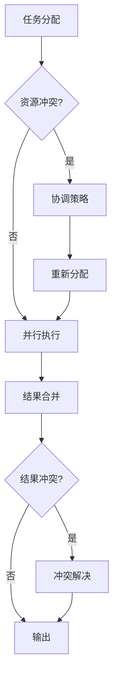

# 13.3 协调与冲突解决

## 概念讲解

### 多代理协作中的冲突

当多个Agent并行执行时，可能出现以下问题：
1. **资源竞争**：多个Agent同时修改同一资源
2. **结果冲突**：不同Agent的输出相互矛盾
3. **死锁**：Agent之间相互等待导致停滞



## 核心要点

### 状态合并策略

使用`Annotated`和自定义reducer控制状态合并：

| 策略 | 实现 | 适用场景 |
|------|------|----------|
| 追加 | `Annotated[list, operator.add]` | 收集多个Agent输出 |
| 覆盖 | 直接赋值 | 只保留最新结果 |
| 自定义 | 自定义reducer函数 | 复杂合并逻辑 |

## 简单示例

### 自定义状态合并

```python
import operator
from typing import Annotated
from typing_extensions import TypedDict

# 冲突检测与合并
def merge_results(existing: list, new: list) -> list:
    """合并结果并去重"""
    merged = existing.copy()
    for item in new:
        if item not in merged:
            merged.append(item)
    return merged

class TeamState(TypedDict):
    # 使用自定义合并函数
    research_results: Annotated[list, merge_results]
    final_decision: str

def researcher_a(state: TeamState) -> dict:
    return {"research_results": ["结果A1", "结果A2"]}

def researcher_b(state: TeamState) -> dict:
    return {"research_results": ["结果B1", "结果A2"]}  # A2重复

# 合并后: ["结果A1", "结果A2", "结果B1"]
```

### 任务分配与负载均衡

```python
from langgraph.types import Send

def load_balancer(state: TeamState) -> list:
    """负载均衡：将任务均匀分配给可用的Worker"""
    tasks = state["pending_tasks"]
    workers = ["worker_1", "worker_2", "worker_3"]
    
    sends = []
    for i, task in enumerate(tasks):
        worker = workers[i % len(workers)]  # 轮询分配
        sends.append(Send(worker, {"task": task}))
    return sends

# 构建图
graph.add_conditional_edges("dispatcher", load_balancer, 
    ["worker_1", "worker_2", "worker_3"])
```

## 进阶应用

### 投票机制解决冲突

```python
def voting_mechanism(state: TeamState) -> dict:
    """多个Agent投票决定最终结果"""
    results = state["research_results"]
    
    # 统计投票
    votes = {}
    for result in results:
        votes[result] = votes.get(result, 0) + 1
    
    # 选出最高票
    final = max(votes, key=votes.get)
    return {"final_decision": final}
```

### 子图隔离避免冲突

```python
from langgraph.graph import StateGraph

# 创建独立子图
def create_worker_subgraph():
    builder = StateGraph(WorkerState)
    builder.add_node("process", process_data)
    builder.add_node("validate", validate_data)
    builder.add_edge(START, "process")
    builder.add_edge("process", "validate")
    builder.add_edge("validate", END)
    return builder.compile()

# 主图引用子图
main_builder = StateGraph(MainState)
main_builder.add_node("worker_1", create_worker_subgraph())
main_builder.add_node("worker_2", create_worker_subgraph())
# 子图之间相互独立，不会冲突
```

## 常见问题

### Q: 如何避免多个Agent重复工作？

**A:** 在Supervisor节点中维护任务队列，确保每个任务只分配一次。

### Q: 如何处理Agent执行失败？

**A:** 使用`RetryPolicy`配置自动重试，或在聚合节点中检查并处理缺失结果。

## 本节总结

协调与冲突解决：
- 使用`Annotated`和自定义reducer控制状态合并
- 负载均衡通过轮询或智能分配实现
- 投票机制解决多Agent结果冲突
- 子图隔离确保Worker之间互不干扰