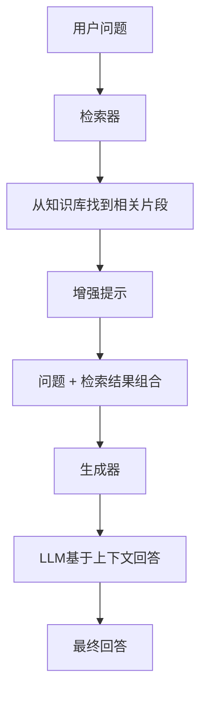

# 13.1 RAG核心原理与架构

## 概念讲解

### 什么是RAG？

RAG（Retrieval-Augmented Generation，检索增强生成）是一种结合检索和生成的AI架构。核心思想：在模型生成回答之前，先从外部知识库检索相关信息，然后将检索结果作为上下文提供给模型。

### 为什么需要RAG？

大语言模型存在三个固有限制：

| 限制 | 说明 | RAG如何解决 |
|------|------|------------|
| 知识时效性 | 训练数据有截止时间 | 检索最新信息 |
| 幻觉问题 | 可能生成不准确的内容 | 基于事实回答 |
| 私有知识 | 无法访问企业内部数据 | 接入私有知识库 |

### RAG的核心流程



## 核心要点

### RAG的三种实现方式

| 方式 | API | 特点 |
|------|-----|------|
| LCEL管道 | `RunnablePassthrough` | 灵活，完全控制 |
| create_retrieval_chain | `langchain.chains` | 结构化，返回context |
| LangGraph | StateGraph | 可中断，支持对话历史 |

## 简单示例

### 最小RAG实现（LCEL）

```python
from langchain.chat_models import init_chat_model
from langchain_core.prompts import ChatPromptTemplate
from langchain_core.runnables import RunnablePassthrough
from langchain_core.output_parsers import StrOutputParser

# 检索器
retriever = vectorstore.as_retriever()

# 提示模板
template = """基于以下上下文回答问题：
{context}

问题：{question}
"""
prompt = ChatPromptTemplate.from_template(template)

# LLM
llm = init_chat_model("gpt-4o-mini")

# 构建RAG链
rag_chain = (
    {"context": retriever, "question": RunnablePassthrough()}
    | prompt
    | llm
    | StrOutputParser()
)

# 执行
response = rag_chain.invoke("什么是LangChain？")
```

### 使用create_retrieval_chain

```python
from langchain.chains import create_retrieval_chain
from langchain.chains.combine_documents import create_stuff_documents_chain

# 问答链
prompt = ChatPromptTemplate.from_messages([
    ("system", "基于以下上下文回答问题：\n{context}"),
    ("human", "{input}")
])
question_answer_chain = create_stuff_documents_chain(llm, prompt)

# RAG链
rag_chain = create_retrieval_chain(retriever, question_answer_chain)

# 执行 - 返回answer和context
result = rag_chain.invoke({"input": "什么是LangChain？"})
print(result["answer"])  # 回答
print(result["context"])  # 源文档
```

## 进阶应用

### 带对话历史的RAG

```python
from langchain.chains import create_history_aware_retriever
from langchain_core.prompts import MessagesPlaceholder

# 上下文感知检索
contextualize_prompt = ChatPromptTemplate.from_messages([
    ("system", "根据对话历史重写问题，使其独立可理解。"),
    MessagesPlaceholder("chat_history"),
    ("human", "{input}")
])

history_aware_retriever = create_history_aware_retriever(
    llm, retriever, contextualizeize_prompt
)

# 完整RAG链（带历史）
qa_prompt = ChatPromptTemplate.from_messages([
    ("system", "基于上下文回答：\n{context}"),
    MessagesPlaceholder("chat_history"),
    ("human", "{input}")
])
question_answer_chain = create_stuff_documents_chain(llm, qa_prompt)
rag_chain = create_retrieval_chain(history_aware_retriever, question_answer_chain)

# 执行
result = rag_chain.invoke({
    "input": "它有哪些功能？",
    "chat_history": [HumanMessage(content="什么是LangChain？"), 
                     AIMessage(content="LangChain是...")]
})
```

## 常见问题

### Q: RAG和微调有什么区别？

**A:** RAG通过检索外部信息增强生成，适合知识更新和私有数据；微调改变模型权重，适合领域适配。

### Q: 检索质量如何保证？

**A:** 关键在文档分块策略和嵌入模型选择。分块太大会丢失细节，太小会丢失上下文。

## 本节总结

RAG通过检索外部知识库增强LLM的生成能力，有效解决了知识时效性、幻觉和私有数据等问题。LangChain提供了LCEL、create_retrieval_chain等多种实现方式。