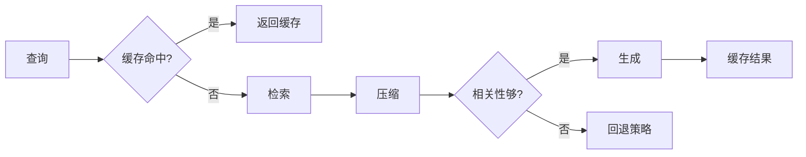

# 13.3 生产环境优化

## 概念讲解

### 生产环境RAG的挑战

从开发到生产，RAG系统面临三个核心挑战：

1. **响应时间**：检索+生成涉及多次网络调用
2. **准确率与召回率平衡**：太多文档影响质量，太少可能遗漏
3. **成本控制**：嵌入、LLM调用都有成本



## 核心要点

### 优化策略概览

| 策略 | 解决 | 方法 |
|------|------|------|
| 响应时间 | 慢 | 缓存、并行、流式 |
| 准确率 | 不精确 | 重排序、阈值过滤 |
| 成本 | 高 | 嵌入缓存、小模型路由 |

## 简单示例

### 响应时间优化：流式输出

```python
from langchain.chat_models import init_chat_model
from langchain_core.prompts import ChatPromptTemplate
from langchain_core.runnables import RunnablePassthrough
from langchain_core.output_parsers import StrOutputParser

rag_chain = (
    {"context": retriever, "question": RunnablePassthrough()}
    | prompt
    | llm
    | StrOutputParser()
)

# 流式输出 - 用户更快看到响应
for chunk in rag_chain.stream("什么是LangChain？"):
    print(chunk, end="", flush=True)
```

### 准确率优化：相关性阈值

```python
from langchain.retrievers import ContextualCompressionRetriever
from langchain.retrievers.document_compressors import FlashrankRerank

class ThresholdFilterCompressor:
    """过滤低于阈值的文档"""
    def __init__(self, threshold: float = 0.5):
        self.threshold = threshold
        self.base_compressor = FlashrankRerank()
    
    def compress_documents(self, documents, query):
        compressed = self.base_compressor.compress_documents(documents, query)
        # 过滤低相关性文档
        return [doc for doc in compressed 
                if doc.metadata.get("relevance_score", 0) >= self.threshold]

compression_retriever = ContextualCompressionRetriever(
    base_compressor=ThresholdFilterCompressor(threshold=0.6),
    base_retriever=vectorstore.as_retriever()
)
```

### 成本优化：嵌入缓存

```python
from langchain.storage import InMemoryStore
from langchain.embeddings import CacheBackedEmbeddings
from langchain_openai import OpenAIEmbeddings

# 底层嵌入模型
underlying_embeddings = OpenAIEmbeddings()

# 缓存存储
store = InMemoryStore()

# 缓存嵌入
embeddings = CacheBackedEmbeddings.from_bytes_store(
    underlying_embeddings,
    store,
    namespace=underlying_embeddings.model
)

# 使用缓存嵌入创建向量存储
vectorstore = FAISS.from_documents(documents, embeddings)
```

## 进阶应用

### 完整的检索管道

```python
from langchain.retrievers import (
    ContextualCompressionRetriever,
    MultiQueryRetriever,
    EnsembleRetriever
)

def build_production_retriever():
    """构建生产级检索器"""
    # 1. 混合检索
    bm25 = BM25Retriever.from_documents(documents, k=5)
    vector = vectorstore.as_retriever(search_kwargs={"k": 5})
    ensemble = EnsembleRetriever(
        retrievers=[bm25, vector],
        weights=[0.3, 0.7]
    )
    
    # 2. 多查询
    multi_query = MultiQueryRetriever.from_llm(
        retriever=ensemble, llm=llm
    )
    
    # 3. 压缩重排序
    compressor = FlashrankRerank(top_n=3)
    return ContextualCompressionRetriever(
        base_compressor=compressor,
        base_retriever=multi_query
    )

retriever = build_production_retriever()
```

### 质量评估

```python
from langsmith import Client
from langsmith.evaluation import evaluate

# 评估RAG链
def rag_answer_evaluator(run, example) -> dict:
    """评估回答质量"""
    answer = run.outputs.get("answer", "")
    context = run.outputs.get("context", [])
    
    # 检查是否基于上下文
    grounded = any(doc in answer for doc in context)
    
    return {"score": grounded, "key": "groundedness"}

# 运行评估
evaluate(
    rag_chain,
    data="test_dataset",
    evaluators=[rag_answer_evaluator]
)
```

## 常见问题

### Q: 如何降低RAG的响应延迟？

**A:** 
1. 使用流式输出
2. 缓存常见查询结果
3. 并行执行独立检索

### Q: 如何衡量RAG系统的质量？

**A:** 使用LangSmith评估框架，测试指标包括：
- 忠实度（答案是否基于上下文）
- 相关性（答案是否解决问题）
- 召回率（是否检索到关键信息）

## 本节总结

生产环境优化：
- 流式输出提升用户体验
- 重排序和阈值过滤提升准确率
- 嵌入缓存降低重复计算成本
- LangSmith评估框架监控质量