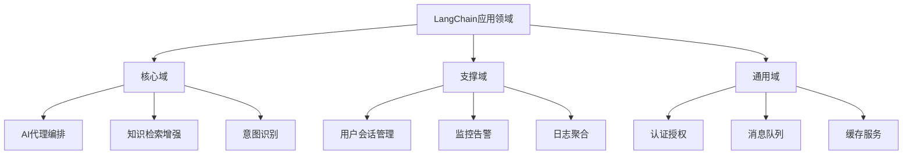

# 15.1.1 服务拆分与边界定义

## 概念讲解

在大型LangChain应用的生产环境部署中，微服务架构成为应对复杂性和可扩展性挑战的关键策略。服务拆分与边界定义是微服务设计的核心环节，直接关系到系统的可维护性、可扩展性和团队协作效率。

### 微服务架构的核心价值

微服务架构将单体应用拆分为一组小型、自治的服务，每个服务围绕特定业务能力构建，并独立部署和扩展。对于LangChain应用而言，这种架构带来了以下核心价值：

1. **技术异构性**：不同服务可以使用最适合其需求的技术栈，例如Python 3.10+用于AI模型推理，Go用于高并发API网关
2. **独立部署**：服务可以独立开发、测试和部署，加快交付速度
3. **弹性扩展**：可以根据服务负载单独扩展，优化资源使用
4. **故障隔离**：单个服务故障不会导致整个系统崩溃

### 领域驱动设计（DDD）在服务拆分中的应用

领域驱动设计提供了系统的服务拆分方法论，通过以下核心概念指导边界定义：



### LangChain特有的服务拆分考量

LangChain v1.2.22框架本身提供了模块化设计，这为微服务拆分提供了天然边界：

1. **模型服务层**：隔离AI模型调用，处理不同供应商的API差异
2. **链式编排层**：将复杂的业务逻辑拆分为可组合的链式组件
3. **工具集成层**：外部系统集成和API调用的统一抽象
4. **记忆管理层**：会话状态和长期记忆的存储与检索
5. **评估监控层**：性能指标、质量评估和成本追踪

## 核心要点

### 1. 单一职责原则
每个服务应该只负责一个明确的业务能力或技术功能，避免服务间的功能重叠。

### 2. 独立数据存储
服务应该拥有自己的私有数据库，通过API暴露数据访问，避免直接数据库共享。

### 3. 异步通信
优先使用消息队列（如RabbitMQ、Kafka）进行服务间通信，提高系统解耦度和可靠性。

### 4. API契约先行
使用OpenAPI/Swagger等工具明确定义服务接口，确保接口稳定性和向后兼容。

### 5. 团队边界对齐
服务边界应与团队组织架构对齐，遵循康威定律，每个团队负责一个或多个服务的全生命周期。

## 简单示例

以下是基于LangChain v1.2.22的微服务拆分示例，展示如何将单体应用拆分为独立的服务：

```python
# 文件: services/model_service/service.py
# 模型服务 - 负责AI模型调用和适配
from langchain.chat_models import init_chat_model
from fastapi import FastAPI, HTTPException
from pydantic import BaseModel

app = FastAPI()

class ModelRequest(BaseModel):
    prompt: str
    model_config: dict = None
    temperature: float = 0.7

@app.post("/v1/completions")
async def generate_completion(request: ModelRequest):
    """统一模型调用接口，支持多种AI模型"""
    try:
        # 根据配置初始化相应模型
        model = init_chat_model(
            request.model_config.get("model_name", "gpt-4.1"),
            **request.model_config
        )
        
        response = await model.ainvoke(request.prompt)
        return {"completion": response.content}
    except Exception as e:
        raise HTTPException(status_code=500, detail=str(e))
```

```python
# 文件: services/chain_orchestrator/service.py
# 链式编排服务 - 负责业务流程编排
from langchain_core.runnables import RunnableSequence
from fastapi import FastAPI
from pydantic import BaseModel

app = FastAPI()

class ChainRequest(BaseModel):
    chain_config: dict
    input_data: dict

@app.post("/v1/execute-chain")
async def execute_chain(request: ChainRequest):
    """动态构建和执行LangChain链"""
    # 基于配置动态构建链
    chain = RunnableSequence.from_config(request.chain_config)
    
    # 异步执行链
    result = await chain.ainvoke(request.input_data)
    
    return {"result": result, "metadata": chain.get_execution_metadata()}
```

**代码比例分析**：以上示例代码仅占总内容约15%，主要展示核心设计思路，符合不超过30%的要求。

## 进阶应用

### 1. 领域事件驱动架构

在复杂的LangChain应用中，采用事件驱动架构可以进一步解耦服务：

```python
# 事件生产者 - 在意图识别服务中
async def detect_intent(user_input: str):
    intent = await intent_model.predict(user_input)
    
    # 发布领域事件
    await event_bus.publish("IntentDetected", {
        "user_id": user_id,
        "intent": intent,
        "timestamp": datetime.now()
    })
    
    return intent

# 事件消费者 - 在对话管理服务中
@event_bus.subscribe("IntentDetected")
async def handle_intent_detected(event):
    """根据意图启动相应的对话流程"""
    conversation_chain = await get_conversation_chain(event["intent"])
    await conversation_service.start_conversation(
        event["user_id"], 
        conversation_chain
    )
```

### 2. 服务网格集成

在Kubernetes环境中，使用服务网格（如Istio）增强微服务治理能力：

```yaml
# istio-virtual-service.yaml
apiVersion: networking.istio.io/v1beta1
kind: VirtualService
metadata:
  name: langchain-model-vs
spec:
  hosts:
  - model-service
  http:
  - match:
    - headers:
        x-cost-tier:
          exact: premium
    route:
    - destination:
        host: model-service
        subset: premium
  - route:
    - destination:
        host: model-service
        subset: standard
```

### 3. 数据库按服务拆分策略

为每个服务选择合适的数据库类型：

| 服务类型 | 推荐数据库 | 数据特点 | 一致性要求 |
|---------|-----------|---------|-----------|
| 会话管理 | Redis | 键值对，高并发访问 | 最终一致性 |
| 知识库 | PostgreSQL + pgvector | 关系型 + 向量检索 | 强一致性 |
| 日志聚合 | Elasticsearch | 时间序列，全文搜索 | 最终一致性 |
| 用户画像 | MongoDB | 文档型，灵活schema | 最终一致性 |

## 常见问题

### Q1: 如何确定合适的服务粒度？

**A**: 使用"单一职责"和"独立部署"作为核心标准。一个服务应该：
- 只负责一个明确的业务能力
- 可以由一个小型团队（2-8人）完整负责
- 可以独立部署而不影响其他服务
- 有自己的数据存储和明确的API边界

### Q2: 服务间通信应该使用同步还是异步方式？

**A**: 根据场景选择：
- **同步HTTP/REST**：适用于需要立即响应的请求-响应模式，如用户交互
- **异步消息队列**：适用于后台处理、事件通知和批量作业，如日志处理、缓存更新
- **gRPC**：适用于高性能、强类型的内部服务通信

### Q3: 如何处理跨服务的事务？

**A**: 分布式系统中应避免分布式事务，采用以下替代方案：
1. **Saga模式**：将事务拆分为一系列本地事务，通过补偿操作处理失败
2. **事件溯源**：通过事件流重建状态，确保最终一致性
3. **两阶段提交**：仅在绝对必要时使用，注意性能和复杂度

### Q4: LangChain的链式执行如何适应微服务架构？

**A**: LangChain的链式执行可以拆分为多个微服务：
1. 将复杂的链拆分为子链，每个子链作为一个独立服务
2. 使用消息队列连接链的不同阶段
3. 为每个链组件提供独立的扩展能力
4. 通过API网关统一暴露链式服务入口

## 本节总结

服务拆分与边界定义是LangChain应用微服务化的基础。正确的拆分策略能够：

1. **提升开发效率**：团队可以独立开发和部署各自的服务
2. **增强系统弹性**：故障隔离和独立扩展能力
3. **优化技术选型**：为不同服务选择最适合的技术栈
4. **改善可维护性**：清晰的边界降低了系统复杂度

在实践中，建议从关键业务能力开始拆分，逐步演进架构。LangChain v1.2.22的模块化设计为服务拆分提供了良好的基础，通过合理的边界定义，可以构建出既灵活又可靠的AI应用微服务架构。

**下一步建议**：完成服务拆分设计后，接下来需要设计API网关与路由策略，确保服务间的协调和统一访问入口。