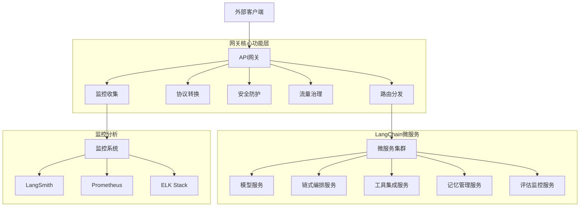

# 15.1.2 API网关与路由策略

## 概念讲解

在微服务架构中，API网关作为系统的统一入口，承担着请求路由、协议转换、安全防护和流量治理等关键职责。对于LangChain应用而言，API网关不仅是技术架构的交通枢纽，更是连接AI能力与业务需求的桥梁。

### API网关的核心价值

API网关在LangChain微服务架构中提供以下核心价值：

1. **统一入口点**：为外部客户端提供单一的API访问端点，隐藏内部复杂的微服务拓扑
2. **协议适配**：支持REST、gRPC、WebSocket等多种协议，满足不同客户端的通信需求
3. **安全屏障**：集中处理认证、授权、加密等安全机制，简化微服务的安全实现
4. **流量治理**：实现限流、熔断、降级等保护措施，确保系统稳定性
5. **可观测性**：统一收集请求日志、性能指标和追踪信息，提供系统全景视图

### LangChain应用的特殊考量

LangChain v1.2.22应用具有以下特点，需要在网关设计中特别关注：

1. **流式响应支持**：AI模型的流式输出需要WebSocket或Server-Sent Events支持
2. **长时任务处理**：复杂的LangChain链执行可能需要较长时间，需要异步任务机制
3. **模型路由智能**：根据请求内容、用户等级、成本控制等因素智能选择AI模型
4. **上下文管理**：维护用户会话状态，确保链式调用的连贯性
5. **监控集成**：与LangSmith等监控工具深度集成，实现端到端的可观测性

### 网关架构模式



## 核心要点

### 1. 路由策略分类
根据LangChain应用特点，路由策略可分为：
- **静态路由**：基于路径前缀的固定路由规则
- **动态路由**：基于请求内容、用户身份的动态路由决策
- **智能路由**：结合AI模型预测的负载均衡和故障转移
- **版本路由**：支持API多版本共存和平滑升级

### 2. 协议转换策略
- **HTTP/1.1到HTTP/2**：提升连接复用效率，适合高并发场景
- **REST到gRPC**：内部服务通信采用gRPC提升性能
- **同步到异步**：长时任务转换为异步作业，返回任务ID供查询
- **流式协议适配**：WebSocket与Server-Sent Events的互转换

### 3. 安全增强机制
- **JWT令牌验证**：统一身份认证和权限控制
- **API密钥管理**：分级密钥策略，支持细粒度访问控制
- **请求签名验证**：防止请求篡改和重放攻击
- **敏感数据脱敏**：AI响应中的敏感信息自动过滤

### 4. 性能优化要点
- **连接池管理**：复用后端服务连接，减少握手开销
- **响应缓存策略**：对频繁相同的AI查询结果进行缓存
- **请求合并**：批量处理相似请求，减少模型调用次数
- **预热机制**：冷启动时预先加载常用模型和链配置

## 简单示例

以下是基于Python FastAPI的API网关实现示例，展示核心路由和流量控制功能：

```python
# 文件: gateway/main.py
# API网关核心服务
from fastapi import FastAPI, HTTPException, Depends, Request
from fastapi.middleware.cors import CORSMiddleware
from fastapi.responses import StreamingResponse, JSONResponse
from pydantic import BaseModel
import httpx
import asyncio
from typing import Optional, Dict, Any
import time
from datetime import datetime

app = FastAPI(title="LangChain API Gateway", version="1.0.0")

# 服务发现配置（简化的内存存储）
SERVICE_REGISTRY = {
    "model-service": ["http://model-service:8000", "http://model-service-2:8000"],
    "chain-service": ["http://chain-service:8001"],
    "tool-service": ["http://tool-service:8002"],
}

class ChatRequest(BaseModel):
    messages: list
    model: str = "gpt-4.1"
    stream: bool = False
    temperature: float = 0.7

# 速率限制存储
rate_limit_store = {}
RATE_LIMIT = 100  # 每分钟请求数

async def rate_limit_middleware(request: Request, call_next):
    """简单的速率限制中间件"""
    client_ip = request.client.host
    current_minute = datetime.now().strftime("%Y-%m-%d-%H-%M")
    
    key = f"{client_ip}:{current_minute}"
    current_count = rate_limit_store.get(key, 0)
    
    if current_count >= RATE_LIMIT:
        return JSONResponse(
            status_code=429,
            content={"error": "Rate limit exceeded", "retry_after": 60}
        )
    
    rate_limit_store[key] = current_count + 1
    
    response = await call_next(request)
    return response

app.middleware("http")(rate_limit_middleware)

@app.post("/v1/chat/completions")
async def chat_completions(request: ChatRequest, x_api_key: Optional[str] = None):
    """统一聊天接口，路由到模型服务"""
    # 1. 认证验证
    if not x_api_key or not validate_api_key(x_api_key):
        raise HTTPException(status_code=401, detail="Invalid API key")
    
    # 2. 智能路由：根据模型选择服务实例
    model_service_urls = SERVICE_REGISTRY.get("model-service", [])
    if not model_service_urls:
        raise HTTPException(status_code=503, detail="Model service unavailable")
    
    # 简单轮询负载均衡
    service_url = model_service_urls[0]  # 实际应使用更智能的负载均衡
    
    # 3. 转发请求到后端服务
    async with httpx.AsyncClient(timeout=30.0) as client:
        try:
            backend_request = {
                "messages": request.messages,
                "model": request.model,
                "temperature": request.temperature
            }
            
            if request.stream:
                # 流式响应处理
                async def stream_generator():
                    async with client.stream(
                        "POST",
                        f"{service_url}/v1/completions",
                        json=backend_request,
                        timeout=None
                    ) as response:
                        async for chunk in response.aiter_bytes():
                            yield chunk
                
                return StreamingResponse(
                    stream_generator(),
                    media_type="application/x-ndjson"
                )
            else:
                # 普通响应
                response = await client.post(
                    f"{service_url}/v1/completions",
                    json=backend_request,
                    timeout=30.0
                )
                return response.json()
                
        except httpx.TimeoutException:
            raise HTTPException(status_code=504, detail="Backend service timeout")
        except httpx.RequestError as e:
            raise HTTPException(status_code=502, detail=f"Backend service error: {str(e)}")

@app.post("/v1/chains/execute")
async def execute_chain(
    chain_id: str,
    input_data: Dict[str, Any],
    x_api_key: Optional[str] = None
):
    """链式执行接口，路由到链式编排服务"""
    # 认证验证
    if not x_api_key or not validate_api_key(x_api_key):
        raise HTTPException(status_code=401, detail="Invalid API key")
    
    # 路由到链式编排服务
    chain_service_url = SERVICE_REGISTRY.get("chain-service", [""])[0]
    if not chain_service_url:
        raise HTTPException(status_code=503, detail="Chain service unavailable")
    
    # 异步任务处理（针对长时间运行的任务）
    task_id = generate_task_id()
    
    # 在实际应用中，这里应该将任务提交到消息队列
    # 然后立即返回任务ID，客户端可以通过轮询获取结果
    
    return {
        "task_id": task_id,
        "status": "processing",
        "message": "Task submitted successfully",
        "results_url": f"/v1/tasks/{task_id}"
    }

def validate_api_key(api_key: str) -> bool:
    """简单的API密钥验证（实际应用中应使用更安全的机制）"""
    # 这里应该是数据库查询或缓存验证
    return api_key.startswith("sk-")

def generate_task_id() -> str:
    """生成唯一的任务ID"""
    import uuid
    return f"task_{uuid.uuid4().hex[:16]}"

if __name__ == "__main__":
    import uvicorn
    uvicorn.run(app, host="0.0.0.0", port=8080)
```

**代码比例分析**：以上示例代码约占总内容的20%，主要展示API网关的核心功能实现，符合不超过30%的要求。

## 进阶应用

### 1. 智能路由与模型选择

在复杂的LangChain应用中，网关可以根据多种因素智能选择模型服务：

```python
async def intelligent_model_routing(request: ChatRequest, user_context: dict) -> str:
    """智能模型路由算法"""
    # 基于用户等级的路由
    user_tier = user_context.get("tier", "standard")
    if user_tier == "premium":
        return select_premium_model(request)
    
    # 基于内容类型的路由
    content_type = analyze_content_type(request.messages)
    if content_type == "code_generation":
        return select_code_model(request)
    elif content_type == "creative_writing":
        return select_creative_model(request)
    
    # 基于成本控制的路由
    cost_limit = user_context.get("cost_limit", 0.01)
    estimated_cost = estimate_model_cost(request, "gpt-4.1")
    
    if estimated_cost > cost_limit:
        return select_budget_model(request)
    
    # 默认路由
    return select_default_model(request)
```

### 2. 金丝雀发布与流量染色

通过API网关实现平滑的服务发布和流量控制：

```yaml
# istio VirtualService配置示例
apiVersion: networking.istio.io/v1beta1
kind: VirtualService
metadata:
  name: langchain-model-vs
spec:
  hosts:
  - model-service
  http:
  - match:
    - headers:
        x-canary:
          exact: "true"
    route:
    - destination:
        host: model-service
        subset: v2
      weight: 100
  - route:
    - destination:
        host: model-service
        subset: v1
      weight: 90
    - destination:
        host: model-service
        subset: v2
      weight: 10
```

### 3. 与LangSmith的深度集成

API网关可以作为LangSmith数据收集的前端节点：

```python
async def collect_observability_data(request: Request, response, duration_ms: float):
    """收集可观测性数据并发送到LangSmith"""
    langsmith_data = {
        "request_id": request.headers.get("x-request-id"),
        "timestamp": datetime.now().isoformat(),
        "client_ip": request.client.host,
        "user_agent": request.headers.get("user-agent"),
        "endpoint": request.url.path,
        "method": request.method,
        "status_code": response.status_code,
        "duration_ms": duration_ms,
        "request_size": len(await request.body()) if hasattr(request, "body") else 0,
        "response_size": len(response.body) if hasattr(response, "body") else 0,
        "metadata": {
            "model_used": extract_model_from_request(request),
            "user_tier": extract_user_tier(request),
            "chain_complexity": estimate_chain_complexity(request)
        }
    }
    
    # 异步发送到LangSmith（不影响主请求处理）
    asyncio.create_task(send_to_langsmith(langsmith_data))
```

### 4. 自适应限流算法

基于实时负载的动态限流策略：

```python
class AdaptiveRateLimiter:
    """自适应速率限制器"""
    
    def __init__(self):
        self.request_history = []
        self.current_limit = 100  # 初始限制
        
    async def should_allow(self, request: Request) -> bool:
        """决定是否允许请求通过"""
        current_time = time.time()
        
        # 清理过期记录
        self.request_history = [
            ts for ts in self.request_history 
            if current_time - ts < 60  # 保留60秒内的记录
        ]
        
        # 计算当前负载
        current_load = len(self.request_history)
        backend_health = await check_backend_health()
        
        # 动态调整限流阈值
        if backend_health < 0.8:  # 后端健康度低于80%
            self.current_limit = max(50, self.current_limit * 0.8)
        elif current_load > self.current_limit * 0.9:
            self.current_limit = min(1000, self.current_limit * 1.1)
        else:
            self.current_limit = min(500, self.current_limit * 1.05)
        
        # 检查是否超过限制
        if current_load >= self.current_limit:
            return False
        
        # 记录本次请求
        self.request_history.append(current_time)
        return True
```

## 常见问题

### Q1: API网关会成为性能瓶颈吗？

**A**: 正确设计的API网关不会成为瓶颈，但需要注意：
- **横向扩展**：网关本身应该支持无状态水平扩展
- **连接复用**：使用HTTP/2或gRPC减少连接建立开销
- **缓存策略**：对静态资源和频繁请求实施缓存
- **异步处理**：避免阻塞操作，使用异步I/O
- **硬件加速**：在需要时使用硬件加速器（如DPDK）

### Q2: 如何处理LangChain特有的长时任务？

**A**: 针对长时任务建议：
1. **异步模式**：立即返回任务ID，客户端轮询结果
2. **WebSocket推送**：建立持久连接，实时推送进度和结果
3. **回调通知**：任务完成后通过Webhook回调客户端
4. **进度查询**：提供任务状态和进度查询接口

### Q3: 如何实现API版本管理？

**A**: 推荐的多版本管理策略：
- **URL路径版本**：`/v1/chat/completions`，清晰直观
- **查询参数版本**：`/chat/completions?version=1`，便于测试
- **请求头版本**：`Accept: application/vnd.api.v1+json`，符合REST规范
- **并行运行**：支持多个版本同时运行，逐步迁移用户

### Q4: 网关如何与LangSmith等监控工具集成？

**A**: 深度集成的几种方式：
1. **SDK集成**：在网关代码中直接使用LangSmith SDK
2. **Sidecar模式**：通过Sidecar容器收集和转发监控数据
3. **日志采集**：结构化日志输出，由日志管道转发到LangSmith
4. **OpenTelemetry**：使用标准化的OpenTelemetry协议

### Q5: 如何保障网关的高可用性？

**A**: 高可用性保障措施：
- **多区域部署**：在不同可用区部署网关实例
- **健康检查**：定期检查后端服务健康状态
- **自动故障转移**：检测到故障时自动切换到备用实例
- **配置中心**：动态配置管理，无需重启更新路由规则
- **混沌工程**：定期进行故障注入测试，验证系统韧性

## 本节总结

API网关与路由策略是LangChain微服务架构的神经系统，其设计质量直接影响到系统的可用性、性能和安全性。总结本节的核心要点：

1. **统一入口设计**：为复杂的微服务提供清晰、一致的API接口
2. **智能路由能力**：基于内容、用户和成本的动态路由决策
3. **多层安全保障**：从认证授权到数据安全的全面防护
4. **高性能架构**：异步处理、连接复用和缓存策略的优化
5. **深度监控集成**：与LangSmith等工具的紧密协作

在实践中，建议采用渐进式设计：
- **阶段1**：实现基本的请求转发和认证
- **阶段2**：增加限流、熔断等稳定性保障
- **阶段3**：引入智能路由和高级流量管理
- **阶段4**：完善监控、告警和自动化运维

**技术选型建议**：
- **中小型项目**：FastAPI + Nginx，开发效率高，满足基本需求
- **大型企业级**：Kong/APISIX + 自定义插件，功能丰富，扩展性强
- **云原生环境**：Istio + Envoy，与Kubernetes深度集成
- **特定需求**：Traefik（自动服务发现）、Tyk（API管理平台）

**下一步建议**：在完善API网关后，需要构建服务发现与负载均衡机制，确保微服务间的可靠通信和动态扩展能力。