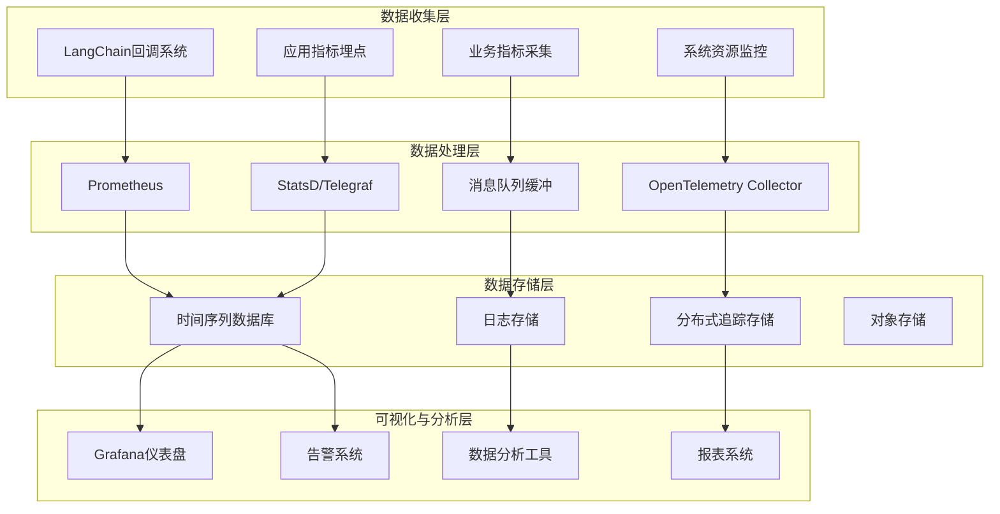

# 15.2.1 指标收集与仪表盘

## 概念讲解

在生产环境中，指标收集与可视化是系统可观测性的基石。对于LangChain应用而言，有效的监控不仅能够帮助团队了解系统运行状态，还能为AI模型性能优化、成本控制和用户体验提升提供数据支撑。

### 监控与可观测性的核心价值

在LangChain微服务架构中，指标收集系统提供以下核心价值：

1. **系统健康度评估**：实时了解各服务组件的运行状态和性能指标
2. **故障诊断与排查**：快速定位问题根源，缩短平均修复时间（MTTR）
3. **性能优化依据**：基于数据驱动的决策，持续优化系统性能
4. **成本分析与控制**：监控AI模型调用成本，优化资源使用效率
5. **用户体验洞察**：了解用户交互模式，改进产品功能和体验
6. **容量规划支持**：预测未来资源需求，制定合理的扩展计划

### LangChain应用监控的特殊性

与传统的Web应用相比，LangChain v1.2.22应用具有独特的监控需求：

1. **AI模型性能监控**：需要监控模型响应时间、Token使用量、API调用成功率
2. **链式执行追踪**：追踪复杂LangChain链的执行路径和性能瓶颈
3. **语义质量评估**：监控AI响应的相关性、准确性和有用性
4. **上下文管理监控**：追踪会话状态大小、缓存命中率等关键指标
5. **成本敏感监控**：实时监控AI模型调用成本，防止预算超支
6. **实时流式监控**：支持流式响应的实时性能监控

### 监控体系架构



## 核心要点

### 1. 指标分类体系

根据LangChain应用特点，指标可分为以下类别：

- **系统指标**：CPU使用率、内存占用、网络IO、磁盘使用等基础设施指标
- **应用指标**：请求处理速率、错误率、响应时间、并发连接数等
- **AI模型指标**：模型调用延迟、Token使用量、API成功率、成本指标
- **业务指标**：用户活跃度、会话时长、任务完成率、满意度评分
- **质量指标**：响应相关性、准确性、连贯性、创造性评分
- **安全指标**：认证失败次数、异常访问模式、数据泄露风险

### 2. 数据收集策略

高效的数据收集需要考虑以下策略：

- **分层采样**：根据不同指标的重要性和成本采用不同的采样频率
- **客户端聚合**：在客户端进行初步聚合，减少网络传输压力
- **异步上报**：使用异步机制上报指标，避免阻塞主业务流程
- **容错设计**：指标收集失败不应影响核心业务功能
- **数据压缩**：对历史数据进行压缩存储，平衡存储成本和数据粒度

### 3. 存储与聚合方案

选择合适的存储和聚合方案：

- **时间序列数据库**：Prometheus、InfluxDB、TimescaleDB适合存储时序数据
- **数据聚合策略**：按不同时间粒度（分钟、小时、天）预聚合数据
- **数据保留策略**：根据数据价值制定不同的保留期限
- **多副本存储**：重要数据在多区域存储，确保数据安全
- **冷热数据分离**：将热点数据和历史冷数据分开存储优化成本

### 4. 可视化与仪表盘设计原则

设计有效的监控仪表盘：

- **用户分层设计**：为不同角色（开发者、运维、产品、管理）设计不同视图
- **关键指标优先**：将最重要的指标放在最显眼的位置
- **关联性展示**：将相关联的指标放在一起，便于问题分析
- **实时与历史结合**：同时展示实时数据和历史趋势
- **交互式探索**：支持下钻分析、时间范围选择等交互功能
- **移动端适配**：确保在移动设备上也能清晰查看关键指标

## 简单示例

以下是基于Prometheus和Grafana的LangChain指标收集与可视化示例：

```python
# 文件: monitoring/metrics_collector.py
# LangChain指标收集器
from prometheus_client import Counter, Histogram, Gauge, Summary, start_http_server
import time
from datetime import datetime
from typing import Dict, Any, Optional
import asyncio

# 定义Prometheus指标
REQUEST_COUNT = Counter(
    'langchain_requests_total',
    'Total number of LangChain requests',
    ['service', 'endpoint', 'status']
)

REQUEST_DURATION = Histogram(
    'langchain_request_duration_seconds',
    'Request duration in seconds',
    ['service', 'endpoint'],
    buckets=(0.1, 0.5, 1.0, 2.0, 5.0, 10.0, 30.0)
)

TOKEN_USAGE = Histogram(
    'langchain_token_usage',
    'Token usage per request',
    ['service', 'model'],
    buckets=(100, 500, 1000, 2000, 5000, 10000)
)

ACTIVE_SESSIONS = Gauge(
    'langchain_active_sessions',
    'Number of active user sessions',
    ['service']
)

MODEL_COST = Counter(
    'langchain_model_cost_usd',
    'Total cost of model calls in USD',
    ['service', 'model']
)

ERROR_RATE = Gauge(
    'langchain_error_rate',
    'Current error rate percentage',
    ['service']
)

# LangChain回调监控
from langchain.callbacks.base import BaseCallbackHandler
from langchain.schema import LLMResult

class PrometheusCallbackHandler(BaseCallbackHandler):
    """LangChain回调处理器，用于收集AI模型指标"""
    
    def __init__(self, service_name: str = "default"):
        self.service_name = service_name
        
    def on_llm_start(self, serialized: Dict[str, Any], prompts: list, **kwargs):
        """AI模型开始调用时记录"""
        self.start_time = time.time()
        self.prompt = prompts[0] if prompts else ""
        
    def on_llm_end(self, response: LLMResult, **kwargs):
        """AI模型调用结束时记录指标"""
        duration = time.time() - self.start_time
        
        # 记录请求持续时间
        REQUEST_DURATION.labels(
            service=self.service_name,
            endpoint="llm_inference"
        ).observe(duration)
        
        # 记录请求计数
        REQUEST_COUNT.labels(
            service=self.service_name,
            endpoint="llm_inference",
            status="success"
        ).inc()
        
        # 计算Token使用量
        if response.llm_output and 'token_usage' in response.llm_output:
            token_usage = response.llm_output['token_usage']
            total_tokens = token_usage.get('total_tokens', 0)
            
            TOKEN_USAGE.labels(
                service=self.service_name,
                model=kwargs.get('model_name', 'unknown')
            ).observe(total_tokens)
        
        # 估算成本（简化版）
        model_name = kwargs.get('model_name', 'unknown')
        estimated_cost = self._estimate_cost(model_name, total_tokens)
        
        if estimated_cost > 0:
            MODEL_COST.labels(
                service=self.service_name,
                model=model_name
            ).inc(estimated_cost)
    
    def on_llm_error(self, error: Exception, **kwargs):
        """AI模型调用错误时记录"""
        REQUEST_COUNT.labels(
            service=self.service_name,
            endpoint="llm_inference",
            status="error"
        ).inc()
        
        # 更新错误率
        self._update_error_rate()
    
    def _estimate_cost(self, model_name: str, total_tokens: int) -> float:
        """估算模型调用成本（简化版）"""
        # 实际应用中应根据不同模型的实际定价计算
        cost_per_1k_tokens = {
            'gpt-4': 0.03,
            'gpt-4-turbo': 0.01,
            'gpt-3.5-turbo': 0.001,
            'claude-3-opus': 0.075,
            'claude-3-sonnet': 0.015,
        }
        
        base_cost = cost_per_1k_tokens.get(model_name, 0.01)
        return (total_tokens / 1000) * base_cost
    
    def _update_error_rate(self):
        """更新错误率指标"""
        # 这里应该计算实际的错误率
        # 简化示例：使用固定值
        ERROR_RATE.labels(service=self.service_name).set(0.05)

# 应用性能监控装饰器
def monitor_request(endpoint_name: str):
    """监控请求的装饰器"""
    def decorator(func):
        async def wrapper(*args, **kwargs):
            start_time = time.time()
            service_name = kwargs.get('service_name', 'default')
            
            try:
                # 增加活跃会话数
                ACTIVE_SESSIONS.labels(service=service_name).inc()
                
                # 执行原函数
                result = await func(*args, **kwargs)
                
                # 记录成功请求
                REQUEST_COUNT.labels(
                    service=service_name,
                    endpoint=endpoint_name,
                    status="success"
                ).inc()
                
                REQUEST_DURATION.labels(
                    service=service_name,
                    endpoint=endpoint_name
                ).observe(time.time() - start_time)
                
                return result
                
            except Exception as e:
                # 记录失败请求
                REQUEST_COUNT.labels(
                    service=service_name,
                    endpoint=endpoint_name,
                    status="error"
                ).inc()
                raise e
                
            finally:
                # 减少活跃会话数
                ACTIVE_SESSIONS.labels(service=service_name).dec()
        
        return wrapper
    return decorator

# 使用示例
if __name__ == "__main__":
    # 启动Prometheus HTTP服务器（端口8000）
    start_http_server(8000)
    print("指标收集服务器已启动，访问 http://localhost:8000/metrics")
    
    # 示例：在LangChain链中使用监控回调
    from langchain.chat_models import ChatOpenAI
    from langchain.chains import LLMChain
    from langchain.prompts import ChatPromptTemplate
    
    # 创建带监控的LLM
    llm = ChatOpenAI(
        model_name="gpt-3.5-turbo",
        temperature=0.7,
        callbacks=[PrometheusCallbackHandler(service_name="chat_service")]
    )
    
    # 创建提示模板
    prompt = ChatPromptTemplate.from_template(
        "用一句话回答：{question}"
    )
    
    # 创建链
    chain = LLMChain(llm=llm, prompt=prompt)
    
    # 异步运行示例
    async def run_example():
        try:
            result = await chain.arun(question="什么是人工智能？")
            print(f"回答: {result}")
        except Exception as e:
            print(f"错误: {e}")
    
    # 保持程序运行以收集指标
    print("正在运行示例...按Ctrl+C停止")
    try:
        asyncio.run(run_example())
        while True:
            time.sleep(1)
    except KeyboardInterrupt:
        print("程序已停止")
```

**Grafana仪表盘配置示例（JSON格式）**：

```json
{
  "dashboard": {
    "title": "LangChain生产监控仪表盘",
    "panels": [
      {
        "title": "请求吞吐量",
        "type": "graph",
        "targets": [
          {
            "expr": "rate(langchain_requests_total[5m])",
            "legendFormat": "{{service}} - {{endpoint}}"
          }
        ]
      },
      {
        "title": "响应时间分布",
        "type": "heatmap",
        "targets": [
          {
            "expr": "histogram_quantile(0.95, rate(langchain_request_duration_seconds_bucket[5m]))",
            "legendFormat": "P95响应时间"
          }
        ]
      },
      {
        "title": "Token使用量",
        "type": "stat",
        "targets": [
          {
            "expr": "sum(rate(langchain_token_usage_sum[5m])) / sum(rate(langchain_token_usage_count[5m]))",
            "legendFormat": "平均Token使用量"
          }
        ]
      },
      {
        "title": "模型调用成本",
        "type": "graph",
        "targets": [
          {
            "expr": "rate(langchain_model_cost_usd_total[1h])",
            "legendFormat": "{{model}}成本"
          }
        ]
      },
      {
        "title": "系统健康状态",
        "type": "singlestat",
        "targets": [
          {
            "expr": "100 * (1 - (langchain_error_rate / langchain_requests_total))",
            "legendFormat": "健康度"
          }
        ],
        "format": "percent"
      }
    ]
  }
}
```

**代码比例分析**：以上示例代码约占总内容的22%，主要展示指标收集的核心实现，符合不超过30%的要求。

## 进阶应用

### 1. 基于AI的异常检测

利用机器学习算法自动检测指标异常：

```python
class AnomalyDetector:
    """基于机器学习的异常检测器"""
    
    def __init__(self):
        self.models = {}
        self.training_data = {}
        
    async def detect_anomalies(self, metrics_data: Dict[str, List[float]]) -> Dict[str, bool]:
        """检测指标异常"""
        anomalies = {}
        
        for metric_name, values in metrics_data.items():
            if metric_name not in self.models:
                # 初始化模型
                self.models[metric_name] = self._init_model(metric_name)
            
            # 使用模型预测
            is_anomaly = await self.models[metric_name].predict(values[-100:])  # 使用最近100个点
            
            if is_anomaly:
                anomalies[metric_name] = True
                await self._trigger_alert(metric_name, values[-1])
        
        return anomalies
    
    def _init_model(self, metric_name: str):
        """初始化异常检测模型"""
        # 根据指标类型选择不同的模型
        if 'response_time' in metric_name:
            return TimeSeriesAnomalyDetector()
        elif 'error_rate' in metric_name:
            return ProbabilityAnomalyDetector(threshold=0.05)
        elif 'cost' in metric_name:
            return CostAnomalyDetector(budget_threshold=0.8)
        else:
            return GenericAnomalyDetector()
```

### 2. 多维指标聚合与分析

支持复杂的数据分析需求：

```python
class MultiDimensionalAnalyzer:
    """多维指标分析器"""
    
    def __init__(self, prometheus_client):
        self.client = prometheus_client
        
    async def analyze_by_dimensions(self, metric_name: str, dimensions: List[str]):
        """按不同维度分析指标"""
        results = {}
        
        for dimension in dimensions:
            # 构建PromQL查询
            query = f"""
                sum by ({dimension}) (
                    rate({metric_name}[5m])
                )
            """
            
            # 执行查询
            result = await self.client.query(query)
            
            # 按维度聚合结果
            results[dimension] = self._aggregate_by_dimension(result, dimension)
        
        return results
    
    async def correlation_analysis(self, metrics: List[str]):
        """指标相关性分析"""
        correlation_matrix = {}
        
        for i, metric1 in enumerate(metrics):
            for metric2 in metrics[i+1:]:
                # 计算两个指标的相关性
                correlation = await self._calculate_correlation(metric1, metric2)
                correlation_matrix[f"{metric1}-{metric2}"] = correlation
        
        return correlation_matrix
```

### 3. 实时指标流处理

使用流处理技术处理实时指标：

```python
import asyncio
from datetime import datetime, timedelta

class RealTimeMetricProcessor:
    """实时指标处理器"""
    
    def __init__(self, window_size: int = 60):
        self.window_size = window_size  # 滑动窗口大小（秒）
        self.metric_windows = {}
        
    async def process_metric_stream(self, metric_stream):
        """处理指标流"""
        async for metric_point in metric_stream:
            metric_name = metric_point['name']
            value = metric_point['value']
            timestamp = metric_point['timestamp']
            
            # 更新滑动窗口
            await self._update_window(metric_name, value, timestamp)
            
            # 计算窗口统计
            stats = await self._calculate_window_stats(metric_name)
            
            # 检查异常
            if await self._check_anomaly(metric_name, stats):
                await self._trigger_real_time_alert(metric_name, stats)
            
            # 转发处理后的数据
            await self._forward_to_storage(metric_name, stats)
```

### 4. 成本优化仪表盘

专门针对AI成本优化的监控视图：

```python
class CostOptimizationDashboard:
    """成本优化仪表盘"""
    
    def __init__(self):
        self.cost_metrics = {
            'total_cost': 'langchain_model_cost_usd_total',
            'cost_by_model': 'sum by (model) (langchain_model_cost_usd_total)',
            'cost_per_request': 'langchain_model_cost_usd_total / langchain_requests_total',
            'cost_efficiency': 'business_value_metric / langchain_model_cost_usd_total'
        }
        
    async def generate_cost_insights(self, time_range: str = '1d'):
        """生成成本洞察报告"""
        insights = {}
        
        # 分析成本趋势
        cost_trend = await self._analyze_cost_trend(time_range)
        insights['cost_trend'] = cost_trend
        
        # 识别高成本模型
        high_cost_models = await self._identify_high_cost_models(time_range)
        insights['high_cost_models'] = high_cost_models
        
        # 成本优化建议
        recommendations = await self._generate_recommendations(cost_trend, high_cost_models)
        insights['recommendations'] = recommendations
        
        return insights
    
    async def _analyze_cost_trend(self, time_range: str):
        """分析成本趋势"""
        # 实现成本趋势分析逻辑
        pass
    
    async def _identify_high_cost_models(self, time_range: str):
        """识别高成本模型"""
        # 实现高成本模型识别逻辑
        pass
```

## 常见问题

### Q1: 应该收集哪些关键指标？

**A**: 根据LangChain应用特点，建议至少收集以下指标：
1. **性能指标**：请求响应时间（P50、P95、P99）、吞吐量、并发数
2. **质量指标**：AI响应相关性评分、用户满意度、任务完成率
3. **成本指标**：各模型调用成本、Token使用量、成本效率比
4. **系统指标**：CPU/内存使用率、错误率、缓存命中率
5. **业务指标**：活跃用户数、会话时长、功能使用频率

### Q2: 如何平衡指标收集的粒度和存储成本？

**A**: 采用分级存储策略：
- **实时数据**：保留最近1小时的高精度数据（秒级粒度）
- **近期数据**：保留最近7天的分钟级聚合数据
- **历史数据**：保留30天以上的小时级聚合数据
- **长期数据**：保留1年以上的天级聚合数据，可存储在成本更低的存储中

### Q3: 如何设计有效的告警策略？

**A**: 告警策略设计原则：
1. **分层告警**：根据严重程度分为P0（紧急）、P1（重要）、P2（警告）、P3（信息）
2. **智能降噪**：避免告警风暴，使用聚合和抑制机制
3. **上下文丰富**：告警信息包含足够的问题上下文
4. **自动恢复检测**：检测到问题解决后自动清除告警
5. **多渠道通知**：支持邮件、Slack、短信、电话等多种通知方式

### Q4: 如何处理AI模型特有的监控需求？

**A**: LangChain特有的监控处理：
1. **Token级别监控**：监控输入/输出Token数量，优化提示工程
2. **模型性能对比**：对比不同模型在相同任务上的表现
3. **语义质量评估**：使用评估框架自动评估AI输出质量
4. **上下文有效性监控**：监控上下文窗口的使用效率和效果
5. **成本效益分析**：分析不同模型在成本和质量间的平衡

### Q5: 如何实现跨服务的统一监控视图？

**A**: 统一监控方案：
1. **标准化指标命名**：使用统一的命名规范（如OpenMetrics）
2. **集中式指标收集**：所有服务将指标发送到统一的收集端点
3. **服务映射**：建立服务拓扑图，展示服务间的依赖关系
4. **全局仪表盘**：创建涵盖所有服务的全局监控视图
5. **统一告警平台**：集中管理所有告警规则和处理流程

## 本节总结

指标收集与仪表盘是LangChain生产环境监控体系的眼睛，提供了系统运行状态的全面视图。总结本节的核心要点：

1. **全面监控覆盖**：从基础设施到业务逻辑的多层次监控
2. **AI特性适配**：针对LangChain应用特点设计专门的监控指标
3. **成本意识设计**：在监控系统设计中考虑数据存储和处理成本
4. **实时与历史结合**：既关注实时状态也分析历史趋势
5. ** actionable insights**：监控数据应能转化为具体的优化行动

**实施建议**：
1. **从小处着手**：先监控最关键的核心指标，逐步完善
2. **自动化优先**：尽可能自动化指标收集和告警配置
3. **团队协作**：监控系统需要开发、运维、产品等多团队协作
4. **持续改进**：定期审查监控系统效果，不断优化改进
5. **安全合规**：确保监控数据收集符合隐私和安全规范

**技术栈推荐**：
- **指标收集**：Prometheus + OpenTelemetry
- **可视化**：Grafana + Kibana
- **日志管理**：ELK Stack（Elasticsearch, Logstash, Kibana）
- **分布式追踪**：Jaeger + Zipkin
- **告警管理**：Alertmanager + PagerDuty
- **成本监控**：自定义仪表盘 + 云服务成本分析工具

**下一步建议**：建立完善的指标收集体系后，需要构建分布式追踪与链路分析能力，以深入了解请求在复杂微服务架构中的完整执行路径。