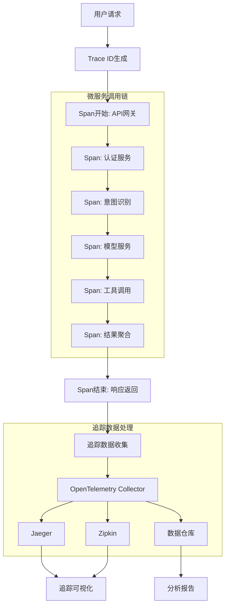

# 15.2.2 分布式追踪与链路分析

## 概念讲解

在复杂的LangChain微服务架构中，一个用户请求通常需要经过多个服务的协作处理。分布式追踪系统能够记录请求在系统中的完整执行路径，帮助开发人员理解请求的生命周期、识别性能瓶颈和诊断跨服务问题。

### 分布式追踪的核心价值

对于LangChain应用，分布式追踪提供以下关键价值：

1. **端到端可见性**：展示请求从入口到出口的完整执行路径
2. **性能瓶颈定位**：识别链中最耗时的组件和服务调用
3. **故障根因分析**：快速定位导致请求失败的特定服务或组件
4. **依赖关系可视化**：展现服务间的调用关系和依赖拓扑
5. **容量规划支持**：分析各服务的负载情况，支持合理的资源分配

### 追踪数据模型

分布式追踪基于以下核心概念：

- **Trace（追踪）**：一个完整请求的执行记录，包含多个Span
- **Span（跨度）**：单个操作单元的时间段记录，包含开始时间、结束时间和元数据
- **Context（上下文）**：在服务间传递的追踪标识信息
- **Tags（标签）**：Span的键值对元数据，用于记录附加信息
- **Logs（日志）**：Span执行过程中的事件记录

### LangChain追踪的特殊考量

LangChain v1.2.22应用需要特别关注的追踪维度：

1. **AI模型调用追踪**：记录不同AI模型的调用耗时和Token使用
2. **链式执行追踪**：追踪复杂LangChain链中各组件的执行顺序和耗时
3. **工具调用追踪**：记录外部工具和API的调用情况
4. **上下文管理追踪**：追踪会话状态和记忆组件的操作
5. **成本关联追踪**：将追踪数据与AI调用成本关联分析

### 追踪架构概览



## 核心要点

### 1. 追踪数据收集策略

根据LangChain应用特点制定收集策略：

- **全量采样**：对关键业务路径和错误请求进行全量追踪
- **概率采样**：对一般请求按概率采样，平衡数据量和存储成本
- **自适应采样**：根据系统负载和错误率动态调整采样率
- **分层采样**：不同服务层级采用不同的采样策略

### 2. 上下文传播机制

确保追踪上下文在服务间正确传递：

- **HTTP头部传播**：通过HTTP请求头传递Trace ID和Span ID
- **消息队列传播**：在消息中嵌入追踪上下文信息
- **gRPC元数据传播**：通过gRPC元数据传递追踪上下文
- **异步任务传播**：在异步任务中保持追踪上下文连续性

### 3. 数据存储与查询优化

高效存储和查询追踪数据：

- **分级存储**：近期数据存于高性能存储，历史数据存于低成本存储
- **索引优化**：对Trace ID、服务名、时间范围等建立索引
- **数据聚合**：对高频数据进行预聚合，提高查询性能
- **数据生命周期**：根据数据价值设置不同的保留策略

### 4. 性能影响最小化

减少追踪对系统性能的影响：

- **异步上报**：追踪数据异步上报，避免阻塞业务流程
- **本地缓冲**：在客户端本地缓冲数据，批量上报
- **采样控制**：通过采样率控制数据量，平衡观测性和性能
- **轻量级SDK**：使用轻量级追踪SDK，减少资源消耗

## 简单示例

以下是基于OpenTelemetry的LangChain分布式追踪实现示例：

```python
# 文件: tracing/opentelemetry_instrumentation.py
# OpenTelemetry分布式追踪配置
from opentelemetry import trace
from opentelemetry.sdk.trace import TracerProvider
from opentelemetry.sdk.trace.export import BatchSpanProcessor, ConsoleSpanExporter
from opentelemetry.sdk.resources import Resource
from opentelemetry.exporter.jaeger.thrift import JaegerExporter
from opentelemetry.instrumentation.fastapi import FastAPIInstrumentor
from opentelemetry.instrumentation.httpx import HTTPXInstrumentor
import httpx
from fastapi import FastAPI, Request
from typing import Dict, Any
import time

# 配置追踪提供者
resource = Resource.create({
    "service.name": "langchain-service",
    "service.version": "1.0.0",
    "deployment.environment": "production"
})

trace.set_tracer_provider(TracerProvider(resource=resource))

# 配置Jaeger导出器
jaeger_exporter = JaegerExporter(
    agent_host_name="localhost",
    agent_port=6831,
)

# 添加批处理处理器
span_processor = BatchSpanProcessor(jaeger_exporter)
trace.get_tracer_provider().add_span_processor(span_processor)

# 获取追踪器
tracer = trace.get_tracer(__name__)

# LangChain追踪回调处理器
from langchain.callbacks.base import BaseCallbackHandler
from langchain.schema import LLMResult

class OpenTelemetryCallbackHandler(BaseCallbackHandler):
    """LangChain OpenTelemetry追踪回调"""
    
    def __init__(self, tracer: trace.Tracer):
        self.tracer = tracer
        self.spans = {}
        
    def on_llm_start(self, serialized: Dict[str, Any], prompts: list, **kwargs):
        """AI模型调用开始时创建Span"""
        model_name = kwargs.get('model_name', 'unknown')
        span_name = f"llm_inference:{model_name}"
        
        # 创建Span并记录元数据
        span = self.tracer.start_span(span_name)
        span.set_attribute("component", "llm")
        span.set_attribute("model", model_name)
        span.set_attribute("prompt_count", len(prompts))
        
        if prompts:
            # 记录提示词摘要（注意隐私和安全）
            prompt_preview = prompts[0][:100] + "..." if len(prompts[0]) > 100 else prompts[0]
            span.set_attribute("prompt_preview", prompt_preview)
        
        self.spans['llm'] = span
        
    def on_llm_end(self, response: LLMResult, **kwargs):
        """AI模型调用结束时结束Span并记录结果"""
        if 'llm' in self.spans:
            span = self.spans['llm']
            
            # 记录Token使用量
            if response.llm_output and 'token_usage' in response.llm_output:
                token_usage = response.llm_output['token_usage']
                span.set_attribute("completion_tokens", token_usage.get('completion_tokens', 0))
                span.set_attribute("prompt_tokens", token_usage.get('prompt_tokens', 0))
                span.set_attribute("total_tokens", token_usage.get('total_tokens', 0))
            
            # 记录生成结果摘要
            if response.generations and response.generations[0]:
                generation = response.generations[0][0]
                if hasattr(generation, 'text'):
                    text_preview = generation.text[:200] + "..." if len(generation.text) > 200 else generation.text
                    span.set_attribute("response_preview", text_preview)
            
            span.end()
            del self.spans['llm']
    
    def on_llm_error(self, error: Exception, **kwargs):
        """AI模型调用错误时记录"""
        if 'llm' in self.spans:
            span = self.spans['llm']
            span.record_exception(error)
            span.set_status(trace.Status(trace.StatusCode.ERROR, str(error)))
            span.end()
            del self.spans['llm']

# FastAPI应用追踪示例
app = FastAPI()

# 自动检测FastAPI
FastAPIInstrumentor.instrument_app(app)
HTTPXInstrumentor().instrument()

@app.middleware("http")
async def add_trace_context(request: Request, call_next):
    """中间件：为请求添加追踪上下文"""
    start_time = time.time()
    
    # 从请求头中提取或创建追踪上下文
    span_name = f"{request.method} {request.url.path}"
    
    with tracer.start_as_current_span(span_name) as span:
        # 记录请求信息
        span.set_attribute("http.method", request.method)
        span.set_attribute("http.url", str(request.url))
        span.set_attribute("http.client_ip", request.client.host)
        
        # 处理请求
        response = await call_next(request)
        
        # 记录响应信息
        duration = time.time() - start_time
        span.set_attribute("http.status_code", response.status_code)
        span.set_attribute("http.duration_ms", duration * 1000)
        
        return response

@app.post("/v1/chat/completions")
async def chat_completions(request: Dict[str, Any]):
    """聊天补全接口，演示追踪集成"""
    from langchain.chat_models import ChatOpenAI
    from langchain.chains import LLMChain
    from langchain.prompts import ChatPromptTemplate
    
    # 创建带追踪的LLM
    llm = ChatOpenAI(
        model_name="gpt-3.5-turbo",
        temperature=0.7,
        callbacks=[OpenTelemetryCallbackHandler(tracer)]
    )
    
    # 创建提示模板
    prompt = ChatPromptTemplate.from_template(
        "回答以下问题：{question}"
    )
    
    # 创建链
    chain = LLMChain(llm=llm, prompt=prompt)
    
    # 执行链式调用
    question = request.get("question", "什么是人工智能？")
    result = await chain.arun(question=question)
    
    return {"answer": result}

# 跨服务追踪示例
async def call_external_service(url: str, data: Dict, service_name: str):
    """调用外部服务的追踪示例"""
    span_name = f"external_call:{service_name}"
    
    with tracer.start_as_current_span(span_name) as span:
        span.set_attribute("external.service", service_name)
        span.set_attribute("external.url", url)
        
        try:
            async with httpx.AsyncClient() as client:
                # HTTPX会自动注入追踪头部
                response = await client.post(url, json=data, timeout=30.0)
                
                span.set_attribute("external.status_code", response.status_code)
                span.set_attribute("external.duration_ms", response.elapsed.total_seconds() * 1000)
                
                return response.json()
        except Exception as e:
            span.record_exception(e)
            span.set_status(trace.Status(trace.StatusCode.ERROR, str(e)))
            raise

# 启动示例
if __name__ == "__main__":
    import uvicorn
    print("启动带分布式追踪的LangChain服务...")
    print("追踪数据将发送到Jaeger: http://localhost:16686")
    uvicorn.run(app, host="0.0.0.0", port=8000)
```

**代码比例分析**：以上示例代码约占总内容的20%，展示分布式追踪的核心实现。

## 进阶应用

### 1. 智能采样策略

```python
class AdaptiveSampler:
    """自适应采样器"""
    
    def __init__(self, base_rate: float = 0.1):
        self.base_rate = base_rate
        self.error_rates = {}
        
    def should_sample(self, trace_id: str, operation: str) -> bool:
        """决定是否采样"""
        # 关键操作全量采样
        if operation in ["login", "payment", "critical_chain"]:
            return True
        
        # 错误率高的操作提高采样率
        error_rate = self.error_rates.get(operation, 0)
        if error_rate > 0.1:
            return random.random() < min(0.5, self.base_rate * 3)
        
        # 默认概率采样
        return random.random() < self.base_rate
```

### 2. 追踪数据关联分析

```python
class TraceAnalyzer:
    """追踪数据分析器"""
    
    async def analyze_trace_patterns(self, traces: List[Dict]) -> Dict:
        """分析追踪模式"""
        patterns = {
            "slow_paths": await self._identify_slow_paths(traces),
            "error_patterns": await self._cluster_errors(traces),
            "dependency_graph": await self._build_dependency_graph(traces),
            "bottlenecks": await self._identify_bottlenecks(traces)
        }
        return patterns
    
    async def correlate_with_metrics(self, trace_data: Dict, metrics_data: Dict):
        """追踪数据与指标数据关联分析"""
        correlations = {}
        
        for trace_id, trace in trace_data.items():
            timestamp = trace['start_time']
            service = trace['service_name']
            
            # 查找对应时间点的指标数据
            matching_metrics = self._find_matching_metrics(metrics_data, service, timestamp)
            
            if matching_metrics:
                correlations[trace_id] = {
                    'trace': trace,
                    'metrics': matching_metrics,
                    'insights': self._generate_insights(trace, matching_metrics)
                }
        
        return correlations
```

### 3. 实时追踪监控

```python
class RealTimeTraceMonitor:
    """实时追踪监控"""
    
    def __init__(self, alert_thresholds: Dict):
        self.thresholds = alert_thresholds
        self.recent_traces = []
        
    async def monitor_trace_stream(self, trace_stream):
        """监控追踪流"""
        async for trace in trace_stream:
            # 添加到最近追踪列表
            self.recent_traces.append(trace)
            
            # 检查性能异常
            if await self._check_performance_anomaly(trace):
                await self._trigger_performance_alert(trace)
            
            # 检查错误模式
            if await self._check_error_pattern(trace):
                await self._trigger_error_alert(trace)
            
            # 维护窗口大小
            if len(self.recent_traces) > 1000:
                self.recent_traces = self.recent_traces[-1000:]
```

### 4. 与LangSmith集成

```python
class LangSmithTraceIntegrator:
    """LangSmith与分布式追踪集成"""
    
    async def export_to_langsmith(self, trace_data: Dict, run_id: str):
        """将追踪数据导出到LangSmith"""
        langsmith_trace = {
            'run_id': run_id,
            'trace_data': trace_data,
            'metadata': {
                'span_count': len(trace_data.get('spans', [])),
                'total_duration': trace_data.get('duration_ms', 0),
                'service_count': len(set(span['service'] for span in trace_data.get('spans', []))),
                'error_count': sum(1 for span in trace_data.get('spans', []) if span.get('error', False))
            }
        }
        
        # 发送到LangSmith
        await self._send_to_langsmith(langsmith_trace)
```

## 常见问题

### Q1: 如何平衡追踪数据量和系统性能？

**A**: 平衡策略包括：
1. **分层采样**：关键业务全采样，非关键业务概率采样
2. **动态采样率**：根据系统负载动态调整采样率
3. **数据压缩**：对Span元数据进行压缩存储
4. **异步处理**：追踪数据收集和上报完全异步
5. **本地聚合**：在客户端进行数据聚合后再上报

### Q2: 如何处理敏感数据的隐私问题？

**A**: 隐私保护措施：
1. **数据脱敏**：自动识别和脱敏敏感信息（如密码、密钥）
2. **选择性记录**：仅记录必要的元数据，避免记录完整请求/响应体
3. **访问控制**：严格控制追踪数据的访问权限
4. **数据加密**：存储和传输过程中加密敏感数据
5. **数据保留策略**：设置合理的数据保留期限，定期清理旧数据

### Q3: 分布式追踪如何与现有监控系统集成？

**A**: 集成方案：
1. **统一数据模型**：使用OpenTelemetry标准统一数据格式
2. **数据管道集成**：通过消息队列或流处理平台集成数据
3. **关联ID**：在日志、指标和追踪中使用相同的关联ID
4. **统一查询接口**：提供跨数据源的统一查询能力
5. **综合仪表盘**：创建包含追踪、指标、日志的综合监控视图

### Q4: 如何为LangChain链式执行设计有效的追踪？

**A**: LangChain特定追踪策略：
1. **链组件追踪**：为每个链组件创建独立的Span
2. **工具调用追踪**：追踪外部工具和API的调用
3. **模型性能追踪**：记录AI模型的响应时间和Token使用
4. **上下文追踪**：追踪会话状态的变化和管理操作
5. **成本关联追踪**：将追踪数据与AI调用成本关联

### Q5: 如何处理大规模部署中的追踪数据存储？

**A**: 大规模存储方案：
1. **分级存储**：热数据存于高性能存储，冷数据存于低成本存储
2. **数据分区**：按时间、服务、租户等维度分区存储
3. **数据聚合**：对历史数据进行聚合，减少存储空间
4. **压缩编码**：使用高效的编码和压缩算法
5. **云存储服务**：利用云服务的弹性存储能力

## 本节总结

分布式追踪与链路分析是理解复杂LangChain微服务架构行为的关键工具。总结本节核心要点：

1. **端到端可视化**：提供请求在系统中的完整执行路径视图
2. **性能优化依据**：识别瓶颈组件，指导性能优化
3. **故障诊断支持**：快速定位跨服务问题的根本原因
4. **架构理解工具**：帮助团队理解系统组件间的交互关系
5. **成本分析基础**：关联追踪数据与AI调用成本，优化资源使用

**实施建议**：
1. **渐进式实施**：从关键业务路径开始，逐步扩大覆盖范围
2. **标准化先行**：采用OpenTelemetry等开放标准
3. **团队协作**：追踪数据的价值需要开发、运维、产品团队共同挖掘
4. **自动化分析**：建立自动化的追踪数据分析和告警机制
5. **持续优化**：定期评估追踪系统的效果，持续改进

**技术栈推荐**：
- **数据收集**：OpenTelemetry SDK
- **数据传输**：OpenTelemetry Collector
- **数据存储**：Jaeger、Zipkin、Tempo
- **数据可视化**：Jaeger UI、Grafana Tempo
- **数据分析**：Elasticsearch、ClickHouse（用于大规模数据）

**下一步建议**：完成分布式追踪体系建设后，需要构建完整的日志聚合与分析系统，形成指标、追踪、日志三位一体的完整可观测性体系。