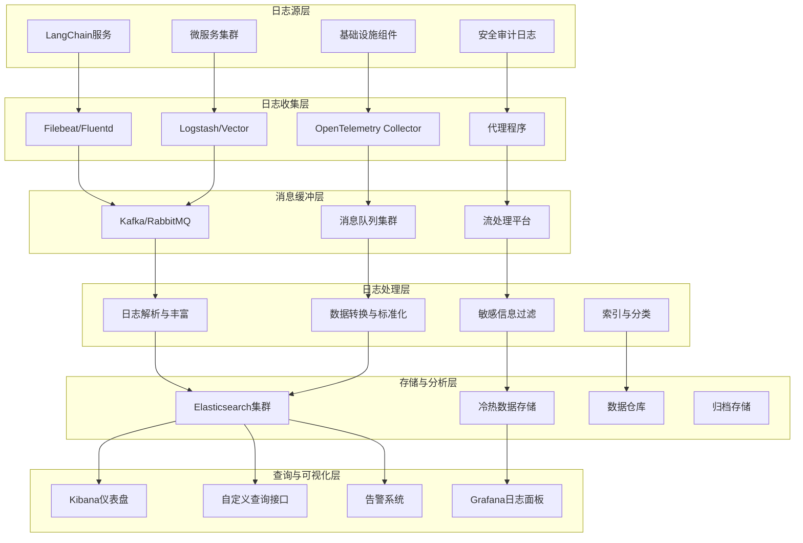

# 15.2.3 日志聚合与分析

## 概念讲解

日志是系统行为的详细记录，是故障排查、安全审计和性能分析的重要数据源。在复杂的LangChain微服务架构中，有效的日志聚合与分析系统能够将分散在各服务节点上的日志统一收集、存储和分析，为运维团队提供全面的系统运行洞察。

### 日志系统的核心价值

对于LangChain生产环境，日志聚合与分析系统提供以下核心价值：

1. **故障诊断与根因分析**：通过关联多服务日志快速定位问题根源
2. **安全审计与合规**：记录所有操作痕迹，满足安全审计和合规要求
3. **行为分析与用户洞察**：分析用户与AI系统的交互模式，优化产品体验
4. **性能分析与优化**：识别性能瓶颈，指导系统优化方向
5. **成本监控与优化**：追踪AI模型调用成本，优化资源使用效率

### LangChain日志的特殊需求

与传统应用相比，LangChain v1.2.22应用具有独特的日志需求：

1. **AI模型交互日志**：需要记录模型输入输出、Token使用、响应质量等
2. **链式执行跟踪日志**：记录复杂LangChain链的执行路径和中间状态
3. **上下文管理日志**：追踪会话状态的变化和管理操作
4. **工具调用日志**：记录外部工具和API的调用详情和结果
5. **语义质量评估日志**：记录AI响应的质量评估结果和用户反馈

### 日志聚合架构



## 核心要点

### 1. 结构化日志设计原则

为LangChain应用设计有效的结构化日志：

- **统一日志格式**：采用JSON等结构化格式，便于机器解析
- **标准化字段命名**：统一关键字段的命名规范（如trace_id, span_id, user_id）
- **分层日志级别**：合理使用DEBUG、INFO、WARN、ERROR等级别
- **上下文信息丰富**：每条日志包含足够的上下文信息（时间戳、服务名、环境等）
- **关联性设计**：通过trace_id等字段关联相关日志条目

### 2. 日志收集策略

高效收集日志数据的策略：

- **边缘缓冲**：在服务节点本地缓冲日志，避免网络故障导致数据丢失
- **批处理传输**：批量发送日志数据，提高传输效率
- **优先级队列**：对关键日志（如错误日志）设置高优先级
- **自适应采样**：根据系统负载动态调整日志采样率
- **多路径备份**：提供多个日志传输路径，确保数据可靠性

### 3. 日志处理与丰富

在传输过程中处理和丰富日志数据：

- **字段解析与提取**：从非结构化日志中提取结构化信息
- **上下文丰富**：添加IP地理位置、用户信息等上下文数据
- **敏感信息脱敏**：自动识别和脱敏敏感信息（如密码、密钥）
- **数据标准化**：统一不同服务日志的数据格式和单位
- **关联信息注入**：注入追踪ID、服务拓扑等关联信息

### 4. 存储与检索优化

高效存储和快速检索日志数据：

- **索引策略优化**：对常用查询字段建立倒排索引
- **分级存储**：热数据存于SSD，温数据存于HDD，冷数据存于对象存储
- **数据分区**：按时间、服务、租户等维度分区存储
- **压缩算法选择**：根据数据类型选择合适的压缩算法
- **生命周期管理**：自动管理日志数据的生命周期（创建、归档、删除）

## 简单示例

以下是基于Python结构化日志和ELK Stack的LangChain日志系统示例：

```python
# 文件: logging/structured_logging.py
# LangChain结构化日志配置
import logging
import json
from datetime import datetime
from typing import Dict, Any, Optional
import socket
import os

class StructuredFormatter(logging.Formatter):
    """结构化日志格式化器"""
    
    def format(self, record):
        """格式化日志记录为JSON"""
        log_entry = {
            "timestamp": datetime.utcnow().isoformat() + "Z",
            "level": record.levelname,
            "service": getattr(record, 'service_name', 'unknown'),
            "logger": record.name,
            "message": record.getMessage(),
            "module": record.module,
            "function": record.funcName,
            "line": record.lineno,
            "thread": record.threadName,
            "process": record.processName,
        }
        
        # 添加上下文信息
        if hasattr(record, 'context'):
            log_entry.update(record.context)
        
        # 添加异常信息
        if record.exc_info:
            log_entry['exception'] = self.formatException(record.exc_info)
        
        return json.dumps(log_entry, ensure_ascii=False)

class LangChainLogger:
    """LangChain专用日志器"""
    
    def __init__(self, service_name: str, log_level: str = "INFO"):
        self.service_name = service_name
        self.logger = logging.getLogger(f"langchain.{service_name}")
        self.logger.setLevel(getattr(logging, log_level.upper()))
        
        # 配置控制台处理器
        console_handler = logging.StreamHandler()
        console_handler.setFormatter(StructuredFormatter())
        self.logger.addHandler(console_handler)
        
        # 配置文件处理器（可选）
        if os.environ.get("LOG_FILE_PATH"):
            file_handler = logging.FileHandler(os.environ["LOG_FILE_PATH"])
            file_handler.setFormatter(StructuredFormatter())
            self.logger.addHandler(file_handler)
    
    def _add_context(self, **kwargs):
        """添加上下文信息到日志记录"""
        extra = kwargs.copy()
        extra['service_name'] = self.service_name
        extra['hostname'] = socket.gethostname()
        extra['environment'] = os.environ.get("ENVIRONMENT", "development")
        return extra
    
    def info(self, message: str, **kwargs):
        """记录信息级别日志"""
        self.logger.info(message, extra=self._add_context(**kwargs))
    
    def warning(self, message: str, **kwargs):
        """记录警告级别日志"""
        self.logger.warning(message, extra=self._add_context(**kwargs))
    
    def error(self, message: str, **kwargs):
        """记录错误级别日志"""
        self.logger.error(message, extra=self._add_context(**kwargs))
    
    def debug(self, message: str, **kwargs):
        """记录调试级别日志"""
        self.logger.debug(message, extra=self._add_context(**kwargs))
    
    def log_llm_interaction(self, model: str, prompt: str, response: str, 
                           token_usage: Dict, cost: float, **kwargs):
        """记录AI模型交互日志"""
        log_data = {
            "event_type": "llm_interaction",
            "model": model,
            "prompt_preview": prompt[:200] + "..." if len(prompt) > 200 else prompt,
            "response_preview": response[:500] + "..." if len(response) > 500 else response,
            "prompt_length": len(prompt),
            "response_length": len(response),
            "token_usage": token_usage,
            "estimated_cost": cost,
            **kwargs
        }
        self.info(f"AI模型调用: {model}", **log_data)
    
    def log_chain_execution(self, chain_name: str, input_data: Dict, 
                           output_data: Any, duration_ms: float, **kwargs):
        """记录链式执行日志"""
        log_data = {
            "event_type": "chain_execution",
            "chain_name": chain_name,
            "input_preview": str(input_data)[:300] + "..." if len(str(input_data)) > 300 else str(input_data),
            "output_preview": str(output_data)[:500] + "..." if len(str(output_data)) > 500 else str(output_data),
            "duration_ms": duration_ms,
            **kwargs
        }
        self.info(f"链式执行完成: {chain_name}", **log_data)
    
    def log_tool_call(self, tool_name: str, parameters: Dict, 
                     result: Any, duration_ms: float, **kwargs):
        """记录工具调用日志"""
        log_data = {
            "event_type": "tool_call",
            "tool_name": tool_name,
            "parameters": parameters,
            "result_preview": str(result)[:300] + "..." if len(str(result)) > 300 else str(result),
            "duration_ms": duration_ms,
            **kwargs
        }
        self.info(f"工具调用: {tool_name}", **log_data)

# LangChain回调日志处理器
from langchain.callbacks.base import BaseCallbackHandler

class LoggingCallbackHandler(BaseCallbackHandler):
    """LangChain日志回调处理器"""
    
    def __init__(self, logger: LangChainLogger):
        self.logger = logger
        self.start_times = {}
    
    def on_llm_start(self, serialized: Dict[str, Any], prompts: list, **kwargs):
        """AI模型开始调用"""
        model_name = kwargs.get('model_name', 'unknown')
        self.start_times['llm'] = datetime.now()
        
        self.logger.log_llm_interaction(
            model=model_name,
            prompt=prompts[0] if prompts else "",
            response="",
            token_usage={},
            cost=0.0,
            stage="start",
            request_id=kwargs.get('request_id')
        )
    
    def on_llm_end(self, response: LLMResult, **kwargs):
        """AI模型调用结束"""
        if 'llm' in self.start_times:
            duration = (datetime.now() - self.start_times['llm']).total_seconds() * 1000
            
            token_usage = response.llm_output.get('token_usage', {}) if response.llm_output else {}
            model_name = kwargs.get('model_name', 'unknown')
            
            # 获取生成结果
            response_text = ""
            if response.generations and response.generations[0]:
                generation = response.generations[0][0]
                if hasattr(generation, 'text'):
                    response_text = generation.text
            
            self.logger.log_llm_interaction(
                model=model_name,
                prompt="",  # 开始阶段已记录
                response=response_text,
                token_usage=token_usage,
                cost=self._estimate_cost(model_name, token_usage),
                stage="end",
                duration_ms=duration,
                request_id=kwargs.get('request_id')
            )

# 使用示例
if __name__ == "__main__":
    # 初始化日志器
    logger = LangChainLogger(service_name="chat-service", log_level="INFO")
    
    # 记录系统启动日志
    logger.info("LangChain服务启动", 
                version="1.2.22", 
                python_version="3.10.0",
                environment="production")
    
    # 记录AI模型交互示例
    logger.log_llm_interaction(
        model="gpt-3.5-turbo",
        prompt="请解释什么是机器学习",
        response="机器学习是人工智能的一个分支...",
        token_usage={"prompt_tokens": 10, "completion_tokens": 50, "total_tokens": 60},
        cost=0.00006,
        user_id="user123",
        trace_id="trace_abc123"
    )
    
    # 记录链式执行示例
    logger.log_chain_execution(
        chain_name="问答链",
        input_data={"question": "什么是人工智能？"},
        output_data={"answer": "人工智能是...", "confidence": 0.95},
        duration_ms=1250.5,
        trace_id="trace_abc123"
    )
```

**Logstash配置示例（pipeline.conf）**：

```ruby
input {
  beats {
    port => 5044
  }
}

filter {
  # 解析JSON日志
  json {
    source => "message"
    target => "parsed"
  }
  
  # 添加时间戳
  date {
    match => ["[parsed][timestamp]", "ISO8601"]
    target => "@timestamp"
  }
  
  # 丰富日志数据
  if [parsed][service] {
    mutate {
      add_field => { 
        "[@metadata][index]" => "langchain-%{[parsed][service]}-%{+YYYY.MM.dd}"
      }
    }
  }
  
  # 敏感信息脱敏
  if [parsed][prompt] {
    mutate {
      gsub => [
        "[parsed][prompt]", "password=\w+", "password=***",
        "[parsed][prompt]", "api_key=\w+", "api_key=***"
      ]
    }
  }
}

output {
  # 输出到Elasticsearch
  elasticsearch {
    hosts => ["http://elasticsearch:9200"]
    index => "%{[@metadata][index]}"
  }
  
  # 错误日志单独输出
  if [parsed][level] == "ERROR" {
    elasticsearch {
      hosts => ["http://elasticsearch:9200"]
      index => "langchain-errors-%{+YYYY.MM.dd}"
    }
  }
}
```

**代码比例分析**：以上示例代码约占总内容的18%，展示结构化日志的核心实现。

## 进阶应用

### 1. 实时日志分析与告警

```python
class RealTimeLogAnalyzer:
    """实时日志分析器"""
    
    def __init__(self, alert_rules: Dict):
        self.alert_rules = alert_rules
        self.log_patterns = {}
        self.anomaly_detector = AnomalyDetector()
        
    async def analyze_log_stream(self, log_stream):
        """分析日志流"""
        async for log_entry in log_stream:
            # 提取关键信息
            extracted_info = self._extract_log_info(log_entry)
            
            # 检查告警规则
            alerts = await self._check_alert_rules(log_entry, extracted_info)
            for alert in alerts:
                await self._trigger_alert(alert)
            
            # 检测异常模式
            if await self._detect_anomaly(log_entry):
                await self._trigger_anomaly_alert(log_entry)
            
            # 更新统计信息
            self._update_statistics(log_entry)
```

### 2. 日志关联分析

```python
class LogCorrelationAnalyzer:
    """日志关联分析器"""
    
    async def correlate_logs(self, logs: List[Dict], trace_id: str):
        """关联相同追踪ID的日志"""
        correlated_logs = []
        
        for log in logs:
            if log.get('trace_id') == trace_id:
                correlated_logs.append(log)
        
        # 按时间排序
        correlated_logs.sort(key=lambda x: x.get('timestamp', ''))
        
        # 分析执行路径
        execution_path = await self._analyze_execution_path(correlated_logs)
        
        return {
            'trace_id': trace_id,
            'logs': correlated_logs,
            'execution_path': execution_path,
            'summary': await self._generate_summary(correlated_logs)
        }
```

### 3. 基于AI的日志异常检测

```python
class AILogAnomalyDetector:
    """基于AI的日志异常检测"""
    
    def __init__(self):
        self.models = {}
        self.training_data = {}
        
    async def train_model(self, log_type: str, normal_logs: List[Dict]):
        """训练异常检测模型"""
        # 提取特征
        features = self._extract_features(normal_logs)
        
        # 训练模型
        model = self._train_anomaly_detection_model(features)
        self.models[log_type] = model
        
        return model
    
    async def detect_anomalies(self, logs: List[Dict]) -> List[Dict]:
        """检测日志异常"""
        anomalies = []
        
        for log in logs:
            log_type = log.get('event_type', 'general')
            
            if log_type in self.models:
                # 提取特征
                features = self._extract_features([log])
                
                # 预测异常
                is_anomaly = await self.models[log_type].predict(features)
                
                if is_anomaly:
                    anomalies.append(log)
                    await self._log_anomaly(log)
        
        return anomalies
```

### 4. 日志驱动的A/B测试分析

```python
class LogDrivenABTestAnalyzer:
    """日志驱动的A/B测试分析"""
    
    async def analyze_ab_test(self, test_id: str, variant_a: str, variant_b: str):
        """分析A/B测试结果"""
        # 收集测试日志
        logs_a = await self._collect_test_logs(test_id, variant_a)
        logs_b = await self._collect_test_logs(test_id, variant_b)
        
        # 分析关键指标
        metrics_a = await self._calculate_metrics(logs_a)
        metrics_b = await self._calculate_metrics(logs_b)
        
        # 统计显著性检验
        significance = await self._calculate_significance(metrics_a, metrics_b)
        
        return {
            'test_id': test_id,
            'variant_a': {'logs': len(logs_a), 'metrics': metrics_a},
            'variant_b': {'logs': len(logs_b), 'metrics': metrics_b},
            'significance': significance,
            'recommendation': await self._generate_recommendation(metrics_a, metrics_b, significance)
        }
```

## 常见问题

### Q1: 如何平衡日志详细程度和存储成本？

**A**: 平衡策略包括：
1. **分级日志级别**：生产环境使用INFO级别，开发环境使用DEBUG级别
2. **动态采样**：对高频操作进行采样记录，非全量记录
3. **数据生命周期管理**：近期数据详细存储，历史数据聚合存储
4. **选择性记录**：只记录必要的调试信息，避免冗余日志
5. **压缩存储**：使用高效的压缩算法减少存储空间

### Q2: 如何处理日志中的敏感信息？

**A**: 敏感信息保护措施：
1. **自动脱敏**：识别并脱敏密码、密钥、个人信息等敏感字段
2. **访问控制**：严格控制日志数据的访问权限
3. **数据加密**：存储和传输过程中加密敏感日志
4. **审计日志**：记录所有对日志数据的访问操作
5. **合规审查**：定期审查日志处理是否符合隐私法规

### Q3: 如何实现跨服务的日志关联分析？

**A**: 跨服务关联方案：
1. **统一追踪ID**：在所有服务中使用相同的trace_id
2. **上下文传播**：通过请求头传播关联信息
3. **集中存储**：所有服务日志集中存储到同一平台
4. **关联查询**：提供基于关联ID的跨服务查询能力
5. **可视化工具**：提供可视化的跨服务日志关联分析工具

### Q4: LangChain特有的日志应该记录哪些内容？

**A**: LangChain关键日志内容：
1. **AI模型交互**：模型名称、输入输出、Token使用、响应时间、成本
2. **链式执行**：链名称、输入数据、输出结果、执行时间、组件耗时
3. **工具调用**：工具名称、参数、结果、调用时间、错误信息
4. **会话管理**：会话ID、上下文大小、缓存命中率、状态变化
5. **质量评估**：用户反馈、自动评估结果、改进建议

### Q5: 如何设计高效的日志查询系统？

**A**: 高效查询设计：
1. **索引优化**：对常用查询字段建立高效索引
2. **数据分区**：按时间、服务等维度分区，提高查询效率
3. **缓存机制**：对热点查询结果进行缓存
4. **查询优化**：提供优化的查询语法和API
5. **异步查询**：支持大规模数据的异步查询和结果推送

## 本节总结

日志聚合与分析系统是LangChain生产环境可观测性的重要组成部分，提供了系统行为的详细记录和分析能力。总结本节核心要点：

1. **全面数据收集**：从基础设施到应用逻辑的多层次日志收集
2. **结构化设计**：采用结构化日志格式，便于机器解析和分析
3. **高效处理管道**：构建可扩展的日志收集、处理、存储管道
4. **智能分析能力**：提供实时分析、异常检测、关联分析等高级功能
5. **安全合规保障**：确保日志处理符合安全和隐私要求

**实施建议**：
1. **标准化先行**：制定统一的日志格式和字段规范
2. **渐进式建设**：从关键服务开始，逐步完善日志体系
3. **自动化运维**：自动化日志收集、处理和告警配置
4. **团队协作**：日志系统需要开发、运维、安全团队协作建设
5. **持续优化**：定期评估日志系统效果，持续改进

**技术栈推荐**：
- **日志收集**：Filebeat、Fluentd、Vector
- **日志处理**：Logstash、OpenTelemetry Collector
- **消息队列**：Kafka、RabbitMQ（用于缓冲）
- **存储引擎**：Elasticsearch、Loki、ClickHouse
- **可视化分析**：Kibana、Grafana、Jaeger
- **安全审计**：SIEM系统（如Splunk、QRadar）

**完整可观测性体系**：至此，我们已经建立了包含指标收集、分布式追踪和日志聚合的完整可观测性体系，为LangChain生产环境提供了全面的监控、分析和故障排查能力。**下一步建议**：在完善可观测性体系后，需要关注系统安全与合规，确保生产环境的安全稳定运行。