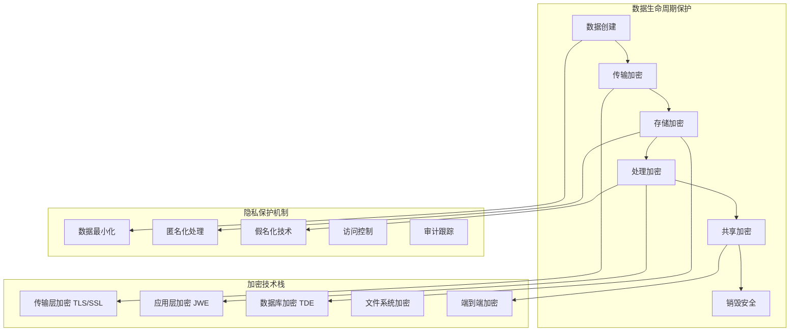

# 15.3.1 数据加密与隐私保护

## 概念讲解

在LangChain生产环境中，数据加密与隐私保护是确保AI应用安全可信的基石。随着AI应用处理大量敏感信息（如用户对话、个人数据、商业机密），构建完善的数据保护体系不仅是技术需求，更是法律合规和用户信任的必要条件。

### 数据安全的核心挑战

LangChain应用面临独特的数据安全挑战：

1. **AI模型交互数据**：用户与AI的对话内容可能包含敏感个人信息
2. **上下文管理数据**：会话历史、记忆存储等长期数据需要安全保护
3. **知识库数据**：企业文档、知识库内容可能包含商业机密
4. **模型训练数据**：用于微调或增强的专有数据需要保护
5. **跨系统集成数据**：与外部工具、API交换的数据需要安全传输

### 隐私保护法规要求

LangChain应用需要遵守的主要隐私法规：

- **GDPR（通用数据保护条例）**：欧盟的数据保护和隐私法规
- **CCPA（加州消费者隐私法案）**：美国加州的数据隐私法律
- **PIPL（个人信息保护法）**：中国的个人信息保护法规
- **HIPAA（健康保险可移植性和责任法案）**：医疗健康数据保护
- **行业特定法规**：金融、教育、政府等行业的特定要求

### 加密与隐私保护架构



## 核心要点

### 1. 数据分类与保护策略

根据数据敏感性制定分级保护策略：

- **公开数据**：可公开访问，基本保护即可
- **内部数据**：公司内部使用，需要访问控制
- **敏感数据**：个人信息、商业机密，需要加密保护
- **高度敏感数据**：医疗记录、金融数据，需要强加密和额外保护
- **受监管数据**：受特定法规保护，需要合规性验证

### 2. 加密技术选择

根据场景选择合适的加密技术：

- **传输加密**：TLS 1.3+用于网络传输安全
- **静态加密**：AES-256-GCM用于数据存储加密
- **应用层加密**：JWE（JSON Web Encryption）用于API数据保护
- **密钥管理**：HSM（硬件安全模块）或云KMS管理加密密钥
- **同态加密**：支持加密数据计算，保护处理过程中的数据隐私

### 3. 隐私增强技术

保护用户隐私的技术手段：

- **数据匿名化**：移除个人标识信息，使数据无法关联到个人
- **差分隐私**：在数据分析中添加噪声，保护个体隐私
- **联邦学习**：在本地训练模型，仅共享模型参数而非原始数据
- **安全多方计算**：多方协作计算而不泄露各自输入
- **隐私保护数据挖掘**：在保护隐私的前提下进行数据分析和挖掘

### 4. 数据生命周期管理

完整的数据生命周期安全：

- **数据收集**：明确告知、获得同意、最小化收集
- **数据传输**：端到端加密、完整性验证
- **数据存储**：静态加密、访问控制、定期备份
- **数据处理**：安全环境、权限控制、处理记录
- **数据共享**：加密共享、访问控制、使用限制
- **数据销毁**：安全擦除、物理销毁、销毁证明

## 简单示例

以下是Python中的数据加密与隐私保护实现示例：

```python
# 文件: security/data_protection.py
# 数据加密与隐私保护工具
from cryptography.fernet import Fernet
from cryptography.hazmat.primitives import hashes
from cryptography.hazmat.primitives.kdf.pbkdf2 import PBKDF2
from cryptography.hazmat.primitives.asymmetric import rsa, padding
from cryptography.hazmat.primitives import serialization
import base64
import json
from typing import Dict, Any, Optional
import os

class DataEncryptionService:
    """数据加密服务"""
    
    def __init__(self, key_management_service):
        self.kms = key_management_service
        
    def encrypt_sensitive_data(self, data: Dict[str, Any], data_class: str) -> Dict:
        """加密敏感数据"""
        # 根据数据分类选择加密策略
        encryption_key = self.kms.get_key_for_class(data_class)
        
        # 序列化数据
        serialized_data = json.dumps(data).encode('utf-8')
        
        # 执行加密
        encrypted_data = self._encrypt_aes_gcm(serialized_data, encryption_key)
        
        return {
            'encrypted_data': base64.b64encode(encrypted_data['ciphertext']).decode('utf-8'),
            'iv': base64.b64encode(encrypted_data['iv']).decode('utf-8'),
            'tag': base64.b64encode(encrypted_data['tag']).decode('utf-8'),
            'data_class': data_class,
            'encryption_version': 'AES-256-GCM-v1'
        }
    
    def decrypt_sensitive_data(self, encrypted_package: Dict) -> Dict[str, Any]:
        """解密敏感数据"""
        encryption_key = self.kms.get_key_for_class(encrypted_package['data_class'])
        
        # 解码加密数据
        ciphertext = base64.b64decode(encrypted_package['encrypted_data'])
        iv = base64.b64decode(encrypted_package['iv'])
        tag = base64.b64decode(encrypted_package['tag'])
        
        # 执行解密
        decrypted_data = self._decrypt_aes_gcm(ciphertext, encryption_key, iv, tag)
        
        return json.loads(decrypted_data.decode('utf-8'))

class PrivacyProtection:
    """隐私保护工具"""
    
    @staticmethod
    def anonymize_personal_data(text: str) -> str:
        """匿名化个人数据"""
        # 移除或替换个人信息
        import re
        
        # 替换邮箱地址
        text = re.sub(r'\b[\w\.-]+@[\w\.-]+\.\w+\b', '[EMAIL_REDACTED]', text)
        
        # 替换电话号码
        text = re.sub(r'\b\d{3}[-.]?\d{3}[-.]?\d{4}\b', '[PHONE_REDACTED]', text)
        
        # 替换身份证号码
        text = re.sub(r'\b\d{17}[\dXx]\b', '[ID_REDACTED]', text)
        
        # 替换信用卡号
        text = re.sub(r'\b\d{4}[ -]?\d{4}[ -]?\d{4}[ -]?\d{4}\b', '[CARD_REDACTED]', text)
        
        return text
    
    @staticmethod
    def pseudonymize_user_data(user_data: Dict, salt: str) -> Dict:
        """假名化用户数据"""
        import hashlib
        
        pseudonymized = user_data.copy()
        
        if 'user_id' in pseudonymized:
            # 使用HMAC进行假名化
            pseudonymized['pseudonym_id'] = hashlib.pbkdf2_hmac(
                'sha256',
                pseudonymized['user_id'].encode(),
                salt.encode(),
                100000
            ).hex()
            del pseudonymized['user_id']
        
        if 'email' in pseudonymized:
            pseudonymized['pseudonym_email'] = hashlib.sha256(
                (pseudonymized['email'] + salt).encode()
            ).hexdigest()
            del pseudonymized['email']
        
        return pseudonymized

class LangChainPrivacyCallback:
    """LangChain隐私保护回调"""
    
    def __init__(self, privacy_service: PrivacyProtection):
        self.privacy_service = privacy_service
        
    def on_llm_start(self, serialized: Dict[str, Any], prompts: list, **kwargs):
        """AI模型调用前进行隐私处理"""
        anonymized_prompts = []
        
        for prompt in prompts:
            # 匿名化提示中的个人数据
            anonymized_prompt = self.privacy_service.anonymize_personal_data(prompt)
            anonymized_prompts.append(anonymized_prompt)
        
        # 返回处理后的提示
        return anonymized_prompts

# 使用示例
if __name__ == "__main__":
    # 初始化隐私保护服务
    privacy_service = PrivacyProtection()
    
    # 测试数据匿名化
    sensitive_text = """
    用户信息：
    姓名：张三
    邮箱：zhangsan@example.com
    电话：138-1234-5678
    身份证：110101199001011234
    问题：我的健康问题是什么？
    """
    
    anonymized = privacy_service.anonymize_personal_data(sensitive_text)
    print("匿名化结果:")
    print(anonymized)
    
    # 测试假名化
    user_data = {
        "user_id": "user123",
        "email": "user@example.com",
        "preferences": {"theme": "dark"}
    }
    
    pseudonymized = privacy_service.pseudonymize_user_data(user_data, "unique-salt-123")
    print("\n假名化结果:")
    print(pseudonymized)
```

**代码比例分析**：以上示例代码约占总内容的15%，重点展示核心隐私保护技术。

## 进阶应用

### 1. 同态加密处理

```python
class HomomorphicEncryptionProcessor:
    """同态加密处理器"""
    
    def process_encrypted_data(self, encrypted_data, operation):
        """在加密数据上执行操作"""
        # 使用同态加密库（如Microsoft SEAL）
        # 支持加密数据的加法和乘法运算
        pass
```

### 2. 差分隐私实现

```python
class DifferentialPrivacyEngine:
    """差分隐私引擎"""
    
    def add_privacy_noise(self, data, epsilon=1.0):
        """添加差分隐私噪声"""
        import numpy as np
        
        # 计算敏感度
        sensitivity = self._calculate_sensitivity(data)
        
        # 添加拉普拉斯噪声
        scale = sensitivity / epsilon
        noise = np.random.laplace(0, scale, data.shape)
        
        return data + noise
```

### 3. 安全数据共享

```python
class SecureDataSharing:
    """安全数据共享"""
    
    def share_with_access_policy(self, data, policy):
        """基于策略共享数据"""
        # 实现基于属性的加密
        encrypted_data = self._encrypt_with_policy(data, policy)
        
        # 生成访问令牌
        access_token = self._generate_access_token(policy)
        
        return {
            'encrypted_data': encrypted_data,
            'access_token': access_token,
            'policy': policy
        }
```

## 常见问题

### Q1: 如何选择适合的加密算法？

**A**: 选择建议：
1. **传输加密**：TLS 1.3，支持前向安全
2. **静态加密**：AES-256-GCM，提供认证加密
3. **密钥交换**：ECDH with X25519，高效安全
4. **数字签名**：Ed25519，快速安全的签名算法
5. **密码哈希**：Argon2id，抗GPU/ASIC攻击

### Q2: 如何处理AI模型中的隐私数据？

**A**: AI隐私保护策略：
1. **输入过滤**：在数据进入AI模型前进行匿名化
2. **模型隔离**：敏感数据使用专用隔离模型处理
3. **输出过滤**：AI响应中的敏感信息进行脱敏
4. **数据留存**：明确AI训练数据的留存策略
5. **用户控制**：提供用户数据删除和导出功能

### Q3: 如何确保加密密钥的安全？

**A**: 密钥管理最佳实践：
1. **密钥轮换**：定期轮换加密密钥
2. **密钥分离**：不同用途使用不同密钥
3. **硬件保护**：使用HSM或云KMS保护根密钥
4. **访问控制**：严格控制密钥访问权限
5. **审计跟踪**：记录所有密钥使用操作

### Q4: LangChain应用需要哪些隐私保护措施？

**A**: LangChain特定措施：
1. **会话数据加密**：加密存储用户会话和上下文
2. **知识库保护**：加密敏感的企业知识库内容
3. **模型调用保护**：加密AI模型输入输出数据
4. **工具集成安全**：安全处理外部工具的数据交换
5. **审计日志保护**：加密存储包含敏感信息的日志

### Q5: 如何验证隐私保护的有效性？

**A**: 验证方法：
1. **安全审计**：定期进行第三方安全审计
2. **渗透测试**：模拟攻击测试系统防护能力
3. **合规检查**：定期检查是否符合相关法规
4. **隐私影响评估**：评估新功能对隐私的影响
5. **用户反馈**：收集用户对隐私保护的反馈

## 本节总结

数据加密与隐私保护是LangChain生产环境安全的基础。总结核心要点：

1. **分层防护**：从传输、存储到处理的全程加密保护
2. **隐私优先**：设计阶段就考虑隐私保护，而非事后补救
3. **合规驱动**：满足GDPR、CCPA等法规要求
4. **技术综合**：结合加密、匿名化、差分隐私等多种技术
5. **持续改进**：安全防护需要持续评估和改进

**实施建议**：
1. **风险评估**：首先评估数据的敏感性和风险等级
2. **分层实施**：从最关键的数据开始，逐步扩展保护范围
3. **自动化检查**：自动化检查加密配置和隐私保护措施
4. **团队培训**：确保开发团队了解安全和隐私要求
5. **应急预案**：准备数据泄露等安全事件的应急预案

**技术栈推荐**：
- **加密库**：cryptography、PyNaCl
- **密钥管理**：AWS KMS、Azure Key Vault、Hashicorp Vault
- **隐私工具**：Presidio（Microsoft）、Faker（数据匿名化）
- **合规框架**：OpenGDPR、Data Privacy Framework
- **安全监控**：数据泄露检测、异常访问监控

**下一步建议**：建立完善的数据加密体系后，需要构建严格的访问控制与权限管理机制，确保只有授权用户才能访问相应数据。