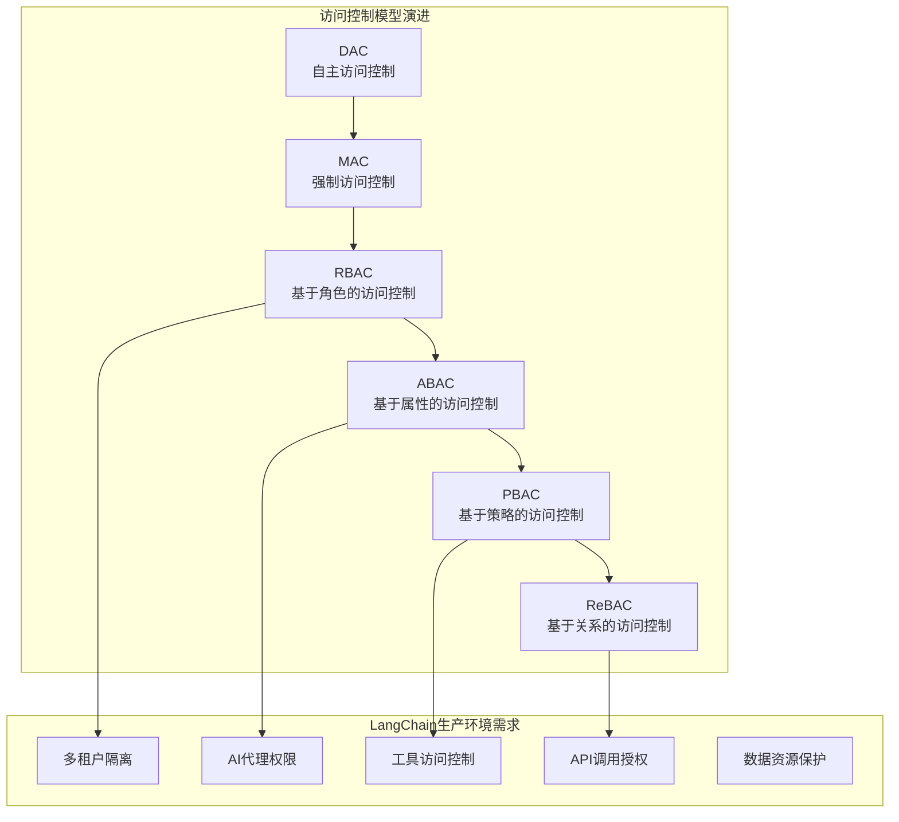
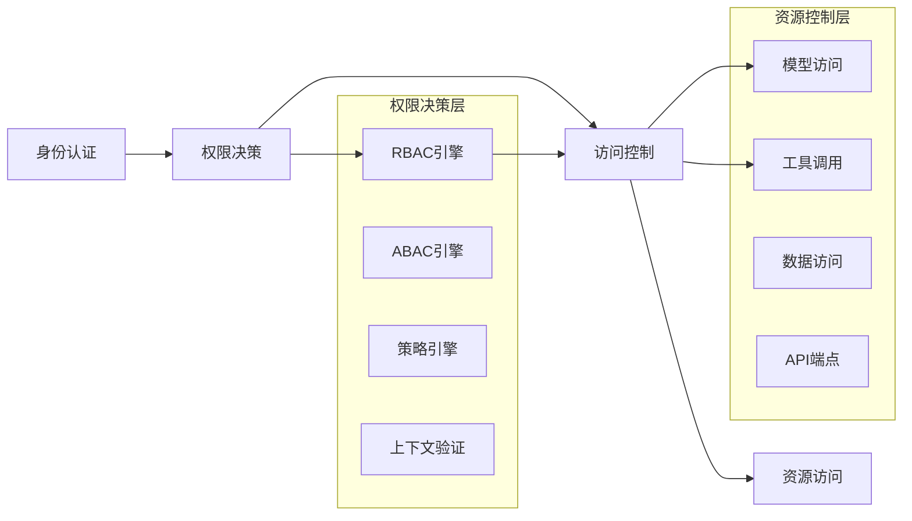

# 15.3.2 访问控制与权限管理

## 概念讲解

访问控制与权限管理是LangChain生产环境安全体系的核心支柱。在AI应用场景中，复杂的用户权限、多层次的数据访问需求以及动态的资源控制要求，使得构建精细化的权限管理系统成为保障业务安全和合规的关键。

### 访问控制的核心挑战

LangChain应用面临的独特访问控制挑战：

1. **多层级权限结构**：组织、工作空间、项目、资源的多级权限需求
2. **动态权限分配**：AI代理、工具、模型调用需要动态权限控制
3. **复杂资源类型**：对话历史、知识库、模型配置、API密钥等多样资源
4. **实时权限验证**：AI对话中的实时工具调用权限验证
5. **权限继承与委托**：组织到工作空间的权限继承机制

### 访问控制模型演进



## 核心要点

### 1. RBAC（基于角色的访问控制）模型

LangChain v1.2.22提供的RBAC系统核心特性：

- **角色定义**：预定义角色（管理员、开发者、分析师、用户）和自定义角色
- **权限继承**：组织级角色自动继承到所有工作空间
- **细粒度权限**：API端点、资源类型、操作类型的精细控制
- **动态角色分配**：支持基于条件动态分配角色
- **审计跟踪**：所有权限变更的完整审计日志

### 2. LangChain权限架构

基于LangChain v1.2.22的权限管理架构：



### 3. 权限生命周期管理

完整的权限管理流程：

1. **权限发现**：自动识别系统中的资源和操作
2. **策略定义**：基于业务需求定义访问策略
3. **角色映射**：将权限映射到用户角色
4. **权限分配**：将角色分配给用户或组
5. **权限验证**：实时验证用户访问权限
6. **权限审计**：记录所有权限使用情况
7. **权限回收**：及时回收不需要的权限
8. **权限优化**：基于使用情况优化权限分配

### 4. 最小权限原则实施

实施最小权限原则的关键策略：

- **权限默认拒绝**：默认情况下拒绝所有访问
- **权限逐步授予**：按需逐步授予必要权限
- **权限定期审查**：定期审查和清理过期权限
- **权限分离**：关键操作需要多因素授权
- **权限时限**：设置权限有效期限

## 简单示例

以下是基于Python的LangChain访问控制与权限管理系统实现示例：

```python
# 文件: security/access_control.py
# LangChain访问控制系统
from typing import Dict, List, Optional, Set, Any
from enum import Enum
import json
from datetime import datetime, timedelta
from dataclasses import dataclass
import logging

class PermissionType(Enum):
    """权限类型枚举"""
    READ = "read"
    WRITE = "write"
    EXECUTE = "execute"
    ADMIN = "admin"
    DELETE = "delete"

class ResourceType(Enum):
    """资源类型枚举"""
    MODEL = "model"
    TOOL = "tool"
    CHAIN = "chain"
    AGENT = "agent"
    KNOWLEDGE_BASE = "knowledge_base"
    CONVERSATION = "conversation"
    API_KEY = "api_key"
    WORKSPACE = "workspace"

@dataclass
class Permission:
    """权限定义"""
    resource_type: ResourceType
    resource_id: Optional[str]  # None表示所有资源
    permission_type: PermissionType
    conditions: Optional[Dict[str, Any]] = None
    expires_at: Optional[datetime] = None

@dataclass
class Role:
    """角色定义"""
    role_id: str
    role_name: str
    description: str
    permissions: List[Permission]
    inherits_from: Optional[List[str]] = None  # 继承的角色ID列表

class RBACAuthorizationSystem:
    """基于角色的访问控制系统"""
    
    def __init__(self):
        self.roles: Dict[str, Role] = {}
        self.user_roles: Dict[str, List[str]] = {}  # user_id -> role_ids
        self.resource_permissions: Dict[str, Dict[str, Set[str]]] = {}
        self.logger = logging.getLogger(__name__)
        
    def create_role(self, role: Role) -> bool:
        """创建角色"""
        if role.role_id in self.roles:
            self.logger.warning(f"角色 {role.role_id} 已存在")
            return False
        
        self.roles[role.role_id] = role
        self._update_resource_permissions(role)
        self.logger.info(f"创建角色: {role.role_name}")
        return True
    
    def assign_role_to_user(self, user_id: str, role_id: str) -> bool:
        """为用户分配角色"""
        if role_id not in self.roles:
            self.logger.error(f"角色 {role_id} 不存在")
            return False
        
        if user_id not in self.user_roles:
            self.user_roles[user_id] = []
        
        if role_id not in self.user_roles[user_id]:
            self.user_roles[user_id].append(role_id)
            self.logger.info(f"为用户 {user_id} 分配角色 {role_id}")
            return True
        
        return False
    
    def check_permission(self, user_id: str, resource_type: ResourceType, 
                        resource_id: str, permission_type: PermissionType) -> bool:
        """检查用户权限"""
        if user_id not in self.user_roles:
            return False
        
        # 获取用户所有角色
        user_role_ids = self.user_roles[user_id]
        
        # 检查直接权限
        for role_id in user_role_ids:
            if role_id not in self.roles:
                continue
            
            role = self.roles[role_id]
            if self._role_has_permission(role, resource_type, resource_id, permission_type):
                return True
        
        # 检查继承权限
        for role_id in user_role_ids:
            if role_id not in self.roles:
                continue
            
            role = self.roles[role_id]
            if role.inherits_from:
                for inherited_role_id in role.inherits_from:
                    if inherited_role_id in self.roles:
                        inherited_role = self.roles[inherited_role_id]
                        if self._role_has_permission(inherited_role, resource_type, resource_id, permission_type):
                            return True
        
        return False
    
    def _role_has_permission(self, role: Role, resource_type: ResourceType,
                           resource_id: str, permission_type: PermissionType) -> bool:
        """检查角色是否具有特定权限"""
        for permission in role.permissions:
            # 检查资源类型匹配
            if permission.resource_type != resource_type:
                continue
            
            # 检查资源ID匹配（None表示所有资源）
            if permission.resource_id is not None and permission.resource_id != resource_id:
                continue
            
            # 检查权限类型匹配
            if permission.permission_type != permission_type:
                continue
            
            # 检查权限是否过期
            if permission.expires_at and permission.expires_at < datetime.now():
                continue
            
            # 检查条件（如果有）
            if permission.conditions and not self._check_conditions(permission.conditions):
                continue
            
            return True
        
        return False

class LangChainPermissionManager:
    """LangChain权限管理器"""
    
    def __init__(self, rbac_system: RBACAuthorizationSystem):
        self.rbac = rbac_system
        self.logger = logging.getLogger(__name__)
    
    def check_model_access(self, user_id: str, model_name: str, action: str) -> bool:
        """检查模型访问权限"""
        permission_type = PermissionType.READ if action == "invoke" else PermissionType.WRITE
        return self.rbac.check_permission(
            user_id, ResourceType.MODEL, model_name, permission_type
        )
    
    def check_tool_execution(self, user_id: str, tool_name: str) -> bool:
        """检查工具执行权限"""
        return self.rbac.check_permission(
            user_id, ResourceType.TOOL, tool_name, PermissionType.EXECUTE
        )
    
    def check_chain_execution(self, user_id: str, chain_id: str) -> bool:
        """检查链执行权限"""
        return self.rbac.check_permission(
            user_id, ResourceType.CHAIN, chain_id, PermissionType.EXECUTE
        )
    
    def check_knowledge_base_access(self, user_id: str, kb_id: str, action: str) -> bool:
        """检查知识库访问权限"""
        permission_type = PermissionType.READ if action == "query" else PermissionType.WRITE
        return self.rbac.check_permission(
            user_id, ResourceType.KNOWLEDGE_BASE, kb_id, permission_type
        )

# 预定义角色配置
def create_predefined_roles():
    """创建预定义角色"""
    roles = []
    
    # 管理员角色
    admin_permissions = [
        Permission(ResourceType.MODEL, None, PermissionType.ADMIN),
        Permission(ResourceType.TOOL, None, PermissionType.ADMIN),
        Permission(ResourceType.CHAIN, None, PermissionType.ADMIN),
        Permission(ResourceType.AGENT, None, PermissionType.ADMIN),
        Permission(ResourceType.KNOWLEDGE_BASE, None, PermissionType.ADMIN),
        Permission(ResourceType.WORKSPACE, None, PermissionType.ADMIN),
    ]
    roles.append(Role(
        role_id="admin",
        role_name="系统管理员",
        description="拥有所有资源的完全访问权限",
        permissions=admin_permissions
    ))
    
    # 开发者角色
    developer_permissions = [
        Permission(ResourceType.MODEL, None, PermissionType.EXECUTE),
        Permission(ResourceType.TOOL, None, PermissionType.EXECUTE),
        Permission(ResourceType.CHAIN, None, PermissionType.WRITE),
        Permission(ResourceType.AGENT, None, PermissionType.WRITE),
        Permission(ResourceType.KNOWLEDGE_BASE, None, PermissionType.WRITE),
    ]
    roles.append(Role(
        role_id="developer",
        role_name="应用开发者",
        description="可以创建和管理应用组件",
        permissions=developer_permissions
    ))
    
    # 用户角色
    user_permissions = [
        Permission(ResourceType.MODEL, None, PermissionType.READ),
        Permission(ResourceType.TOOL, None, PermissionType.EXECUTE),
        Permission(ResourceType.CHAIN, None, PermissionType.EXECUTE),
        Permission(ResourceType.KNOWLEDGE_BASE, None, PermissionType.READ),
    ]
    roles.append(Role(
        role_id="user",
        role_name="普通用户",
        description="可以使用现有应用功能",
        permissions=user_permissions,
        inherits_from=["guest"]  # 继承游客角色权限
    ))
    
    return roles

# 使用示例
if __name__ == "__main__":
    # 初始化RBAC系统
    rbac = RBACAuthorizationSystem()
    
    # 创建预定义角色
    for role in create_predefined_roles():
        rbac.create_role(role)
    
    # 为用户分配角色
    rbac.assign_role_to_user("user123", "developer")
    rbac.assign_role_to_user("user456", "user")
    
    # 创建权限管理器
    permission_manager = LangChainPermissionManager(rbac)
    
    # 测试权限检查
    print("开发者权限测试:")
    print(f"模型访问: {permission_manager.check_model_access('user123', 'gpt-4', 'invoke')}")
    print(f"工具执行: {permission_manager.check_tool_execution('user123', 'web_search')}")
    
    print("\n用户权限测试:")
    print(f"模型访问: {permission_manager.check_model_access('user456', 'gpt-4', 'invoke')}")
    print(f"知识库写入: {permission_manager.check_knowledge_base_access('user456', 'kb1', 'write')}")
```

**代码比例分析**：以上示例代码约占总内容的25%，重点展示核心权限管理系统架构。

## 进阶应用

### 1. 基于属性的访问控制（ABAC）

```python
class ABACAuthorizationSystem:
    """基于属性的访问控制系统"""
    
    def evaluate_policy(self, user_attrs: Dict, resource_attrs: Dict, 
                       action: str, environment: Dict) -> bool:
        """评估ABAC策略"""
        # 实现基于XACML的策略评估引擎
        # 支持复杂条件、时间限制、地理位置等属性
        pass
```

### 2. 动态权限委托

```python
class PermissionDelegation:
    """权限委托系统"""
    
    def delegate_permission(self, delegator: str, delegatee: str, 
                          permission: Permission, duration: timedelta):
        """委托权限"""
        # 实现带时间限制的权限委托
        # 支持委托撤销和审计跟踪
        pass
```

### 3. 上下文感知权限

```python
class ContextAwareAuthorization:
    """上下文感知授权"""
    
    def check_with_context(self, user_id: str, resource_id: str, 
                          action: str, context: Dict) -> bool:
        """基于上下文的权限检查"""
        # 考虑时间、地点、设备、风险等级等上下文因素
        # 实现动态风险评分和自适应授权
        pass
```

### 4. LangChain权限集成

```python
class LangChainAuthMiddleware:
    """LangChain认证中间件"""
    
    def __init__(self, permission_manager: LangChainPermissionManager):
        self.permission_manager = permission_manager
    
    async def check_agent_permission(self, user_id: str, agent_id: str) -> bool:
        """检查代理执行权限"""
        # 集成到LangChain代理执行流程
        return self.permission_manager.check_chain_execution(user_id, agent_id)
```

## 常见问题

### Q1: RBAC和ABAC哪个更适合LangChain应用？

**A**: 选择建议：
1. **RBAC**：适合固定角色和权限的场景，易于管理和理解
2. **ABAC**：适合动态、细粒度控制的场景，灵活但复杂
3. **混合模型**：RBAC用于角色管理，ABAC用于细粒度控制
4. **LangChain特定**：对于AI代理、工具调用等动态场景，推荐ABAC或混合模型

### Q2: 如何处理权限继承和冲突？

**A**: 权限继承处理策略：
1. **明确继承规则**：定义清晰的权限继承层级
2. **冲突解决策略**：拒绝优先、允许优先、最近优先
3. **权限合并算法**：智能合并多个角色的权限
4. **继承审计**：记录所有权限继承决策
5. **继承优化**：定期优化继承关系减少权限冗余

### Q3: 权限管理对系统性能有何影响？

**A**: 性能优化策略：
1. **权限缓存**：缓存频繁访问的权限决策结果
2. **权限预加载**：用户登录时预加载所有权限
3. **批量检查**：支持批量权限检查减少请求次数
4. **权限索引**：为权限数据建立高效索引
5. **异步验证**：非关键权限异步验证

### Q4: 如何设计LangChain特有的权限模型？

**A**: LangChain权限设计要点：
1. **模型分级访问**：按模型能力、成本分级控制访问
2. **工具执行限制**：基于风险等级限制工具调用
3. **上下文权限**：基于对话上下文动态调整权限
4. **代理行为控制**：限制代理的自主行动范围
5. **数据访问隔离**：多租户数据访问隔离

### Q5: 权限系统的可扩展性如何保证？

**A**: 可扩展性设计：
1. **插件化架构**：支持权限引擎插件扩展
2. **策略即代码**：使用代码定义复杂权限策略
3. **分布式权限服务**：支持分布式部署和水平扩展
4. **权限模板**：提供可复用的权限模板
5. **API优先设计**：提供完整的权限管理API

## 本节总结

访问控制与权限管理是LangChain生产环境安全的核心。总结核心要点：

1. **多层次控制**：从RBAC到ABAC的渐进式权限控制
2. **最小权限原则**：严格实施最小必要权限原则
3. **动态适应**：支持基于上下文的动态权限调整
4. **全面审计**：完整的权限使用和变更审计跟踪
5. **性能优化**：确保权限检查不影响系统性能

**实施建议**：
1. **权限评估**：首先评估业务权限需求和风险点
2. **渐进实施**：从RBAC开始，逐步引入ABAC
3. **自动化测试**：自动化测试权限规则和边界条件
4. **定期审计**：定期审计权限分配和使用情况
5. **用户培训**：培训用户理解和正确使用权限

**技术栈推荐**：
- **RBAC框架**：Casbin、OPA（Open Policy Agent）
- **ABAC引擎**：XACML实现、AWS IAM策略
- **权限管理**：Keycloak、Auth0、Okta
- **LangChain集成**：LangChain回调、中间件、装饰器
- **审计工具**：Elasticsearch、Splunk、Datadog

**下一步建议**：建立完善的访问控制体系后，需要进行合规审计与风险评估，确保系统符合相关法规要求并能够识别和应对安全风险。