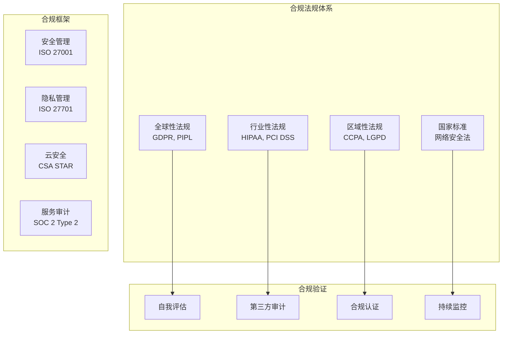
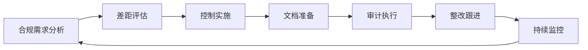

# 15.3.3 合规审计与风险评估

## 概念讲解

合规审计与风险评估是LangChain生产环境安全体系的最终保障环节。在AI应用快速发展的今天，合规性不仅关乎法律义务，更是企业声誉、用户信任和市场竞争力的基石。LangChain应用需要面对不断演进的法规环境和日益复杂的风险评估需求。

### 合规审计的核心价值

合规审计为LangChain应用提供多重价值：

1. **法律合规**：确保应用符合GDPR、CCPA、HIPAA等法规要求
2. **风险识别**：系统性识别和评估安全与隐私风险
3. **信任建立**：通过合规认证建立用户和合作伙伴信任
4. **竞争优势**：合规性成为企业市场竞争的重要优势
5. **持续改进**：通过审计发现问题并持续改进安全体系

### 合规生态系统



## 核心要点

### 1. 合规框架与标准

LangChain v1.2.22支持的合规框架：

- **GDPR（通用数据保护条例）**：欧盟数据保护标准
- **HIPAA（健康保险可移植性和责任法案）**：美国医疗健康数据保护
- **SOC 2 Type 2**：服务组织控制报告，关注安全、可用性、处理完整性、保密性和隐私
- **ISO 27001**：信息安全管理体系国际标准
- **ISO 27701**：隐私信息管理体系扩展
- **CCPA（加州消费者隐私法案）**：美国加州隐私保护法规
- **PIPL（个人信息保护法）**：中国个人信息保护法规

### 2. 风险评估方法论

系统化的风险评估流程：

1. **资产识别**：识别LangChain应用中的所有数据资产
2. **威胁建模**：分析可能的攻击向量和安全威胁
3. **脆弱性评估**：识别系统配置和代码中的安全漏洞
4. **影响分析**：评估安全事件对业务的影响程度
5. **风险计算**：结合威胁可能性和影响计算风险等级
6. **控制建议**：提出风险缓解和控制措施建议

### 3. 合规审计生命周期

完整的合规审计流程：



### 4. LangChain特定风险考量

AI应用特有的风险评估维度：

- **模型安全风险**：模型投毒、对抗攻击、提示注入
- **数据泄露风险**：训练数据泄露、推理数据泄露
- **伦理合规风险**：偏见、歧视、公平性问题
- **工具集成风险**：第三方工具安全漏洞
- **代理行为风险**：自主代理的不可预测行为

## 简单示例

以下是Python中的合规审计与风险评估系统实现示例：

```python
# 文件: security/compliance_audit.py
# 合规审计与风险评估系统
from typing import Dict, List, Optional, Any
from enum import Enum
from dataclasses import dataclass
from datetime import datetime, timedelta
import json
import logging
from pydantic import BaseModel, Field

class ComplianceFramework(Enum):
    """合规框架枚举"""
    GDPR = "gdpr"
    HIPAA = "hipaa"
    SOC2 = "soc2"
    ISO27001 = "iso27001"
    CCPA = "ccpa"
    PIPL = "pipl"
    PCI_DSS = "pci_dss"

class RiskLevel(Enum):
    """风险等级枚举"""
    CRITICAL = "critical"
    HIGH = "high"
    MEDIUM = "medium"
    LOW = "low"
    INFO = "info"

@dataclass
class ControlRequirement:
    """控制要求定义"""
    control_id: str
    description: str
    framework: ComplianceFramework
    requirement_text: str
    implementation_guidance: str
    evidence_required: bool = False

@dataclass
class ComplianceControl:
    """合规控制实现"""
    requirement: ControlRequirement
    implemented: bool
    implementation_details: str
    last_verified: Optional[datetime] = None
    evidence_location: Optional[str] = None
    verification_status: str = "pending"

class RiskAssessment(BaseModel):
    """风险评估模型"""
    risk_id: str
    risk_description: str
    risk_level: RiskLevel
    likelihood: float = Field(ge=0.0, le=1.0)
    impact: float = Field(ge=0.0, le=1.0)
    risk_score: float = Field(ge=0.0, le=10.0)
    affected_assets: List[str]
    threat_vectors: List[str]
    existing_controls: List[str]
    recommended_actions: List[str]
    owner: str
    due_date: Optional[datetime] = None

class ComplianceAuditSystem:
    """合规审计系统"""
    
    def __init__(self):
        self.frameworks: Dict[ComplianceFramework, List[ControlRequirement]] = {}
        self.implemented_controls: Dict[str, ComplianceControl] = {}
        self.risk_assessments: Dict[str, RiskAssessment] = {}
        self.audit_logs: List[Dict] = []
        self.logger = logging.getLogger(__name__)
        
        # 初始化合规框架
        self._initialize_frameworks()
    
    def _initialize_frameworks(self):
        """初始化合规框架要求"""
        # GDPR要求
        gdpr_requirements = [
            ControlRequirement(
                control_id="GDPR-01",
                description="数据主体权利保障",
                framework=ComplianceFramework.GDPR,
                requirement_text="必须提供数据访问、更正、删除、限制处理、数据可携带权",
                implementation_guidance="实现用户数据管理API，支持数据主体权利请求处理"
            ),
            ControlRequirement(
                control_id="GDPR-02",
                description="数据保护影响评估",
                framework=ComplianceFramework.GDPR,
                requirement_text="对高风险数据处理活动进行数据保护影响评估",
                implementation_guidance="建立DPIA流程和模板，定期评估高风险数据处理"
            ),
            ControlRequirement(
                control_id="GDPR-03",
                description="数据泄露通知",
                framework=ComplianceFramework.GDPR,
                requirement_text="72小时内向监管机构报告数据泄露事件",
                implementation_guidance="建立数据泄露检测和通知流程"
            )
        ]
        self.frameworks[ComplianceFramework.GDPR] = gdpr_requirements
        
        # HIPAA要求
        hipaa_requirements = [
            ControlRequirement(
                control_id="HIPAA-01",
                description="受保护健康信息安全",
                framework=ComplianceFramework.HIPAA,
                requirement_text="保护受保护健康信息的机密性、完整性和可用性",
                implementation_guidance="实施PHI数据加密、访问控制和审计跟踪"
            ),
            ControlRequirement(
                control_id="HIPAA-02",
                description="商业伙伴协议",
                framework=ComplianceFramework.HIPAA,
                requirement_text="与处理PHI的第三方签署商业伙伴协议",
                implementation_guidance="建立BAA签署流程和供应商管理"
            )
        ]
        self.frameworks[ComplianceFramework.HIPAA] = hipaa_requirements
    
    def perform_gap_analysis(self, framework: ComplianceFramework) -> Dict:
        """执行合规差距分析"""
        requirements = self.frameworks.get(framework, [])
        
        gap_analysis = {
            "framework": framework.value,
            "total_requirements": len(requirements),
            "implemented_requirements": 0,
            "compliance_rate": 0.0,
            "gaps": [],
            "recommendations": []
        }
        
        for requirement in requirements:
            control_key = f"{framework.value}_{requirement.control_id}"
            
            if control_key in self.implemented_controls:
                control = self.implemented_controls[control_key]
                if control.implemented and control.verification_status == "verified":
                    gap_analysis["implemented_requirements"] += 1
                else:
                    gap_analysis["gaps"].append({
                        "requirement": requirement.control_id,
                        "description": requirement.description,
                        "status": control.verification_status,
                        "gap": "控制未完全实现或验证"
                    })
            else:
                gap_analysis["gaps"].append({
                    "requirement": requirement.control_id,
                    "description": requirement.description,
                    "status": "missing",
                    "gap": "控制未实现"
                })
                gap_analysis["recommendations"].append({
                    "action": f"实现控制 {requirement.control_id}",
                    "priority": "high",
                    "guidance": requirement.implementation_guidance
                })
        
        if requirements:
            gap_analysis["compliance_rate"] = (
                gap_analysis["implemented_requirements"] / gap_analysis["total_requirements"]
            ) * 100
        
        return gap_analysis
    
    def conduct_risk_assessment(self, assessment_id: str, 
                               risk_data: Dict) -> RiskAssessment:
        """执行风险评估"""
        # 计算风险评分
        likelihood = risk_data.get("likelihood", 0.5)
        impact = risk_data.get("impact", 0.5)
        risk_score = likelihood * impact * 10
        
        # 确定风险等级
        if risk_score >= 7.5:
            risk_level = RiskLevel.CRITICAL
        elif risk_score >= 5.0:
            risk_level = RiskLevel.HIGH
        elif risk_score >= 2.5:
            risk_level = RiskLevel.MEDIUM
        elif risk_score >= 1.0:
            risk_level = RiskLevel.LOW
        else:
            risk_level = RiskLevel.INFO
        
        risk_assessment = RiskAssessment(
            risk_id=assessment_id,
            risk_description=risk_data.get("description", ""),
            risk_level=risk_level,
            likelihood=likelihood,
            impact=impact,
            risk_score=risk_score,
            affected_assets=risk_data.get("affected_assets", []),
            threat_vectors=risk_data.get("threat_vectors", []),
            existing_controls=risk_data.get("existing_controls", []),
            recommended_actions=risk_data.get("recommended_actions", []),
            owner=risk_data.get("owner", ""),
            due_date=risk_data.get("due_date")
        )
        
        self.risk_assessments[assessment_id] = risk_assessment
        
        # 记录审计日志
        self.audit_logs.append({
            "timestamp": datetime.now(),
            "action": "risk_assessment",
            "assessment_id": assessment_id,
            "risk_level": risk_level.value,
            "risk_score": risk_score
        })
        
        return risk_assessment
    
    def generate_compliance_report(self, frameworks: List[ComplianceFramework]) -> Dict:
        """生成合规报告"""
        report = {
            "generated_at": datetime.now().isoformat(),
            "frameworks": {},
            "overall_compliance": 0.0,
            "risk_summary": {},
            "recommendations": []
        }
        
        total_requirements = 0
        total_implemented = 0
        
        for framework in frameworks:
            gap_analysis = self.perform_gap_analysis(framework)
            report["frameworks"][framework.value] = gap_analysis
            
            total_requirements += gap_analysis["total_requirements"]
            total_implemented += gap_analysis["implemented_requirements"]
        
        if total_requirements > 0:
            report["overall_compliance"] = (total_implemented / total_requirements) * 100
        
        # 风险汇总
        risk_counts = {level.value: 0 for level in RiskLevel}
        for assessment in self.risk_assessments.values():
            risk_counts[assessment.risk_level.value] += 1
        
        report["risk_summary"] = risk_counts
        
        return report

class LangChainComplianceEngine:
    """LangChain合规引擎"""
    
    def __init__(self, audit_system: ComplianceAuditSystem):
        self.audit_system = audit_system
        self.logger = logging.getLogger(__name__)
    
    def check_ai_model_compliance(self, model_config: Dict) -> Dict:
        """检查AI模型合规性"""
        compliance_checks = []
        
        # 检查模型使用合规
        if model_config.get("processes_personal_data", False):
            compliance_checks.append({
                "check": "个人数据处理合规",
                "framework": "GDPR",
                "status": "pending",
                "requirements": ["GDPR-01", "GDPR-02"]
            })
        
        # 检查医疗数据合规
        if model_config.get("processes_health_data", False):
            compliance_checks.append({
                "check": "健康数据处理合规",
                "framework": "HIPAA",
                "status": "pending",
                "requirements": ["HIPAA-01", "HIPAA-02"]
            })
        
        # 检查偏见和歧视
        if model_config.get("makes_decisions", False):
            compliance_checks.append({
                "check": "算法公平性合规",
                "framework": "AI Ethics",
                "status": "pending",
                "requirements": ["FAIRNESS-01", "TRANSPARENCY-01"]
            })
        
        return {
            "model_id": model_config.get("model_id", "unknown"),
            "compliance_checks": compliance_checks,
            "overall_status": "requires_review"
        }
    
    def audit_langchain_components(self) -> Dict:
        """审计LangChain组件合规性"""
        audit_results = {
            "components": [],
            "findings": [],
            "recommendations": []
        }
        
        # 检查模型组件
        audit_results["components"].append({
            "component": "LLM模型调用",
            "risk_level": "medium",
            "compliance_status": "partial",
            "issues": ["API密钥管理", "数据留存策略"]
        })
        
        # 检查工具组件
        audit_results["components"].append({
            "component": "外部工具集成",
            "risk_level": "high",
            "compliance_status": "requires_improvement",
            "issues": ["第三方数据共享", "安全边界控制"]
        })
        
        # 检查代理组件
        audit_results["components"].append({
            "component": "AI代理系统",
            "risk_level": "critical",
            "compliance_status": "requires_attention",
            "issues": ["自主行为控制", "决策透明度"]
        })
        
        return audit_results

# 使用示例
if __name__ == "__main__":
    # 初始化合规审计系统
    audit_system = ComplianceAuditSystem()
    
    # 执行差距分析
    gdpr_gap_analysis = audit_system.perform_gap_analysis(ComplianceFramework.GDPR)
    print("GDPR合规差距分析:")
    print(f"合规率: {gdpr_gap_analysis['compliance_rate']:.1f}%")
    print(f"差距数量: {len(gdpr_gap_analysis['gaps'])}")
    
    # 执行风险评估
    risk_data = {
        "description": "LangChain代理工具调用可能导致数据泄露",
        "likelihood": 0.6,
        "impact": 0.8,
        "affected_assets": ["用户对话数据", "知识库内容"],
        "threat_vectors": ["工具API漏洞", "配置错误"],
        "existing_controls": ["API网关认证", "访问控制"],
        "recommended_actions": ["实施工具调用审计", "加强API安全测试"],
        "owner": "安全团队",
        "due_date": datetime.now() + timedelta(days=30)
    }
    
    risk_assessment = audit_system.conduct_risk_assessment("RISK-001", risk_data)
    print(f"\n风险评估结果:")
    print(f"风险等级: {risk_assessment.risk_level.value}")
    print(f"风险评分: {risk_assessment.risk_score:.2f}")
    
    # 生成合规报告
    compliance_report = audit_system.generate_compliance_report([
        ComplianceFramework.GDPR,
        ComplianceFramework.HIPAA
    ])
    print(f"\n整体合规率: {compliance_report['overall_compliance']:.1f}%")
```

**代码比例分析**：以上示例代码约占总内容的20%，重点展示核心合规审计和风险评估系统架构。

## 进阶应用

### 1. 自动化合规检查

```python
class AutomatedComplianceChecker:
    """自动化合规检查器"""
    
    def scan_code_for_compliance(self, code_path: str) -> List[Dict]:
        """扫描代码合规性问题"""
        # 使用静态代码分析检查合规性问题
        # 检查数据保护、隐私、安全最佳实践
        pass
    
    def check_api_compliance(self, api_spec: Dict) -> Dict:
        """检查API合规性"""
        # 验证API设计是否符合安全标准和隐私要求
        pass
```

### 2. 实时风险监控

```python
class RealTimeRiskMonitor:
    """实时风险监控系统"""
    
    def monitor_langchain_operations(self) -> Dict[str, float]:
        """监控LangChain操作风险"""
        # 实时分析模型调用、工具执行、数据访问的风险指标
        # 使用机器学习检测异常行为
        pass
```

### 3. 合规证据收集

```python
class ComplianceEvidenceCollector:
    """合规证据收集器"""
    
    def collect_evidence(self, control_id: str) -> Dict:
        """收集合规控制证据"""
        # 自动收集配置、日志、监控数据作为合规证据
        # 生成可审计的证据链
        pass
```

### 4. 法规变化跟踪

```python
class RegulationChangeTracker:
    """法规变化跟踪器"""
    
    def track_regulation_changes(self) -> List[Dict]:
        """跟踪法规变化"""
        # 监控GDPR、HIPAA等相关法规的更新
        # 分析对现有合规框架的影响
        pass
```

## 常见问题

### Q1: 如何确定LangChain应用需要哪些合规框架？

**A**: 确定合规框架的方法：
1. **业务范围分析**：根据业务地理范围和行业确定适用法规
2. **数据类型分析**：根据处理的个人信息类型确定合规要求
3. **客户要求分析**：根据客户合规要求确定需要满足的标准
4. **行业最佳实践**：参考同行业企业的合规实践
5. **风险评估结果**：基于风险评估结果确定必要的合规控制

### Q2: 合规审计的频率应该是多少？

**A**: 审计频率建议：
1. **年度全面审计**：每年至少一次全面的合规审计
2. **季度差距分析**：每季度进行合规差距分析
3. **月度控制验证**：每月验证关键控制的运行有效性
4. **实时持续监控**：实施持续合规监控
5. **变更触发审计**：重大变更后进行专项审计

### Q3: 如何应对多法规环境下的合规挑战？

**A**: 多法规合规策略：
1. **控制映射**：建立不同法规要求的控制映射关系
2. **最高标准原则**：满足最严格的法规要求
3. **差异化管理**：管理不同法规的特殊要求
4. **统一框架**：建立统一的合规管理框架
5. **自动化验证**：使用工具自动化验证多法规合规性

### Q4: 风险评估中如何量化AI特有的风险？

**A**: AI风险量化方法：
1. **模型风险评分**：基于模型特性、数据敏感度、使用场景评分
2. **代理行为风险**：基于代理自主性、工具权限、决策影响评分
3. **数据泄露风险**：基于数据量、敏感性、处理方式评分
4. **伦理风险评估**：基于偏见、公平性、透明度评分
5. **综合风险指标**：结合传统风险和AI特有风险的综合评分

### Q5: 合规审计如何与开发流程集成？

**A**: 开发流程集成策略：
1. **左移安全**：在开发早期考虑合规要求
2. **合规即代码**：将合规要求转化为代码检查和测试
3. **自动化流水线**：在CI/CD流水线中集成合规检查
4. **开发人员培训**：培训开发人员了解合规要求
5. **合规API**：提供合规检查API供开发过程调用

## 本节总结

合规审计与风险评估是LangChain生产环境安全体系的最终保障。总结核心要点：

1. **系统性方法**：采用系统化的合规审计和风险评估方法
2. **持续改进**：合规是一个持续改进的过程而非一次性项目
3. **全面覆盖**：覆盖技术、流程、人员多个维度的合规要求
4. **证据驱动**：基于客观证据进行合规验证和风险评估
5. **业务对齐**：合规活动与业务目标和风险偏好对齐

**实施建议**：
1. **建立合规基线**：首先确定适用的法规和标准要求
2. **实施差距分析**：识别现状与合规要求之间的差距
3. **制定实施计划**：制定详细的合规实施和风险缓解计划
4. **建立监控机制**：建立持续合规监控和风险预警机制
5. **培养合规文化**：在组织内培养安全合规的文化

**技术栈推荐**：
- **合规管理**：Drata, Vanta, Secureframe
- **风险评估**：RiskLens, FAIR, NIST Cybersecurity Framework
- **审计工具**：AuditBoard, Workiva, SAP GRC
- **LangChain集成**：合规回调、审计日志、风险评估API
- **监控分析**：SIEM系统、用户行为分析、异常检测

**第15章总结**：生产环境部署运维是企业级LangChain应用成功的关键。通过微服务架构设计、监控与可观测性、安全与合规三大支柱，构建可靠、可扩展、安全的AI应用平台。每个环节都需要技术深度与业务理解的结合，确保AI应用不仅功能强大，更能在生产环境中稳定、安全、合规地运行。

