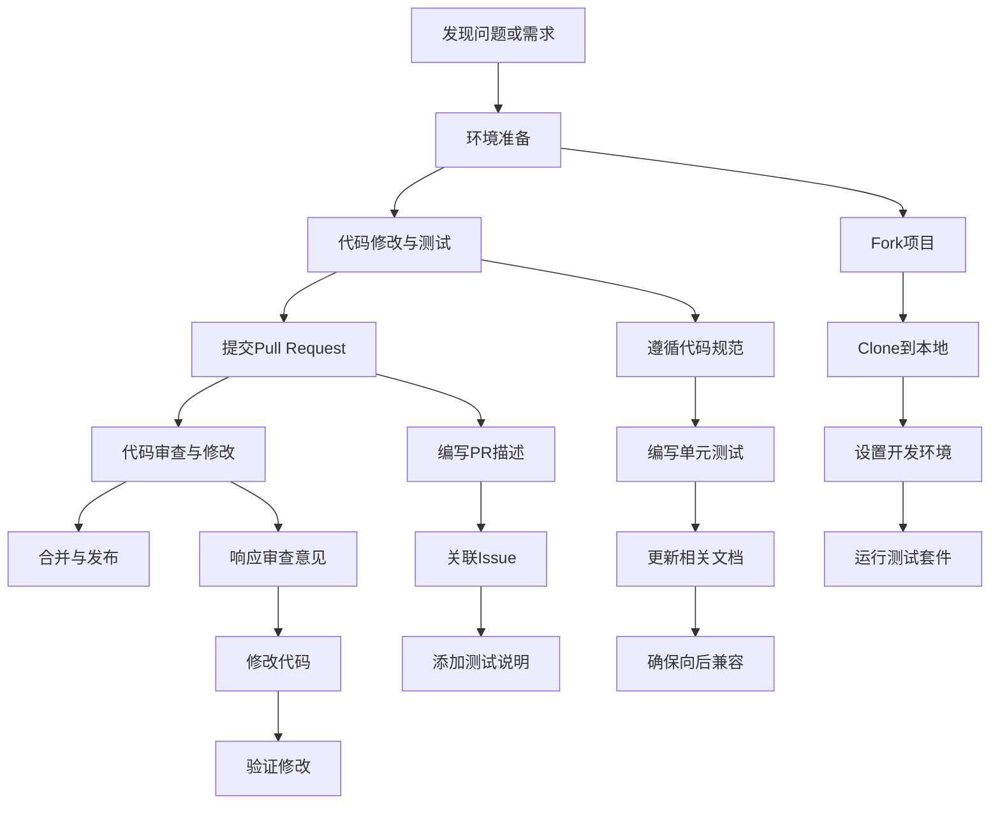

# 17.1.1 代码贡献流程

## 概念讲解

### 开源贡献的意义
开源贡献不仅是技术能力的体现，更是与全球开发者社区互动、学习最新技术、建立个人技术品牌的重要途径。对于LangChain这样的前沿AI框架项目，参与开源贡献能让你：
1. **深入理解框架架构**：通过阅读和修改源代码，理解LangChain的设计哲学和实现细节
2. **紧跟技术发展**：第一时间接触最新的AI应用开发模式和最佳实践
3. **建立技术影响力**：在AI开发社区中建立个人声誉，为职业发展铺路
4. **实践最佳开发流程**：学习现代软件开发流程，包括代码审查、CI/CD、测试驱动开发等

### LangChain开源项目特点
LangChain作为AI应用开发框架，有其特殊的贡献特点：
- **技术栈复杂**：涉及Python、TypeScript、LLM集成、向量数据库等多个领域
- **快速演进**：AI技术发展迅速，项目更新迭代快
- **社区活跃**：拥有大量开发者和企业用户，代码质量要求高
- **文档驱动**：良好的文档和示例是项目成功的关键

### 开源贡献流程全景图
一个完整的开源贡献流程包含多个阶段，每个阶段都有其关键任务和最佳实践：



## 核心要点

### 1. 环境准备与项目设置
成功的代码贡献始于正确的环境配置。LangChain项目有特定的开发环境要求：

#### 项目结构理解
LangChain项目采用模块化设计，主要包含：
- **langchain-core**：核心抽象和基础组件
- **langchain**：主要框架功能
- **langchain-community**：社区贡献的集成和工具
- **langchain-experimental**：实验性功能
- **docs**：文档和示例

#### 开发环境配置步骤
1. **Python版本要求**：LangChain v1.2.22支持Python 3.10及以上版本
2. **虚拟环境管理**：推荐使用`uv`或`poetry`进行依赖管理
3. **代码格式化工具**：配置`ruff`、`black`、`isort`确保代码风格一致
4. **测试框架**：熟悉`pytest`测试框架和项目测试结构

#### 关键配置示例（最小代码展示）
```python
# .pre-commit-config.yaml 示例配置
repos:
  - repo: https://github.com/astral-sh/ruff-pre-commit
    rev: v0.1.6
    hooks:
      - id: ruff
        args: [--fix]
  
  - repo: https://github.com/psf/black
    rev: 23.12.1
    hooks:
      - id: black
        language_version: python3.10
```

### 2. 代码贡献工作流
掌握标准化的Git工作流是高效贡献的关键：

#### 分支管理策略
- **main分支**：仅用于发布版本，不直接提交
- **feature分支**：基于main创建，用于功能开发
- **fix分支**：基于main创建，用于bug修复
- **docs分支**：基于main创建，用于文档改进

#### Git工作流实践
```bash
# 1. Fork项目到个人GitHub账户
# 2. Clone到本地
git clone https://github.com/YOUR_USERNAME/langchain.git
cd langchain

# 3. 添加上游仓库
git remote add upstream https://github.com/langchain-ai/langchain.git

# 4. 创建特性分支
git checkout -b feature/your-feature-name

# 5. 保持与上游同步
git fetch upstream
git rebase upstream/main

# 6. 提交变更
git add .
git commit -m "feat: 添加新的集成支持"
git push origin feature/your-feature-name
```

### 3. 代码质量与规范
LangChain项目对代码质量有严格要求：

#### 代码规范要点
1. **类型注解**：所有公开API必须包含完整的类型注解
2. **文档字符串**：遵循Google风格文档字符串格式
3. **测试覆盖率**：新功能必须包含单元测试，覆盖率不低于80%
4. **向后兼容**：API变更需要考虑向后兼容性

#### 质量检查清单
- [ ] 代码通过`ruff check`检查
- [ ] 所有测试通过（`pytest -xvs tests/`）
- [ ] 新增功能有完整的类型注解
- [ ] 更新了相关文档和示例
- [ ] 遵循项目的导入规范
- [ ] 代码复杂度合理（CCN < 15）

### 4. Pull Request提交规范
高质量的PR描述能显著提高审查效率和合并速度：

#### PR模板要求
```markdown
## 问题描述
<!-- 清晰描述解决的问题或实现的功能 -->

## 解决方案
<!-- 详细说明你的实现方法和技术选型 -->

## 测试方法
<!-- 描述如何测试这些变更，包括手动测试步骤和自动化测试 -->

## 相关Issue
<!-- 关联的GitHub Issue编号，如fixes #123 -->

## 检查清单
- [ ] 代码通过所有lint检查
- [ ] 添加了必要的测试
- [ ] 更新了相关文档
- [ ] 遵循了项目代码规范
```

#### PR提交最佳实践
1. **保持PR聚焦**：每个PR只解决一个问题或实现一个功能
2. **提供完整上下文**：在PR描述中说明变更的原因和影响
3. **添加可视化证据**：对于UI或交互功能，提供截图或录屏
4. **响应及时**：及时响应审查意见，通常应在24小时内回复

### 5. 代码审查流程
代码审查是开源贡献的核心环节，也是学习提升的好机会：

#### 审查流程理解
1. **自动检查**：CI/CD流水线运行lint、测试和类型检查
2. **人工审查**：核心维护者审查代码质量和功能实现
3. **修改迭代**：根据审查意见修改代码并重新提交
4. **最终批准**：至少需要一名核心维护者批准才能合并

#### 高效应对审查
- **保持开放心态**：将审查视为学习机会而非批评
- **主动沟通**：对不理解的意见主动询问澄清
- **及时修改**：快速响应审查意见并进行修改
- **保持礼貌**：始终保持专业和尊重的沟通态度

## 简单示例

### 示例：为LangChain添加简单的自定义工具
以下是一个最小化的示例，展示如何为LangChain贡献一个自定义工具：

```python
# langchain_community/tools/example_tool.py
"""示例：天气查询工具的实现"""

from typing import Optional, Type
from pydantic import BaseModel, Field

from langchain_core.tools import BaseTool
from langchain_core.callbacks import CallbackManagerForToolRun


class WeatherQueryInput(BaseModel):
    """天气查询工具的输入模型"""
    city: str = Field(description="城市名称")
    unit: Optional[str] = Field(
        default="celsius",
        description="温度单位，可选celsius或fahrenheit"
    )


class WeatherQueryTool(BaseTool):
    """天气查询工具实现"""
    
    name: str = "weather_query"
    description: str = "查询指定城市的天气信息"
    args_schema: Type[BaseModel] = WeatherQueryInput
    
    def _run(
        self,
        city: str,
        unit: str = "celsius",
        run_manager: Optional[CallbackManagerForToolRun] = None,
    ) -> str:
        """执行天气查询
        
        Args:
            city: 城市名称
            unit: 温度单位
            
        Returns:
            天气信息字符串
        """
        # 这里应该调用实际的天气API
        # 为示例简化，返回模拟数据
        temperature = 25 if unit == "celsius" else 77
        
        return f"{city}的天气：晴天，温度{temperature}°{unit}"
    
    async def _arun(
        self,
        city: str,
        unit: str = "celsius",
        run_manager: Optional[CallbackManagerForToolRun] = None,
    ) -> str:
        """异步执行天气查询"""
        return self._run(city, unit, run_manager)
```

### 示例：为新工具添加单元测试
```python
# tests/unit_tests/tools/test_example_tool.py
"""示例工具的单元测试"""

import pytest
from langchain_community.tools.example_tool import WeatherQueryTool


def test_weather_query_tool_initialization():
    """测试工具初始化"""
    tool = WeatherQueryTool()
    
    assert tool.name == "weather_query"
    assert "天气" in tool.description
    assert hasattr(tool, "args_schema")


def test_weather_query_tool_execution():
    """测试工具执行"""
    tool = WeatherQueryTool()
    result = tool.run({"city": "北京", "unit": "celsius"})
    
    assert "北京" in result
    assert "温度" in result


@pytest.mark.asyncio
async def test_weather_query_tool_async_execution():
    """测试异步工具执行"""
    tool = WeatherQueryTool()
    result = await tool.arun({"city": "上海", "unit": "celsius"})
    
    assert "上海" in result
    assert isinstance(result, str)
```

### 示例：更新相关文档
```markdown
# 文档更新示例
## 天气查询工具

`WeatherQueryTool` 是一个用于查询城市天气信息的工具。

### 安装
```bash
pip install langchain-community
```

### 使用示例
```python
from langchain_community.tools import WeatherQueryTool

tool = WeatherQueryTool()
result = tool.run({"city": "北京"})
print(result)  # 输出：北京的天气：晴天，温度25°celsius
```

### 配置参数
- `city` (str): 必需，城市名称
- `unit` (str): 可选，温度单位，默认"celsius"
```

## 进阶应用

### 1. 复杂功能贡献策略
对于复杂的架构性变更，需要更系统化的方法：

#### 架构变更流程
1. **设计文档先行**：在编写代码前，先撰写设计文档并提交RFC（Request for Comments）
2. **原型验证**：创建最小可行性原型验证技术方案
3. **分阶段实施**：将大功能拆分成多个小PR，逐步实现
4. **社区反馈**：在Discord或GitHub Discussions中收集社区反馈

#### 向后兼容性处理
- **弃用警告**：对于要移除的API，先添加弃用警告
- **迁移指南**：提供清晰的迁移路径和示例
- **版本规划**：在大版本更新中处理破坏性变更

### 2. 性能优化贡献
性能优化是高级贡献者的常见任务：

#### 性能分析工具
```python
# 性能分析示例
import cProfile
import pstats
from langchain.chains import LLMChain

# 创建分析器
profiler = cProfile.Profile()
profiler.enable()

# 执行要分析的代码
chain = LLMChain(...)
result = chain.run(...)

profiler.disable()
stats = pstats.Stats(profiler).sort_stats('cumulative')
stats.print_stats(10)  # 打印前10个耗时最多的函数
```

#### 优化策略
1. **缓存优化**：实现智能缓存减少重复计算
2. **批处理**：将多个请求合并处理
3. **异步优化**：利用异步IO提高并发性能
4. **内存管理**：减少不必要的内存分配和复制

### 3. 国际化贡献
为LangChain添加多语言支持：

#### 国际化最佳实践
1. **使用标准库**：利用Python的`gettext`模块
2. **分离文本**：将所有用户可见文本提取到翻译文件中
3. **社区翻译**：建立社区翻译流程，支持多种语言
4. **本地化测试**：确保翻译后的界面在不同语言环境下正常显示

## 常见问题

### Q1: 如何找到适合新贡献者的任务？
**A**: LangChain项目为新手贡献者准备了专门的任务标签：
- `good first issue`: 适合第一次贡献的简单任务
- `help wanted`: 需要社区帮助的问题
- `documentation`: 文档改进任务
- `bug`: bug修复任务

建议从文档改进或简单的bug修复开始，逐步了解项目结构。

### Q2: 代码审查需要多长时间？
**A**: 审查时间因PR复杂度而异：
- 简单修复：通常1-3天
- 中等功能：3-7天
- 复杂架构变更：可能需要1-2周

如果超过一周没有反馈，可以礼貌地在PR中@相关维护者询问进度。

### Q3: 如何提高PR被接受的概率？
**A**: 遵循以下最佳实践：
1. **提前沟通**：在Discord或GitHub Discussions中讨论你的想法
2. **保持PR简洁**：每个PR只解决一个问题
3. **充分测试**：提供完整的测试覆盖
4. **详细描述**：在PR中说明变更原因和实现方法
5. **响应及时**：快速响应审查意见

### Q4: 贡献代码有什么奖励？
**A**: LangChain社区有多种认可方式：
- **社区认可**：你的贡献会出现在项目贡献者列表中
- **技能提升**：通过实际项目学习先进技术
- **职业机会**：优秀贡献者可能获得工作机会或合作邀请
- **会议邀请**：有机会被邀请参加技术会议分享经验

### Q5: 如何处理代码冲突？
**A**: 代码冲突是常见情况，处理步骤：
1. **保持同步**：定期`git fetch upstream`和`git rebase upstream/main`
2. **解决冲突**：使用`git mergetool`或手动解决冲突
3. **测试验证**：解决冲突后重新运行测试确保功能正常
4. **寻求帮助**：如果无法解决，可以在PR中请求帮助

## 本节总结

### 核心收获
1. **系统性流程**：成功的代码贡献需要遵循完整的开发流程，从环境准备到PR合并
2. **质量至上**：LangChain项目对代码质量有严格要求，需要关注规范、测试和文档
3. **沟通协作**：开源贡献是团队协作，良好的沟通能力与编码能力同样重要
4. **持续学习**：通过贡献代码，不仅能提升技术水平，还能学习到现代软件开发的最佳实践

### 实践建议
对于想要开始LangChain代码贡献的开发者：
1. **从简单开始**：先尝试文档改进或简单的bug修复
2. **深入理解**：仔细阅读项目文档和现有代码，理解设计哲学
3. **寻求帮助**：积极参与社区讨论，向经验丰富的贡献者学习
4. **保持耐心**：代码审查可能需要时间，保持耐心和专业态度

### 下一步行动
1. **设置环境**：按照本文指南设置本地开发环境
2. **寻找任务**：浏览GitHub Issues，寻找标记为`good first issue`的任务
3. **开始贡献**：选择一个小任务开始你的开源贡献之旅
4. **参与社区**：加入LangChain Discord或GitHub Discussions，与社区互动

开源贡献是一场旅程，而不是一次性的任务。通过持续参与，你不仅能提升技术水平，还能建立起有价值的技术网络和个人品牌。LangChain社区欢迎所有级别的贡献者，无论你是初学者还是经验丰富的开发者，都能在这里找到适合自己的贡献方式。

**记住**：每一次贡献，无论大小，都是对开源生态系统的宝贵支持。开始你的LangChain开源贡献之旅吧！