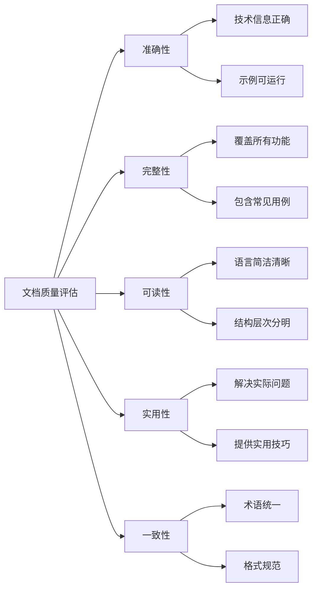

# 17.1.2 文档与示例贡献

## 概念讲解

### 文档在开源项目中的重要性
在开源项目中，文档不仅仅是辅助工具，而是项目的核心资产。优秀的文档能够：

1. **降低学习门槛**：帮助新用户快速上手，减少使用障碍
2. **减少维护成本**：清晰的使用说明能减少重复性的技术支持需求
3. **提升项目质量**：完善的文档反映了项目的成熟度和专业性
4. **促进社区发展**：良好的文档吸引更多贡献者和用户参与

### LangChain文档体系架构
LangChain作为一个复杂的AI框架，建立了多层次的文档体系：

- **API参考文档**：详细的类和函数说明，包含参数、返回值、示例
- **概念指南**：解释核心概念和设计哲学，帮助用户理解框架原理
- **教程和示例**：手把手的实践指南，展示具体应用场景
- **最佳实践**：基于社区经验总结的开发建议和模式
- **迁移指南**：版本升级时的兼容性说明和迁移步骤

### 文档贡献的独特价值
与代码贡献相比，文档贡献有其特殊的价值：
- **门槛更低**：适合初学者和英语非母语的贡献者
- **影响广泛**：好的文档能帮助成千上万的用户
- **学习机会**：通过编写文档深入理解框架设计
- **建立声誉**：高质量文档贡献者受到社区高度尊重

### 文档质量评估维度
评估文档质量可以从多个维度进行：



## 核心要点

### 1. LangChain文档类型与结构
理解文档的不同类型是高效贡献的基础：

#### 官方文档层次结构
1. **首页和概览**：项目介绍、快速开始、核心特性
2. **概念和原理**：深入解释框架设计思想和核心概念
3. **指南和教程**：分步骤的教学材料，按应用场景组织
4. **API参考**：自动生成的API文档，包含详细参数说明
5. **示例和案例**：完整可运行的代码示例和项目案例

#### 文档文件组织
LangChain文档采用标准的Markdown格式，组织在`docs/`目录下：
- `docs/get_started/`：入门指南和安装说明
- `docs/concepts/`：概念解释和设计原理
- `docs/how_to/`：使用指南和教程
- `docs/integrations/`：集成第三方服务的文档
- `docs/api_reference/`：API参考文档

#### 文档质量标准
- **技术准确性**：所有技术信息必须经过验证
- **示例完整性**：示例代码必须可运行和测试
- **结构清晰性**：逻辑层次分明，易于阅读
- **语言简洁性**：使用简洁明了的表达方式

### 2. 文档编写规范与最佳实践
遵循统一的规范确保文档质量一致性：

#### 语言风格指南
1. **主动语态优先**：使用"你可以这样做"而不是"这可以被这样做"
2. **第二人称视角**：使用"你"来直接与读者对话
3. **简洁明了**：避免冗长复杂的句子，保持段落简短
4. **专业但友好**：保持技术专业性，同时保持友好的语气

#### Markdown格式规范
```markdown
# 一级标题：文档主标题

## 二级标题：主要章节

### 三级标题：子章节

正文内容使用普通段落，注意控制段落长度。

**重点内容**可以使用粗体强调。

> 引用块用于突出重要提示或注意事项。

- 列表项用于列举要点
- 保持列表项格式一致

1. 有序列表用于步骤说明
2. 每个步骤清晰明确

```python
# 代码块使用三个反引号和语言标识
def example_function():
    """示例函数的文档字符串"""
    return "Hello, World!"
```

[链接文本](https://example.com) 用于引用相关资源。

 用于插入图片说明。
```

#### 术语一致性
- 统一使用英文术语，避免中英文混杂
- 首次出现的专业术语提供简短解释
- 保持术语在全文档中的一致性
- 避免使用项目特有的非标准缩写

### 3. 示例代码编写原则
示例代码是文档的重要组成部分，需要特别注意质量：

#### 示例代码质量标准
1. **可运行性**：所有示例代码必须能够实际运行
2. **最小化原则**：示例只展示核心功能，避免无关代码
3. **错误处理**：包含基本的错误处理和异常情况说明
4. **可测试性**：示例代码应该能够被自动化测试验证

#### 示例代码结构模板
```python
# 示例：LangChain工具使用示例
"""简要说明示例的目的和场景"""

# 必要的导入语句
from langchain_community.tools import SomeTool
from langchain_openai import ChatOpenAI

def main():
    """主函数，展示完整的使用流程"""
    
    # 1. 初始化组件
    tool = SomeTool()
    llm = ChatOpenAI(model="gpt-4o-mini")
    
    # 2. 基本使用示例
    result = tool.run({"param": "value"})
    print(f"工具执行结果: {result}")
    
    # 3. 与其他组件集成示例
    # ... 更多代码
    
    return result

if __name__ == "__main__":
    # 确保示例可以直接运行
    main()
```

#### 示例注释规范
- 每个重要步骤都有注释说明
- 复杂逻辑提供额外的解释
- 参数和返回值说明清晰
- 注意点和限制条件明确标注

### 4. 文档贡献工作流程
文档贡献需要系统的工作流程确保质量：

#### 文档更新流程
1. **识别需求**：通过Issue、用户反馈或自我发现确定文档改进点
2. **内容规划**：规划文档结构和内容大纲
3. **编写初稿**：按照规范编写文档内容
4. **自我审查**：检查技术准确性、语言质量和格式规范
5. **提交审查**：提交PR等待社区审查
6. **根据反馈修改**：根据审查意见修改完善
7. **最终合并**：通过审查后合并到主分支

#### 文档审查要点
- 技术信息是否准确无误
- 示例代码是否可运行和测试
- 语言表达是否清晰易懂
- 格式规范是否符合要求
- 是否存在拼写或语法错误

### 5. 多语言文档贡献
随着LangChain国际化发展，多语言文档变得越来越重要：

#### 翻译贡献指南
1. **优先翻译**：从用户最需要的文档开始翻译
2. **保持一致性**：使用统一的术语翻译表
3. **文化适配**：根据目标语言文化习惯调整表达
4. **定期更新**：跟踪英文文档更新，及时同步翻译

#### 翻译质量控制
- 技术术语翻译准确一致
- 保持原文的技术准确性
- 语言表达符合目标语言习惯
- 定期与英文原文同步更新

## 简单示例

### 示例：编写一个简单的LangChain工具文档
以下是一个完整的文档示例，展示如何为自定义工具编写文档：

```markdown
# WeatherQueryTool - 天气查询工具

`WeatherQueryTool` 是一个用于查询城市天气信息的自定义工具，可以集成到LangChain工作流中。

## 安装

```bash
pip install langchain-community
```

## 快速开始

### 基本使用

```python
from langchain_community.tools import WeatherQueryTool

# 初始化工具
tool = WeatherQueryTool()

# 查询天气
result = tool.run({"city": "北京"})
print(result)
# 输出：北京的天气：晴天，温度25°celsius
```

### 指定温度单位

```python
result = tool.run({"city": "上海", "unit": "fahrenheit"})
print(result)
# 输出：上海的天气：晴天，温度77°fahrenheit
```

## 参数说明

### 输入参数

| 参数名 | 类型 | 必需 | 默认值 | 描述 |
|--------|------|------|--------|------|
| city | str | 是 | - | 城市名称 |
| unit | str | 否 | "celsius" | 温度单位，可选"celsius"或"fahrenheit" |

### 返回值
- 类型：`str`
- 内容：包含城市天气信息的字符串

## 集成示例

### 与Agent集成

```python
from langchain.agents import AgentExecutor, create_openai_tools_agent
from langchain_openai import ChatOpenAI

# 创建工具列表
tools = [WeatherQueryTool()]

# 创建Agent
llm = ChatOpenAI(model="gpt-4o-mini")
agent = create_openai_tools_agent(llm, tools)

# 执行查询
executor = AgentExecutor(agent=agent, tools=tools)
result = executor.invoke({
    "input": "今天北京的天气怎么样？"
})
print(result["output"])
```

## 错误处理

### 常见错误

1. **城市不存在**
   ```python
   try:
       result = tool.run({"city": "不存在的城市"})
   except Exception as e:
       print(f"查询失败: {e}")
   ```

2. **无效温度单位**
   ```python
   # 单位参数错误将使用默认值
   result = tool.run({"city": "北京", "unit": "invalid"})
   # 仍会使用"celsius"作为单位
   ```

## 限制和注意事项

1. **数据源限制**：当前版本使用模拟数据，实际应用中需要连接天气API
2. **城市范围**：支持主要城市，部分小城市可能无法查询
3. **更新频率**：天气数据更新频率取决于实际API配置

## 相关资源

- [完整源代码](https://github.com/langchain-ai/langchain/blob/main/libs/community/langchain_community/tools/weather.py)
- [更多工具示例](https://python.langchain.com/docs/integrations/tools/)
- [工具开发指南](https://python.langchain.com/docs/how_to/custom_tools/)
```

### 示例：为现有文档添加实用技巧
文档不仅包含基础用法，还可以添加实用技巧和最佳实践：

```markdown
## 实用技巧

### 性能优化建议

**批处理查询**
```python
# 同时查询多个城市
cities = ["北京", "上海", "广州", "深圳"]
results = {}

for city in cities:
    tool = WeatherQueryTool()
    results[city] = tool.run({"city": city})
    
# 批量处理结果
for city, weather in results.items():
    print(f"{city}: {weather}")
```

**缓存重复查询**
```python
from functools import lru_cache

@lru_cache(maxsize=100)
def get_cached_weather(city: str, unit: str = "celsius"):
    """带缓存的天气查询"""
    tool = WeatherQueryTool()
    return tool.run({"city": city, "unit": unit})

# 相同查询将从缓存中获取
weather1 = get_cached_weather("北京")
weather2 = get_cached_weather("北京")  # 从缓存获取
```

### 错误处理最佳实践

```python
def safe_weather_query(city: str, unit: str = "celsius") -> dict:
    """安全的天气查询函数，返回结构化结果"""
    try:
        tool = WeatherQueryTool()
        weather_str = tool.run({"city": city, "unit": unit})
        
        return {
            "success": True,
            "city": city,
            "weather": weather_str,
            "timestamp": datetime.now().isoformat()
        }
    except Exception as e:
        return {
            "success": False,
            "city": city,
            "error": str(e),
            "timestamp": datetime.now().isoformat()
        }

# 使用安全查询
result = safe_weather_query("北京")
if result["success"]:
    print(f"查询成功: {result['weather']}")
else:
    print(f"查询失败: {result['error']}")
```

## 进阶应用

### 1. 复杂文档项目贡献
对于大型文档项目，需要更系统的方法：

#### 文档重构流程
1. **现状分析**：评估现有文档的质量和问题
2. **需求调研**：收集用户反馈和使用场景
3. **结构设计**：重新设计文档组织结构
4. **内容迁移**：逐步迁移和重写现有内容
5. **质量审查**：进行多轮审查和测试
6. **发布规划**：制定分阶段发布计划

#### 文档测试策略
- **技术准确性测试**：验证所有技术信息的正确性
- **示例代码测试**：确保所有示例代码可以运行
- **用户测试**：邀请目标用户测试文档可用性
- **自动化检查**：使用工具检查格式和链接

### 2. 交互式文档开发
现代文档越来越注重交互性：

#### 可交互示例
- **Jupyter Notebook集成**：提供可运行的代码示例
- **在线演示环境**：用户可以直接在浏览器中尝试
- **可视化工具**：图表和动画帮助理解复杂概念
- **搜索优化**：改善文档搜索体验

#### 文档工具链
- **静态网站生成器**：如MkDocs、Docusaurus
- **自动化测试**：CI/CD集成文档测试
- **多语言支持**：国际化工具和流程
- **版本管理**：文档版本与代码版本同步

### 3. 文档质量持续改进
文档质量需要持续监控和改进：

#### 质量指标
1. **完整性指标**：文档覆盖的功能比例
2. **准确性指标**：技术错误的发现和修复速度
3. **可用性指标**：用户反馈和满意度评分
4. **维护性指标**：文档更新和同步的便利性

#### 改进流程
- **定期审查**：定期评估文档质量
- **用户反馈**：建立用户反馈收集机制
- **持续更新**：跟随产品发展更新文档
- **社区参与**：鼓励社区贡献和协作

## 常见问题

### Q1: 如何开始文档贡献？
**A**: 开始文档贡献的步骤：
1. **熟悉项目**：先阅读现有文档，理解项目结构
2. **从小开始**：从简单的拼写错误或格式问题开始
3. **选择任务**：寻找标记为`documentation`或`good first issue`的任务
4. **遵循规范**：仔细阅读项目的文档编写规范
5. **寻求反馈**：提交PR后积极与审查者沟通

### Q2: 文档贡献需要哪些技能？
**A**: 文档贡献需要多项技能：
- **技术理解**：理解项目功能和使用方法
- **写作能力**：清晰准确地表达技术概念
- **格式规范**：熟悉Markdown等文档格式
- **沟通能力**：与审查者和用户有效沟通
- **持续学习**：跟踪项目发展和用户需求

### Q3: 如何确保技术准确性？
**A**: 确保技术准确性的方法：
1. **亲自测试**：所有示例代码都要亲自运行验证
2. **查阅源码**：不确定的技术细节查阅源代码
3. **参考官方**：以官方文档和示例为参考
4. **寻求确认**：不确定的内容向核心维护者确认
5. **持续更新**：及时更新过时的技术信息

### Q4: 如何处理文档中的代码示例？
**A**: 处理代码示例的最佳实践：
1. **可运行性**：确保所有示例代码可以实际运行
2. **简洁性**：示例只展示核心功能，避免无关代码
3. **注释充分**：重要步骤添加清晰注释
4. **错误处理**：包含基本的错误处理机制
5. **测试验证**：为示例代码编写自动化测试

### Q5: 文档贡献如何获得认可？
**A**: 文档贡献的认可方式：
- **社区认可**：高质量文档贡献者受到社区尊重
- **项目影响**：你的文档帮助成千上万的用户
- **技能提升**：通过文档编写深入理解技术
- **职业机会**：优秀文档能力是重要的职业技能
- **个人品牌**：建立技术写作专家的个人品牌

## 本节总结

### 核心收获
1. **文档即产品**：优秀的文档是开源项目成功的关键因素
2. **质量至上**：文档质量直接影响用户体验和项目声誉
3. **持续改进**：文档需要持续维护和更新，不是一次性任务
4. **社区协作**：文档贡献是团队协作，需要良好的沟通和协作

### 文档贡献的价值
- **降低使用门槛**：帮助更多用户成功使用项目
- **提升项目质量**：反映项目的专业性和成熟度
- **建立个人声誉**：展示技术理解和写作能力
- **促进社区发展**：吸引更多贡献者和用户参与

### 实践建议
对于想要开始文档贡献的开发者：
1. **从简单开始**：先修复简单的错误或改进小部分内容
2. **深入理解**：仔细研究项目功能和现有文档
3. **遵循规范**：严格遵守项目的文档编写规范
4. **持续学习**：不断学习技术知识和写作技巧
5. **积极反馈**：主动寻求反馈并持续改进

### 下一步行动
1. **探索需求**：浏览文档Issue，寻找需要改进的地方
2. **选择任务**：选择一个适合自己能力的文档任务
3. **开始贡献**：按照规范编写文档并提交PR
4. **参与审查**：参与文档审查，学习他人的经验
5. **持续贡献**：建立定期贡献的习惯

**记住**：每一份文档贡献，无论大小，都是对开源社区的重要支持。清晰的文档能够帮助无数开发者节省时间、避免困惑。开始你的文档贡献之旅，用文字的力量让技术更加可及！

优秀的文档就像一盏明灯，照亮技术学习的道路。在LangChain这样的复杂项目中，清晰准确的文档尤其重要。通过文档贡献，你不仅帮助了他人，也在过程中深化了自己对技术的理解。文档贡献是技术和艺术的结合，是连接创造者和使用者的桥梁。