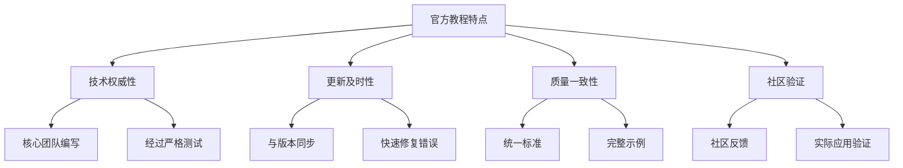
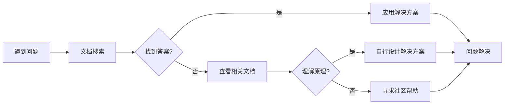

# 17.2.1 官方文档与教程

## 概念讲解

### 官方文档的核心价值
LangChain的官方文档不仅仅是API参考，而是一个完整的学习生态系统：

1. **权威信息来源**：由核心团队维护，确保技术准确性和一致性
2. **系统性学习路径**：从入门到精通的完整学习曲线设计
3. **最新技术动态**：及时更新反映框架的最新发展和最佳实践
4. **社区共识体现**：融合了社区经验和最佳实践的集体智慧

### 文档体系的多层次结构
LangChain文档采用分层设计，满足不同层次用户的需求：

- **入门层**：快速开始指南和基础概念解释，适合零基础用户
- **应用层**：具体场景的教程和示例，解决实际问题
- **原理层**：深入分析框架设计哲学和内部工作机制
- **参考层**：完整的API文档和技术规格说明

### 官方教程的特点
与普通技术博客不同，官方教程具有独特的优势：



### 文档学习的最佳实践
有效的文档学习需要策略和方法：

| 学习阶段 | 推荐文档 | 学习目标 | 预计时间 |
|---------|----------|----------|----------|
| **入门探索** | 快速开始指南 | 建立基本认知，完成第一个示例 | 2-4小时 |
| **基础掌握** | 核心概念文档 | 理解框架设计思想和基础组件 | 10-20小时 |
| **技能应用** | 场景教程 | 掌握具体场景下的应用方法 | 20-40小时 |
| **深入理解** | 高级主题文档 | 理解内部原理和高级特性 | 40-80小时 |

## 核心要点

### 1. LangChain官方文档入口
掌握正确的访问路径是高效学习的第一步：

#### 主要文档网站
1. **Python文档**：https://python.langchain.com
   - 主要面向Python开发者
   - 包含完整的API参考和教程
   - 支持多语言界面切换

2. **TypeScript/JavaScript文档**：https://js.langchain.com
   - 面向前端和Node.js开发者
   - 包含浏览器和Node环境示例
   - 与Python文档保持同步

3. **LangSmith文档**：https://docs.smith.langchain.com
   - LangChain的监控和测试平台
   - 企业级应用开发指南
   - 性能优化和调试工具

#### 文档导航技巧
- **搜索功能**：利用全文搜索快速定位信息
- **侧边栏导航**：按主题层次结构浏览内容
- **版本切换**：查看不同版本的文档
- **语言切换**：支持多种语言的文档界面

### 2. 核心文档内容体系
理解文档的组织结构有助于系统学习：

#### 文档模块划分
```yaml
文档结构:
  入门指南:
    - 安装配置
    - 快速开始
    - 核心概念介绍
  
  教程和示例:
    - 基础教程: 链、代理、工具使用
    - 进阶教程: LangGraph、Deep Agents
    - 场景示例: RAG、客服系统、数据分析
  
  API参考:
    - 核心模块: langchain_core
    - 主要框架: langchain
    - 社区集成: langchain_community
  
  最佳实践:
    - 性能优化
    - 错误处理
    - 安全考虑
  
  迁移指南:
    - 版本升级说明
    - 破坏性变更说明
    - 兼容性建议
```

#### 学习路径建议
1. **第一步：基础掌握**（1-2周）
   - 完成快速开始指南
   - 理解LCEL（LangChain表达式语言）
   - 掌握基础链和代理的使用

2. **第二步：技能应用**（2-4周）
   - 学习常用集成和工具
   - 掌握RAG系统构建
   - 实践复杂工作流设计

3. **第三步：深入理解**（1-2个月）
   - 研究LangGraph图计算
   - 理解Deep Agents架构
   - 掌握生产环境部署

### 3. 官方教程的使用方法
官方教程不仅提供知识，还提供学习方法：

#### 教程学习策略
1. **按顺序学习**：遵循教程的自然进阶顺序
2. **动手实践**：所有示例代码都要亲自运行和修改
3. **问题导向**：带着具体问题寻找解决方案
4. **笔记整理**：记录关键概念和代码片段

#### 代码示例学习法
```python
# 示例：官方教程中的典型学习模式
"""
官方教程通常采用"讲解-示例-练习"的三段式结构：

1. 概念讲解：解释技术的原理和用途
2. 代码示例：提供完整可运行的示例代码
3. 扩展练习：建议进一步的实践和探索
"""

# 学习建议：
# 1. 先理解概念，不要急于运行代码
# 2. 逐行分析示例代码，理解每行作用
# 3. 修改示例代码，测试不同的参数和场景
# 4. 记录遇到的问题和解决方案
```

#### 教程资源类型
- **文字教程**：详细的步骤说明和解释
- **视频教程**：视觉化的演示和讲解
- **交互式教程**：可在浏览器中直接运行的示例
- **项目模板**：完整的项目结构和代码

### 4. 文档搜索与问题解决
高效利用文档解决实际问题：

#### 搜索策略
1. **关键词选择**：使用准确的技术术语
2. **问题描述**：明确具体的问题场景
3. **多关键词组合**：使用AND/OR逻辑组合搜索
4. **版本限定**：指定相关版本的文档

#### 问题解决流程


#### 常见文档搜索场景
- **API使用**：查找特定函数或类的用法
- **错误解决**：搜索错误信息和解决方案
- **最佳实践**：寻找特定场景的实现建议
- **版本迁移**：查看版本变更和兼容性说明

### 5. 文档贡献与反馈
用户也是文档质量提升的参与者：

#### 文档问题报告
1. **内容错误**：技术信息不准确或过时
2. **示例问题**：代码示例无法运行或存在错误
3. **表述不清**：概念解释难以理解
4. **结构问题**：文档组织不合理或导航困难

#### 反馈方式
- **GitHub Issues**：在文档仓库中提交问题
- **文档评论**：部分文档支持直接评论
- **社区讨论**：在Discord或论坛中讨论
- **直接贡献**：提交文档改进的Pull Request

#### 有效反馈要素
- 具体指出问题位置（URL、章节、行号）
- 清晰描述问题现象
- 提供改进建议或修正方案
- 说明问题的影响程度

## 简单示例

### 示例：使用官方文档解决实际问题
以下是一个实际场景，展示如何利用官方文档解决问题：

**问题场景**：需要构建一个基于LangChain的客服系统，支持多轮对话和历史记录

**解决方案流程**：

1. **确定学习目标**：客服系统、多轮对话、状态管理
2. **文档搜索**：在python.langchain.com搜索"conversation memory"
3. **找到相关文档**：对话记忆和状态管理指南
4. **学习核心概念**：理解不同类型的记忆组件
5. **查看示例代码**：学习具体的实现方法
6. **动手实践**：在自己的项目中实现类似功能

**关键文档资源**：
- [对话记忆指南](https://python.langchain.com/docs/concepts/memory/)
- [多轮对话示例](https://python.langchain.com/docs/tutorials/conversational_retrieval/)
- [状态管理最佳实践](https://python.langchain.com/docs/how_to/memory/)

### 示例：官方教程的学习笔记模板
有效学习需要系统化的笔记记录：

```markdown
# LangChain学习笔记：[主题名称]

## 学习时间
[日期] [时长]

## 学习目标
1. [具体目标一]
2. [具体目标二]
3. [具体目标三]

## 核心概念
### [概念一]
- 定义：[简洁的定义]
- 用途：[主要应用场景]
- 关键特点：[重要特性]

### [概念二]
[类似结构]

## 代码示例
```python
# 示例代码
from langchain.chains import LLMChain
from langchain.prompts import PromptTemplate

# 核心代码片段
prompt = PromptTemplate(...)
chain = LLMChain(...)
```

## 关键要点
1. [重要知识点一]
2. [重要知识点二]
3. [注意事项或限制]

## 实践应用
- 可以在[具体场景]中应用此技术
- 需要注意[具体问题]
- 下一步尝试[扩展实践]

## 问题与解决
### 遇到的问题
1. [问题描述]
   - 解决方案：[解决方法]
   - 根本原因：[原因分析]

## 参考资料
- [官方文档链接]
- [相关教程链接]
- [扩展阅读材料]
```

### 示例：文档搜索技巧的实际应用
**场景**：需要查找如何在LangChain中处理API限流和重试

**搜索过程**：
1. **初始搜索**：搜索"rate limiting" - 结果较少
2. **扩展搜索**：搜索"retry" - 找到重试相关文档
3. **相关概念**：发现"callback"和"error handling"相关文档
4. **组合搜索**：搜索"retry callback" - 找到具体实现方法
5. **深入阅读**：学习`langchain_core.callbacks`模块文档

**找到的解决方案**：
```python
# 文档中的示例代码
from langchain_core.callbacks import RetryCallbackHandler

retry_handler = RetryCallbackHandler(
    max_retries=3,
    retry_delay=1.0
)

# 在链或代理中使用
chain = LLMChain(
    ...,
    callbacks=[retry_handler]
)
```

## 进阶应用

### 1. 深度文档研究与技术掌握
对于想要深入理解LangChain的开发者：

#### 源码阅读辅助
官方文档是阅读源码的重要辅助工具：
1. **API文档与源码对应**：通过文档理解接口设计意图
2. **设计思想文档**：理解框架的整体架构设计
3. **变更历史文档**：了解技术演进的脉络

#### 技术专题研究
选择特定主题进行深入研究：
- **性能优化专题**：收集所有相关文档和示例
- **安全最佳实践**：系统学习安全相关文档
- **扩展开发指南**：研究如何开发自定义组件

### 2. 文档驱动的学习计划制定
系统化的学习需要科学的计划：

#### 个性化学习路径
根据自身背景和目标制定学习计划：
1. **技能评估**：评估现有技能和知识缺口
2. **目标设定**：设定明确可衡量的学习目标
3. **资源选择**：选择适合的文档和教程资源
4. **进度跟踪**：定期评估学习进展和效果

#### 学习资源组合
- **官方文档**：核心技术和权威信息
- **视频教程**：视觉化理解和演示
- **实践项目**：实际应用和问题解决
- **社区讨论**：经验交流和问题解答

### 3. 文档质量评估与改进参与
作为高级用户可以参与文档质量提升：

#### 文档质量评估标准
1. **技术准确性**：所有技术信息必须正确
2. **示例完整性**：示例代码应该完整可运行
3. **更新及时性**：反映最新版本的特性和变化
4. **用户友好性**：易于理解和导航

#### 改进贡献方式
- **错误报告**：提交具体的技术错误
- **示例改进**：提供更好的代码示例
- **翻译贡献**：参与多语言文档翻译
- **结构优化**：建议更好的文档组织方式

## 常见问题

### Q1: 官方文档和第三方教程有什么区别？
**A**: 主要区别包括：
1. **权威性**：官方文档由核心团队维护，确保技术准确性
2. **完整性**：官方文档覆盖所有功能和版本
3. **及时性**：官方文档随版本更新及时同步
4. **一致性**：官方文档保持统一的风格和质量标准

第三方教程可能在具体应用场景、实践经验或教学方式上有优势，但应以官方文档为基准验证信息。

### Q2: 如何判断文档是否过时？
**A**: 判断文档时效性的方法：
1. **版本信息**：检查文档是否标注了适用的版本
2. **更新日期**：查看文档的最后更新时间
3. **API变更**：对比文档中的API与当前版本是否一致
4. **示例运行**：尝试运行示例代码是否正常
5. **社区讨论**：查看社区中是否有相关讨论

### Q3: 文档内容太多，如何高效学习？
**A**: 高效学习文档的建议：
1. **目标导向**：带着具体问题或目标学习
2. **分层学习**：先掌握核心概念，再深入细节
3. **实践结合**：边学边练，及时应用
4. **笔记整理**：系统记录学习内容和心得
5. **定期复习**：巩固记忆，建立知识连接

### Q4: 遇到文档中没有的问题怎么办？
**A**: 处理文档未覆盖问题的方法：
1. **搜索技巧**：尝试不同的关键词和搜索方式
2. **相关文档**：查看相关或基础概念的文档
3. **源码分析**：直接阅读相关源码理解实现
4. **社区求助**：在GitHub Issues或Discord中提问
5. **实验验证**：通过实验测试可能的解决方案

### Q5: 如何为文档改进做贡献？
**A**: 贡献文档改进的途径：
1. **错误报告**：提交具体的技术或文字错误
2. **示例贡献**：提供更好的代码示例或使用场景
3. **翻译协助**：参与多语言文档翻译工作
4. **结构建议**：提出文档组织结构的改进建议
5. **内容补充**：补充缺失的文档内容或章节

## 本节总结

### 核心收获
1. **系统学习**：官方文档提供了完整的学习路径和知识体系
2. **权威参考**：官方文档是技术决策和问题解决的权威依据
3. **持续更新**：文档随着项目发展不断更新和完善
4. **社区基础**：高质量的文档是健康开源社区的重要标志

### 文档学习的价值
- **技术掌握**：系统学习框架的核心概念和最佳实践
- **问题解决**：快速找到技术问题的解决方案
- **效率提升**：避免重复造轮子，复用成熟方案
- **质量保证**：基于官方文档的开发更有质量保障

### 实践建议
对于想要有效利用官方文档的开发者：
1. **建立习惯**：将文档查阅作为开发工作的一部分
2. **系统学习**：按照学习路径系统掌握框架知识
3. **实践导向**：将文档学习与实际项目结合
4. **积极参与**：为文档质量提升贡献自己的力量
5. **持续更新**：关注文档更新，跟进技术发展

### 下一步行动
1. **探索文档**：花时间浏览官方文档的结构和内容
2. **制定计划**：根据个人目标制定文档学习计划
3. **开始实践**：选择一个小项目开始实践学习
4. **参与社区**：加入文档相关的讨论和贡献
5. **持续学习**：建立持续学习和知识更新的习惯

**记住**：优秀的开发者不是记住所有知识，而是知道在哪里找到需要的知识。官方文档就是你最可靠的知识库和工具箱。在LangChain这样快速发展的技术领域，掌握高效使用文档的能力比记忆具体技术细节更加重要。

文档是技术的桥梁，连接着创造者与使用者，也连接着现在与未来。通过深入学习官方文档，你不仅掌握了具体的技术技能，更培养了持续学习和问题解决的核心能力。开始你的文档探索之旅，让知识照亮你的技术道路！