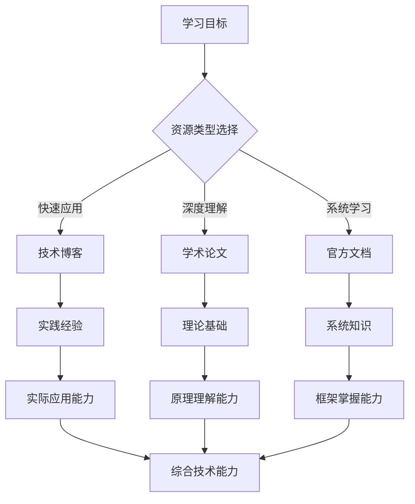

# 17.2.2 技术博客与论文

## 概念讲解

### 技术博客与论文在AI学习中的重要性
在快速发展的AI领域，技术博客和学术论文是获取最新知识和深入理解的关键渠道：

1. **前沿动态**：及时获取最新的技术发展和应用趋势
2. **深度分析**：获得对技术原理和实现细节的深入理解
3. **实践经验**：学习其他开发者在实际项目中的经验教训
4. **创新思想**：接触前沿的研究思想和创新方法

### 技术博客与论文的区别与互补
理解不同类型资源的特点有助于更有效地学习：

| 资源类型 | 优势 | 局限性 | 适用场景 |
|---------|------|--------|----------|
| **技术博客** | 通俗易懂、实用性强、更新快速 | 深度有限、质量参差 | 快速学习、解决具体问题、了解最新动态 |
| **学术论文** | 严谨系统、深度分析、创新性强 | 阅读门槛高、更新较慢 | 深入理解、研究创新、理论基础 |
| **官方文档** | 权威准确、全面系统、持续更新 | 偏向使用而非原理 | 学习框架使用、API参考、最佳实践 |

### 学习资源的多层次价值
不同类型的学习资源形成完整的学习生态系统：



### 有效学习的资源组合策略
成功的AI开发者善于组合使用不同类型的学习资源：

1. **入门阶段**：官方文档为主，技术博客为辅
2. **进阶阶段**：技术博客为主，学术论文为辅
3. **专家阶段**：学术论文为主，结合实践经验
4. **创新阶段**：跨领域论文，技术趋势分析

## 核心要点

### 1. 高质量技术博客资源
掌握寻找和评估技术博客的方法：

#### 主要博客平台和来源
1. **官方博客**：LangChain官方博客、OpenAI博客、Anthropic博客
2. **技术社区**：Medium、Dev.to、Towards Data Science
3. **个人博客**：知名AI研究者和工程师的个人博客
4. **公司技术博客**：Google AI、Microsoft Research、Meta AI

#### 博客质量评估标准
- **作者资质**：作者的技术背景和经验
- **内容深度**：对问题的分析深度和见解
- **技术准确性**：技术信息的正确性和时效性
- **实用性**：内容的实际应用价值
- **更新频率**：博客的活跃程度和更新频率

#### 推荐阅读清单
```yaml
必读博客推荐:
  官方资源:
    - LangChain Blog: https://blog.langchain.com
    - OpenAI Blog: https://openai.com/blog
    - Anthropic Blog: https://www.anthropic.com/news
  
  高质量个人博客:
    - Lilian Weng: https://lilianweng.github.io
    - Andrej Karpathy: http://karpathy.github.io
    - Jay Alammar: https://jalammar.github.io
  
  技术社区:
    - Towards Data Science: https://towardsdatascience.com
    - Medium AI/ML主题
    - Dev.to LangChain标签
```

### 2. 学术论文资源获取与阅读
系统化地获取和阅读AI相关学术论文：

#### 论文获取渠道
1. **学术数据库**：arXiv、Google Scholar、ACM Digital Library
2. **会议论文集**：NeurIPS、ICLR、ICML、ACL、EMNLP
3. **预印本平台**：arXiv是最重要的AI论文预印本平台
4. **开源项目**：许多论文附带开源代码实现

#### 论文阅读策略
1. **标题和摘要筛选**：快速判断论文相关性
2. **引言和结论精读**：理解研究动机和主要贡献
3. **方法和实验选读**：根据需求选择阅读深度
4. **复现代码研究**：通过代码理解技术实现

#### 论文搜索技巧
```python
# 示例：论文搜索的关键词策略
"""
AI论文搜索的关键词层次：

1. 基础概念：large language models, transformer, attention mechanism
2. 应用领域：retrieval-augmented generation, multi-agent systems, tool use
3. 技术方法：chain-of-thought, reinforcement learning from human feedback
4. 特定框架：LangChain, AutoGPT, BabyAGI

搜索建议：
- 使用引号搜索精确短语
- 使用AND/OR组合关键词
- 按时间排序获取最新研究
- 查看引用文献扩展阅读
"""
```

### 3. 博客与论文的深度学习方法
不仅仅是阅读，更要深度学习和应用：

#### 主动学习策略
1. **笔记整理**：系统记录关键观点和技术要点
2. **代码实践**：复现论文中的算法和实验
3. **思考总结**：提炼核心思想和创新点
4. **分享讨论**：与他人讨论加深理解

#### 学习笔记模板
```markdown
# 技术博客/论文学习笔记

## 基本信息
- 标题：[文章/论文标题]
- 作者：[作者信息]
- 来源：[博客/会议/期刊]
- 发布日期：[发布时间]
- 阅读日期：[阅读时间]

## 核心观点
### 主要贡献
1. [第一点贡献]
2. [第二点贡献]
3. [第三点贡献]

### 关键技术
- [技术一]: [简要说明]
- [技术二]: [简要说明]
- [技术三]: [简要说明]

## 技术细节
### 实现方法
[详细的技术实现描述]

### 实验结果
[主要的实验结果和数据分析]

## 实践应用
### 在LangChain中的应用
1. [应用场景一]
2. [应用场景二]

### 实现建议
```python
# 伪代码或实现思路
def apply_technique():
    # 实现思路说明
    pass
```

## 思考与评价
### 创新点分析
[技术的创新之处和价值]

### 局限性讨论
[存在的局限性和改进空间]

### 后续研究方向
[可能的后续研究方向]

## 参考资料
- [相关论文或博客链接]
- [开源代码库链接]
- [扩展阅读材料]
```

### 4. 从学习到应用的转化
将学到的知识转化为实际能力：

#### 知识应用框架
1. **理解吸收**：深入理解技术原理和思想
2. **实践验证**：通过代码实践验证理解
3. **项目应用**：在实际项目中应用新技术
4. **创新改进**：基于理解进行改进和创新

#### 应用案例：将论文技术应用到LangChain
```python
# 示例：将ReAct论文思想应用到LangChain
"""
ReAct论文核心思想：结合推理（Reasoning）和行动（Acting）

在LangChain中的应用：
1. 使用思维链（Chain-of-Thought）进行推理
2. 通过工具调用进行行动
3. 交替进行推理和行动直至解决问题
"""

# 伪代码实现
class ReActAgent:
    def __init__(self, llm, tools):
        self.llm = llm
        self.tools = tools
    
    def solve_problem(self, problem):
        # 推理阶段：分析问题
        reasoning = self.llm.reason(problem)
        
        # 行动阶段：调用工具
        action_result = self.execute_tools(reasoning)
        
        # 交替进行直至解决
        while not self.is_solved(action_result):
            reasoning = self.llm.reason(action_result)
            action_result = self.execute_tools(reasoning)
        
        return action_result
```

### 5. 知识更新与持续学习
在快速变化的AI领域保持知识更新：

#### 信息更新机制
1. **定期阅读**：建立固定的学习时间表
2. **订阅通知**：订阅重要博客和论文的更新
3. **社区参与**：通过社区讨论了解最新动态
4. **项目实践**：通过实际项目接触新技术

#### 学习计划制定
- **短期计划**：每周阅读2-3篇高质量博客
- **中期计划**：每月深入研读1-2篇重要论文
- **长期计划**：每季度学习一个新技术领域
- **实践计划**：将学到的技术应用到实际项目中

## 简单示例

### 示例：技术博客的深度分析
以下是对一篇典型LangChain技术博客的分析示例：

**博客标题**："Building Production-Ready RAG Systems with LangChain v1.2"

**博客来源**：LangChain官方博客

**核心内容分析**：
1. **问题识别**：传统RAG系统在生产环境中的挑战
2. **解决方案**：LangChain v1.2的新特性和改进
3. **技术细节**：新的检索器、更好的缓存机制、改进的错误处理
4. **实践建议**：部署、监控、优化的具体方法

**学习收获**：
- 了解生产环境RAG系统的最佳实践
- 学习LangChain v1.2的新特性应用
- 掌握系统设计和性能优化的方法

**实践应用**：
```python
# 基于博客建议的RAG系统实现
from langchain.chains import RetrievalQA
from langchain.vectorstores import Chroma
from langchain.embeddings import OpenAIEmbeddings

class ProductionRAGSystem:
    def __init__(self):
        # 按照博客建议配置
        self.embeddings = OpenAIEmbeddings()
        self.vectorstore = Chroma(
            embedding_function=self.embeddings,
            persist_directory="./chroma_db"
        )
        
    def build_retriever(self):
        # 使用博客推荐的配置
        return self.vectorstore.as_retriever(
            search_type="similarity",
            search_kwargs={"k": 5}
        )
    
    def create_qa_chain(self, llm):
        retriever = self.build_retriever()
        return RetrievalQA.from_chain_type(
            llm=llm,
            chain_type="stuff",
            retriever=retriever,
            return_source_documents=True
        )
```

### 示例：学术论文的学习与应用
**论文信息**：
- 标题："ReAct: Synergizing Reasoning and Acting in Language Models"
- 作者：Shunyu Yao等
- 会议：ICLR 2023
- 链接：https://arxiv.org/abs/2210.03629

**论文学习笔记**：
```markdown
# ReAct论文学习笔记

## 核心思想
将推理（Reasoning）和行动（Acting）结合在语言模型中，通过交替进行推理和工具使用来解决复杂问题。

## 技术要点
1. **推理步骤**：模型生成自然语言推理轨迹
2. **行动步骤**：模型调用外部工具获取信息
3. **交替执行**：推理和行动交替进行直至解决问题

## 在LangChain中的应用
LangChain的Agent系统天然支持ReAct模式：
- 推理：通过LLM生成思考过程
- 行动：通过工具调用执行操作

## 实践代码
```python
# 简化的ReAct实现
from langchain.agents import AgentExecutor, create_react_agent
from langchain.tools import Tool

# 定义工具
tools = [
    Tool(
        name="Calculator",
        func=lambda x: str(eval(x)),
        description="计算数学表达式"
    )
]

# 创建ReAct Agent
agent = create_react_agent(llm, tools)
executor = AgentExecutor(agent=agent, tools=tools)

# 执行问题解决
result = executor.run("计算(25 * 4) + (100 / 5)的结果")
```

## 实践价值
1. **提高问题解决能力**：结合推理和行动解决复杂问题
2. **增强可解释性**：推理轨迹提供决策过程的可视化
3. **提升工具使用效率**：通过推理指导工具选择和调用
```

### 示例：资源发现与评估实践
**场景**：寻找最新的LangChain多代理系统相关资源

**搜索过程**：
1. **初始搜索**：在Google Scholar搜索"multi-agent systems LangChain"
2. **扩展搜索**：在arXiv搜索"multi-agent language models"
3. **博客搜索**：在Medium搜索"LangChain multi-agent"
4. **社区搜索**：在LangChain Discord查看相关讨论

**评估标准**：
- 技术新颖性：是否包含最新技术和方法
- 实用性：是否有可运行的代码示例
- 权威性：作者背景和来源可靠性
- 相关性：与当前学习目标的相关程度

**发现的有价值资源**：
1. **论文**："Multi-Agent Collaboration: Humans and AI Joining Forces"
2. **博客**："Building Complex Workflows with LangGraph Multi-Agent"
3. **教程**："LangChain官方多代理系统教程"
4. **开源项目**：GitHub上的LangChain多代理示例项目

## 进阶应用

### 1. 建立个人知识体系
将学习资源系统化组织：

#### 知识管理方法
1. **分类体系**：按技术领域、应用场景、难易程度分类
2. **标签系统**：使用标签标记资源的关键特征
3. **关联网络**：建立资源之间的关联关系
4. **定期整理**：定期更新和维护知识库

#### 工具选择
- **笔记工具**：Obsidian、Notion、Roam Research
- **代码管理**：GitHub Gist、Jupyter Notebook
- **阅读管理**：Zotero、Pocket、Raindrop.io
- **学习平台**：Anki、RemNote

### 2. 从消费者到创造者
将学习转化为创造：

#### 内容创作路径
1. **学习总结**：整理学习笔记和心得
2. **技术分析**：深入分析技术原理和应用
3. **实践分享**：分享项目经验和解决方案
4. **创新研究**：基于学习进行创新研究

#### 创作平台选择
- **技术博客**：个人博客、Medium、知乎专栏
- **开源项目**：GitHub项目、技术方案库
- **社区贡献**：Stack Overflow、技术论坛
- **学术发表**：会议论文、期刊文章

### 3. 技术趋势分析与预测
基于学习资源进行技术分析：

#### 分析方法
1. **文献计量**：分析论文发表趋势和热点
2. **技术演进**：追踪技术发展和演变路径
3. **应用分析**：分析技术在实际应用中的表现
4. **趋势预测**：基于分析预测未来发展方向

#### 分析工具
- **数据分析**：Python数据分析库
- **可视化**：图表和可视化工具
- **文本分析**：自然语言处理工具
- **网络分析**：引文网络和合作关系分析

## 常见问题

### Q1: 如何判断技术博客的质量？
**A**: 判断技术博客质量的维度：
1. **作者背景**：作者的技术经验和专业背景
2. **内容深度**：对问题的分析深度和见解
3. **技术准确性**：技术信息的正确性和时效性
4. **代码质量**：附带代码的质量和可运行性
5. **读者反馈**：评论、点赞、分享等读者反馈
6. **更新维护**：内容的更新频率和维护状态

### Q2: 学术论文阅读有哪些技巧？
**A**: 高效阅读学术论文的技巧：
1. **三步阅读法**：先读摘要，再读引言和结论，最后选读细节
2. **笔记记录**：系统记录关键观点和技术要点
3. **代码复现**：通过代码实现加深理解
4. **讨论交流**：与他人讨论论文内容
5. **关联阅读**：阅读相关论文和参考文献
6. **实践应用**：将论文技术应用到实际项目中

### Q3: 如何平衡博客和论文的学习时间？
**A**: 平衡学习的建议：
1. **目标导向**：根据学习目标选择资源类型
2. **时间分配**：建议70%时间用于深度内容，30%用于广度扩展
3. **优先级排序**：重要且相关的内容优先学习
4. **灵活调整**：根据学习进展和需求调整策略
5. **实践结合**：将理论学习与实践项目结合

### Q4: 遇到难以理解的技术内容怎么办？
**A**: 处理难懂内容的方法：
1. **基础补充**：补充相关的基础知识
2. **多源对比**：查阅不同来源的相同内容
3. **简化理解**：尝试用简单语言重新表述
4. **实践验证**：通过代码实践加深理解
5. **寻求帮助**：在社区中提问和讨论
6. **逐步深入**：分步骤深入理解复杂内容

### Q5: 如何将学到的知识应用到实际项目？
**A**: 知识应用的方法：
1. **小规模实验**：先在小项目中尝试应用
2. **渐进式应用**：逐步增加应用的复杂性
3. **问题驱动**：针对具体问题寻找解决方案
4. **效果评估**：评估应用效果并调整优化
5. **经验总结**：总结应用经验和教训
6. **持续改进**：根据反馈持续改进应用

## 本节总结

### 核心收获
1. **资源多样性**：技术博客和论文各具优势，应组合使用
2. **学习方法**：主动学习和深度思考比被动阅读更重要
3. **实践转化**：将学到的知识转化为实际能力是关键
4. **持续更新**：在快速变化的AI领域需要持续学习

### 学习资源的战略价值
- **知识获取**：获取最新技术知识和趋势
- **能力提升**：提升技术理解和应用能力
- **创新基础**：为技术创新提供思想基础
- **职业发展**：支持长期职业发展和成长

### 实践建议
对于想要有效利用技术博客和论文的开发者：
1. **建立习惯**：建立定期的学习和阅读习惯
2. **系统管理**：系统化管理学习资源和笔记
3. **深度思考**：进行深度思考和批判性分析
4. **实践应用**：将学到的知识应用到实际项目中
5. **分享交流**：通过分享和交流加深理解

### 下一步行动
1. **资源探索**：开始探索推荐的技术博客和论文
2. **学习计划**：制定个人的学习计划和目标
3. **实践项目**：选择一个实践项目应用学到的知识
4. **笔记整理**：建立系统的学习笔记体系
5. **社区参与**：参与相关社区讨论和分享

**记住**：在AI这个快速发展的领域，学习能力比当前知识更重要。通过有效利用技术博客和论文，你不仅掌握了具体的技术知识，更培养了持续学习和自我提升的核心能力。这些能力将伴随你的整个职业生涯，让你在技术变革中始终保持竞争力。

技术博客是实践的灯塔，学术论文是理论的基石。两者的结合为你构建了完整的学习生态系统。开始你的深度学习之旅，让知识和实践共同推动你的技术成长！