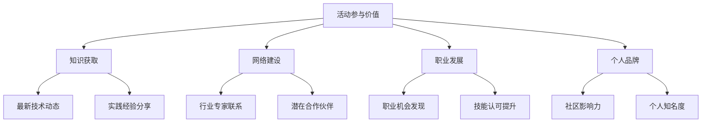

# 17.2.3 会议与线下活动

## 概念讲解

### 技术会议与线下活动的独特价值
在数字化时代，线下技术活动依然具有不可替代的价值：

1. **深度交流**：面对面交流促进深入的技术讨论和思想碰撞
2. **网络建设**：建立真实的人际关系网络和职业联系
3. **学习体验**：现场演示和互动提供独特的学习体验
4. **行业洞察**：直接接触行业领导者和前沿思想

### 技术活动的多层次生态系统
AI和LangChain相关的技术活动形成了丰富的生态系统：

- **国际会议**：全球性的学术和技术盛会
- **行业峰会**：针对特定行业或技术领域的专业会议
- **本地聚会**：城市级别的技术社区活动
- **工作坊培训**：深入的技术培训和动手实践
- **线上活动**：虚拟会议和网络研讨会

### 参与技术活动的战略价值
对于AI开发者来说，参与技术活动不仅仅是学习，更是战略投资：



### 活动参与的投资回报分析
参与技术活动需要时间和资源投入，但其回报是多方面的：

| 投资类型 | 时间投入 | 经济投入 | 预期回报 |
|---------|----------|----------|----------|
| **本地聚会** | 2-4小时/月 | 低或无 | 本地网络、基础学习 |
| **行业会议** | 1-3天/次 | 中等 | 行业洞察、专业网络 |
| **国际会议** | 3-7天/次 | 较高 | 全球视野、顶尖网络 |
| **培训工作坊** | 1-5天/次 | 中等 | 深度技能、认证认可 |

## 核心要点

### 1. AI与LangChain相关的重要会议
了解关键的技术会议是有效参与的第一步：

#### 国际学术会议
1. **NeurIPS**（神经信息处理系统大会）
   - 全球最重要的AI学术会议之一
   - 包含大量LLM和Agent相关研究
   - 时间：每年12月，地点多变

2. **ICLR**（国际学习表征大会）
   - 专注于深度学习表征学习
   - 前沿的Transformer和语言模型研究
   - 时间：每年4-5月

3. **ACL**（计算语言学协会年会）
   - 自然语言处理领域的顶级会议
   - 包含大量LLM应用和研究
   - 时间：每年7-8月

#### 行业技术会议
1. **LangChain Conf**（官方会议）
   - LangChain官方组织的技术大会
   - 最新框架特性发布和案例分享
   - 时间：定期举办，关注官方公告

2. **AI Engineer Summit**
   - 专注于AI工程实践和应用
   - 大量LangChain和Agent系统内容
   - 时间：每年多次，全球多个城市

3. **PyData / PyCon**系列
   - Python数据科学和开发社区会议
   - 包含丰富的AI和LangChain相关议题
   - 时间：全年在不同城市举办

#### 本地社区活动
1. **LangChain Meetups**
   - 城市级别的LangChain用户聚会
   - 小规模、高互动的技术分享
   - 时间：每月或每季度

2. **AI/ML本地社区**
   - 本地AI和机器学习用户组
   - 包含LangChain相关内容分享
   - 时间：定期举办

### 2. 会议参与策略与准备
有效的会议参与需要系统的准备和策略：

#### 会前准备
1. **议程研究**：仔细研究会议议程和演讲者
2. **目标设定**：明确参会目标和期望收获
3. **网络规划**：计划希望联系的人员和话题
4. **技术准备**：准备个人介绍和问题清单

#### 参与计划模板
```markdown
# [会议名称] 参与计划

## 会议信息
- 时间：[日期]
- 地点：[城市/线上]
- 主题：[主要议题]

## 参会目标
### 学习目标
1. [了解最新技术一]
2. [学习最佳实践二]
3. [掌握新工具三]

### 网络目标
1. [联系专家一]
2. [结识同行二]
3. [寻找合作三]

### 职业目标
1. [了解行业趋势]
2. [探索职业机会]
3. [建立个人品牌]

## 重点关注议程
### 必听演讲
1. [演讲标题一] - [演讲者] - [时间]
2. [演讲标题二] - [演讲者] - [时间]

### 重点关注领域
- [技术领域一]
- [应用场景二]
- [发展趋势三]

## 网络准备
### 个人介绍
- 姓名：[你的姓名]
- 职位：[当前职位]
- 专长：[技术专长]
- 当前项目：[正在进行的项目]

### 联系清单
1. [专家姓名] - [公司/机构] - [联系话题]
2. [同行姓名] - [公司/机构] - [联系话题]

## 会后行动计划
1. [整理学习笔记]
2. [跟进重要联系]
3. [分享参会收获]
```

### 3. 演讲参与与内容贡献
从听众到演讲者的角色转变：

#### 演讲机会类型
1. **闪电演讲**：5-10分钟的简短分享
2. **技术演讲**：30-60分钟的深入技术分享
3. **工作坊**：2-4小时的动手实践教学
4. **小组讨论**：与其他专家的对话讨论

#### 演讲主题建议
- **LangChain实战案例**：具体项目的经验分享
- **技术深度解析**：某个LangChain特性的深入分析
- **最佳实践总结**：特定场景下的最佳实践
- **创新应用展示**：创新的应用场景和解决方案

#### 演讲准备流程
1. **主题选择**：选择有价值且合适的主题
2. **大纲设计**：设计清晰的内容结构
3. **内容准备**：准备详细的演讲内容和示例
4. **练习演练**：多次练习确保流畅表达
5. **反馈收集**：收集反馈并持续改进

### 4. 网络建设与关系维护
技术会议是建立专业网络的绝佳机会：

#### 网络建设策略
1. **主动交流**：积极与演讲者和参与者交流
2. **价值提供**：分享自己的经验和见解
3. **跟进维护**：会后及时跟进重要联系
4. **长期关系**：建立和维护长期专业关系

#### 有效交流技巧
- **开放性问题**：使用开放性问题引导深入对话
- **倾听理解**：认真倾听他人的观点和经验
- **价值交换**：在交流中提供和获取价值
- **专业尊重**：保持专业和尊重的交流态度

### 5. 会后行动与价值转化
会议结束后的行动决定最终价值：

#### 会后行动计划
1. **笔记整理**：系统整理会议笔记和收获
2. **知识分享**：与团队或社区分享学习成果
3. **联系跟进**：及时跟进重要联系和机会
4. **实践应用**：将学到的知识应用到实际项目

#### 价值转化方法
- **技术应用**：将新技术应用到实际项目中
- **经验总结**：总结最佳实践和经验教训
- **合作机会**：探索潜在的合作和项目机会
- **职业发展**：利用网络支持职业发展

## 简单示例

### 示例：LangChain Conf参会实践
以下是一个实际参会的示例和收获：

**会议信息**：LangChain Conf 2024，旧金山，3天

**参会准备**：
1. 提前研究议程，标记重点关注演讲
2. 准备个人介绍和联系清单
3. 设定具体的学习和网络目标

**会议收获**：
```yaml
技术学习:
  - LangChain v1.3新特性预览
  - 生产环境部署最佳实践
  - LangGraph高级工作流设计
  
网络建设:
  - 与3位核心维护者建立联系
  - 结识10+位行业同行
  - 获得2个潜在合作机会
  
职业发展:
  - 了解行业最新趋势
  - 获得多个工作机会信息
  - 建立个人技术品牌认知
```

**会后行动**：
1. 整理详细会议笔记并分享给团队
2. 与重要联系人进行跟进交流
3. 将学到的最佳实践应用到当前项目
4. 在技术博客分享参会收获和经验

### 示例：本地技术聚会组织
**活动类型**：LangChain本地用户组月度聚会

**活动组织**：
- **时间**：每月第三个周四晚7-9点
- **地点**：本地科技公司办公室或联合办公空间
- **形式**：2个技术分享 + 自由交流
- **规模**：30-50人

**活动内容**：
```markdown
# LangChain本地用户组月度聚会

## 活动议程
19:00-19:15 签到和交流
19:15-19:45 技术分享一：LangChain在电商客服的应用
19:45-20:15 技术分享二：LangGraph工作流设计实践
20:15-21:00 自由交流和技术讨论

## 分享者
- 张三：某电商公司AI工程师
- 李四：某科技公司技术负责人

## 参与者
- AI工程师、数据科学家、技术负责人
- 对LangChain感兴趣的学生和研究者
- 本地科技公司代表

## 活动价值
- 本地技术社区建设
- 实践经验分享和学习
- 职业网络扩展
- 合作机会发现
```

### 示例：会议演讲提案
**演讲提案示例**：

```markdown
# 演讲提案：构建企业级LangChain应用：从原型到生产

## 演讲者信息
- 姓名：王五
- 职位：某科技公司高级AI工程师
- 经验：3年LangChain应用开发经验
- 联系：wangwu@example.com

## 演讲概述
分享从LangChain原型开发到生产环境部署的完整历程，包括架构设计、性能优化、监控部署等关键环节。

## 目标听众
- 正在或计划使用LangChain的开发者
- 需要将AI应用投入生产的技术负责人
- 对AI工程化感兴趣的工程师

## 主要内容
### 1. 架构设计挑战与解决方案
- 大规模数据处理和流式处理
- 多模型协同和路由策略
- 状态管理和会话保持

### 2. 性能优化实践
- 缓存策略设计和实现
- 并发处理和资源管理
- API限流和错误处理

### 3. 生产环境部署
- 容器化和编排部署
- 监控和日志系统集成
- 安全合规考虑

### 4. 案例分享
- 客服系统生产部署案例
- 内容生成平台优化案例
- 数据分析自动化案例

## 技术深度
- 适合中级到高级开发者
- 包含实际代码示例和架构图
- 提供可操作的最佳实践建议

## 预期收获
听众将学习到：
1. 企业级LangChain应用的设计原则
2. 性能优化和问题解决的具体方法
3. 生产环境部署的完整流程和工具
4. 实际案例的经验教训和最佳实践

## 演讲时长
45分钟演讲 + 15分钟问答

## 设备需求
- 投影设备和麦克风
- 网络连接（用于演示）
- 白板或绘图工具
```

## 进阶应用

### 1. 会议组织与社区领导
从参与者到组织者的角色升级：

#### 活动组织经验
1. **需求调研**：了解社区成员的兴趣和需求
2. **资源协调**：协调场地、赞助、演讲者等资源
3. **活动执行**：确保活动顺利进行和高质量体验
4. **效果评估**：收集反馈并持续改进活动质量

#### 社区领导价值
- **影响力提升**：在技术社区建立领导地位
- **网络扩展**：扩展更广泛的职业网络
- **技能发展**：提升组织管理和领导能力
- **职业机会**：获得更多职业发展机会

### 2. 国际会议深度参与
对于想要在国际舞台展示的开发者：

#### 国际会议参与策略
1. **论文发表**：在顶级会议发表研究成果
2. **演讲机会**：争取在国际会议演讲的机会
3. **委员会参与**：参与会议程序委员会工作
4. **合作研究**：与国际研究者合作开展研究

#### 国际参与价值
- **全球视野**：了解全球技术发展趋势
- **国际网络**：建立国际化的专业网络
- **学术认可**：获得国际学术界的认可
- **职业突破**：打开国际职业发展机会

### 3. 线上线下融合参与
在后疫情时代，线上线下融合成为新常态：

#### 混合参与策略
1. **本地参与**：重要会议争取现场参与
2. **线上补充**：通过线上方式参与更多活动
3. **内容消化**：利用录播内容深度学习
4. **社区维护**：通过线上工具维护社区联系

#### 技术工具利用
- **虚拟会议平台**：Zoom、腾讯会议等
- **社区管理工具**：Discord、Slack等
- **内容分享平台**：YouTube、Bilibili等
- **网络管理工具**：LinkedIn、Twitter等

## 常见问题

### Q1: 如何选择适合自己的技术会议？
**A**: 选择会议的建议：
1. **目标匹配**：会议主题与个人学习目标匹配
2. **层次适合**：会议难度与个人技术水平适合
3. **资源可行**：时间、经济等资源投入可行
4. **价值预期**：预期收获与投入成本平衡
5. **网络价值**：参与人群对个人网络建设的价值

### Q2: 如何在会议上有效建立人脉？
**A**: 建立人脉的技巧：
1. **提前准备**：研究参会人员和演讲者信息
2. **主动交流**：在茶歇、交流环节主动交流
3. **价值导向**：在交流中提供和寻求价值
4. **跟进维护**：会后及时跟进重要联系
5. **长期经营**：建立和维护长期专业关系

### Q3: 会议费用较高，如何争取公司支持？
**A**: 争取公司支持的方法：
1. **价值论证**：明确说明会议对工作的价值
2. **学习计划**：制定详细的学习和分享计划
3. **成本效益**：分析投入产出比和长期价值
4. **团队收益**：强调对团队和公司的整体收益
5. **替代方案**：提供线上参与等成本较低方案

### Q4: 第一次在技术会议演讲需要注意什么？
**A**: 首次演讲的建议：
1. **充分准备**：多次练习确保内容熟练
2. **时间控制**：严格控制在规定时间内
3. **互动设计**：设计适当的互动环节
4. **技术备份**：准备技术故障的应对方案
5. **心态调整**：保持自信和专业的态度

### Q5: 如何将会议收获转化为实际价值？
**A**: 价值转化的方法：
1. **系统整理**：会议结束后立即整理笔记
2. **团队分享**：在团队中分享学习收获
3. **实践应用**：将新技术应用到实际项目
4. **网络维护**：持续维护重要联系
5. **经验总结**：总结参会经验并改进策略

## 本节总结

### 核心收获
1. **战略价值**：技术会议是职业发展的战略投资
2. **多维收获**：会议提供学习、网络、机会等多维价值
3. **主动参与**：从被动听众到主动参与者的角色转变
4. **持续价值**：会后行动决定会议参与的长期价值

### 会议参与的价值链
- **知识更新**：获取最新技术动态和趋势
- **网络扩展**：建立和维护专业人际关系
- **技能提升**：通过学习和实践提升技能
- **机会发现**：发现职业发展和合作机会
- **品牌建设**：建立个人技术品牌和影响力

### 实践建议
对于想要有效参与技术会议的开发者：
1. **计划先行**：制定明确的参会计划和目标
2. **主动参与**：从听众到演讲者到组织者的角色演进
3. **价值导向**：以价值创造和交换为导向参与活动
4. **持续投入**：将会议参与作为长期职业投资
5. **分享回馈**：将收获分享给社区和团队

### 下一步行动
1. **活动探索**：研究和选择适合的技术活动
2. **计划制定**：制定个人参与计划和目标
3. **资源准备**：准备参会所需的资源和支持
4. **积极参与**：以主动态度参与选定的活动
5. **价值转化**：将参与收获转化为实际价值

**记住**：技术会议不仅是学习的机会，更是建立职业生涯的重要平台。每一次会议参与，都是对个人技术网络和职业发展的投资。通过有策略的参与和有效的价值转化，技术会议将成为你职业成长的重要加速器。

在AI技术快速发展的今天，保持与前沿技术和优秀人才的连接比单纯的技术学习更加重要。开始你的会议参与之旅，让每一次交流都成为职业发展的新起点！