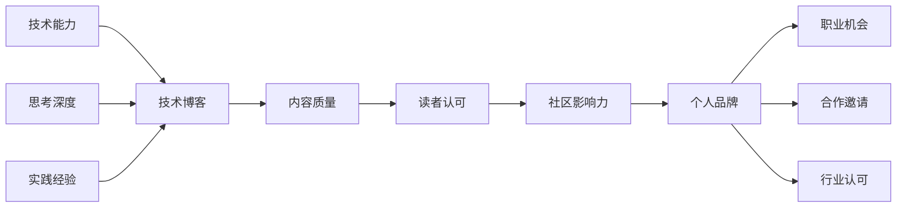

# 17.3.1 技术博客与分享

## 概念讲解

### 技术博客在个人品牌建设中的重要性
在AI技术快速发展的今天，技术博客已成为开发者建立个人品牌的关键平台：

1. **专业能力展示**：通过深度技术文章展示专业知识和实践经验
2. **思想领导力**：分享独特见解和思考，建立行业影响力
3. **社区影响力**：通过内容贡献提升在技术社区的知名度和认可度
4. **职业机会**：高质量技术内容吸引工作机会和合作邀请

### 技术博客的多元价值
一篇优秀的技术博客可以创造多重价值：

- **学习价值**：帮助他人学习和解决问题
- **记录价值**：系统记录自己的学习和思考过程
- **网络价值**：吸引志同道合的技术伙伴和专家
- **职业价值**：提升个人市场竞争力和职业发展机会

### 技术博客与个人品牌的关系
技术博客是个人品牌建设的核心载体：



### 技术博客的质量层次
不同层次的技术博客创造不同价值：

| 博客层次 | 主要内容 | 目标读者 | 价值贡献 |
|---------|----------|----------|----------|
| **基础层** | 学习笔记、技术总结 | 初学者、同行学习者 | 知识整理、学习记录 |
| **应用层** | 项目实践、问题解决 | 实践者、问题解决者 | 经验分享、方案参考 |
| **深度层** | 技术分析、原理探究 | 技术专家、研究者 | 深度洞察、思想启发 |
| **创新层** | 原创思想、技术趋势 | 行业领导者、创新者 | 思想领导、趋势引领 |

## 核心要点

### 1. 技术博客的主题选择策略
选择合适的主题是成功的第一步：

#### 主题选择原则
1. **价值导向**：主题应对读者有实际价值
2. **能力匹配**：在自己擅长的领域进行写作
3. **需求响应**：响应社区的实际问题和需求
4. **差异化**：提供独特的视角和见解

#### LangChain相关热门主题
```yaml
入门指导类:
  - LangChain入门完全指南
  - 从零开始构建第一个AI Agent
  - LCEL表达式语言深度解析

实践应用类:
  - 基于LangChain的智能客服系统实践
  - LangGraph复杂工作流设计
  - RAG系统性能优化实战

深度技术类:
  - LangChain架构设计与实现原理
  - Agent系统决策机制分析
  - 大模型与工具集成技术细节

趋势分析类:
  - LangChain技术演进趋势
  - AI Agent技术生态分析
  - 企业级AI应用发展展望
```

#### 主题发现方法
1. **个人经验**：总结自己的项目经验和学习过程
2. **社区观察**：关注技术社区的热门话题和问题
3. **技术跟踪**：跟踪新技术发展和版本更新
4. **读者需求**：通过读者反馈了解需求

### 2. 技术博客的内容质量标准
高质量技术博客应满足的标准：

#### 内容质量标准
1. **技术准确性**：所有技术信息必须准确无误
2. **深度适当**：根据目标读者调整技术深度
3. **结构清晰**：逻辑清晰，层次分明
4. **实用性**：提供可操作的建议和示例

#### 博客结构设计
```markdown
# [吸引人的标题]

## 引言
- 问题背景和重要性
- 文章目标和预期收获
- 读者定位和先决知识

## 核心内容
### 概念讲解
- 核心概念解释
- 技术原理说明
- 设计思想分析

### 实践指南
- 步骤清晰的实现方法
- 代码示例和解释
- 常见问题和解决方案

### 深入分析
- 技术细节深度解析
- 性能优化建议
- 最佳实践总结

## 案例研究
### 实际应用案例
- 项目背景和目标
- 技术方案和实施过程
- 结果分析和经验教训

### 代码示例
```python
# 完整可运行的代码示例
def practical_example():
    # 详细的代码实现
    pass
```

## 总结与展望
### 核心收获
- 技术要点总结
- 实践建议提炼
- 学习资源推荐

### 未来展望
- 技术发展趋势
- 进一步学习方向
- 社区参与建议

## 参考资料
- 官方文档链接
- 相关技术资源
- 扩展阅读材料
```

### 3. 写作技巧与表达优化
优秀的写作技巧提升内容可读性：

#### 写作原则
1. **清晰简洁**：使用简洁明了的语言表达
2. **逻辑连贯**：保持内容的逻辑连贯性
3. **重点突出**：突出关键信息和核心观点
4. **读者友好**：考虑读者背景和理解难度

#### 技术写作技巧
- **示例驱动**：通过具体示例解释抽象概念
- **层次递进**：从简单到复杂逐步深入
- **可视化辅助**：使用图表和流程图辅助理解
- **代码注释**：详细的代码注释帮助理解

#### 表达优化建议
```python
# 优化前后的对比示例

# 优化前：抽象描述
"""
这个函数用于处理数据。
"""

# 优化后：具体清晰的描述
"""
process_user_data()函数执行以下操作：
1. 验证用户输入数据的格式和完整性
2. 清理无效或异常数据点
3. 将数据转换为标准格式
4. 返回处理后的数据供后续分析使用

参数说明：
- user_data: dict类型，包含原始用户数据
- strict_mode: bool类型，控制验证严格程度

返回值：
- 处理后的标准化数据字典
- 处理过程中发现的错误列表
"""
```

### 4. 技术博客的发布与推广
内容发布后的推广同样重要：

#### 发布平台选择
1. **个人博客**：完全控制，品牌独立
2. **技术社区**：Medium、知乎、CSDN等
3. **开源平台**：GitHub Pages、GitBook
4. **社交媒体**：技术论坛、专业社区

#### 推广策略
- **社区分享**：在相关技术社区分享内容
- **社交媒体**：通过Twitter、LinkedIn等平台推广
- **邮件列表**：建立读者邮件列表定期更新
- **SEO优化**：优化内容提高搜索引擎排名

#### 互动与反馈
1. **评论回复**：积极回复读者评论和问题
2. **内容更新**：根据反馈更新和完善内容
3. **读者互动**：通过问卷调查了解读者需求
4. **社区参与**：参与相关讨论扩大影响力

### 5. 持续写作与品牌建设
技术博客需要持续投入：

#### 写作计划制定
1. **频率设定**：根据能力设定合理的发布频率
2. **主题规划**：提前规划系列主题和内容
3. **时间管理**：合理安排写作时间
4. **质量控制**：建立内容质量审查流程

#### 品牌建设策略
- **专业定位**：明确自己的专业领域和定位
- **风格统一**：保持一致的写作风格和视觉风格
- **价值持续**：持续提供有价值的内容
- **网络扩展**：通过内容吸引和扩展专业网络

## 简单示例

### 示例：一篇高质量的LangChain技术博客
**博客标题**：深入理解LangChain的Agent系统：从ReAct到AutoGPT

**内容大纲**：
```markdown
# 深入理解LangChain的Agent系统：从ReAct到AutoGPT

## 引言
- Agent系统在现代AI应用中的重要性
- LangChain Agent系统的发展历程
- 本文的目标和结构

## Agent系统基础
### 什么是AI Agent
- Agent的定义和核心特征
- 与传统程序的区别

### LangChain Agent架构
- 核心组件：LLM、工具、记忆、执行器
- 工作流程和执行机制

## 关键技术深度解析
### ReAct模式实现
- 推理与行动交替的工作机制
- LangChain中的ReAct实现
- 代码示例和性能分析

### 工具使用优化
- 工具选择和调用策略
- 多工具协同工作
- 工具开发的注意事项

### 记忆管理机制
- 短期记忆和长期记忆
- 状态管理和会话保持
- 大规模应用中的记忆优化

## 实践应用案例
### 智能客服Agent实现
- 需求分析和系统设计
- 关键技术实现细节
- 性能测试和优化结果

### 数据分析Agent开发
- 数据处理工具集成
- 分析流程自动化
- 结果可视化和报告生成

## 进阶主题探讨
### 多Agent协作系统
- 多Agent架构设计
- 协作和通信机制
- LangGraph在多Agent系统中的应用

### Agent系统性能优化
- 响应时间优化策略
- 资源使用效率提升
- 大规模部署考虑

## 总结与展望
### 核心收获
- Agent系统设计的关键要点
- 实践中的最佳经验
- 常见问题和解决方案

### 未来发展方向
- Agent技术的演进趋势
- LangChain Agent系统的路线图
- 个人学习和研究建议

## 参考资料
- 相关论文和官方文档
- 开源项目和代码库
- 社区讨论和案例分析
```

### 示例：技术博客的SEO优化实践
**SEO优化要点**：

```yaml
标题优化:
  - 包含关键词: "LangChain Agent系统深度解析"
  - 长度适中: 50-60个字符
  - 吸引点击: 提供明确价值承诺

内容优化:
  - 关键词密度: 自然融入"LangChain"、"Agent"、"AI"等关键词
  - 标题层次: 使用H1-H4合理组织内容结构
  - 内部链接: 链接到相关技术文章和官方文档
  - 外部链接: 引用权威的技术资源和研究

技术优化:
  - 页面加载速度: 优化图片和代码块
  - 移动端适配: 确保移动设备良好显示
  - 结构化数据: 添加技术文章的结构化标记

推广优化:
  - 社交媒体分享: 优化分享时的预览信息
  - 社区发布: 在相关技术社区发布和推广
  - 读者互动: 鼓励评论和分享
```

### 示例：博客内容的质量检查清单
```markdown
# 技术博客质量检查清单

## 内容质量
- [ ] 技术信息准确无误
- [ ] 示例代码可以正常运行
- [ ] 概念解释清晰易懂
- [ ] 逻辑结构合理清晰

## 写作质量
- [ ] 语言简洁明了
- [ ] 段落长度适中
- [ ] 重点突出明确
- [ ] 过渡自然流畅

## 读者体验
- [ ] 目标读者定位明确
- [ ] 技术难度层次适当
- [ ] 实用价值充分体现
- [ ] 学习路径清晰指引

## 技术细节
- [ ] 代码示例完整注释
- [ ] 技术术语准确定义
- [ ] 最佳实践明确标注
- [ ] 注意事项充分说明

## 视觉呈现
- [ ] 标题层次清晰
- [ ] 代码高亮正确
- [ ] 图表清晰易懂
- [ ] 格式统一规范

## 发布准备
- [ ] SEO关键词优化
- [ ] 摘要吸引人
- [ ] 标签分类准确
- [ ] 相关资源链接
```

## 进阶应用

### 1. 技术博客系列规划
系列博客创造更大的影响力：

#### 系列规划方法
1. **主题分解**：将大主题分解为系列小主题
2. **层次递进**：从基础到高级逐步深入
3. **时间安排**：合理安排系列发布的时间间隔
4. **内容关联**：确保系列内容的内在关联性

#### 系列示例：LangChain学习之路
```yaml
系列主题: LangChain从入门到精通

第一部分: 基础入门(3篇)
  1. LangChain快速入门指南
  2. LCEL表达式语言详解
  3. 第一个AI Agent实践

第二部分: 核心技术(4篇)
  4. Chain系统深度解析
  5. Agent设计与实现
  6. 工具开发与集成
  7. 记忆管理与状态保持

第三部分: 高级应用(3篇)
  8. LangGraph复杂工作流
  9. 生产环境部署实践
  10. 性能优化与监控

第四部分: 实战项目(3篇)
  11. 智能客服系统构建
  12. 内容生成平台开发
  13. 数据分析自动化
```

### 2. 多媒体内容创作
除了文字，多媒体内容也很重要：

#### 内容形式扩展
- **视频教程**：技术演示和讲解视频
- **直播分享**：实时技术分享和问答
- **播客节目**：技术讨论和访谈
- **在线课程**：系统化的技术教学

#### 多媒体内容规划
1. **内容适配**：根据内容特点选择合适形式
2. **制作质量**：确保音频视频质量
3. **平台选择**：选择合适的发布平台
4. **互动设计**：设计观众互动环节

### 3. 品牌合作与商业化
成熟的技术博客可以考虑商业化：

#### 合作机会
1. **技术赞助**：获得技术公司赞助
2. **内容合作**：与企业合作内容创作
3. **咨询机会**：基于专业知识的咨询服务
4. **培训合作**：技术培训和教学工作

#### 商业化原则
- **价值优先**：确保商业化不影响内容价值
- **透明公开**：明确标识商业合作内容
- **读者利益**：保护读者利益和体验
- **可持续发展**：确保长期可持续发展

## 常见问题

### Q1: 如何开始写第一篇技术博客？
**A**: 开始写作的建议：
1. **从熟悉开始**：写自己最熟悉的技术主题
2. **小目标开始**：第一篇不用追求完美，先完成
3. **读者视角**：从读者角度思考内容价值
4. **获取反馈**：发布后积极获取和改进
5. **持续改进**：每篇都比前一篇有所进步

### Q2: 如何保持技术博客的更新频率？
**A**: 保持更新的策略：
1. **合理计划**：设定现实的更新频率
2. **内容储备**：提前准备多篇内容素材
3. **时间管理**：安排固定的写作时间
4. **主题系列**：通过系列主题降低选题难度
5. **质量优先**：质量比频率更重要

### Q3: 技术博客应该写多长？
**A**: 文章长度的考虑：
1. **主题决定**：根据主题复杂程度决定长度
2. **读者耐心**：考虑读者的阅读耐心
3. **信息密度**：确保每部分都有信息价值
4. **结构清晰**：长文章需要更清晰的结构
5. **可读性**：长度不应影响可读性

### Q4: 如何处理技术博客中的代码示例？
**A**: 代码示例的处理：
1. **可运行性**：确保示例代码可以运行
2. **简洁性**：只展示核心代码，去除无关部分
3. **注释充分**：重要部分添加详细注释
4. **环境说明**：说明运行环境和依赖
5. **错误处理**：包含基本的错误处理

### Q5: 技术博客如何获得更多读者？
**A**: 获得读者的方法：
1. **内容质量**：高质量内容是根本
2. **社区分享**：在相关技术社区分享
3. **SEO优化**：优化搜索引擎排名
4. **社交媒体**：通过社交媒体推广
5. **读者互动**：建立读者社区和互动

## 本节总结

### 核心收获
1. **价值导向**：技术博客的核心是创造价值
2. **质量至上**：高质量内容比数量更重要
3. **持续投入**：个人品牌建设需要长期投入
4. **读者中心**：始终从读者角度思考内容

### 技术博客的战略价值
- **能力展示**：展示技术能力和专业素养
- **思想表达**：表达技术见解和创新思想
- **网络建设**：建立和扩展专业人际关系
- **职业发展**：支持长期职业发展和成长

### 实践建议
对于想要开始技术博客写作的开发者：
1. **立即开始**：不要等待完美，立即开始写作
2. **小步快跑**：从简单主题开始，逐步深入
3. **持续学习**：通过写作促进深度学习
4. **社区参与**：积极参与技术社区互动
5. **长期坚持**：将写作作为长期习惯坚持

### 下一步行动
1. **主题选择**：选择一个自己熟悉的主题
2. **大纲设计**：设计清晰的内容结构
3. **内容创作**：开始第一篇技术博客写作
4. **发布分享**：发布内容并与社区分享
5. **反馈改进**：根据反馈持续改进

**记住**：每一篇技术博客都是你技术旅程的记录，也是你与更广阔技术世界连接的桥梁。通过技术博客，你不仅分享了知识，更建立了自己的技术身份和品牌。开始你的技术写作之旅，让文字成为你技术成长的最佳见证！

技术博客是思考的延伸，是学习的深化，是经验的结晶。在AI技术日新月异的今天，通过技术博客记录和分享，你不仅能帮助他人，更能在这个过程中深化自己的理解，建立个人的技术影响力。开始写作吧，让思想在文字中闪光！