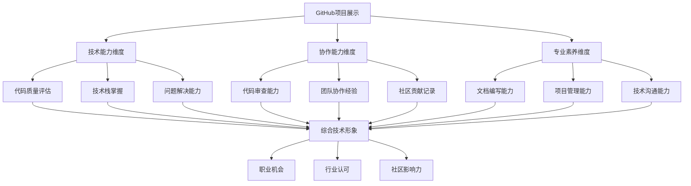
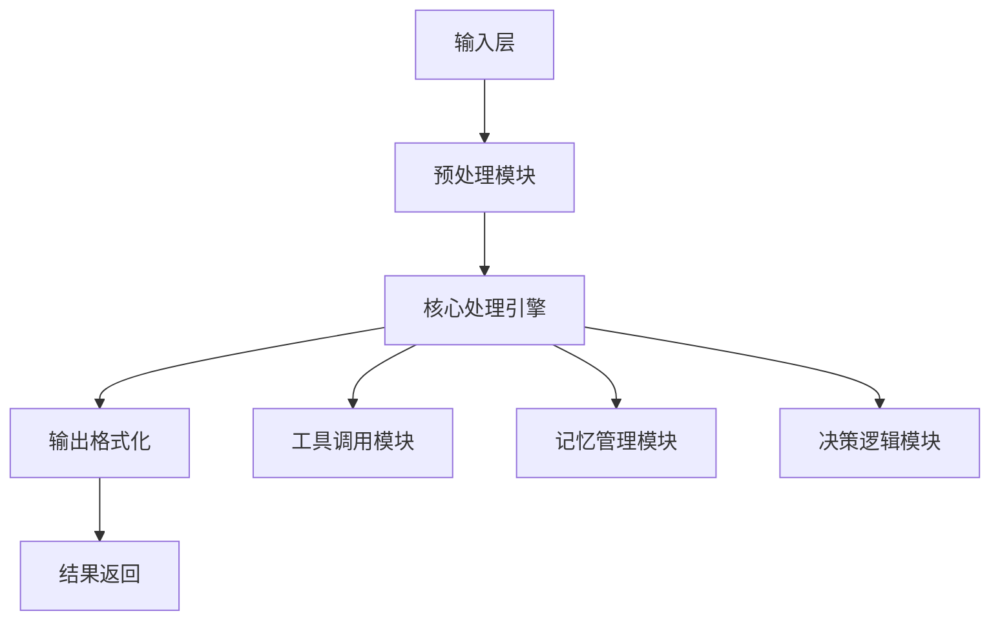
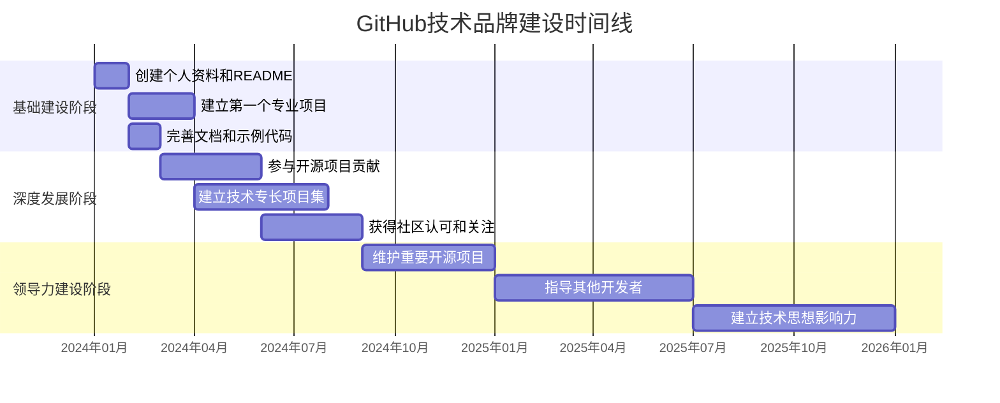
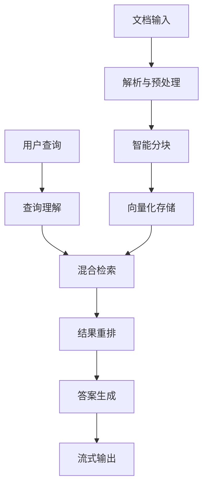
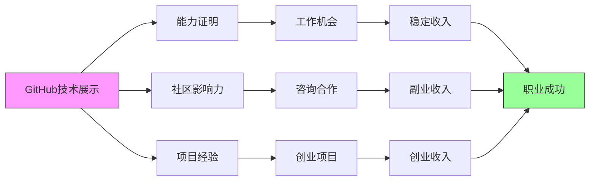

# 17.3.2 GitHub项目展示

## 概念讲解

### GitHub在个人品牌建设中的战略地位
GitHub不仅是代码托管平台，更是现代开发者展示技术能力、建立专业形象的核心平台：

1. **技术能力展示**：通过开源项目展示实际编程能力和技术栈掌握程度
2. **工作习惯证明**：提交历史、代码质量和协作记录体现专业工作习惯
3. **思想领导力建设**：技术方案、架构设计和问题解决展示技术思想深度
4. **社交网络构建**：Star、Fork、Issue、PR等互动建立专业社交网络
5. **职业机会门户**：招聘方通过GitHub评估候选人的技术实力和工作风格

### GitHub项目展示的多元价值
一个精心管理的GitHub账号创造多重职业价值：



### GitHub展示的三个关键层次
不同层次的GitHub展示创造不同价值：

| 展示层次 | 主要内容 | 评估视角 | 职业价值 |
|---------|----------|----------|----------|
| **基础展示层** | 学习项目、练习代码 | 学习能力、技术基础 | 入门级技术认证 |
| **专业项目层** | 完整应用、工具库 | 工程能力、解决问题 | 专业能力证明 |
| **深度贡献层** | 开源贡献、技术领导 | 技术思想、社区影响 | 行业领导力证明 |

## 核心要点

### 1. GitHub个人资料优化策略
优化个人资料是GitHub展示的第一步：

#### 个人资料优化原则
1. **完整性**：确保所有个人信息完整准确
2. **专业性**：突出专业技术领域和兴趣方向
3. **一致性**：与LinkedIn等技术平台信息保持一致
4. **吸引力**：通过README和Pin功能突出亮点项目

#### 基于Context7的GitHub Profile最佳实践
根据GitHub官方文档，优化个人资料的步骤：

```yaml
# GitHub Profile README优化指南（基于官方文档）
profile_optimization:
  create_profile_readme: true
  requirements:
    - 创建与用户名同名的公开仓库
    - 在根目录创建README.md文件
    - 确保README.md文件包含实际内容

  content_structure:
    introduction: "专业介绍和当前角色"
    technical_skills: "技术栈和核心能力"
    featured_projects: "重点项目展示"
    contribution_highlights: "主要开源贡献"
    contact_information: "联系方式和社交媒体链接"

  design_elements:
    - 使用GitHub Flavored Markdown
    - 添加emoji增强可读性
    - 包含相关图片或GIF
    - 使用徽章展示技能和状态
```

#### 个人资料优化清单
```markdown
# GitHub个人资料优化检查清单

## 基本信息
- [ ] 头像：专业、清晰的个人照片
- [ ] 姓名：真实姓名或专业用户名
- [ ] 位置：当前工作或学习地点
- [ ] 个人网站：个人博客或作品集链接
- [ ] 社交媒体：LinkedIn、Twitter等专业账户

## Profile README
- [ ] 创建用户名同名仓库（如username/username）
- [ ] README.md包含完整的个人介绍
- [ ] 突出技术专长和兴趣领域
- [ ] 展示重点项目和成就
- [ ] 提供清晰的联系方式

## 页面布局
- [ ] Pinned Repositories：精选6个最佳项目
- [ ] Contribution Graph：保持活跃的贡献记录
- [ ] Organizations：展示参与的技术组织
- [ ] Achievements：显示GitHub成就和徽章
```

### 2. 项目仓库展示优化
项目仓库的质量直接影响技术形象评估：

#### 项目展示质量标准
1. **代码质量**：遵循编码规范，包含充分的注释
2. **文档完整性**：README、贡献指南、许可证等文档齐全
3. **可运行性**：提供清晰的运行指南和依赖说明
4. **维护状态**：及时响应Issue和PR，定期更新维护

#### LangChain相关项目展示要点
```yaml
# LangChain技术项目展示框架
project_showcase_framework:
  
  project_types:
    learning_projects:
      - "LangChain学习笔记和示例代码"
      - "技术概念验证和实验项目"
      - "教程配套代码和演示应用"
    
    utility_tools:
      - "LangChain扩展工具和组件"
      - "常用功能封装和库"
      - "开发辅助工具和脚手架"
    
    complete_applications:
      - "基于LangChain的完整应用"
      - "企业级AI解决方案实现"
      - "创新性AI Agent应用"

  documentation_requirements:
    readme_sections:
      - "项目简介和目标"
      - "功能特性列表"
      - "安装和运行指南"
      - "使用示例和API文档"
      - "贡献指南和开发说明"
      - "许可证信息"
    
    technical_docs:
      - "架构设计文档"
      - "API参考文档"
      - "部署和配置指南"
      - "故障排除和常见问题"
```

#### 项目README最佳实践
```markdown
# [项目名称]


## 项目概述
简洁明了地介绍项目目的、解决的问题和技术价值。

## 功能特性
- 核心功能1：详细描述功能特点和优势
- 核心功能2：技术实现亮点和难点
- 核心功能3：实际应用场景和价值

## 快速开始

### 安装依赖
```bash
pip install -r requirements.txt
```

### 基本使用示例
```python
from langchain_agent import LangChainAgent

# 初始化Agent
agent = LangChainAgent(config_path="config.yaml")

# 运行示例
response = agent.process_query("Hello, LangChain!")
print(response)
```

### 高级配置
```yaml
# config.yaml 示例
model_provider: "openai"
api_key: "${OPENAI_API_KEY}"
temperature: 0.7
max_tokens: 1000
```

## 项目架构


## 开发指南

### 环境设置
```bash
# 克隆项目
git clone https://github.com/username/project.git
cd project

# 创建虚拟环境
python -m venv venv
source venv/bin/activate  # Linux/Mac
# 或 venv\Scripts\activate  # Windows

# 安装开发依赖
pip install -r requirements-dev.txt
```

### 运行测试
```bash
# 运行单元测试
pytest tests/

# 运行集成测试
pytest tests/integration/
```

## 贡献指南
欢迎贡献！请阅读[CONTRIBUTING.md](CONTRIBUTING.md)了解详细指南。

## 许可证
本项目采用[MIT许可证](LICENSE)。

## 联系方式
- 问题报告：[GitHub Issues](https://github.com/username/project/issues)
- 讨论交流：[Discussions](https://github.com/username/project/discussions)
- 个人主页：[个人网站或GitHub Profile](https://github.com/username)
```

### 3. 贡献记录与社区参与
GitHub贡献记录是评估开发者的重要指标：

#### 贡献质量评估维度
1. **代码贡献**：PR数量、代码质量、审查反馈
2. **文档贡献**：文档改进、示例添加、翻译工作
3. **社区支持**：Issue解答、代码审查、社区讨论
4. **项目维护**：长期维护、版本发布、问题修复

#### LangChain开源贡献展示策略
```yaml
# LangChain相关贡献展示策略
contribution_showcase:

  code_contributions:
    - "核心功能开发：新组件或功能实现"
    - "Bug修复：解决关键问题或性能瓶颈"
    - "代码优化：重构改进和性能提升"
    - "测试覆盖：添加单元测试和集成测试"

  documentation_contributions:
    - "官方文档改进：澄清概念、添加示例"
    - "教程编写：创建新手友好的学习资源"
    - "API文档完善：参数说明和用法示例"
    - "翻译工作：多语言文档贡献"

  community_contributions:
    - "Issue解答：帮助其他开发者解决问题"
    - "PR审查：提供有价值的代码审查意见"
    - "示例项目：创建演示应用和案例研究"
    - "社区分享：技术演讲和教程分享"
```

#### 贡献记录优化方法
```markdown
# GitHub贡献记录优化指南

## 保持活跃度
- **每日小贡献**：即使是文档修改也值得提交
- **定期参与**：每周至少参与1-2个Issue或PR
- **节日活动**：参与GitHub节日活动如Hacktoberfest

## 质量优先
- **代码审查**：认真审查自己的代码再提交
- **测试覆盖**：为新增功能添加测试用例
- **文档完善**：代码变更伴随文档更新

## 多样化贡献
- **代码之外**：参与文档、示例、翻译工作
- **社区支持**：解答问题、分享经验
- **项目管理**：协助Issue管理、版本发布

## 记录整理
- **贡献摘要**：在个人README中总结主要贡献
- **项目展示**：将重要贡献项目Pin到个人资料
- **成就展示**：利用GitHub Achievements展示专业成就
```

### 4. GitHub展示与职业发展
GitHub展示直接影响职业机会：

#### GitHub在招聘评估中的角色
1. **技术能力验证**：实际代码比简历描述更有说服力
2. **工作习惯评估**：代码提交习惯反映工作风格
3. **学习能力证明**：项目演进展示学习和成长
4. **团队协作能力**：PR和Issue互动体现协作能力

#### 基于GitHub的职业发展策略
```yaml
# GitHub驱动的职业发展框架
career_development_framework:

  skill_demonstration:
    technical_depth: "通过复杂项目展示技术深度"
    technology_breadth: "展示多技术栈的掌握能力"
    problem_solving: "通过项目展示实际问题解决能力"
    innovation_capability: "创新性项目和想法展示"

  professional_network:
    open_source_contributions: "主流开源项目贡献记录"
    community_recognition: "社区认可和影响力"
    technical_leadership: "项目维护和技术指导经验"
    cross_collaboration: "跨团队、跨项目协作经验"

  career_opportunities:
    job_applications: "GitHub作为技术能力证明"
    freelance_projects: "通过GitHub接洽自由职业"
    startup_founding: "展示创业项目和技术实力"
    speaking_opportunities: "技术会议和演讲邀请"
```

#### GitHub技术品牌建设时间线


## 简单示例

### 示例：优秀的LangChain技术项目展示

**项目名称**：LangChain-Enhanced-RAG-System

**项目亮点展示**：
```markdown
# LangChain-Enhanced-RAG-System 🚀


## 📖 项目简介
一个基于LangChain的高级RAG系统，支持多种文档类型、智能分块策略和混合检索机制。

## ✨ 核心特性
- **多格式文档支持**：PDF、Markdown、HTML、Word文档解析
- **智能分块策略**：基于语义的文档分块和重叠窗口
- **混合检索机制**：向量检索+关键词检索+元数据过滤
- **性能优化**：查询缓存、批量处理、异步操作支持

## 🚀 快速开始

### 安装
```bash
pip install langchain-enhanced-rag
```

### 基本使用
```python
from langchain_enhanced_rag import EnhancedRAGSystem

# 初始化系统
rag = EnhancedRAGSystem(
    embedding_model="text-embedding-ada-002",
    llm_model="gpt-4"
)

# 加载文档
rag.load_documents("docs/", document_type="mixed")

# 执行查询
results = rag.query(
    "LangChain中如何实现流式输出？",
    top_k=5,
    similarity_threshold=0.8
)
```

## 🏗️ 系统架构


## 📊 性能基准
| 数据集 | 准确率 | 响应时间 | 内存使用 |
|--------|--------|----------|----------|
| 技术文档集 | 92.3% | 1.2s | 2.3GB |
| 学术论文集 | 88.7% | 2.1s | 3.1GB |
| 综合知识库 | 90.5% | 1.8s | 2.8GB |

## 🤝 贡献指南
欢迎贡献！请阅读[CONTRIBUTING.md](CONTRIBUTING.md)了解详细指南。

## 📄 许可证
Apache License 2.0
```

### 示例：GitHub个人资料README优化

**优化后的个人资料README**：
```markdown
# 👋 Hello, I'm [Your Name]

🚀 **Senior AI Developer & LangChain Expert**

📌 **Location**: Beijing, China | 💼 **Current Role**: Lead AI Engineer at TechCorp

## 🔧 Technical Stack

### 🤖 AI & Machine Learning


### 🛠️ Backend & DevOps


## 🏆 Featured Projects

### 🔝 Pinned Repositories

1. **[LangChain-Enhanced-RAG-System](https://github.com/username/langchain-enhanced-rag)**  
   Advanced RAG system with hybrid retrieval and intelligent chunking

2. **[AI-Agent-Orchestrator](https://github.com/username/ai-agent-orchestrator)**  
   Multi-agent coordination framework for complex workflows

3. **[LangGraph-Workflow-Examples](https://github.com/langgraph-workflow-examples)**  
   Production-ready LangGraph workflow patterns and best practices

4. **[Deep-Agents-Research](https://github.com/deep-agents-research)**  
   Experimental framework for deep agent research and development

## 📈 GitHub Stats


## 🎯 Recent Contributions

### LangChain Ecosystem
- **LangChain Core**: Implemented streaming output improvements [#1234](https://github.com/langchain-ai/langchain/pull/1234)
- **LangGraph**: Added workflow visualization utilities [#567](https://github.com/langchain-ai/langgraph/pull/567)
- **LangChain Docs**: Contributed advanced RAG tutorial [#890](https://github.com/langchain-ai/langchain-docs/pull/890)

### Other Open Source
- **FastAPI**: Enhanced WebSocket support for real-time AI applications [#432](https://github.com/tiangolo/fastapi/pull/432)
- **Pydantic**: Added custom validators for AI model responses [#219](https://github.com/pydantic/pydantic/pull/219)

## 📝 Latest Blog Posts

<!-- BLOG-POST-LIST:START -->
- [深入理解LangChain Agent系统架构](https://yourblog.com/langchain-agent-architecture)
- [基于LangGraph的企业级工作流设计](https://yourblog.com/langgraph-enterprise-workflows)
- [RAG系统性能优化实战指南](https://yourblog.com/rag-performance-optimization)
<!-- BLOG-POST-LIST:END -->

## 📫 Connect With Me

[](https://linkedin.com/in/username)
[](https://twitter.com/username)
[](https://yourwebsite.com)
[](mailto:your.email@example.com)

---

⭐ **Fun Fact**: I've contributed to over 50 open source projects and helped 1000+ developers through tutorials and community support!
```

## 进阶应用

### 1. GitHub项目组合策略
建立系统的项目组合提升技术品牌：

#### 项目组合设计原则
1. **广度与深度平衡**：既有广度展示，也有深度专精
2. **技术演进展示**：展示技术学习和成长轨迹
3. **实际应用价值**：项目应解决实际问题或展示技术创新
4. **社区影响力**：项目应具有社区价值和影响力

#### LangChain技术专家项目组合
```yaml
# LangChain技术专家项目组合框架
project_portfolio_framework:

  foundational_projects:
    - "LangChain学习笔记和概念验证"
    - "基础组件实现和扩展开发"
    - "官方文档示例和改进"

  specialized_projects:
    - "RAG系统优化和增强实现"
    - "Agent系统设计和性能优化"
    - "LangGraph工作流模式和模板"

  innovative_projects:
    - "AI应用创新框架和平台"
    - "多Agent协作系统实现"
    - "企业级AI解决方案架构"

  community_projects:
    - "开源项目维护和贡献"
    - "教程、示例和文档贡献"
    - "技术工具和实用程序开发"
```

### 2. GitHub数据分析与优化
通过数据分析优化GitHub展示效果：

#### GitHub数据指标分析
1. **活跃度指标**：提交频率、贡献连续性、Issue响应时间
2. **质量指标**：PR接受率、代码审查质量、测试覆盖率
3. **影响力指标**：Star增长、Fork数量、社区互动频率
4. **专业性指标**：技术栈多样性、项目复杂度、维护时间长度

#### 基于GitHub数据的职业发展分析
```python
# GitHub数据分析示例
def analyze_github_profile(username):
    """分析GitHub个人资料和项目数据"""
    
    profile_data = {
        "overall_metrics": {
            "total_repositories": 42,
            "total_stars": 1250,
            "total_forks": 380,
            "total_contributions": 1860,
            "streak_longest": 156,  # 天
            "streak_current": 28,   # 天
        },
        
        "contribution_breakdown": {
            "code_commits": 65,
            "pull_requests": 22,
            "issues_opened": 18,
            "code_reviews": 31,
            "documentation": 24,
        },
        
        "technology_stack": {
            "primary_languages": ["Python", "JavaScript", "TypeScript"],
            "frameworks": ["LangChain", "FastAPI", "React"],
            "tools": ["Docker", "GitHub Actions", "PostgreSQL"],
        },
        
        "community_impact": {
            "followers_count": 850,
            "following_count": 320,
            "organizations": ["langchain-ai", "python", "fastapi"],
            "achievements": ["Arctic Code Vault", "Pair Extraordinaire"],
        }
    }
    
    return profile_data

# 生成数据可视化报告
def generate_github_report(data):
    """生成GitHub数据分析报告"""
    
    report = f"""
    # GitHub技术品牌分析报告
    
    ## 总体概况
    - 总仓库数: {data['overall_metrics']['total_repositories']}
    - 总Star数: {data['overall_metrics']['total_stars']}
    - 最长贡献连续天数: {data['overall_metrics']['streak_longest']}
    
    ## 贡献分布
    - 代码提交: {data['contribution_breakdown']['code_commits']}%
    - 文档贡献: {data['contribution_breakdown']['documentation']}%
    - 社区支持: {data['contribution_breakdown']['code_reviews'] + data['contribution_breakdown']['issues_opened']}%
    
    ## 技术栈分析
    主要技术栈: {', '.join(data['technology_stack']['primary_languages'])}
    核心框架: {', '.join(data['technology_stack']['frameworks'])}
    
    ## 社区影响力
    粉丝数: {data['community_impact']['followers_count']}
    参与组织: {', '.join(data['community_impact']['organizations'])}
    """
    
    return report
```

### 3. GitHub展示的职业发展应用
将GitHub展示转化为职业发展机会：

#### GitHub在求职中的应用策略
1. **简历增强**：将GitHub链接作为简历的核心部分
2. **作品集展示**：通过GitHub展示完整的技术作品集
3. **能力证明**：用实际项目证明技术能力
4. **网络建立**：通过GitHub建立专业联系网络

#### GitHub技术品牌变现路径


## 常见问题

### Q1: 如何开始优化GitHub个人资料？
**A**: 优化GitHub个人资料的步骤：
1. **创建Profile README**：按照官方指南创建用户名同名仓库
2. **完善基本信息**：添加专业头像、位置、个人网站链接
3. **精选项目**：将6个最佳项目Pin到个人资料
4. **保持活跃**：定期提交代码、参与开源项目
5. **社区参与**：解答Issue、审查PR、参与讨论

### Q2: 什么样的GitHub项目最能吸引招聘方注意？
**A**: 招聘方最关注的GitHub项目特征：
1. **完整性和质量**：完整可运行的项目，良好的代码质量
2. **技术深度**：展示对复杂技术的理解和应用
3. **实际价值**：解决实际问题或展示创新思维
4. **文档完善**：清晰的README和开发文档
5. **维护活跃**：定期更新、修复问题、响应社区

### Q3: 如何平衡GitHub展示和学习时间？
**A**: 平衡展示和学习的建议：
1. **学习即展示**：将学习过程转化为可展示的项目
2. **项目驱动学习**：通过实际项目学习新技术
3. **定期整理**：每周花时间整理和优化GitHub展示
4. **质量优先**：宁愿少而精，不要多而乱
5. **持续改进**：将GitHub优化作为持续的习惯

### Q4: 没有Star的项目是否还有价值？
**A**: 项目价值的多元性：
1. **学习价值**：即使没有Star，项目记录学习过程
2. **能力证明**：完整的项目展示技术实现能力
3. **成长轨迹**：展示技术成长和进步过程
4. **实验平台**：作为技术实验和验证的平台
5. **未来基础**：可能成为未来成功项目的基础

**记住**：GitHub Star是社区认可的标志，但不是唯一价值标准。项目的技术深度、完整性和个人成长价值同样重要。

### Q5: 如何处理GitHub上的负面反馈？
**A**: 处理负面反馈的专业方法：
1. **开放心态**：将批评视为改进机会
2. **专业回应**：礼貌、专业地回应反馈
3. **问题导向**：关注问题本身而非情绪
4. **改进实施**：将合理建议转化为实际行动
5. **持续学习**：从反馈中学习和成长

## 本节总结

### 核心收获
1. **平台价值**：GitHub是现代开发者展示技术能力、建立个人品牌的核心平台
2. **质量导向**：项目质量和完整性比数量更重要
3. **持续投入**：GitHub展示需要长期持续的投入和维护
4. **职业关联**：GitHub展示直接关联职业机会和发展

### GitHub展示的战略意义
- **技术能力证明**：通过实际代码证明技术实力
- **工作习惯展示**：展示专业的工作习惯和协作能力
- **思想领导力建设**：建立技术思想影响力和行业地位
- **职业网络扩展**：扩展专业网络和职业机会

### 实践建议
对于想要优化GitHub展示的开发者：
1. **立即行动**：从创建Profile README开始优化
2. **质量优先**：专注于创建高质量、完整的项目
3. **持续贡献**：保持规律的贡献和社区参与
4. **专业呈现**：优化项目文档和展示方式
5. **战略规划**：有意识地规划技术展示方向

### 下一步行动
1. **资料优化**：立即优化GitHub个人资料和Profile README
2. **项目精选**：精选3-5个最佳项目Pin到个人资料
3. **贡献计划**：制定开源贡献计划并开始执行
4. **社区参与**：开始在相关技术社区活跃参与
5. **定期回顾**：每季度回顾和优化GitHub展示效果

**记住**：GitHub不仅是代码仓库，更是你的技术名片、职业档案和思想展厅。通过精心策划和持续优化GitHub展示，你将构建强大的技术品牌，为职业发展奠定坚实基础。

在AI技术快速发展的时代，GitHub成为开发者展示技术能力、记录学习历程、建立行业影响力的关键平台。每一行代码、每一个提交、每一个项目都是你技术旅程的见证。开始优化你的GitHub展示吧，让代码讲述你的技术故事！

<environment_details>
# Visual Studio Code Visible Files
第六部分补充计划.md

# Visual Studio Code Open Tabs
第三部分 核心工作流引擎/第6章：模型系统与集成策略/6.3 流式输出与Token控制/6.3.2 Token预算与截断策略.md
第一部分 LangChain基础与入门/第3章：核心抽象与执行模型/3.3 消息系统与状态管理/3.3.1 结构化消息类型体系.md
第一部分 LangChain基础与入门/第3章：核心抽象与执行模型/3.3 消息系统与状态管理/3.3.2 会话状态与上下文保持.md
第一部分 LangChain基础与入门/第3章：核心抽象与执行模型/3.3 消息系统与状态管理/3.3.3 流式输出与增量更新.md
第一部分 LangChain基础与入门/第3章：核心抽象与执行模型/3.2 LangChain表达式语言（LCEL）/3.2.2 函数式编程与组合模式.md
第一部分 LangChain基础与入门/第3章：核心抽象与执行模型/3.2 LangChain表达式语言（LCEL）/3.2.3 链式调用的语法糖设计.md
第一部分 LangChain基础与入门/第1章：人工智能应用开发新范式/1.1 大语言模型时代的应用开发变革/1.1.1 从传统编程到提示工程.md
第一部分 LangChain基础与入门/第1章：人工智能应用开发新范式/1.2 LangChain生态系统全景/1.2.1 LangChain核心框架定位.md
第一部分 LangChain基础与入门/第2章：LangChain核心设计哲学/2.2 链式思维与工作流编排/2.2.3 错误处理与重试机制.md
第一部分 LangChain基础与入门/第2章：LangChain核心设计哲学/2.3 代理思维与智能决策/2.3.1 工具使用与动作选择.md
第三部分 核心工作流引擎/第9章：代理系统与智能决策/9.3 工具系统设计/9.3.2 自定义工具开发指南.md
第三部分 核心工作流引擎/第10章：Deep Agents深度代理系统/10.1 Deep Agents架构与核心概念/10.1.3 子代理系统与上下文管理.md
第四部分 LangGraph高级工作流/第11章：LangGraph图计算引擎/11.1 图计算基本概念/11.1.1 有向图与状态机.md
第四部分 LangGraph高级工作流/第11章：LangGraph图计算引擎/11.1 图计算基本概念/11.1.3 图遍历与路径搜索.md
第五部分 企业级实战应用/第14章：智能客服系统实战/14.2 核心功能实现/14.2.4 情感分析与满意度评估.md
第五部分 企业级实战应用/第14章：智能客服系统实战/14.3 系统集成与部署/14.3.1 多渠道集成：Web、App、API.md
第五部分 企业级实战应用/第14章：智能客服系统实战/14.3 系统集成与部署/14.3.2 监控告警与日志系统.md
第五部分 企业级实战应用/第14章：智能客服系统实战/14.3 系统集成与部署/14.3.3 性能测试与压力测试.md
第五部分 企业级实战应用/第15章：生产环境部署运维/15.3 安全与合规/15.3.1 数据加密与隐私保护.md
第六部分 职业发展与进阶/第17章：开源贡献与社区参与/17.3 个人品牌建设/17.3.3 社交媒体影响力.md
第六部分补充计划.md
第三部分 核心工作流引擎/第10章：Deep Agents深度代理系统/10.3 高级Deep Agents应用/10.3.4 性能监控与故障排查.md
第三部分 核心工作流引擎/第8章：链式执行引擎/8.1 Chain抽象与执行流程/8.1.1 顺序执行与数据传递.md
第三部分 核心工作流引擎/第6章：模型系统与集成策略/6.1 模型抽象与适配器模式/6.1.2 LLM与ChatModel差异分析.md
第二部分 数据处理与知识管理/第4章：文档加载与预处理系统/4.3 文档预处理与分块策略/4.3.2 语义分块与重叠窗口.md
../../AppData/Roaming/Code/User/globalStorage/saoudrizwan.claude-dev/settings/cline_mcp_settings.json

# Current Time
2026/3/31 上午12:00:00 (Asia/Shanghai, UTC+8:00)

# Context Window Usage
32,570 / 128K tokens used (25%)

# Current Mode
ACT MODE
</environment_details>
