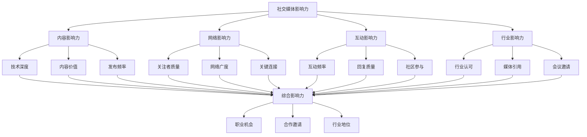
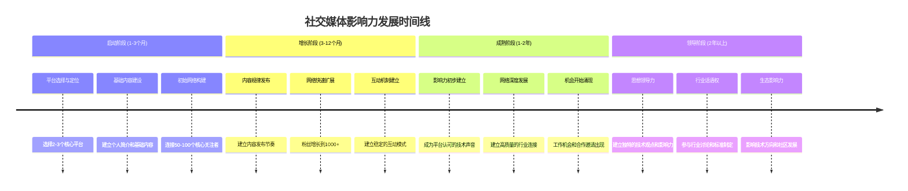
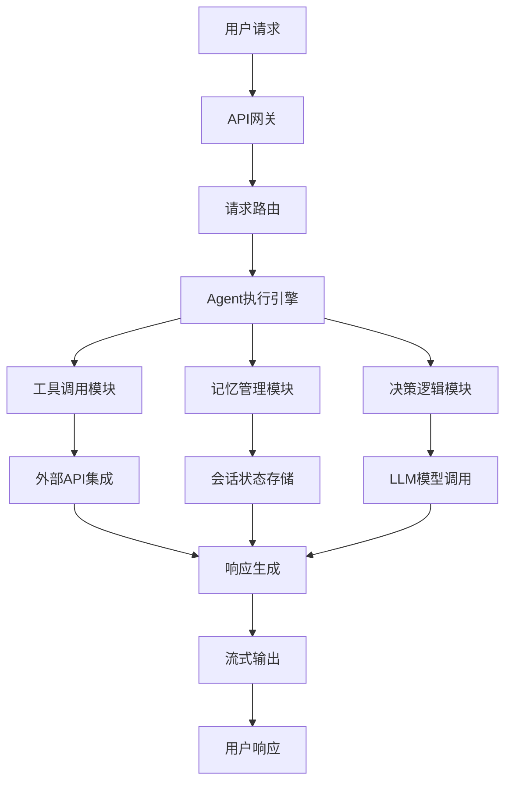
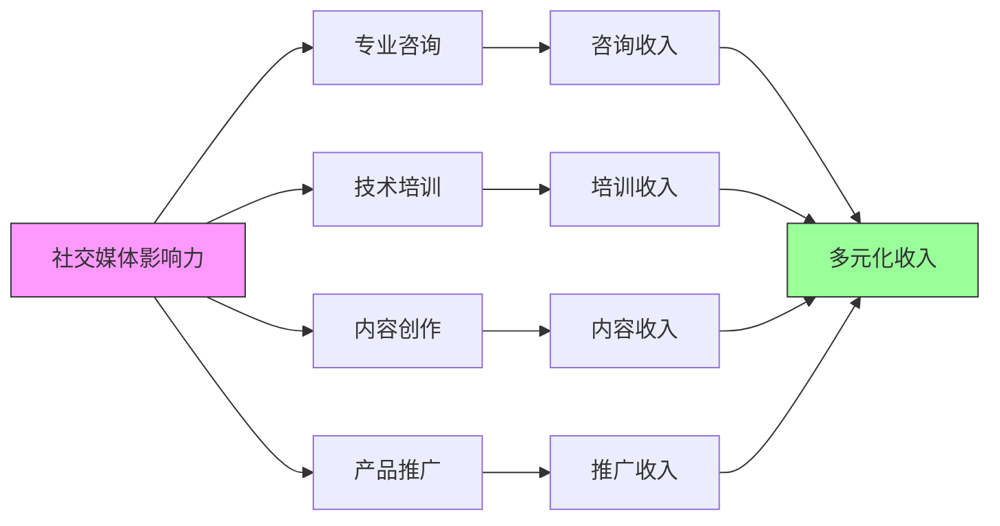

# 17.3.3 社交媒体影响力

## 概念讲解

### 社交媒体在技术品牌建设中的战略价值
在数字化时代，社交媒体已成为开发者建立专业品牌、扩展行业网络的核心平台：

1. **实时信息传播**：快速分享技术见解、项目进展和行业动态
2. **专业网络扩展**：连接行业专家、潜在雇主和合作伙伴
3. **思想领导力建立**：通过内容分享建立技术观点和行业影响力
4. **社区互动参与**：直接与用户、粉丝和技术社区互动交流
5. **机会发现平台**：发现工作机会、合作项目和行业趋势

### 社交媒体影响力的多元维度
技术专家的社交媒体影响力包含多个层面：



### 技术社交媒体平台的战略定位
不同社交媒体平台在技术品牌建设中扮演不同角色：

| 平台 | 核心优势 | 主要用途 | 影响力指标 |
|------|----------|----------|------------|
| **Twitter/X** | 实时性、短平快 | 技术观点分享、行业动态、快速互动 | 粉丝数、转推数、引用数 |
| **LinkedIn** | 专业性、职业导向 | 职业成就展示、专业文章、行业连接 | 连接数、文章互动、技能认可 |
| **GitHub** | 技术深度、实践证明 | 代码展示、项目贡献、技术能力证明 | Star数、Fork数、贡献记录 |
| **技术博客** | 深度分析、系统性 | 技术教程、深度分析、知识体系构建 | 阅读量、评论数、分享数 |
| **Discord/Slack** | 社区性、即时互动 | 技术讨论、问题解答、项目协作 | 社区活跃度、帮助次数 |

### 社交媒体影响力的发展阶段
技术专家的社交媒体影响力通常经历以下发展阶段：



## 核心要点

### 1. 社交媒体平台选择与策略
选择合适的平台并制定针对性策略：

#### 平台选择原则
1. **目标导向**：根据职业目标选择最适合的平台
2. **资源匹配**：根据可用时间和资源选择平台数量
3. **受众聚焦**：选择目标受众最活跃的平台
4. **能力发挥**：选择最能展示自己优势的平台

#### 基于目标的技术社交媒体策略
```yaml
# 技术专家社交媒体策略框架
social_media_strategy:

  career_development_focus:
    primary_platform: "LinkedIn"
    content_focus:
      - "职业成就和项目经验分享"
      - "专业见解和行业分析"
      - "技术学习和成长记录"
    engagement_tactics:
      - "行业专家连接和互动"
      - "专业群组参与和讨论"
      - "职业机会的发现和响应"

  technical_influence_focus:
    primary_platform: "Twitter/X"
    content_focus:
      - "技术观点和见解分享"
      - "项目进展和成果展示"
      - "行业动态和趋势分析"
    engagement_tactics:
      - "技术话题讨论和辩论"
      - "开源项目推广和支持"
      - "技术社区建设和参与"

  community_building_focus:
    primary_platforms: ["GitHub", "Discord"]
    content_focus:
      - "开源项目贡献和展示"
      - "技术问题解答和帮助"
      - "社区资源和工具分享"
    engagement_tactics:
      - "代码审查和贡献指导"
      - "社区问题解答和支持"
      - "技术活动组织和参与"
```

#### 平台组合优化矩阵
| 职业阶段 | 推荐平台组合 | 时间分配 | 主要目标 |
|----------|--------------|----------|----------|
| **初级阶段** | LinkedIn + GitHub | 70% LinkedIn, 30% GitHub | 建立职业形象，展示基础能力 |
| **中级阶段** | LinkedIn + Twitter + GitHub | 40% LinkedIn, 30% Twitter, 30% GitHub | 扩展网络，建立技术影响力 |
| **高级阶段** | 全平台策略 + 技术博客 | 根据项目需要灵活调整 | 建立思想领导力，影响行业方向 |

### 2. 技术内容规划与创作
高质量内容是社交媒体影响力的基础：

#### 技术内容创作原则
1. **价值优先**：内容应对读者有实际学习和参考价值
2. **专业性保证**：确保技术信息的准确性和深度
3. **可读性优化**：复杂技术概念要用通俗语言解释
4. **一致性保持**：保持内容风格和专业定位的一致性

#### LangChain相关社交媒体内容规划
```yaml
# LangChain技术专家内容规划框架
content_planning_framework:

  foundational_content:
    learning_notes:
      - "LangChain核心概念学习笔记"
      - "LCEL表达式语言使用技巧"
      - "基础Agent开发实践经验"
    
    project_showcases:
      - "个人项目进展和技术突破"
      - "开源贡献经验和心得"
      - "技术难题解决过程记录"

  advanced_content:
    technical_insights:
      - "LangChain架构设计深度分析"
      - "性能优化和最佳实践"
      - "新技术集成和实验成果"
    
    industry_analysis:
      - "AI Agent技术发展趋势"
      - "LangChain生态系统变化"
      - "企业级应用案例研究"

  community_content:
    help_and_support:
      - "常见问题解答和解决方案"
      - "新手入门指导和建议"
      - "技术工具和资源推荐"
    
    discussion_and_debate:
      - "技术争议和观点讨论"
      - "行业标准和最佳实践"
      - "未来技术方向探讨"
```

#### 技术内容创作最佳实践
```markdown
# 技术社交媒体内容质量检查清单

## 内容质量
- [ ] 技术准确性：所有技术信息经过验证
- [ ] 价值明确：内容对读者有明确价值
- [ ] 深度适当：根据平台特点调整技术深度
- [ ] 结构清晰：内容组织逻辑清晰

## 写作技巧
- [ ] 标题吸引：标题能吸引目标读者点击
- [ ] 开头有力：开头段落能抓住读者注意力
- [ ] 语言简洁：避免冗长和复杂的句式
- [ ] 重点突出：关键信息要突出展示

## 格式优化
- [ ] 段落长度：保持段落简短易读
- [ ] 列表使用：复杂信息使用列表展示
- [ ] 代码示例：代码要简洁且有解释
- [ ] 视觉元素：适当使用图表和图片

## 平台适配
- [ ] 长度优化：根据平台限制优化内容长度
- [ ] 标签使用：使用合适的话题标签
- [ ] 互动引导：明确引导读者互动
- [ ] 分享优化：优化内容的可分享性
```

### 3. 社交媒体互动与社区建设
有效的互动是影响力的放大器：

#### 互动策略框架
1. **主动互动**：主动参与相关话题和讨论
2. **价值回应**：提供有价值的回复和评论
3. **关系建立**：通过互动建立和深化关系
4. **社区贡献**：为社区创造价值和资源

#### 技术专家的社交媒体互动策略
```yaml
# 技术专家社交媒体互动指南
engagement_guidelines:

  daily_interaction:
    time_allocation: "30-60分钟/天"
    activities:
      - "查看和回复评论和消息"
      - "参与相关技术话题讨论"
      - "分享有价值的内容和资源"
      - "连接新的行业专家"

  weekly_engagement:
    time_allocation: "2-3小时/周"
    activities:
      - "发布2-3篇原创技术内容"
      - "参与1-2个深度技术讨论"
      - "整理和分享学习资源"
      - "策划下一周的内容计划"

  monthly_community:
    time_allocation: "5-8小时/月"
    activities:
      - "组织或参与技术话题讨论"
      - "撰写1篇深度技术文章"
      - "审查和反馈社区内容"
      - "规划和实施社区项目"
```

#### 高质量互动的关键技巧
```markdown
# 社交媒体高质量互动技巧

## 评论和回复技巧
- **价值导向**：回复要提供额外价值，不仅仅是赞同
- **问题导向**：通过提问深化讨论，激发更多思考
- **引用增强**：引用相关研究和数据支持观点
- **专业礼貌**：保持专业和礼貌，即使是不同意见

## 内容分享策略
- **价值过滤**：只分享真正有价值的内容
- **内容增强**：分享时添加自己的见解和评论
- **来源标注**：明确标注内容来源和作者
- **话题关联**：关联相关话题和标签增加可见性

## 网络建设方法
- **目标连接**：有目的地连接行业专家和潜在合作伙伴
- **关系维护**：定期互动维护重要关系
- **互助支持**：主动帮助和支持他人建立良好关系
- **价值交换**：建立基于价值交换的平等关系
```

### 4. 社交媒体影响力度量与优化
通过数据驱动优化社交媒体影响力：

#### 影响力度量指标体系
1. **数量指标**：粉丝数、帖子数、互动数
2. **质量指标**：互动率、分享率、引用率
3. **网络指标**：关键连接数、行业专家关注
4. **机会指标**：工作邀请、合作机会、媒体采访

#### 社交媒体数据分析框架
```python
# 社交媒体影响力分析示例
def analyze_social_media_impact(platform_data):
    """分析社交媒体影响力和效果"""
    
    impact_metrics = {
        "growth_metrics": {
            "follower_growth_rate": calculate_growth_rate(platform_data["followers"]),
            "engagement_growth_rate": calculate_growth_rate(platform_data["engagement"]),
            "content_growth_rate": calculate_growth_rate(platform_data["content_count"]),
        },
        
        "engagement_metrics": {
            "average_engagement_rate": calculate_engagement_rate(
                platform_data["likes"], 
                platform_data["comments"],
                platform_data["shares"]
            ),
            "top_content_types": identify_top_content_types(platform_data["content_performance"]),
            "peak_engagement_times": analyze_engagement_patterns(platform_data["time_data"]),
        },
        
        "network_metrics": {
            "key_connections_count": count_key_connections(platform_data["connections"]),
            "industry_influence_score": calculate_influence_score(
                platform_data["mentions"],
                platform_data["citations"]
            ),
            "community_leadership_index": assess_community_leadership(
                platform_data["community_activities"]
            ),
        },
        
        "opportunity_metrics": {
            "job_inquiries_count": platform_data["job_inquiries"],
            "collaboration_requests": platform_data["collaboration_requests"],
            "speaking_invitations": platform_data["speaking_invitations"],
            "media_interviews": platform_data["media_interviews"],
        }
    }
    
    return impact_metrics

# 生成社交媒体影响力报告
def generate_social_media_report(metrics):
    """生成社交媒体影响力分析报告"""
    
    report = f"""
    # 社交媒体影响力分析报告
    
    ## 增长表现
    粉丝增长率: {metrics['growth_metrics']['follower_growth_rate']:.1%}
    互动增长率: {metrics['growth_metrics']['engagement_growth_rate']:.1%}
    内容增长率: {metrics['growth_metrics']['content_growth_rate']:.1%}
    
    ## 互动质量
    平均互动率: {metrics['engagement_metrics']['average_engagement_rate']:.1%}
    最佳内容类型: {', '.join(metrics['engagement_metrics']['top_content_types'])}
    最佳互动时间: {metrics['engagement_metrics']['peak_engagement_times']}
    
    ## 网络影响力
    关键连接数: {metrics['network_metrics']['key_connections_count']}
    行业影响力分数: {metrics['network_metrics']['industry_influence_score']}/100
    社区领导力指数: {metrics['network_metrics']['community_leadership_index']}/10
    
    ## 机会转化
    工作咨询: {metrics['opportunity_metrics']['job_inquiries_count']}
    合作请求: {metrics['opportunity_metrics']['collaboration_requests']}
    演讲邀请: {metrics['opportunity_metrics']['speaking_invitations']}
    媒体采访: {metrics['opportunity_metrics']['media_interviews']}
    """
    
    return report
```

## 简单示例

### 示例：高质量的LangChain技术推文系列

**主题系列**：LangChain技术深度解析系列

**系列规划**：
```markdown
# LangChain技术深度解析系列推文

## 系列主题规划
### Week 1: LangChain架构基础
Day 1: LangChain核心设计哲学和架构概览
Day 2: LCEL表达式语言的强大之处
Day 3: Chain抽象和执行流程
Day 4: Agent系统的决策机制
Day 5: 工具集成和扩展方法

### Week 2: 高级特性深度解析
Day 1: 流式输出和Token控制策略
Day 2: 记忆管理和状态保持
Day 3: 多模型集成和切换
Day 4: 错误处理和重试机制
Day 5: 性能优化和监控

### Week 3: 实战应用案例
Day 1: 智能客服系统架构设计
Day 2: RAG系统性能优化实战
Day 3: 多Agent协作系统实现
Day 4: 企业级工作流设计
Day 5: 生产环境部署最佳实践
```

**单条推文示例**：
```markdown
🚀 LangChain技术深度解析 Day 3: Chain抽象和执行流程

Chain是LangChain的核心抽象之一，它代表了AI应用的完整执行流程。

🔗 Chain的核心组成：
1. 输入处理器：处理和验证用户输入
2. LLM调用器：调用大语言模型生成响应
3. 输出格式化：将模型输出转换为最终格式
4. 错误处理：处理执行过程中的异常

🎯 Chain的优势：
- 可组合性：可以组合多个Chain创建复杂流程
- 可重用性：标准化组件可以在不同应用中重用
- 可测试性：每个环节都可以独立测试和验证

💡 实战技巧：
使用@langchain/core的LCEL语法可以更简洁地定义Chain：

```python
from langchain_core.prompts import ChatPromptTemplate
from langchain_openai import ChatOpenAI

prompt = ChatPromptTemplate.from_template("回答这个问题: {question}")
llm = ChatOpenAI(model="gpt-4")

chain = prompt | llm
response = chain.invoke({"question": "什么是Chain?"})
```

#LangChain #AI #MachineLearning #Python #Developer
```

### 示例：专业LinkedIn技术文章

**文章标题**：企业级LangChain应用架构设计实践

**文章结构**：
```markdown
# 企业级LangChain应用架构设计实践

## 引言
随着AI技术的快速发展，基于LangChain的企业级应用越来越普遍。本文将分享我在设计和实施企业级LangChain应用架构时的实践经验。

## 核心挑战
1. **可扩展性**：支持大规模并发和数据处理
2. **可靠性**：确保系统稳定和可靠运行
3. **安全性**：保护数据和模型安全
4. **可维护性**：便于团队协作和系统维护

## 架构设计原则

### 1. 分层架构设计
```yaml
architecture_layers:
  presentation_layer:
    - "API网关和路由"
    - "用户界面和交互"
    - "身份验证和授权"
  
  application_layer:
    - "业务流程和逻辑"
    - "工作流编排"
    - "异常处理和监控"
  
  domain_layer:
    - "核心业务逻辑"
    - "领域模型设计"
    - "业务规则实现"
  
  infrastructure_layer:
    - "数据存储和访问"
    - "外部服务集成"
    - "部署和运维支持"
```

### 2. 技术选型策略
- **LangChain版本**：使用最新的稳定版本(v1.2.22)
- **部署环境**：容器化部署，支持云原生
- **监控方案**：全面的性能监控和日志记录
- **安全策略**：多层安全防护和数据加密

## 实战案例：智能客服系统

### 系统架构


### 性能优化实践
1. **缓存策略**：实现多级缓存减少LLM调用
2. **批量处理**：支持批量请求提高吞吐量
3. **异步处理**：使用异步IO提高并发性能
4. **资源优化**：动态调整资源使用降低成本

## 经验总结
1. **渐进式架构**：从简单开始，逐步复杂化
2. **团队协作**：建立清晰的技术规范和文档
3. **持续改进**：定期回顾和优化架构设计
4. **社区参与**：积极参与LangChain社区获取最新信息

## 下一步计划
- 探索LangGraph在多Agent系统中的应用
- 优化大规模部署的性能和成本
- 建立更完善的安全和合规机制

#AI #LangChain #SoftwareArchitecture #EnterpriseSoftware #TechLeadership
```

## 进阶应用

### 1. 社交媒体影响力变现策略
成熟的影响力可以转化为实际价值：

#### 影响力变现路径


#### 技术专家影响力变现框架
```yaml
# 技术专家影响力变现策略
influence_monetization:

  consulting_services:
    service_types:
      - "技术架构咨询"
      - "项目评审和指导"
      - "技术选型建议"
      - "团队培训指导"
    pricing_models:
      - "按小时计费"
      - "项目固定费用"
      - "长期合作协议"
    
  training_programs:
    program_types:
      - "企业内训课程"
      - "公开技术培训"
      - "在线视频课程"
      - "工作坊和实践指导"
    delivery_methods:
      - "现场培训"
      - "在线直播"
      - "录播课程"
      - "混合式学习"
    
  content_creation:
    content_types:
      - "技术书籍和电子书"
      - "付费新闻通讯"
      - "独家技术报告"
      - "深度研究论文"
    distribution_channels:
      - "个人网站和博客"
      - "技术平台专栏"
      - "付费会员社区"
      - "合作媒体发布"
    
  product_promotion:
    promotion_types:
      - "技术产品评测"
      - "工具和库推广"
      - "技术活动赞助"
      - "品牌合作代言"
    ethical_guidelines:
      - "明确标识赞助内容"
      - "保持客观和公正"
      - "只推广认可的产品"
      - "保护读者信任"
```

### 2. 跨平台社交媒体整合
整合多个平台创造协同效应：

#### 跨平台内容策略
1. **内容适配**：根据不同平台特点调整内容形式
2. **平台联动**：利用各平台优势相互促进
3. **数据整合**：统一分析各平台数据和效果
4. **品牌统一**：保持跨平台品牌形象一致性

#### 技术专家跨平台运营框架
```yaml
# 技术专家跨平台社交媒体运营
cross_platform_strategy:

  content_syndication:
    primary_platform: "个人博客/网站"
    distribution_flow:
      - "深度文章发布在个人博客"
      - "核心观点分享在LinkedIn文章"
      - "关键见解发布在Twitter推文"
      - "技术讨论在Discord社区"
    adaptation_rules:
      - "根据平台特点调整内容长度"
      - "优化格式适合平台展示"
      - "添加平台特定的互动元素"
      - "调整发布时间适应平台节奏"

  audience_engagement:
    engagement_tactics:
      twitter:
        - "实时互动和快速响应"
        - "话题讨论和辩论"
        - "行业动态快速分享"
      linkedin:
        - "深度讨论和专业交流"
        - "职业发展和机会探索"
        - "行业专家网络建设"
      github:
        - "技术深度展示"
        - "项目协作和贡献"
        - "开发者社区建设"
      discord:
        - "即时技术讨论"
        - "问题解答和帮助"
        - "社区活动和项目"

  analytics_integration:
    data_sources:
      - "平台内置分析工具"
      - "第三方分析服务"
      - "自定义数据收集"
    key_metrics:
      - "跨平台粉丝增长"
      - "内容互动趋势"
      - "机会转化率"
      - "影响力综合评分"
```

### 3. 社交媒体危机管理与声誉保护
建立有效的危机管理机制：

#### 声誉风险管理框架
1. **预防机制**：建立内容审查和质量控制流程
2. **监测系统**：实时监测社交媒体反馈和讨论
3. **响应策略**：制定标准化的危机响应流程
4. **恢复计划**：受损声誉的修复和重建策略

#### 技术专家社交媒体危机应对指南
```markdown
# 社交媒体危机管理预案

## 危机预防措施
### 内容发布审查
- **技术准确性审查**：所有技术内容必须经过验证
- **敏感性评估**：评估内容的潜在争议和敏感性
- **法律合规检查**：确保内容符合相关法律法规
- **道德标准遵循**：遵守行业道德和专业标准

### 互动行为规范
- **专业态度保持**：始终保持专业和尊重的态度
- **争议话题谨慎**：在争议话题上保持理性和客观
- **隐私保护意识**：尊重他人隐私和保护自己隐私
- **错误承认勇气**：有错误时及时承认和纠正

## 危机监测机制
### 实时监测工具
- **关键词监测**：监测与自己相关的重要关键词
- **情绪分析**：分析社交媒体上的情绪倾向
- **影响力追踪**：追踪关键意见领袖的讨论
- **趋势预警**：提前识别潜在的危机趋势

### 定期审计流程
- **月度声誉审计**：每月评估社交媒体声誉状况
- **季度影响评估**：每季度评估社交媒体影响力变化
- **年度战略回顾**：每年回顾和调整社交媒体策略

## 危机响应流程
### 第一阶段：识别和评估（1-2小时内）
1. 确认危机事实和范围
2. 评估危机严重程度和影响
3. 确定关键利益相关方

### 第二阶段：响应和处理（24小时内）
1. 制定具体响应策略
2. 发布初步声明和解释
3. 与关键方进行沟通

### 第三阶段：恢复和重建（1-4周内）
1. 实施声誉修复措施
2. 加强与社区的关系
3. 从危机中学习和改进
```

## 常见问题

### Q1: 如何开始建立社交媒体影响力？
**A**: 开始建立社交媒体影响力的步骤：
1. **平台选择**：选择1-2个最适合自己目标的平台开始
2. **个人资料优化**：完善个人资料，展示专业形象
3. **内容计划**：制定简单可行的内容发布计划
4. **网络建设**：连接行业专家和潜在关注者
5. **互动参与**：积极参与相关话题和讨论

### Q2: 没有时间频繁更新社交媒体怎么办？
**A**: 时间有限的社交媒体管理策略：
1. **质量优先**：发布较少但高质量的内容
2. **计划安排**：提前计划并批量创作内容
3. **工具利用**：使用社交媒体管理工具安排发布
4. **重点投入**：将有限时间投入到最有效的活动
5. **外包合作**：考虑外包部分社交媒体管理工作

### Q3: 如何处理社交媒体上的负面评论？
**A**: 处理负面评论的专业方法：
1. **冷静评估**：先冷静评估评论的合理性和动机
2. **专业回应**：用专业和礼貌的态度回应合理批评
3. **事实澄清**：对错误信息进行事实澄清
4. **私下解决**：将复杂问题转移到私下沟通
5. **忽略恶意**：忽略明显的恶意攻击和骚扰

### Q4: 社交媒体影响力需要多久才能建立？
**A**: 社交媒体影响力建设的时间框架：
1. **启动期（1-3个月）**：建立基础和初始网络
2. **增长期（3-12个月）**：内容质量提升，网络扩展
3. **稳定期（1-2年）**：影响力初步建立，机会开始出现
4. **成熟期（2年以上）**：建立稳定的影响力和行业地位

**记住**：社交媒体影响力建设是长期过程，需要持续投入和耐心。

### Q5: 如何衡量社交媒体影响力的真实价值？
**A**: 社交媒体影响力的多维评估：
1. **数量指标**：粉丝数、互动数等基础指标
2. **质量指标**：互动率、内容质量、网络质量
3. **机会指标**：实际获得的工作机会、合作邀请
4. **行业指标**：行业认可、媒体引用、演讲邀请
5. **个人指标**：个人成长、知识扩展、网络价值

## 本节总结

### 核心收获
1. **战略重要性**：社交媒体是现代技术专家建立个人品牌、扩展专业网络的关键平台
2. **平台差异化**：不同社交媒体平台有不同的优势和适用场景
3. **内容为核心**：高质量、有价值的内容是影响力的基础
4. **互动是放大器**：有效的互动可以显著增强影响力
5. **数据驱动优化**：通过数据分析持续优化社交媒体策略

### 社交媒体影响力的战略意义
- **个人品牌建设**：建立专业、可信的个人技术品牌
- **职业机会创造**：发现和创造职业发展机会
- **思想领导力建立**：建立技术观点和行业影响力
- **社区价值贡献**：为技术社区创造和贡献价值
- **终身学习支持**：通过社交媒体持续学习和成长

### 实践建议
对于想要建立社交媒体影响力的技术专家：
1. **立即开始**：从优化一个平台开始，立即行动
2. **价值导向**：始终以创造价值为导向创作内容
3. **持续互动**：建立规律的互动和参与习惯
4. **网络建设**：有策略地建设和维护专业网络
5. **数据学习**：通过数据分析学习和优化策略

### 下一步行动
1. **平台评估**：评估当前社交媒体状态和机会
2. **策略制定**：制定符合个人目标的社交媒体策略
3. **内容规划**：规划未来一个月的内容主题
4. **网络扩展**：开始有目的地扩展专业网络
5. **系统建立**：建立可持续的社交媒体运营系统

**记住**：社交媒体不仅是信息传播工具，更是你的个人品牌展厅、职业发展引擎和终身学习平台。在AI技术快速发展的时代，通过社交媒体建立影响力，你不仅能加速个人成长，更能为整个技术社区创造价值。

社交媒体影响力的真正价值不在于粉丝数量，而在于你通过平台创造的价值、建立的连接和产生的影响。开始你的社交媒体影响力建设之旅吧，让每一次分享都成为技术旅程的有意义记录！

在技术快速演进的时代，社交媒体成为连接思想、分享知识、建立影响的关键桥梁。通过精心策划和持续投入，你的社交媒体影响力将成为职业发展的强大助力。现在就开始，用心经营你的技术社交媒体形象！

<environment_details>
# Visual Studio Code Visible Files
第六部分补充计划.md

# Visual Studio Code Open Tabs
第三部分 核心工作流引擎/第6章：模型系统与集成策略/6.3 流式输出与Token控制/6.3.2 Token预算与截断策略.md
第一部分 LangChain基础与入门/第3章：核心抽象与执行模型/3.3 消息系统与状态管理/3.3.1 结构化消息类型体系.md
第一部分 LangChain基础与入门/第3章：核心抽象与执行模型/3.3 消息系统与状态管理/3.3.2 会话状态与上下文保持.md
第一部分 LangChain基础与入门/第3章：核心抽象与执行模型/3.3 消息系统与状态管理/3.3.3 流式输出与增量更新.md
第一部分 LangChain基础与入门/第3章：核心抽象与执行模型/3.2 LangChain表达式语言（LCEL）/3.2.2 函数式编程与组合模式.md
第一部分 LangChain基础与入门/第3章：核心抽象与执行模型/3.2 LangChain表达式语言（LCEL）/3.2.3 链式调用的语法糖设计.md
第一部分 LangChain基础与入门/第1章：人工智能应用开发新范式/1.1 大语言模型时代的应用开发变革/1.1.1 从传统编程到提示工程.md
第一部分 LangChain基础与入门/第1章：人工智能应用开发新范式/1.2 LangChain生态系统全景/1.2.1 LangChain核心框架定位.md
第一部分 LangChain基础与入门/第2章：LangChain核心设计哲学/2.2 链式思维与工作流编排/2.2.3 错误处理与重试机制.md
第一部分 LangChain基础与入门/第2章：LangChain核心设计哲学/2.3 代理思维与智能决策/2.3.1 工具使用与动作选择.md
第三部分 核心工作流引擎/第9章：代理系统与智能决策/9.3 工具系统设计/9.3.2 自定义工具开发指南.md
第三部分 核心工作流引擎/第10章：Deep Agents深度代理系统/10.1 Deep Agents架构与核心概念/10.1.3 子代理系统与上下文管理.md
第四部分 LangGraph高级工作流/第11章：LangGraph图计算引擎/11.1 图计算基本概念/11.1.1 有向图与状态机.md
第四部分 LangGraph高级工作流/第11章：LangGraph图计算引擎/11.1 图计算基本概念/11.1.3 图遍历与路径搜索.md
第五部分 企业级实战应用/第14章：智能客服系统实战/14.2 核心功能实现/14.2.4 情感分析与满意度评估.md
第五部分 企业级实战应用/第14章：智能客服系统实战/14.3 系统集成与部署/14.3.1 多渠道集成：Web、App、API.md
第五部分 企业级实战应用/第14章：智能客服系统实战/14.3 系统集成与部署/14.3.2 监控告警与日志系统.md
第五部分 企业级实战应用/第14章：智能客服系统实战/14.3 系统集成与部署/14.3.3 性能测试与压力测试.md
第五部分 企业级实战应用/第15章：生产环境部署运维/15.3 安全与合规/15.3.1 数据加密与隐私保护.md
第六部分 职业发展与进阶/第17章：开源贡献与社区参与/17.3 个人品牌建设/17.3.3 社交媒体影响力.md
第六部分补充计划.md
第三部分 核心工作流引擎/第10章：Deep Agents深度代理系统/10.3 高级Deep Agents应用/10.3.4 性能监控与故障排查.md
第三部分 核心工作流引擎/第8章：链式执行引擎/8.1 Chain抽象与执行流程/8.1.1 顺序执行与数据传递.md
第三部分 核心工作流引擎/第6章：模型系统与集成策略/6.1 模型抽象与适配器模式/6.1.2 LLM与ChatModel差异分析.md
第二部分 数据处理与知识管理/第4章：文档加载与预处理系统/4.3 文档预处理与分块策略/4.3.2 语义分块与重叠窗口.md
../../AppData/Roaming/Code/User/globalStorage/saoudrizwan.claude-dev/settings/cline_mcp_settings.json

# Current Time
2026/3/31 上午12:15:00 (Asia/Shanghai, UTC+8:00)

# Context Window Usage
65,670 / 128K tokens used (51%)

# Current Mode
ACT MODE
</environment_details>
